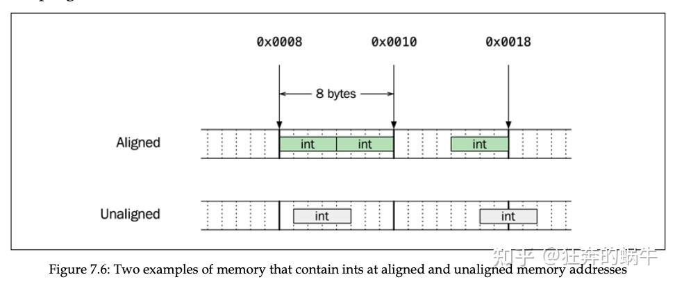
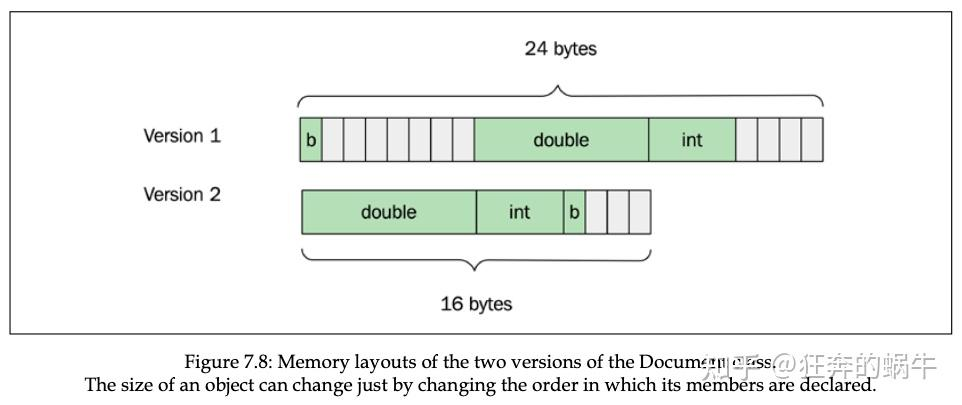

# 字节对齐

> *"An alignment is an implementation-defined integer value representing the number of bytes between successive addresses at which a given object can be allocated."*

字节对齐也称为字节填充， **它是一种牺牲空间换取时间的方法。**

目前几乎所有平台内存地址都是从 0 开始，因此可以使用取模运算判断地址是否对齐。

## 对齐原因

> 字；字节
>
> 一字节通常为 8bit，而字和cpu架构有关，若系统为32位架构，一个字为4个字节；64位系统中，一个字为64位。

CPU每次从 内存中只能访问一个 字 的内容，因此为了 CPU 有效工作，不同类型在内存中的位置有限制。



编译器通常会做许多优化，将内存对齐数据，以便于 cpu 高效访问数据


## `std::align()`

`<memory>` 头文件中的一个函数，用来根据对齐要求调整指针位置，若指针位置已经按要求对齐，则不会调整指针，否则返回调整后满足对齐要求的指针

当使用 new 或 std::malloc()，返回的内存地址应该是已经根据我们指定的对象类型对齐过的，例如

```cpp
auto* p = new int{};
assert(is_aligned(p, 4ul)); // True
```


## `padding`

当我们定义 class 或 struct 时，编译器被强制要求按照用户声明的成员变量顺序放置成员变量，有时为了满足成员变量类型的对齐要求，需要在成员变量之间添加 padding 字节，例如

```cpp
class Document {
    bool is_cached_{};
    double rank_{};
    int id_{};
};
std::cout << sizeof(Document) << '\n'; // Possible output is 24
```

编译器会将上面的类转换成类似下面的样子

```cpp
class Document {
    bool is_cached_{};
    std::byte padding1[7]; // Invisible padding inserted by compiler
    double rank_{};
    int id_{};
    std::byte padding2[4]; // Invisible padding inserted by compiler
};
```

由于 rand_ 对齐要求是 8，因此 is_cached 后插入 7 个字节，由于整个 Document 的对齐要求是 24（由最大成员 rank_ 的对齐要求的整数倍确定），因此 id_ 后插入 4 字节。我们可以安排成员变量的顺序使得整个 class 占据的内存空间尽量小：

```cpp
class Document {
    double rank_{}; // Rearranged data members
    int id_{};
    bool is_cached_{};
};
```

编译器转换后的版本：

```cpp
class Document {
    double rank_{};
    int id_{};
    bool is_cached_{};
    std::byte padding[3]; // Invisible padding inserted by compiler
};
```




## `alignas`

C++11 中使用 alignas 指定对象或类型的对齐要求，参数可以是表达式（值为 0 的整形常量表达式或满足对齐要求的合法值）、type-id、或者参数包（parameter pack）。可以在变量或类中不是 bit 域的数据成员、class、union、enumeration 声明中使用。

当使用 alignas 时，对象或类型的对齐要求将是所有值中的最大值，同时必须大于 0。

当使用 alignas 时有一些限制：

1. 唯一合法的参数是 2 的幂次方（1, 2, 4, 8, 16, 32 等），任何其他值都是非法的，但编译不会报错，编译器可能会忽略非法值
2. 0 值的对齐总是被忽略
3. 若用户使用 alignas 指定的最大对齐值比没有指定时编译器引入的自然对齐小，程序是 ill-formed 的

看个类型对齐的例子

```cpp
struct alignas(4) foo
{
    char a;
    char b;
};
```

若未使用 alignas 指定对齐要求，编译器的自然对齐是 1，但我们指定为 4，编译器将其转换为

```cpp
struct foo
{
    char a;
    char b;
    char _pad0[2];
};
```

alignas 也可以用在成员变量，这种情况下将使用最大的对齐要求

```cpp
struct alignas(4) foo
{
    alignas(2) char a;
    alignas(8) int b;
};
```

a 自然对齐要求是 1，我们指定为 2；b 自然对齐是 4，我们改为 8，因此最大为 8。整个类型的对齐要求是 4，比 8 小，因此会被忽略。结果如下：

```cpp
struct foo
{
    char a;
    char _pad0[7];
    int b;
    char _pad1[4];
};
```

alignas 也能用在变量上

```cpp
alignas(8) int a;
alignas(256) long b[4];
printf("%p\n", &a); // eg. 0000006C0D9EF908
printf("%p\n", &b); // eg. 0000006C0D9EFA00
```

上面的例子中，a 被要求放置在 8 整数倍的内存地址，b 被要求放在 256 整数倍的内存地址；从输出我们可以看到确实是这样的。


##  `#pragma pack`

如果我们在结构体前面加上#pragma pack(show)

```cpp
#pragma pack(show)
struct abc1
{
	char a;
	short b;
	int c;
};
```

运行结果会显示：pragma pack(show) 的值 == 8也就是说这个电脑 支持的最长的数据类型的字节数是8个字节，如果我们设置成#pragma pack（1）看一下什么效果

输出：abc1:size = 7,abc2:size = 7两个大小都变成了7，其储存是按顺序存储


### 常见对齐设置及适用场景

1. **`#pragma pack(1)`**：表示1字节对齐，完全去除填充字节。
   - **适用场景**：内存非常紧张的情况，或数据需要精确匹配通信协议格式。
   - **缺点**：对齐方式较低，可能导致CPU访问不便，降低性能。
2. **`#pragma pack(2)`、`#pragma pack(4)`、`#pragma pack(8)`**：表示2字节、4字节或8字节对齐。
   - **适用场景**：一般用于普通内存场景，合理设置对齐大小可以在性能和空间效率之间找到平衡。
   - **选择方法**：如果结构体中存在较大数据类型（如`double`），可以选择4或8字节对齐，减少填充字节的同时保证访问效率。
3. **默认对齐**：不使用`#pragma pack`，则采用编译器默认对齐方式（通常是最大成员大小）。
   - **适用场景**：对内存占用不敏感的应用，或性能要求较高的情况。


## `位域`

该种形式出现于结构体或共用体的定义中，是位域定义的标准形式。
其使用方式为

```c
struct student
{
	type var_student : n;
};

```

在结构体student中，成员变量var_student占用空间为n位。（1字节=8位，1 bit = 8 bytes）
n为正整数，其值必须小于type类型占用的位数。比如type如果是int，占4字节32位，那么n必须是1~31之间的整数。