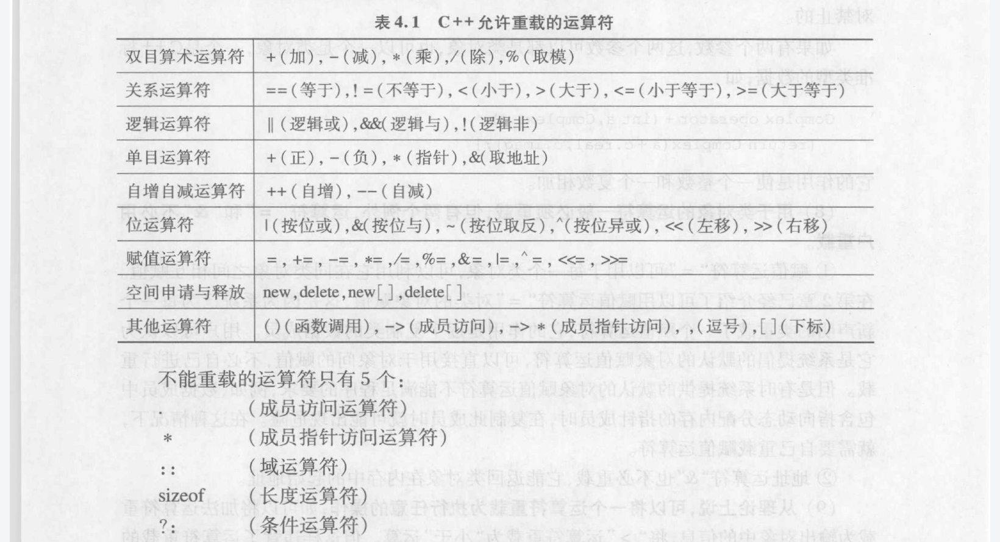
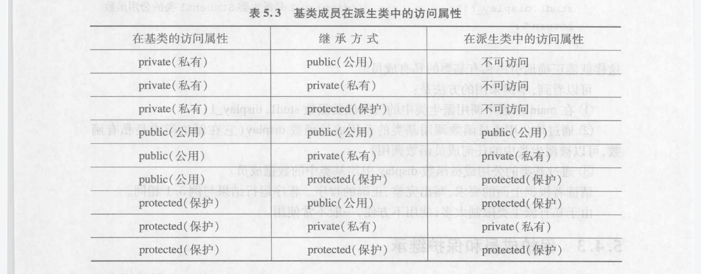

# C++ Primer 的零零碎碎

## 1. 类

### 1.1 `const`成员函数

```c++
std::string isb() const {return this->Book; }
```

其中 紧跟在参数列表后面的 `const` , **表示**`this` **是一个指向常量的指针**，来增加函数的灵活性。

> 默认情况下，**this** 指向类类型非常量版本的常量指针。

### 1.2 定义顺序

编译器分两步处理类： 

* 首先编译成员的声明
* 再轮到成员函数体

故，不需在意成员出现的位置。

### 1.3 构造函数

当创建一个类的**const**对象，构造函数可以在构造之前来向其写入值。因为此时，对象还未取得“常量”属性。

当成员是`const`或者是引用的 时候，必须进行成员初始化。

#### 1.3.0`=default`

在参数列表后面加上来要求编译器生成构造函数。

#### 1.3.1委托构造函数

委托构造函数使用它所属的类的其他构造函数执行它自己的初始化过程，将自己的部分职能委托给了 **其他构造函数**。

```c++
class Sale_data()
{
    public:
    Sale_data(std::string s):book(s){}
    Sale_data():Sale_data(""){}                 //该行将任务委托给了第一个构造函数。
    private:
}
```

#### 1.3.2隐式类类型转换

如果构造函数只接收一个实参，则它实际上定义了转换为此类类型的隐式转换机制。

```c++
//例如
item.combine(string("55526"));
//本来.combine 函数接收一个Sale_data, 如此它会将上述字符串 55526 转换为Sale_data类。
```

#### 1.3.3explicit构造函数用于直接初始化

该声明阻止编译器自动转换。

#### 1.3.4 聚合类

* 所有成员是public
* 没有定义构造函数
* 没有类内初始值
* 没有基类和virtual函数

### 1.4 构造函数和析构函数的顺序

遵循**先进后出**的顺序。最后被构造的对象，在析构的时候是第一个被析构。

### 1.5 对象的赋值和复制

* **对象名1 = 对象名2**
* **类名 对象2 =（对象1）**   或     **类名  对象名1 = 对象名2**

### 1.6 静态成员函数

因为静态成员函数没有`this`指针。由此决定静态成员函数不能访问本类中，**非静态成员**。

### 1.7 运算符重载的函数



用于类对象的运算符一般都需要重载，但有两个例外， 运算符 `=``&`不必重载。

而且不能重载纯c++内部数据类型。

对运算符重载的函数有两种处理方式：

* 将运算符重载的函数作为类的成员函数
* 在类中把运算符重载函数声明为 **友元**

将运算符重载函数作为成员函数，它可以通过this指针自由地访问本类中的数据成员，因此可以少写一个函数参数。友元函数由于不是该类的成员函数，所以必须把所有参数列上，不能省略。

#### 1.7.0 重载流插入运算符<<和流提取运算符>>

```c++
istream & operator >> (istream &, 自定义类 &);
istream & operator << (istream &, 自定义类 &);
```

### 1.8  继承



保护继承是指  受保护的成员不能被类外访问，保护乘员对于类的用户来说是私有的，但 **保护成员可以被派生类的 成员函数引用**。

> 派生类的构造函数一般要：
>
> **派生类构造函数名（总参数表）: 基类构造函数名(参数表)  子对象数据成员初始化(参数表)  {派生类中的新增的数据成员初始化语句}**

#### 1.8.0 派生类析构函数

也是**先进后出**的顺序，派生类先执行自己的析构函数，然后执行子对象的析构函数，然后执行基类析构函数。

#### 1.8.1 多重继承引起的二义性问题

继承成员同名会导致 **二义性问题**。

> 基类的同名成员在派生类中被屏蔽，派生类新增加的童名成员覆盖了基类中的同名成员。注意 **不同的成员函数，只有在函数名和参数个数相同的情况下才会发生同名覆盖，否则会发生 函数重载**。

为避免二义性问题，直接指明 **类类型**。


### 1.9   虚基类

