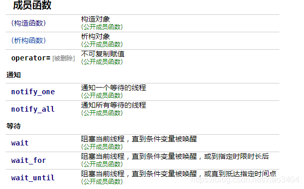

# C++条件变量详解

## 一、condition_variable

使用条件变量可以实现多个线程之间的同步操作，当操作不满足时，相关线程会一直阻塞。条件变量通常和```std::mutex```互斥锁一起使用，且管理锁只能是```std::unique_lock<std::mutex>```

分别是使用以下两个方法实现：

- 等待条件成立使用的是condition_variable类成员wait 、wait_for 或 wait_until。
- 给出信号使用的是condition_variable类成员notify_one或者notify_all函数。



## 二、```wait/wait_for()```

### wait()成员函数

函数声明：

```cpp
void wait(std::unique_lock<std::mutex>& lock);
//Predicate 谓词函数，可以普通函数或者lambda表达式
template<class Predicate>
void wait(std::unique_lock<std::mutex>& lock, Predicate pred);
```

包含两种重载，第一种只包含unique_lock对象，另外一个Predicate 对象（等待条件），这里必须使用 unique_lock，因为wait函数的工作原理：

- 当前线程调用wait()后将被阻塞并且函数会解锁互斥量，直到另外某个线程调用notify_one或者notify_all唤醒当前线程；一旦当前线程获得通知(notify)，wait()函数也是自动调用lock()，同理不能使用lock_guard对象。
- 如果wait没有第二个参数，第一次调用默认条件不成立，直接解锁互斥量并阻塞到本行，直到某一个线程调用notify_one或notify_all为止，被唤醒后，wait重新尝试获取互斥量，如果得不到，线程会卡在这里，直到获取到互斥量，然后无条件地继续进行后面的操作。
- 如果wait包含第二个参数，如果第二个参数不满足，那么wait将解锁互斥量并堵塞到本行，直到某一个线程调用notify_one或notify_all为止，被唤醒后，wait重新尝试获取互斥量，如果得不到，线程会卡在这里，直到获取到互斥量，然后继续判断第二个参数，如果表达式为false，wait对互斥量解锁，然后休眠，如果为true，则进行后面的操作。


### wait_for()成员函数

函数声明;

```cpp
template<class Rep, class Period>
std::cv_status wait_for(std::unique_lock<std::mutex>& lock,
                        const std::chrono::duration<Rep, Period>& rel_time);

template<class Rep, class Period, class Predicate>
bool wait_for(std::unique_lock<std::mutex>& lock,
              const std::chrono::duration<Rep, Period>& rel_time,
              Predicate pred);
```

wait_for 导致当前线程阻塞直至条件变量被通知，或虚假唤醒发生，或者超时返回。

返回值说明：

    若经过 rel_time 所指定的关联时限则为 std::cv_status::timeout ，否则为 std::cv_status::no_timeout 。
    
    若经过 rel_time 时限后谓词 pred 仍求值为 false 则为 false，否则为true
以上两个类型的wait函数都在会阻塞时，自动释放锁权限，即调用unique_lock的成员函数unlock()，以便其他线程能有机会获得锁。这就是条件变量只能和unique_lock一起使用的原因，否则当前线程一直占有锁，线程被阻塞。

## 三、```notify_all/notify_one```

notify函数声明：

```cpp
//若在*this上等待，唤醒等待线程之一
void notify_one() noexcept;
//~，唤醒全部等待线程
void notify_all() noexcept;
```

#### 虚假唤醒：

> 虚假唤醒是一种现象，它只会出现在多线程环境中，指的是在多线程环境下，多个线程等待在同一个条件上，等到条件满足时，所有等待的线程都被唤醒，但由于多个线程执行的顺序不同，后面竞争到锁的线程在获得时间片时条件已经不再满足，线程应该继续睡眠但是却继续往下运行的一种现象。

在正常情况下，wait类型函数返回时要么是因为被唤醒，要么是因为超时才返回，但是在实际中发现，因此操作系统的原因，wait类型在不满足条件时，它也会返回，这就导致了虚假唤醒。因此，我们一般都是使用带有谓词参数的wait函数，因为这种(xxx, Predicate pred )类型的函数等价于：
```cpp
while (!pred()) //while循环，解决了虚假唤醒的问题
{
    wait(lock);
}
```

假设系统不存在虚假唤醒的时，代码形式如下：

```cpp
if (不满足xxx条件) {
    //没有虚假唤醒，wait函数可以一直等待，直到被唤醒或者超时，没有问题。
    //但实际中却存在虚假唤醒，导致假设不成立，wait不会继续等待，跳出if语句，
    //提前执行其他代码，流程异常
    wait();  
}
 
//其他代码
...
```

正确的使用方式，使用while语句解决：

```cpp
while (!(xxx条件) )
{
    //虚假唤醒发生，由于while循环，再次检查条件是否满足，
    //否则继续等待，解决虚假唤醒
    wait();  
}
//其他代码
....
```


