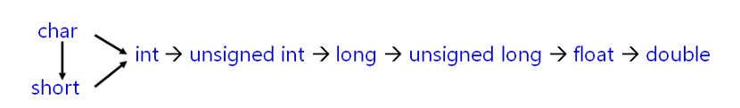

# C++ 中的 类型转换函数

## 1.0 隐式类型转换



标准数据类型之间会进行 **隐式的类型安全转换**。

但隐式转换类型会带来：

* 让程序以意想不到的方式进行工作
* bug的来源

通过使用  `explicit`  关键词来杜绝编译器进行转换尝试，

```c++
class A
{
  public:
  	explicit A(int test):test_(test){}
  private:
    int test_;
};

A t = A(5.3);       //Error!
```


## 2.0  类类型 如何转换到 普通类型 ？

* C++中可以定义类型转换函数
* 语法规则：

```c++
operator Type ()
{
    Type ret;
    return ret;
}
```


* 与 **转换构造函数** 具有同等地位
* 使编译器有能力将对象转化为其他类型
* 编译器能够隐式使用类型转换函数