# C语言 [内存管理](https://zhuanlan.zhihu.com/p/657696118)

# 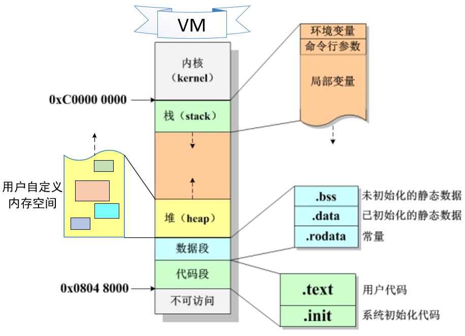


## 1. 虚拟内存

* 内存资源是稀缺的
* 内存空间容易受到破坏,（一个进程误踩其他进程内存）


虚拟内存提供了哪些能力？

- - 高效使用内存：VM将内存看成是存储在磁盘上的地址空间的高速缓存，内存中保存热的数据，根据需要在磁盘和内存之间传送数据；
  - 简化内存管理：VM为每个进程提供了一致的地址空间，从而简化了链接、加载、内存共享等过程；
  - 内存保护：保护每个进程的地址空间不被其他进程破坏。


在单片机中，单片机的内存引用了绝对物理地址；而在Linux中，Linux会为每一个进程分配虚拟地址，并且实行隔离。


### 1.1   内存管理

#### 1.1.1   内存分段

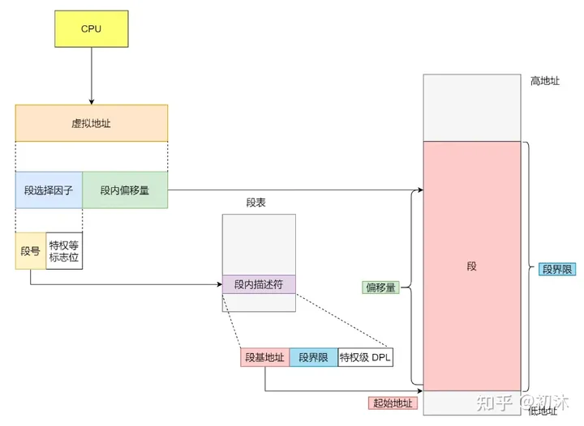

- 虚拟地址是通过段表与物理地址进行映射的，分段机制会把程序的虚拟地址分成 4 个段，每个段在段表中有一个项，在这一项找到段的基地址，再加上偏移量，于是就能找到物理内存中的地址。

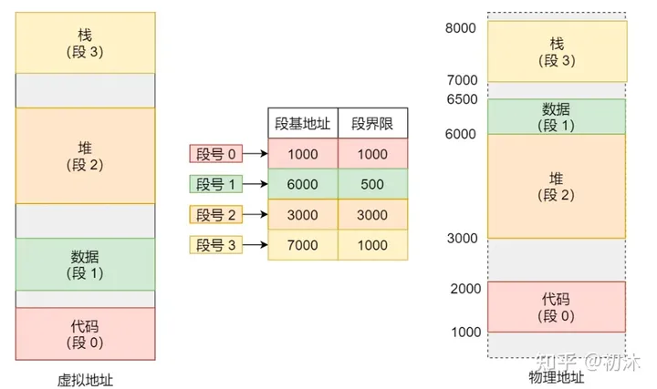

缺点：

1. 内存碎片问题

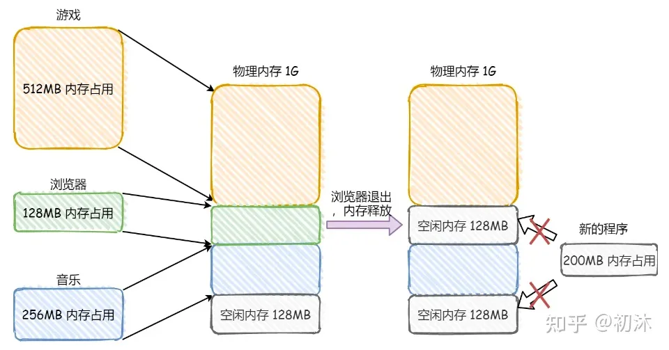

- - 解决方式：内存交换

可以把音乐程序占用的那 256MB 内存写到硬盘上，然后再从硬盘上读回来到内存里。不过再读回的时候，我们不能装载回原来的位置，而是紧紧跟着那已经被占用了的 512MB 内存后面。这样就能空缺出连续的 256MB 空间，于是新的 200MB 程序就可以装载进来。

在 Linux 系统里，也就是我们常看到的 Swap 空间，这块空间是从硬盘划分出来的，用于内存与硬盘的空间交换

\2. 内存交换的效率低问题

硬盘的访问速度要比内存慢太多了，每一次内存交换，我们都需要把一大段连续的内存数据写到硬盘上。如果内存交换的时候，交换的是一个占内存空间很大的程序，这样整个机器都会显得卡顿。


### **1.2.2 内存分页**

- 分页是把整个虚拟和物理内存空间切成一段段固定尺寸的大小。这样一个连续并且尺寸固定的内存空间，我们叫页（Page）。在 Linux 下，每一页的大小为 4KB

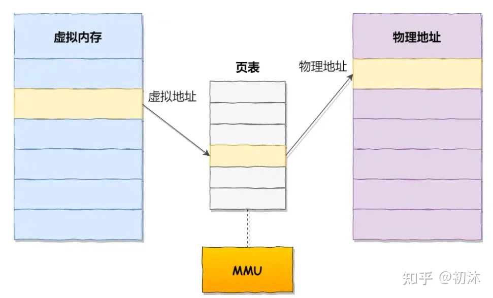

- - 这么做的好处是页与页之间是紧密排列的，所以不会有内存碎片。
  - 内存分页机制分配内存的最小单位是一页，即使程序不足一页大小，最少也得分配一个页
  - 如果内存空间不够，操作系统会把其他正在运行的进程中的「最近没被使用」的内存页面给释放掉，也就是暂时写在硬盘上，称为换出（Swap Out）。一旦需要的时候，再加载进来，称为换入（Swap In）。
  - 分页的方式使得我们在加载程序的时候，不再需要一次性都把程序加载到物理内存中。我们完全可以在进行虚拟内存和物理内存的页之间的映射之后，并不真的把页加载到物理内存里，而是只有在程序运行中，需要用到对应虚拟内存页里面的指令和数据时，再加载到物理内存里面去。（这也是8g内存的电脑能玩100多g游戏的原因）


- 分页机制下，虚拟地址和物理地址是如何映射的？

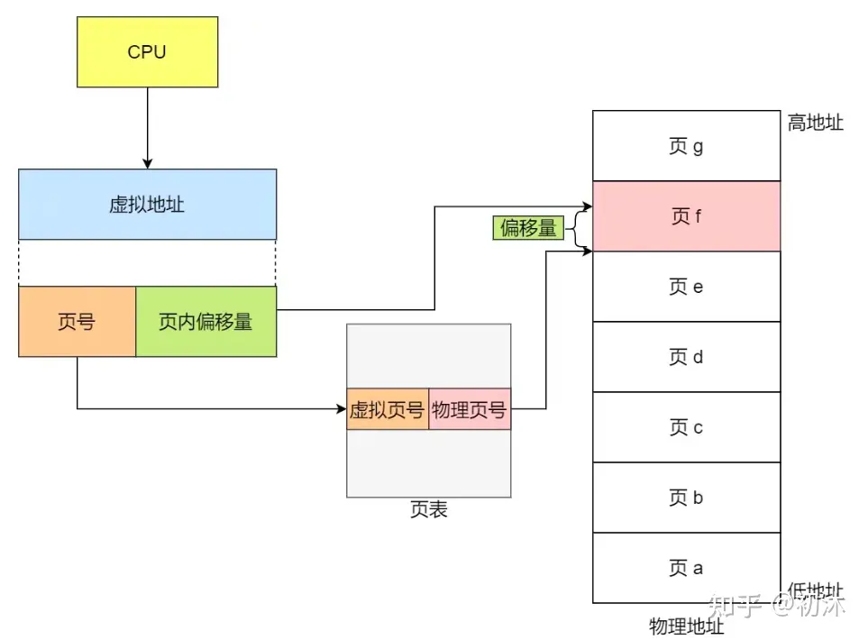

- - 在分页机制下，虚拟地址分为两部分，页号和页内偏移。页号作为页表的索引，页表包含物理页每页所在物理内存的基地址，这个基地址与页内偏移的组合就形成了物理内存地址

缺点：

- - 空间上的缺陷：因为操作系统是可以同时运行非常多的进程的，那这不就意味着页表会非常的庞大，在 32 位的环境下，虚拟地址空间共有 4GB，假设一个页的大小是 4KB（2^12），那么就需要大约 100 万 （2^20） 个页，每个「页表项」需要 4 个字节大小来存储，那么整个 4GB 空间的映射就需要有 4MB 的内存来存储页表。
  - 这 4MB 大小的页表，看起来也不是很大。但是要知道每个进程都是有自己的虚拟地址空间的，也就说都有自己的页表。 那么，100 个进程的话，就需要 400MB 的内存来存储页表，这是非常大的内存了，更别说 64 位的环境了。


### **1.2.3 段页式**

- 段页式是内存分段和内存分页的组合方式。

- 段页式内存管理实现的方式：

- - 先将程序划分为多个有逻辑意义的段，也就是前面提到的分段机制；
  - 接着再把每个段划分为多个页，也就是对分段划分出来的连续空间，再划分固定大小的页；

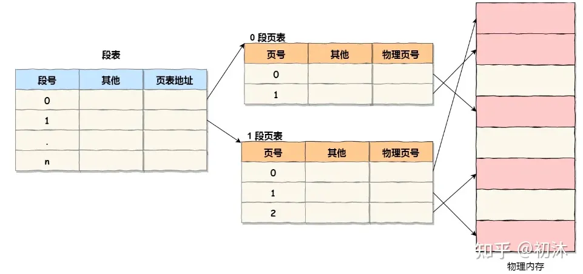


## **2.Linux-C进程内存布局（重点）**

- 任何一个程序，正常运行都需要内存资源，用来存放诸如变量、常量、函数代码等等。这些不同的内容，所存储的内存区域是不同的，且不同的区域有不同的特性。因此我们需要研究内存布局，逐个了解不同内存区域的特性。

- 每个C语言进程都拥有一片结构相同的虚拟内存，例如三个完全不相干的进程p1、p2、p3，它们很显然会占据不同区段的物理内存，但经过系统的变换和映射，它们的虚拟内存的布局是完全一样的。

- - PM：Physical Memory，物理内存。
  - VM：Virtual Memory，虚拟内存。

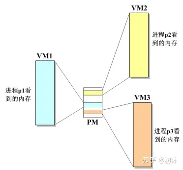

- 将其中一个C语言进程的虚拟内存放大来看，会发现其内部包下区域：

- - 栈（stack）
  - 堆（heap）
  - 数据段
  - 代码段

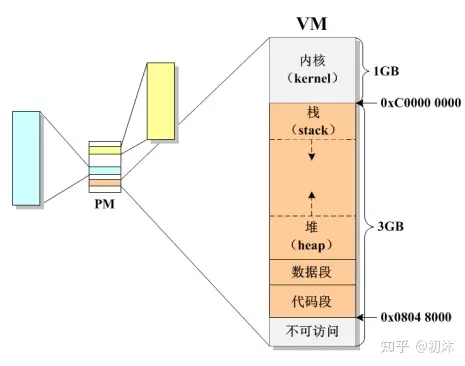

- 虚拟内存中，内核区段对于应用程序而言是禁闭的，它们用于存放操作系统的关键性代码，另外由于 Linux 系统的历史性原因，在虚拟内存的最底端 0x0 ~ 0x08048000 之间也有一段禁闭的区段，该区段也是不可访问的。

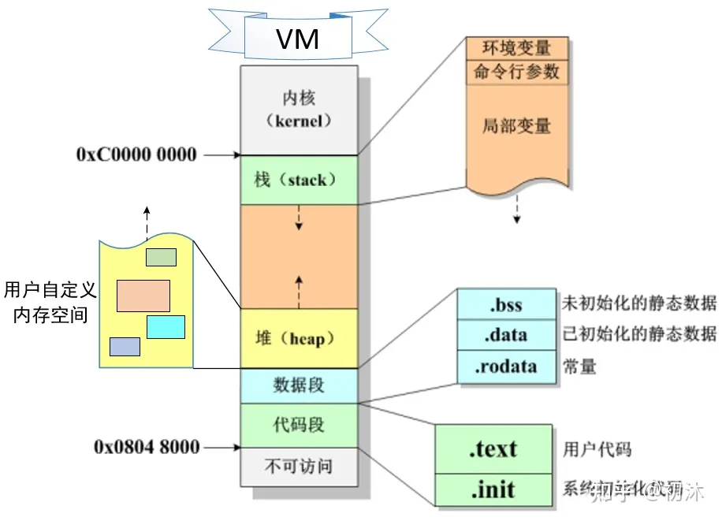


### **2.1 栈内存**

- 栈，又称堆栈，是现代计算机程序极为重要的组成部分，几乎所有的函数调用都依赖于栈进行实现。栈维护了一个函数调用过程中所需要的信息，被称为栈帧。栈帧中一般维护了以下几类重要的数据：

- - 函数返回地址：记录了函数执行完成后，退出函数调用时需要执行的下一条指令
  - 函数参数：在调用子函数时，程序将函数参数依序保存在栈上
  - 局部变量：函数调用过程中使用的非静态局部变量均默认保存在栈上，函数退出后，这些变量也会被释放而不可使用
  - 保存的寄存器（环境变量等）：保存了函数调用前后需要保持不变的寄存器

- 在程序运行过程中，每次执行函数调用，都会建立一个栈帧，连续的过程调用会让栈不断朝着“栈顶”的方向进行扩展；在函数调用完成后，栈帧会被自动释放，栈也会随之缩减。在大多数体系结构上，栈的扩展方向都是由高地址向低地址进行扩展。

- 栈内存有什么特点？

- - 空间有限，尤其在嵌入式环境下。因此不可以用来存储尺寸太大的变量。
  - 每当一个函数被调用，栈就会向下增长一段，用以存储该函数的局部变量。
  - 每当一个函数退出，栈就会向上缩减一段，将该函数的局部变量所占内存归还给系统。
  - 栈内存的分配和释放，都是由系统规定的，我们无法干预。

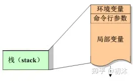

例：

```c
#include <stdio.h>

void swap(int pa, int pb)
{
    // 通过指针，交换实参a和b
    int tmp;
    tmp = pa;
    pa = pb;
    pb = tmp;
    printf("%s\n", __FUNCTION__); // swap
    printf("a: %d\n", pa);        // a: 2
    printf("b: %d\n", pb);        // b: 1
}
// “__FUNCTION__”报告未修饰过的（也就是未裁剪过的）、正在被访问的函数名
// 会在函数大括号开始之后就立即初始化
int main()
{
    int a = 1;
    int b = 2;
    // 交换a和b的值
    swap(a, b);
    printf("%s\n", __FUNCTION__); // main
    printf("a: %d\n", a);         // a: 1
    printf("b: %d\n", b);         // b: 2

    return 0;
}
```

更改为地址传递后：

```c
#include <stdio.h>

void swap(int *pa, int *pb)
{
    // 通过指针，交换实参a和b
    int tmp;
    tmp = *pa;
    *pa = *pb;
    *pb = tmp;
    printf("%s\n", __FUNCTION__);
    printf("a: %d\n", *pa); // a: 2
    printf("b: %d\n", *pb); // b: 1
}

int main()
{
    int a = 1;
    int b = 2;
    // 交换a和b的值
    swap(&a, &b);
    printf("%s\n", __FUNCTION__);
    printf("a: %d\n", a); // a: 2
    printf("b: %d\n", b); // b: 1

    return 0;
}
```

例：

```c
int max(int x, int y) // 变量 x 和 y 存储在max()函数的栈中
{
    int z;            // 变量 z 存储在max()函数的栈中
    z = x>y ? x : y;
    return z;         // 函数退出后，栈中的x、y 和 z 被系统回收
}

int main(void)
{
    int a = 1; // 变量 a 存储在main()函数的栈中
    int b = 2; // 变量 b 存储在main()函数的栈中
    int m;     // 变量 m 存储在main()函数的栈中，未赋值因此其值为随机值
    
    m = max(a, b);
}
```

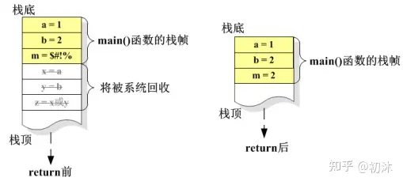

### **2.2 数据段和代码段**

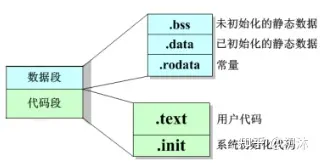


- 数据段细分成如下几个区域：

- - .bss 段(Block Started by Symbol)：未初始化的全局变量和静态局部变量保存在bss段，它们将被系统自动初始化为0。
  - .data段(data segment)：数据段。保存已经初始化的全局变量和静态局部变量。
  - .rodata段（read only data）：只读数据段。存放的是只读数据，一般是程序里面的只读变量(const修饰的变量)、字符串变量、常量数据（printf 的格式化字符也算）。

- 代码段细分成如下几个区域：

- - .text段：存放用户代码
  - .init段：存放系统初始化代码

### **2.2.1 局部变量**

- 在函数内部定义的变量是局部变量，其有效范围是局限于函数内部的，形参也是局部变量。
- 正是因为局部变量的有效使用范围的局限，可以最大程度的确保各函数之间的独立性，避免函数之间相互干扰。

```c
#include <stdio.h>

int main(void)
{
    int a = 1;         /*主函数的局部变量，有效范围整个主函数*/
    {                  /*复合语句开始*/
        int b = 2;     /*复合语句内的局部变量，有效范围在两个大括号之内*/
    }                  /*复合语句结束*/
    printf("%d\n", a); /*出了复合语句变量b就无法使用了*/

    return 0;
}
```

### **2.2.2 全局变量**

- 定义在函数外的变量，不属于任何函数。其作用范围是从定义开始到程序结束，对作用范围内所有的函数都起作用。
- 全部变量的定义格式与局部变量完全一致，只是定义的位置不在函数内，它可以定义在函数的头部，也可以定义在两个函数的中间或程序尾部，只要在函数外部即可。
- 当某函数的局部变量与全局变量同名时，那么全局变量在该函数中不起作用，局部变量起作用。若不存在同名变量的函数，那么全局变量仍然起作用。

```c
#include <stdio.h>

int a = 2, b = 3;

void fun()
{
    int a = 6, b = 2;
    {
        int a = 9, b = 0; /*在这个复合语句中，这两个变量生效，覆盖掉与它同名的全局变量和局部变量*/
        printf("a = %d, b = %d\n", a, b); /*此时：a = 9, b = 0*/
    }
    printf("a = %d, b = %d\n", a, b); /*这里a和b生效的是该函数开头处定义的a和b，它们覆盖掉全局变量，此时：a = 6, b = 2*/
}

int main()
{
    fun();
    printf("a = %d, b = %d\n", a, b); /*这里的a和b就是全局的a和b，因为没有与之同名的变量此时：a = 2, b = 3*/

    return 0;
}
```

### **2.2.3 静态变量**

1. 局部静态变量

- 在局部变量之前加上关键字static，局部变量就被定义成为一个局部静态变量。

- - 内存中的位置：静态存储区（使得局部变量由原来存储在栈内存，变成存储在静态存储区）。
  - 初始化：未经初始化的局部静态变量会被程序自动初始化为0。
  - 作用域：作用域仍为局部作用域，当定义它的函数或者语句块结束的时候，作用域随之结束。
  - 生存周期：当static用来修饰局部变量的时候，它就改变了局部变量的存储位置，从原来的栈中存放改为静态存储区。但是局部静态变量在离开作用域之后，并没有被销毁，而是仍然驻留在内存当中，直到程序结束。

```c
#include <stdio.h>

void f(void)
{
    static int b = 200; // 静态局部变量，退出整个程序之前不会释放
    printf("%d\n", b);
    b++; // b的值加1
}
int main(void)
{
    f();
    f(); // b只会初始化一次，重复调用函数 f()，会使静态局部变量 b 的值不断增大

    return 0;
}
```

\2. 全局静态变量

- 在全局变量之前加上关键字static，全局变量就被定义成为一个全局静态变量。

- - 内存中的位置：静态存储区
  - 初始化：未经初始化的全局静态变量会被程序自动初始化为0
  - 作用域：全局静态变量在声明他的文件之外是不可见的。准确地讲从定义之处开始到文件结尾。

- 定义全局静态变量的好处：

- - 不会被其他文件所访问，修改
  - 其他文件中可以使用相同名字的变量，不会发生冲突。

a.c

```c
//a.c
#include <stdio.h>
extern int a;
extern void fun1();
int main()
{
    printf("%d\n",a);
    fun1();
}
```

b.c

```c
//b.c
#include <stdio.h>
// static int a=100;
int a=100;
void fun1()
{
    int b=200;
    printf("%d\n",b);
}
```

编译命令：

```text
cam@ubuntu:~/code$ gcc -c a.c
cam@ubuntu:~/code$ gcc -c b.c
cam@ubuntu:~/code$ gcc a.o b.o -o main
cam@ubuntu:~/code$ ./main
```

总结：


1. 为什么需要静态数据？

2. 1. 全局变量在默认的情况下，对所有文件可见，为某些需要在各个不同文件和函数间访问的数据提供操作上的方便。
   2. 当我们希望一个函数退出后依然能保留局部变量的值，以便于下次调用时还能用时，静态局部变量可帮助实现这样的功能。

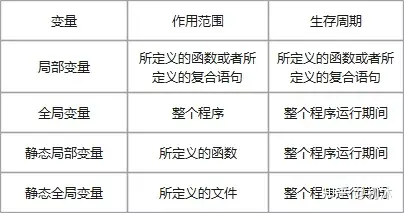

\3. 注意：

1. 1. 若定义时未初始化，则系统会将所有的静态数据自动初始化为0
   2. 静态数据初始化语句，只会执行一遍。
   3. 静态数据从程序开始运行时便已存在，直到程序退出时才释放。

举例：

```c
int a;       // 未初始化的全局变量，放置在.bss 中
int b = 100; // 已初始化的全局变量，放置在.data 中

int main(void)
{
    static int c;       // 未初始化的静态局部变量，放置在.bss 中
    static int d = 200; // 已初始化的静态局部变量，放置在.data 中
    int e;              // 局部变量，放置在栈中
    // 以上代码中的常量100、200放置在.rodata 中
}
```


### **2.3变量存储类型**

- auto：函数中的局部变量，动态地分配存储空间，数据存储在动态存储区中，在调用该函数时系统会给它们分配存储空间，在函数调用结束时就自动释放这些存储空间。
- register：为了提高效率，C语言允许将局部变量的值放在CPU中的寄存器中，这种变量叫“寄存器变量”，只有局部自动变量和形式参数可以作为寄存器变量。
- extern：外部变量（即全局变量）是在函数的外部定义的，它的作用域为从变量定义处开始，到本程序文件的末尾。如果外部变量不在文件的开头定义，其有效的作用范围只限于定义处到文件终了。
- static：静态局部变量属于静态存储类别，在静态存储区内分配存储单元，在程序整个运行期间都不释放。全局静态变量在声明他的文件之外是不可见的。


### **2.4 堆内存（动态内存）**

- 堆内存（heap）又被称为动态内存、自由内存，简称堆。堆是唯一可被开发者自定义的区段，开发者可以根据需要申请内存的大小、决定使用的时间长短等。但又由于这是一块系统“飞地”，所有的细节均由开发者自己把握，系统不对此做任何干预，给予开发者绝对的“自由”，但也正因如此，对开发者的内存管理提出了很高的要求。对堆内存的合理使用，几乎是软件开发中的一个永恒的话题。


- 堆内存基本特征：

- - 相比栈内存，堆的总大小仅受限于物理内存，在物理内存允许的范围内，系统对堆内存的申请不做限制。
  - 相比栈内存，堆内存从下往上增长。
  - 堆内存是匿名的，只能由指针来访问。
  - 自定义分配的堆内存，除非开发者主动释放，否则永不释放，直到程序退出。

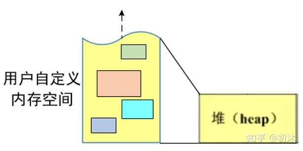

- 相关API：

- - 申请堆内存：malloc() / calloc()
  - 清零堆内存：bzero()
  - 释放堆内存：free()

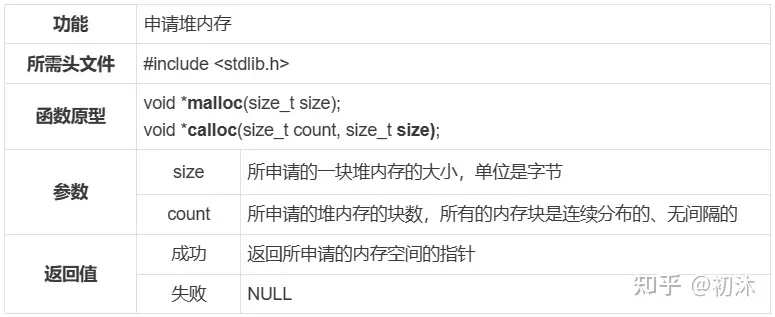

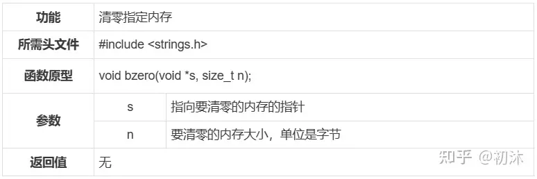

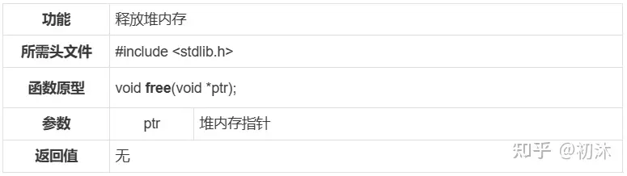

```c
int *p = malloc(sizeof(int)); // 申请1块大小为 sizeof(int) 的堆内存
bzero(p, sizeof(int));        // 将刚申请的堆内存清零

*p = 100; // 将整型数据 100 放入堆内存中
free(p);  // 释放堆内存
p = NULL; // 置为空，以免形成野指针影响程序运行

// 申请3块连续的大小为 sizeof(double) 的堆内存
double *k = calloc(3, sizeof(double));
// calloc会在返回起始地址之前，把在堆区申请的动态内存空间的每个字节都初始化为0
k[0] = 0.618;
k[1] = 2.718;
k[2] = 3.142;
free(k);  // 释放堆内存
k = NULL; // 置为空，以免形成野指针影响程序运行
```

注意：

- - malloc()申请的堆内存，默认情况下是随机值，一般需要用 bzero() 来清零。
  - calloc()申请的堆内存，默认情况下是已经清零了的，不需要再清零。
  - free()只能释放堆内存，不能释放别的区段的内存。

释放内存的含义：

- - 释放内存意味着将内存的使用权归还给系统。
  - 释放内存并不会改变指针的指向。
  - 释放内存并不会对内存做任何修改，更不会将内存清零。