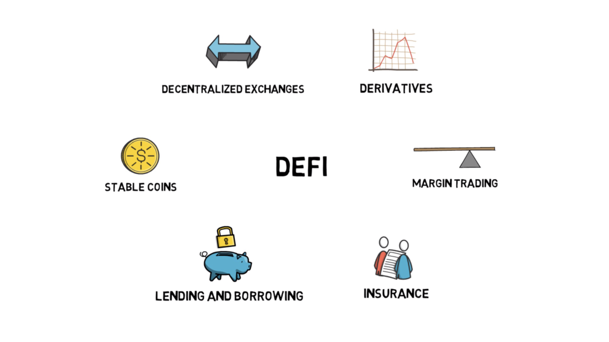

# 1.0 Decentralized Finance Explained

​	DeFi or decentralized finance is a movement that aims at making a new financial system that is open to everyone and doesn’t require trusting intermediaries like banks. Most defi projects are built on **Ethereum**.

## 1.1 History of Defi

One of the first projects that started the decentralized finance movement was MakerDAO.

## 1.2 Some important parts

### 1.2.1  Lending and Borrowing 

### 1.2.2  Algorithmic Stable Coin

### 1.2.3  Decentralized Exchanges

### 1.2.4  Derivatives

### 1.25  Insurance

### 1.26 Oracles (  预言机  )

Oracles services that focus on delivering **reliable data feeds** from the **outside world** into the **smart contracts**. The most popular project in this space is **Chainlink**.