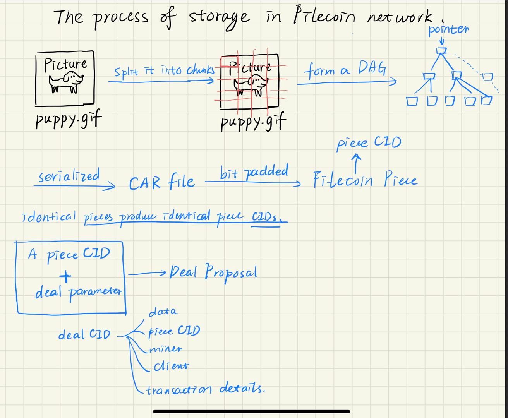
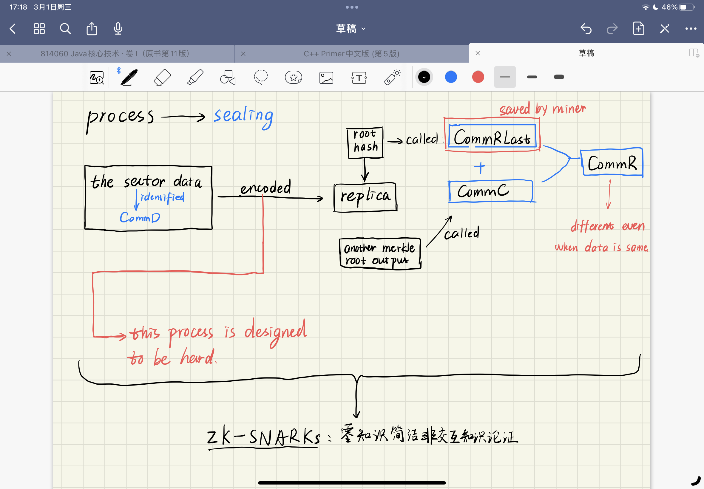
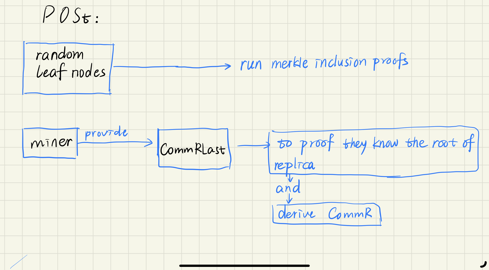

# Filecoin

### Brief  introduction

* decentralized storage
* incentivized storage  (cryptocurrency--**FIlecoin**)
* cryptographic proofs (**Proof of Replication** and **Proof of Spacetime**)

### Preparing  and  transferring  data

* prepare data for storage
  * being transformed into a Filecoin Piece

***how to??***

### Proof

#### Proof of Replication

* a storage miner proves that they are storing a physically unique copy of data
* happen just once at the time the data is first stored
* filling sectors and generating the CommD (piece CID)

Miners put each piece of data into a sector. When the sector is full, a CommD (Commitment of Data, aka UnsealedSectorCID) is produced, representing the root node of all the piece CIDs contained in the sector.

> Sectors are the fundamental units of storage in Filecoin, and can contain pieces from multiple deals and clients.

* Sealing sectors and producing the CommR

Next, a process called *sealing* takes place.

During sealing, the sector data (identified by the CommD) is encoded through a sequence of graph and hashing processes to create a unique replica. The root hash of the merkle tree of the resulting replica is the CommRLast. (Learn more about merkle trees in our [Content Addressing on the Decentralized Web](https://proto.school/content-addressing) tutorial.)

The CommRLast is then hashed together with the CommC (another merkle root output from Proof of Replication). This generates the CommR (Commitment of Replication, aka SealedSectorCID), which is recorded to the public blockchain. The CommRLast is saved privately by the miner for future use in Proof of Spacetime, but is not saved to the chain.

The encoding process is designed to be slow and computationally heavy, making it difficult to spoof. (Note that encoding is not the same as encryption. If you want to store private data, you must encrypt it before adding it to the Filecoin network.)

The CommR offers the proof we need that the miner is storing a physically unique copy of the client's data. If you store the same data with multiple storage miners, or make multiple storage deals for the same data with a single miner, each deal will have a different CommR.

The sealing process also compresses the Proof of Replication using zk-SNARKs to keep the chain smaller so that it can be stored by all members of the Filecoin network for verification purposes. We'll learn more about zk-SNARKs in a future lesson.

#### Proof of Spacetime

**Proof of Spacetime (PoSt)** is run repeatedly to prove that they are  continuing to dedicate storage space to that same data over time.

PoSt builds upon several elements created during Proof of  Replication: the replica, the privately saved CommRLast, and the  publicly known CommR.

* First, PoSt randomly selects some leaf nodes of the encoded replica  and runs merkle inclusion proofs on them to show that the miner has the  specific bytes that should be there. 
* Then, the miner uses the privately  stored CommRLast to prove (without revealing its value) that they know  of a root for the replica which both agrees with the inclusion proofs *and* can be used to derive the publicly-known CommR.
* The final stage of PoSt compresses these proofs into a single zk-SNARK. (We’ll learn about zk-SNARKs in the next lesson.)

When miners agree to store data for a client, they're required to put down collateral. If they fail a Proof of Spacetime at any point during  the contract, they'll be penalized. This is a key part of the  incentivization that encourages good behavior amongst all the players in the Filecoin network.

