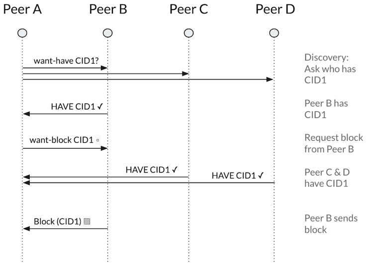

# Bitswap

### BItswap has two main jobs:

- **Acquire** blocks requested by the client from the network.
- **Send blocks** in its possession to other peers who want them.

### Want Lists

* send out ```want-lists```of CIDs

  ```markdown
  Want-list {
    QmZtmD2qt6fJot32nabSP3CUjicnypEBz7bHVDhPQt9aAy, WANT,
    QmTudJSaoKxtbEnTddJ9vh8hbN84ZLVvD5pNpUaSbxwGoa, WANT,
    ...
  }
  ```

### Discovery

