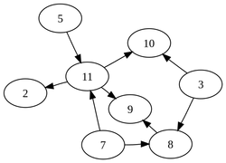

# How IPFS works

As a protocol for peer-to-peer data storage and delivery, IPFS is a *public network*: Nodes participating in the network store data affiliated with globally consistent [content addresses](https://docs.ipfs.tech/concepts/content-addressing/) (CIDs) and advertise that they have those CIDs available for other nodes to use through publicly viewable [distributed hash tables](https://docs.ipfs.tech/concepts/dht/) (DHTs).

There are three fundamental principles to understanding IPFS:

1. Unique identification via content addressing
2. Content linking via directed acyclic graphs (DAGs)  有向无环图
3. Content discovery via distributed hash tables (DHTs)

## Directed acyclic graphs (DAGs)

一种数据结构。

IPFS uses a Merkle DAG that is optimized for representing directories and files. To build a Merkle DAG representation of your content, IPFS often first splits it into *blocks*. Splitting it into blocks means that different parts of the file can come from different sources and be authenticated quickly. 

> [有向无环图](https://wiki.swarma.org/index.php?title=%E6%9C%89%E5%90%91%E6%97%A0%E7%8E%AF%E5%9B%BE_Directed_acyclic_graph&oldid=23887)

> [Merkle Directed Acyclic ](https://docs.ipfs.tech/concepts/merkle-dag/#further-resources)

##  Distributed hash tables (DHTs分布式散列表)  

A hash table is a database of keys to values. A *distributed* hash table is one where the table is split across all the peers in a distributed network. The [libp2p project](https://libp2p.io/)[ (opens new window)](https://libp2p.io/) is the part of the IPFS ecosystem that provides the DHT and handles peers connecting and talking to each other. 

#### **STEP**:

1. find where the contents is (by libp2p) 

2. use DHTs again to find the current location of the peers

3. connect to that content and get it  (by requesting blocks)

   * uses a module called Bitswap

     > Bitswap is a data exchange protocol for sending and receiving content addressed blocks of data. Bitswap has two primary jobs:
     >
     > 1. Attempt to acquire blocks from the network that have been requested by the client.
     > 2. Send blocks in its possession to other peers who want them.

   

In IPFS, the DHT is used as the fundamental component of the **content  routing system** and acts like a cross between **a catalog and a navigation  system**.

### [Kademlia](https://zh.wikipedia.org/zh-hans/Kademlia)

Kademlia uses a **"distance" computed as the XOR of the two nodes ID** calculation between two nodes.A **basic** Kademlia network with 2n nodes will only take n steps (in the worst case) to find that node.

> *XOR* was chosen because it acts as a [distance function](https://en.wikipedia.org/wiki/Metric_(mathematics)) between all the node IDs. Specifically:
>
> - the distance between a node and itself is **zero**  
> - it is symmetric: the "distances" calculated from A to B and from B to A are the **same**
> - it follows the **triangle inequality**: given A, B and C are [vertices](https://en.wikipedia.org/wiki/Vertex_(geometry)) (points) of a triangle, then the distance from A to B is shorter than  (or equal to) the sum of both the distance from A to C and the distance  from C to B.

 it's purpose is to build a DHT on top of three system parameters:

1. An address space peers` identifier
2. A metric to order the peers in the address in a line from smallest to largest 
3. A *projection* that will take a `record key` and  calculate a position in the address space where the peer or peers most  ideally suited to store the record should be near. IPFS uses `SHA256(Record Key)`.

### SHA file hashes won't match Content IDs

Because IPFS splits a file into blocks, and verifies them through [directed acyclic graphs (DAGs](https://docs.ipfs.tech/concepts/merkle-dag/)). each block has its own CID, including separate CIDs for any parent nodes.

### Libp2p

What makes libp2p especially useful for peer-to-peer connections is ***connection multiplexing***. Using IPFS, you open just one connection, and you multiplex everything on that.
