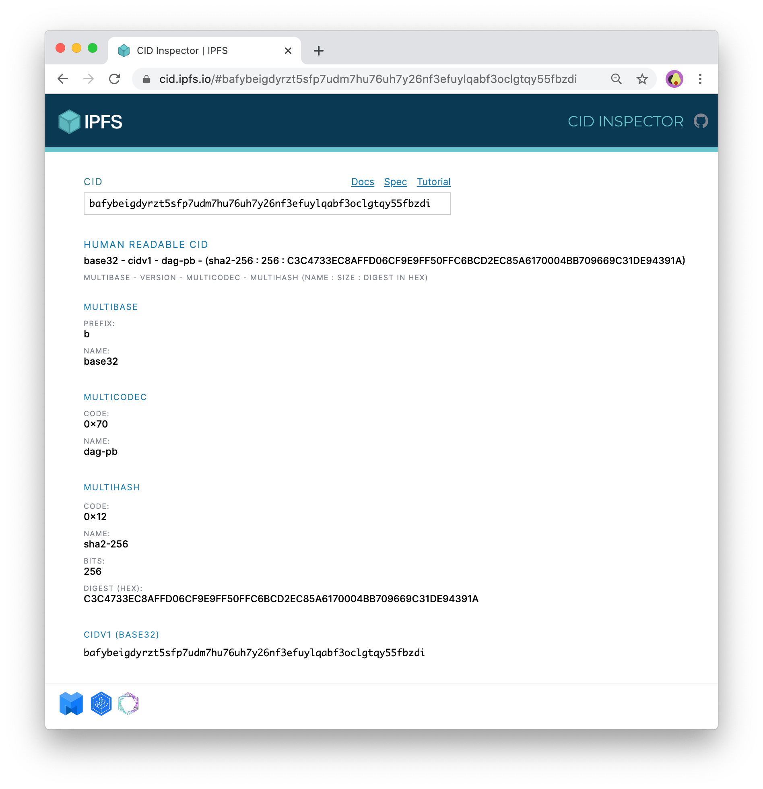

# Dweb


### Location addressing && content addressing 

##### Location addressing

1.  it depends on **URLs** to find the content location (centralized authority)

> **URLs are based on the location where data is stored**

2. limitations
   * the risk of being tricky when based on the URLs to judge the content
   * lead to somewhere holding nothing (404)
   * trust risk (rely on central authority)
   * efficiency problem (tons of redundancy waste the hardware source)

##### content addressing

> Cryptographic hash function (CHF)  密码散列函数
>
> properties：
>
> *  **Pre-image resistance**:   Given a hash value *h*, it should be difficult to find any message *m* such that *h* = hash(*m*).  the probability of a particular n-bit output result for a random input is 2<sup>-n</sup>
>
> * **Second pre-image resistance**：Given an input *m*1, it should be difficult to find a different input *m*2 such that hash(*m*1) = hash(*m*2). resistance to search
> * collision resistance strength of n/2 bits . It should be difficult to find two different messages *m*1 and *m*2 such that hash(*m*1) = hash(*m*2). Such a pair is called a cryptographic [hash collision](https://en.wikipedia.org/wiki/Hash_collision). 

1. cryptographic hashing 
2. **unique** : Everyone holds the data , and the unique hash ensure the truth of content. 
3. content stored in peers


## [IPFS](https://docs.ipfs.tech/concepts/what-is-ipfs/#decentralization)(**InterPlanetary File System**)

IPFS is a distributed system for storing and accessing files, websites, applications, and data.

IPFS is a peer-to-peer (p2p) storage network. Content is accessible  through peers located anywhere in the world, that might relay  information, store it, or do both. IPFS knows how to find what you ask  for using its content address rather than its location.

```json
/ipfs/bafybeiaysi4s6lnjev27ln5icwm6tueaw2vdykrtjkwiphwekaywqhcjze/wiki/Aardvark
```

### Decentralization:

* **Supports a resilient internet**
* **Makes it harder to censor content**
* **Can speed up the web when you're far away or disconnected**

### Content addressing:

- **unchangeable**  If the text on a web page is changed, the new version gets a new, different address.
- **unmovable**   Content can't be moved to a different address. On today's internet, a company  could reorganize content on their website and move a page at `http://mycompany.com/what_we_do` to `http://mycompany.com/services`. In IPFS, the old link you have would still point to the same old content.
  - how to solve the problem(lousy in updating)
- content can't be removed from IPFS as long as *someone* is interested enough to make it available, whether that person is the original author or not.

### Paticipation:

IPFS only works well when people are actively participating. IPFS is based on the ideas of **possession** and **participation**, where many people *possess* each others' files and *participate* in making them available.


### CIDs  (Content Idendifiers)

> [learn CIDs](https://docs.ipfs.tech/concepts/content-addressing/#what-is-a-cid)

A *content identifier*, or CID, is a label used to point to material in IPFS.

properties:

* CIDs are short
* based on Cryptographic Hash    (any diference will produce different CIDs)
* forms address based on the content (not the location)

structure:

```c
+------------------------------+
| Codec                        |
+------------------------------+
|                              |
| Multihash                    |
| +----------+---------------+ |
| |Hash Type | Hash Value    | |
| +----------+---------------+ |
|                              |
+------------------------------+
```


