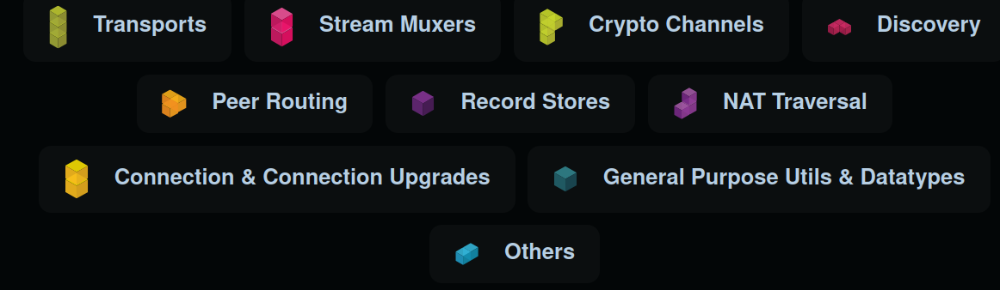

# libp2p

### Brief introduction:

The libp2p project is splited from IPFS, in order to better develop the own ecosystem of itself.

difference:

* IPFS is more focused on ***content addressing***, i.e., finding, fetching and authenticating any piece of content in the web.
* libp2p is more focused on ***process addressing***, i.e., finding, connecting and authenticating any data transfer processes in the network.

### Modularity

modularity design can really extend its all potency.

