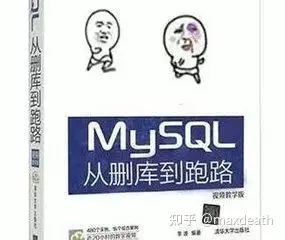
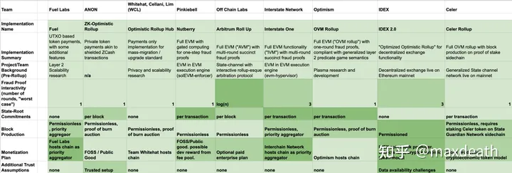

# 什么是Rollup

## 太长不看版（TL；DR）

众所周知，以太坊是个虚拟机。

什么意思呢？

就是比特币中的交易长这样：

“如果小明的签名验证通过，小明转10元钱给小红的地址。”

而以太坊中的交易可能长这样：

“当小明的签名验证通过并且满足blablablabla条件时，将小明账户中的10元钱转到小红的账户上。”

这其中的blablablabla条件，实际上可以是任何逻辑或者任何程序，其中可以有条件判断，可以有循环，这些以太坊都支持。但问题就来了——要是有个不善良的矿工打包了个死循环放在区块里，岂不是能让所有的以太坊节点都死机？

为了防止这种事情发生，以太坊中设置了每个区块的Gas上限以及每个计算步骤所需要消耗的Gas量。

我们可以简单粗暴地把Gas理解成汽油。比如，一个条件判断需要10gas，一个签名验证需要100gas，一个状态读写需要10gas等等……然后，每笔交易都需要注明这笔交易需要使用的Gas（当然，还需要付钱）。比如说，在某笔交易之后，你注明“跑1000个gas的”，于是，以太坊的节点会执行这笔交易，但是当计算需要消耗的gas超过1000了，不管交易的步骤执行没执行完都会停下来。

于是，死循环不会出现，比如你写了个死循环，但是每次循环会烧10gas，而区块的gas上限是10000，你于是最多给这个程序买10000的gas，那么所有节点会执行1000次循环把你给的gas烧完就停下来，而不会无限循环下去。

而这个时候就引出了另一个以太坊和比特币不同的区别：

在比特币中，链上最宝贵的资源是空间——因为一个区块大小是1M，而平均10分钟才能出一个区块。

而在以太坊中，**链上最宝贵的资源是gas**，因为每个区块的gas是有上限的，而平均出块时间也是固定的，于是其实每单位时间能够做的计算步骤是有限的。

于是，当大量的人需要做交易，尤其是很多操作复杂的交易的时候，以太坊就会拥堵。

而在当下DeFi交易盛行的时候，以太坊拥堵的问题就变得十分严重以至于开始影响使用了，一笔去中心化交易所的货币兑换的交易的交易费在拥堵的时候可能会超过100美元，这无疑会让很多用户望而却步。

而rollup顾名思义，就是把一堆交易卷（rollup）起来变成一个rollup交易，所有节点接收到这个rollup交易之后，不去执行被卷起来的逻辑，而只去接受**这些逻辑的执行结果**。因此这个rollup交易所需要的gas会远小于执行这些交易的gas。

通过这种把交易卷起来的方法，一个区块中就能装下更多的交易了，而TPS也就上去了。

但自然而然的，虽然扩容的目的达到了，但是这些卷起来的交易需要怎么执行呢？

这些卷起来的交易和这些交易之后变更的状态（比如账户信息）都会被挪到链下的一个账本上，这个账本由一些专门的节点负责验证和维护，并定期将这个账本的状态做个摘要发到以太坊上。

也就是说，如果采用了rollup之后，就像是现在你看到的这篇文章的这个“太长不看”的段落一样，以太坊里会有一些专门的节点负责去给所有交易做计算，然后，把这些交易打包起来生成一个“太贵不用算”的摘要，告诉所有节点“这些是我们算完之后给你总结出来的结论，你们照着做就是了”。

采用了rollup之后，区块大概会变成下图这个样子。原本需要很多gas的交易现在只需要1000gas了，于是这个区块中就可以继续装更多的交易了。

而rollup主要分成optimistic rollup和zk-rollup，两者在rollup的方法和原理上都十分不同，这点我们后面再详细讲。

## rollup是怎么来的

那么，大家已经知道rollup是什么了，但rollup具体是怎么实现的呢，这个要是真想讲明白，就不得不讲点历史小故事：

这里我们就来说说rollup这种方法是怎么来的，以及为什么之前某个更简单的叫做plasma的方案失败了。

## 比特币与闪电网络

Plasma的关系实际上是比特币的闪电网络在以太坊里的映射。换句话说，以太坊想按照闪电网络的原理在以太坊上做一个链下技术，但是没做出来。

那我们先说说闪电网络是什么原理。

比特币闪电网络的基本原理类似储值卡：

1. 交易双方，小明和小红，各锁定一笔钱，比如1000块在链上。然后，每个人手里都握有一个延时退款凭证，这个凭证的作用是“凭提交此证上链可以在两星期之后从链上拿回1000块钱”。
2. 双方在链下进行交易，而这个交易的本质是更新双方的凭证。例如，小明给了小红100块，这笔交易的实质是小明的凭证变成“凭提交此证上链可以在两星期之后从链上拿回900块钱”，而小红的凭证变成“凭提交此证上链可以在两星期之后从链上拿回1100块钱”。
3. 于是问题就来了——如果小明付完钱之后赖账怎么办？也就是说，小明如果还拿着“凭提交此证上链可以在两星期之后从链上拿回1000块钱”的旧凭证上链提款怎么办？所以说，其实双方在交易的时候，除了更新延时退款凭证之外，还要互相交换一个违约退款凭证，即：“如果链上对方发了失效的退款凭证，那么我可以凭借此违约凭证**即时**退回我的钱以及拿走对方的押金。
4. 于是，双方的在1000块以内的交易就都可以被挪到链下，在交易双方之间安全进行，只要两个人都保持定期监测链上动态，看看对方有没有发起恶意的延时退款就行。

## 以太坊与Plasma

那么，这个方法能不能用于以太坊呢？

从逻辑上来讲是没问题的，但是操作起来的时候，由于以太坊和比特币在形式上的区别，以太坊的链下方案，即Plasma，它的样子和闪电网络非常不一样——

在闪电网络中：

1. **交易双方**在链上抵押押金。
2. 双方的所有交易都在链下，仅需要**被交易双方验证和记录**。
3. **一方想要退出，则将链下当下的“状态”提交到链上**，等待一段时间才可拿回押金；在这段时间内，另一方可以提出异议并提交“欺诈证明”，来证明对方提交的状态并非最新状态并且**拿走对方抵押的押金**。

以上这种，被称为**私人状态通道**。

然而，由于以太坊是个虚拟机，你的账户状态有可能被任何节点调用，所以链下的交易就不仅仅是一条条“通道”了，而是一个“网络”，里面记录了所有节点的状态，并且每笔交易都会影响链下的这个“网络”的状态。而这个网络，任何普通的用户肯定是没有办法处理这么多交易并且随时更新状态。

于是，Plasma采用的逻辑是：

1. **专门的验证节点**在链上抵押押金。
2. **验证节点负责验证和记录所有的交易**。
3. 任何人想要将自己的钱从链下转到链上，需要**某个验证节点将链下的状态提交到链上**，并等待一段时间；在这段时间内，任何其他节点都可以提出异议并提交“欺诈证明”，来证明该验证节点提交的状态并非最新状态并且**拿走部分该节点抵押的押金**。

但这个时候，在第三步上就有了几个比较麻烦的问题——

在闪电网络中，交易双方都会盯着自己的链下交易状态，因为那相当于自己的钱包。如果对方试图退款时发布的状态和链下的最新状态不符，那都相当于从你钱包里偷钱，正常人都能做出相应的回应。

但在Plasma里，链下交易是个大网络，你光盯着自己的钱包没有用，因为你的钱会记录在一个巨大的数据库里。于是，一般用户没有能力随时盯着所有交易和状态的变化，就只能交给专业的验证者。尽管在理想的状态下，所有的链下状态也该是公开的，任何节点都可以自己维护一份，并且，如果发现了验证节点的作恶行为也可以反制并拿走作恶节点的押金。但这只是个美好的幻想，经济学告诉我们——没有稳定回报的机制是无法长期运行的。链下的交易数量庞大，而如果你不是验证节点，光靠监督其他验证节点指望着他们作恶来你来拿走押金这种激励是不现实的。

于是，令人担心的问题是——如果某一天如果Plasma所有的验证者都删库跑路了，谁那还能从哪找到这些状态呢？于是这些在链下的资金就永远无法被解锁了，这是第一个问题。

第二个问题是，在比特币里，双方交易的时候，每次交易会交换这个欺诈证明作为交易完成的标志。但在Plasma里，链下的任何交易都会改变这个“二层网络”全局的状态，不可能每次有交易都发给所有用户一个“欺诈证明”，那样太没效率了。于是，就只能是当验证者出现欺诈行为的时候，再去根据现在的链下状态生成一个“欺诈证明”。

打个比方：小明给了小红100块钱，在闪电网络里，小明其实每次给小红的都不是钱，而是一个“你凭借此条可以从链上我的押金里取走我的100块钱，但如果我试图赖账，你可以凭借此条从链上取走我的所有押金”的一个凭证。但在Plasma里，没法在每次状态变更的时候给所有人生成并且发放这个凭证，于是，如果小明伙同一个验证者试图赖账，小红得去链上申辩“你看小明公布的状态是这个时候的，但现在的状态是这样的”。

于是这个时候，大家要信谁的呢？小红就需要在链上再提供小明公布的状态到小红公布的状态的一个完整过程，也就是这期间发生的所有状态变化，也就是交易，来证明小明收买的那个验证者公布的状态确实不是最新的。而这就相当于又把这些链下的交易放回了链上，这就失去了链下技术的意义而且带来了安全风险——如果交易太多以至于根本来不及在申诉期发完，那么小红的钱就永远追不回来了。

## Optimistic Rollup

于是，我们有了Plasma的一个升级方案，或者说是折中方案，叫做Optimistic Rollup（OR）：

- 以太坊：所有交易和状态都记录在链上。
- Plasma：所有交易和状态都记录在链下。
- OR：所有交易和一批交易处理之后的最终状态的摘要记录在链上，但交易的计算和具体状态变更放在链下进行。

相比于Plasma，OR解决了Plasma的两个最致命的问题：

首先，由于所有交易其实都被完整的记录在链上，只不过大家不去验证了而已。因此，Plasma的数据可用性问题就不存在了，因为即便原来的验证者跑路了，任何人都可以根据记录在链上的记录去验证一遍来成为新的验证者。此外，之前那种可能相当繁琐的申诉过程也不存在了，因为如果有人伙同验证者作恶，那么他们必然导致某批次交易之后的状态信息（比如账户信息）和这些交易本身对不上。而由于状态信息的摘要和交易都在链上，申诉方可以很方便地通过状态变更的摘要信息指出两者的不一致。

但这种这种方案自然是有代价的：原本，闪电网络或者Plasma这样的链下技术可以说是“无限扩展”的——比如说，闪电网络两个人的状态通道里可以发生10000笔交易，只要额度都比押金少，在链上始终都只有两笔交易，就是双方抵押押金开启状态通道的那笔，但在OR里，链上记录的交易仍旧是10000笔，一笔都没少。

用更科学的话说，不考虑申诉的情况，闪电网络里n笔交易对于链上资源的占用是O(1)，也就是创建了通道或者说资产挪到二层网络之后后，二层网络里不管有多少笔交易都不会占用链下资源。而对于OR，链上资源的占用是O(n)，从数量级上是没有提升的。也就是说，原本10000笔交易占用10000份的资源，现在10000笔交易还是占用10000份的资源。

于是，有人大概会问了——原来是这叫什么扩容呢？

原因在于，以太坊现在最大的瓶颈是gas，而OR省了gas。虽然仍旧占用10000份资源，但原本，一笔交易中可能需要涉及到若干计算，消耗大量的gas，但如果采用了OR，虽然仍是10000份，但是每笔交易都仅仅储存在链上一个只读的部分，消耗的gas是原来一笔交易的几十或者100分之一。

这样，虽然达不到“无限扩展”，但是，在最理想的状况下，也能将输出提高几十到200倍，而在现阶段，这相当于以太坊的速效救心丸——从长远的角度看，无疑“分片”带来的吞吐量提升更诱人，但是在现在，OR带来的性能提升是以太坊更急需的东西。

## 为什么我看到这么多种Optimistic rollup

OR的基本原理我们已经讲完了，那么现在圈子里那么多OR的项目都是在干啥呢？

实际上原理都是上面这个原理，但是做法上其实有很多可以权衡的地方，比如：

所有状态的摘要是一个区块传一个呢？还是一笔交易就传一个呢？还是在侧链上根据应用不同，把全局状态分个类，然后一个区块传几个呢？摘要传得多，平时占用的链上资源就多，但提交欺诈证据是申诉时所占用的资源就少，同时，如果有摘要出了问题，需要回滚的交易也越少。

同时，申诉也分两种，有的提交证据的时候是一次性的，有的提交证据的时候是交互式的。通常，前者证据的大小会更大一些，后者证据的总体大小小，但是申诉人得等官方上班（找个在线的以太坊矿工）。

于是，选择哪种方法，就取决于每个OR的项目采用的技术路线，以及他们对于申述的看法，也就是觉得这些验证节点是很不可能作恶呢，还是有作恶的可能；而这点怎么判断的，这又取决于这些节点的选取——他们是以太坊矿工中公开选取出来的，还是主要来自于某些专注某些应用（比如DeFi）的机构呢？

（图片引自Daniel Goldman的medium文章The State of Optimistic Rollup，[https://medium.com/molochdao/the-state-of-optimistic-rollup-8ade537a2d0f](https://link.zhihu.com/?target=https%3A//medium.com/molochdao/the-state-of-optimistic-rollup-8ade537a2d0f)）

## Zk-rollup

除了OR之外，大家可能听过另一种rollup方案，叫做zk-rollup（ZR），这里，zk指的是zero knowledge（零知识），换言之，这种rollup方案基于一个叫做“零知识证明”的密码学工具。

“零知识证明”这个东西，如果比较关心区块链或者密码学的前沿技术的话可能大家已经听说过了，它的原理即便对于非专业人士太过复杂，我这里仅仅介绍一下它能做什么：

给定一个问题X，比如某数学试卷最后一道大题最后一问。

这个时候，某个学霸小明做出了这道题，但是某个学渣小白不相信小明做出了这道题，于是和小明打赌，要他证明自己确实做出了这道题。而小明其实很清楚，小白想打赌的目的实际上是想抄他的答案。

那么，有没有某种方法，能够一方面证明小明解出了这题，同时还不泄露这题的答案呢？

这种方法就是零知识证明，它可以同时满足以上两个条件。通过某个零知识证明的算法，小明生成了一个证明“P”。

给出这个证明后，小白一看到“P”，就能100%确信小明确实解开了这道题——这是零知识证明中的“证明”的意思。

但另一方面，小白看到“P”之后，仍旧完全不知道答案和小明解题的一丁点过程——这是零知识证明中的“零知识”的意思。

——————————————————————————————

具体到ZR的场景里，我们主要是用到“证明”的这部分用途。

在ZR中，链上保留交易以及一批交易之后，所有状态的变化的摘要。

于是，在这里，零知识证明中需要证明的东西，就是：

“我知道一系列的交易，在经过这些交易之后，所有交易的状态的摘要将从A变成B。”

就比如：

“我知道某一系列交易，在经过这些交易的所有处理步骤之后，小明和小红的账户会从（1000，1000）变成（900，1100）。”

对这条论断，验证者可以通过零知识证明生成一个证明P。

然后，将P以及状态摘要A和B以及所有的交易一起发到链上，这样，所有的节点不需要验证这些交易，只要通过验证P，就可以确定状态A到状态B的真实性了。

这种做法和OR有个显著的不同点：

同样有一堆被打包起来的交易TX，同样是这些交易会让所有账户的状态从A变成B，同样是将具体变化的计算拿到链下而用一个证明代替。

但不同的是，ZR采用的是“有效证明（Validity proof）”的逻辑而OR采用的是“作恶证明（Fraud proof）”的逻辑，即：

- 在OR中，有一个或者几个验证者，他们通过签名的方式担保“状态A在经过这些交易TX之后会变成状态B，我验证了”。然后，在一段时间的挑战期（通常是一周或者两周）之内，如果有人提出“你担保的结果和实际交易执行的结果不符”并提供证据，那么，错误的结果将会被回滚，挑战者可以获得担保人在链上抵押的一部分押金。
- 在ZR中，验证节点在链下通过零知识证明算法，生成一个证明P并与状态A，B与交易TX一起上传上链，相当于是表示“状态A在经过这些交易TX之后会变成状态B，你可以通过验证P来证实这一点”。在ZR中，不需要挑战期，因为密码学可以保证验算P就等价于验证了状态B是经由交易TX得出的。

## OR和ZR哪个好？

可能很多读者看到这里，已经在心中有了个自己的判断——

ZR似乎从很多角度看起来都比OR好啊：

1. OR并不带来绝对的安全性——首先OR的安全性还是通过押金而不是算法保证的。此外，与闪电网络，Plasma一样，这些基于“担保--挑战”也就是基于“作恶证明”的机制都容易受到对于区块链的“审查攻击”，也就是说，如果别人在第二层偷了你的钱，但串通了矿工在挑战期的时候不打包你的申诉，于是过了挑战期，你的钱就永久地在第二层被偷走了。相对的，基于“有效证明”的ZR就不存在这种问题。
2. 同时，由于挑战期的存在，将资产从OR的链下提到链上时需要被锁定一段时间，而这一点对于很多对及时性要求高的交易是不可接受的。比如，想要将OR里的钱提出去做交易，就不得不等待一周或两周的锁定期之后才能成功，这点就需要一个额外的“跨OR”机制来实现，而这个“跨OR”实际上有需要引入额外的算法的复杂度和信任假设。

的确，ZR在这两点上有着对于OR根本性的优势——OR无论再怎么完善，它只是提供了一个可选方案：你可以选择链上交易，也可以选择以低一些的安全性和很长的退出时间为代价，选择交易费更低、速度更快、吞吐量更高的OR交易。但ZR则不同，ZR是可以完完全全代替链上交易的扩容方案——甚至，ZR还能在提供安全性的同时，可以提供相比于链上交易不具备隐私保护。

但另一方面，ZR有一个根本性的缺点，就是零知识证明本身——

1. 首先，零知识证明的一个特性是，虽然验证P要比验证TX简单很多，但相对的，**生成P要比验证TX复杂更多**。也就是说，虽然普通节点的工作量变小了，因为他们只需要负责验证P，但是需要从交易TX中生成P的ZR节点的工作量变多了，而且，通常ZR会要求他们能够在一个区块间隔的时间生成这个证明。这些节点相当于老师，将快速将复杂的知识TX先学一遍，然后用简单的语言，也就是P交给其他节点。于是，这些节点需要更高的硬件投入。
2. 此外，零知识证明本身有个极大的局限性，就是虽然从理论上来讲，任何论断都可以通过零知识证明，但在实际中，目前的几种主流的零知识证明算法，比如Bullet proof，zk-SNARK，zk-STARK在证明不同的问题上的效率各有优劣。换言之，虽然从理论上来讲我们可以把以太坊的所有交易挪到链下，但在目前的技术条件下，转账类的交易更容易实现，甚至已经能够技术落地。但是对于一般性的，图灵完备的交易而言，想要生成零知识证明有的时候是效率很低甚至完全不现实的。因此，如何对一般性的交易有效的生成零知识证明，仍旧是个待解决的研究问题，还需要等待密码学技术的突破。而相对的，OR在把一般性的交易挪到链下这点上其实障碍小得多。
3. 一些零知识证明算法，例如应用很广泛的zk-SNARK，需要可信的初始设置——算法中的一些安全相关的随机数是需要初始节点进行选取的，于是这些随机数在初始设置完成之后，就成了“有毒废料”（toxic waste）。而后续无论是证明的“安全性”还是“零知识性”都建立在这些有毒废料被销毁的前提下。换句话说，假设一个恶意节点架设了一个基于zk-SNARK的ZR，然后偷偷地保存了这些废料，那么，他可以通过这些废料生成假的证据从而偷走别人的链下资产。从这个角度看，有这种问题的ZR实际上和OR一样，也不能认为达成了和链上交易相同的安全性。

因此，个人认为：

1. 在短期内，OR显然是以太坊扩容最现实也最接近实现的方案。
2. 但是从长远看，如果零知识证明能够实现对于一般交易有效的生成证明的突破，那么ZR的优势是OR无法比拟的。
3. 由于各个OR之间以及OR和ZR之间互通性的问题，虽然OR上线可能更快，但OR的广泛应用之路可能更艰难。

|                | Optimistic Rollup  | Zk Rollup      |
| -------------- | ------------------ | -------------- |
| 证明类型       | 作恶证明           | 有效证明       |
| 链上计算复杂度 | 高                 | 低             |
| TPS            | 100 (有BLS签名500) | 2000           |
| 链下计算复杂度 | 低（能跑EVM就行）  | 非常高         |
| 图灵完备       | 可以实现           | 目前还实现不了 |
| 资金撤出时间   | 两星期             | 瞬间           |
| 安全隐患       | 对主链的审查攻击   | 有毒废料       |

## Rollup和分片哪个好？

这就回到了经典的第一层网络和第二层网络之争的问题，而这个问题实在太大了，需要单开一篇来写。

但就单论目前语境下的以太坊Rollup方案和分片方案而言，两者确实可以进行一个限定条件下的比较：

1. rollup显然是更现实并且已经初步落地的方案，而分片还是镜中花水中月——相比而言，也许一个较为通用的ZR方案都比可能比以太坊分片要早实现。因为首先分片技术复杂，牵扯利益众多，而且，它可以说是个以太坊基础设施的方案；而rollup项目则都是商业项目，背后的推力更大，而以太坊对于分片的升级，一拖再拖之后，在路线图上还是个遥遥无期的事情。更何况以太坊开发者除了分片还有PoS等一堆事情要先做。
2. rollup和分片并不冲突。原本，分片的确和layer 2方案例如plasma有着一定的竞争关系，因为两者都会带来无限扩展，而两者的原理都是一笔交易仅被部分节点验证。但rollup实际上是个“1.5层方案”，已经不能够无限扩展了。所以从这个角度而言，rollup和分片不再是一个“选哪个方案来实现无限扩展”的非此即彼的关系，而成了“既……又……”的关系——想要短期解决容量问题，就得先用rollup；想要长期实现无限扩展，还是得要分片。
3. 最后的问题，是我们还需不需要分片——也就是我们还需不需要“无限扩展”，也就是我们是不是还希望输出能够随着网络的增大而无限增加。而现在其实我们知道，分片技术其实就是以降低安全性的代价提高输出，而我们也知道，单纯地追求高TPS其实没有意义。因此，我不认为分片以及无限扩展是个必然需要追求的目标——如果rollup之后输出已经够用，或者是未来以太坊的网络中的矿工数量并不会继续扩大了，那么“无限扩展”其实并不是一个必然选项。

当然，以上这些并不是说分片不行，第二层方案最好；或者是说所有人都该拥抱rollup。而我的观点是，每条区块链，都应该根据自己的需要，来选取适合的扩容方案，因为扩容方案也不会是从天上掉下来的：OR也好，ZR也好，分片也罢，其实都需要在性能和安全性之间有所取舍。现在，大家早就过了盲目追求百万TPS的时代，也越过了把DPOS当作扩容不可能三角的一角的阶段。其实我们知道在不牺牲安全性和中心化程度的基础上，TPS已经能够达到一个“够用”的水平，因此，于其追求更高的TPS，更该关心的是TPS里每条交易的意义——这些交易为什么需要放在区块链上而不是中心化数据库中。

因此，我对于ETH2.0的态度一直是“吃瓜看戏”。因为在我看来，ETH2.0从来都不是什么rollup和分片路线之争，分片只不过是Vitalik Buterin和核心开发者们在各个rollup团队们开始有些喧宾夺主的时候，画的一个“你看我们也没闲着，未来ETH2.0还是需要我们主导”的靶子而已。要不然，如果真按照一些人说的以太坊就保持PoW+rollup就好，那接下来核心开发团队要干啥去呢？

而最后，我觉得一个需要传递的最重要的信息是——虽然现在Rollup俨然已经成了扩容的代名词，甚至但无论你是初学区块链的爱好者也好，还是业界寻找方向的开发者和投资人也好，对于rollup都需要知道的一个最重要的问题是——rollup实际上不是一个通用方案，也不是一个区块链全行业的“高新技术”，它甚至不是广义上的“区块链扩容方案”中的一个重要路线，其实只是解决一个“以太坊限定”的拥堵问题的一个最合适、最现实和最容易实现的方案，并由于以太坊和DeFi的火热恰逢其会地吸引了大量的技术人员和投资者而已。