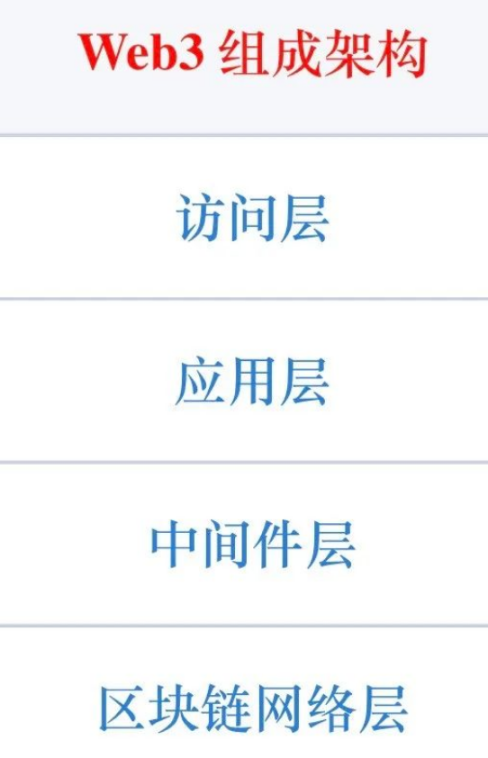
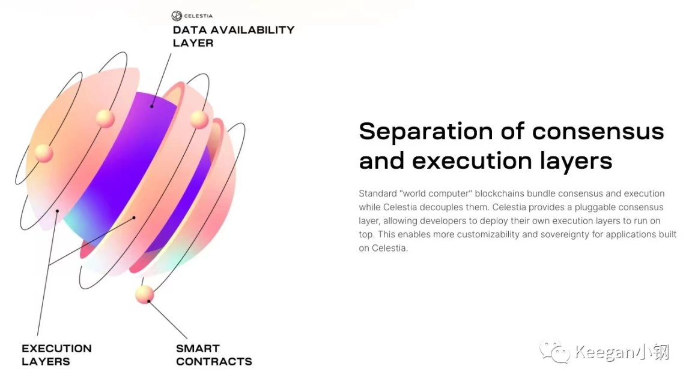
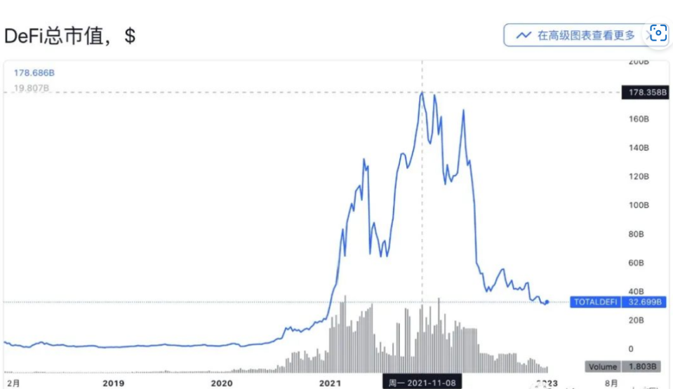

# 万字长文：划分 Web3 生态架构的四个层级

[区块链资讯2023-01-28](https://m.8btc.com/author/4)

[关注](https://m.8btc.com/app-download)

**撰文：Keegan 小钢**

Web3 发展至今，生态已然初具雏形，如果将当前阶段的 Web3 生态组成架构抽象出一个鸟瞰图，由下而上可划分为四个层级：**区块链网络层、中间件层、应用层、访问层**。下面我们来具体看看每一层级都有什么。

## 区块链网络层

最底层是「区块链网络层」，也是 Web3 的基石层，主要由各区块链网络所组成。

组成该层级的区块链网络还不少，Bitcoin、Ethereum、BNB Chain（BSC）、Polygon、Arbitrum、Polkadot、Cosmos、Celestia、Avalanche、Aptos、Sui 等等，还有很多。根据 Blockchain-Comparison 的统计，截止撰文之日的区块链至少有 150 条。这里我们主要说的是公链，联盟链不包括在内。因为区块链实在太多，会有些眼花缭乱，所以有必要进行分门别类。

首先，不同区块链之间存在着分层结构，有 Layer0、Layer1、Layer2 之分。其次，Web3 的繁荣发展，依赖于智能合约技术，而智能合约的运行环境为虚拟机。**智能合约和虚拟机的关系，就和 Java 程序和 JVM 的关系类似**。从不同的虚拟机维度上划分区块链，就可以分为两大类：EVM 链和 Non-EVM 链。EVM 是 Ethereum Virtual Machine，即为以太坊虚拟机的简称。EVM 链即为兼容 EVM 的区块链，而 Non-EVM 顾名思义就是不兼容 EVM 的区块链。最后，还可以根据存储的数据大小进行分类，可以分为计算型区块链和存储型区块链。

先从分层结构说起。最好理解的是 Layer1，我们所熟知的比特币、以太坊、EOS、BSC 都属于 Layer1，也称为主链。在分布式系统中，存在 CAP 定理，即一个分布式系统不可能同时满足三个特性：一致性、可用性、分区容错性。一个分布式系统只能满足三项中的两项。Layer1 的区块链本质上也是分布式系统，也同样存在不可能三角问题，只是三个特性与 CAP 不同，分别为：可扩展性、安全性、去中心化，每个区块链也只能满足三项中的两项。比特币和以太坊偏向于安全性和去中心化，所以可扩展性比较弱，TPS 比较低。EOS 和 BSC 则只依赖于少数节点来维护共识，相比于比特币和以太坊，减低了去中心化特性，但提高了可扩展性，从而能达到很高的 TPS。

为了解决比特币和以太坊的可扩展性问题，就慢慢衍生出了 Layer2。Layer2 是作为依附于主链的子链而存在，主要用于承载 Layer1 的交易量，承担执行层的角色，而 Layer1 则可变成结算层，可大大减少交易压力。**目前主流的 Layer2 都是扩展以太坊的子链，包括 Arbitrum、Optimism、zkSync、StarkNet、Polygon 等。比特币也有 Layer2，主要包括闪电网络、Stacks、RSK 和 Liquid，但目前都比较小众。**

Layer0 则比较抽象了，一般被定义为区块链基础设施服务层，主要由模块化区块链所构成，包括 Celestia、Polkadot、Cosmos 等。模块化区块链这个概念主要是由 Celestia 提出的，其**核心设计思路就是把区块链的共识、执行、数据可用性这几个核心模块拆分开来，每个模块由一条单独的链来完成，再将几个模块组合到一起完成全部工作**。这和软件架构设计中所提倡的模块化设计思想是一样的，可实现高内聚低耦合。

**实现跨链通信的跨链桥或跨链协议也可以划入 Layer0**。跨链桥的数量也是非常多，撰写此文时，debridges.com 上统计的跨链桥多达 113 条，其中 TVL 排名最高的三个分别为 Polygon、Arbitrum、Optimism 的官方跨链桥，这几个桥分别实现了各自的 Layer2 和以太坊之间的资产跨链。TVL 排名第四位的则是 Multichain，其前身为 Anyswap，是连接了最多条区块链的第三方跨链桥，截至今年 1 月份时，其连接的区块链多达 81 条。

聊完分层结构的划分，我们再从 EVM 的维度来梳理下不同的区块链。前面说过，从 EVM 维度上可划分为 EVM 链和 Non-EVM 链两大类。

EVM 链是目前最主流的方向，基于 EVM 链的 DApp 和用户群体是目前整个 Web3 生态里规模最大的。有些原生就是兼容 EVM 的，比如 BSC、Heco、Arbitrum、Optimism 等；有些则是后期才扩展兼容 EVM 的，比如 zkSync 1.0 并不兼容 EVM，而 zkSync 2.0 则是兼容 EVM 的。很多区块链就算早期并不兼容 EVM，但也逐渐在拥抱 EVM。比如，Polkadot 推出了 Moonbeam 平行链来兼容 EVM，Cosmos 则有 Evmos。

目前来看，排名靠前的区块链中，大部分都已经兼容 EVM，不过依然还有少部分 Non-EVM 链存在，比如 Solana、Terra、NEAR、Aptos、Sui。另外，EVM 链的智能合约主要使用 Solidity 作为开发语言，而 Non-EVM 链则主要使用 Rust 或 Move 语言开发智能合约。

以上提到的这些区块链，主要还是偏向于解决去中心化计算的区块链，这些区块链普遍不支持大数据的存储，比如文件存储。而存储型的区块链则聚焦于解决大数据存储的问题，这类区块链目前不太多，主要有 Filecoin、Arweave、Storj、Siacoin 和 EthStorage。

目前组成「区块链网络层」的区块链成员们主要就包括这些了，未来还会不断有新成员加入，但也有不少旧成员逐渐没落而被遗落在角落里。

## 中间件层

在区块链网络层之上的这一层，我称之为「中间件层」，主要为上层应用提供**各种通用服务和功能**。所提供的通用服务和功能包括但不限于：**安全审计、预言机、索引查询服务、API 服务、数据分析、数据存储、基本的金融服务、数字身份、DAO 治理**等。提供通用服务和功能的组件则可称为「中间件」，这些中间件也是存在多种形式，可以是链上协议，也可以是链下平台，或链下组织，包括中心化的企业或去中心化自治组织 DAO。下面就来聊聊这一层具体都有哪些中间件。

先来聊聊**安全审计**，这是非常核心的中间件，因为 Web3 里的区块链和应用大多都是开源的，且很多都是跟金融强相关，因此，安全性就成为了重中之重，安全审计自然也变成了刚需。安全审计的服务大多由一些安全审计公司所提供，比较知名的审计公司包括：CertiK、OpenZeppelin、ConsenSys、Hacken、Quantstamp，以及国内主要有慢雾、链安、派盾等。另外，还有不少知名度不高的小审计公司。

除了审计公司，还有一些提供 Bug Bounty 的平台，一般就是在这些平台上发布任务，让白帽黑客们来找 Bug，找到的 Bug 安全漏洞等级越高则可获得的赏金越高。目前，全球最大的 Bug Bounty 平台是 Immunefi。

接着，再来聊聊**预言机**（Oracle Machine，简称 Oracle），在 Web3 生态里也是扮演着非常重要的角色，**是区块链系统与外部数据源之间沟通的桥梁**，主要实现智能合约与链下真实世界的数据互通。因为区块链网络本身对状态一致性的限制，需要保证每个节点在给定相同输入的情况下必须获得相同的结果，所以区块链被设计成一个封闭系统，只能获取到链内的数据，而无法主动获取外部系统的数据。但很多应用场景中是需要用到外部数据的，这些外部数据就由预言机来提供，这也是目前区块链与外部数据实现互通的唯一途径。

根据预言机所提供的具体功能，目前对预言机的分类大致有：DeFi 预言机、NFT 预言机、SocialFi 预言机、跨链预言机、隐私预言机、信用预言机、去中心化预言机网络。具体的预言机项目有 CreDA、Privy、UMA、Banksea、DOS、NEST、Chainlink 等，其中，Chainlink 为预言机的龙头，其定位为去中心化预言机网络，推出了 Data Feeds、VRF、Keepers、Proof of Reserve、CCIP 等一系列产品和服务。

然后，索引查询服务也是很关键的中间件，解决了链上数据的复杂查询问题。比如要查询 Uniswap 上某一天的总交易量，如果直接在链上查询是很麻烦的。所以就有了对索引查询服务的需求，这块的主要代表为 The Graph 和 Covalent。The Graph 的实现方案主要是可定制化监听链上数据并映射成自定义的数据进行存储，从而方便查询。而 Covalent 则是将很多通用、广泛使用的数据封装成统一的 API 服务，供用户查询。

提到 API 服务，除了 Covalent，还存在解决其他不同需求的 API 提供商，比如：NFTScan，是聚焦于提供 NFT API 数据服务的；Infura 和 Alchemy，则主要提供区块链网络节点服务；API3，旨在打造去中心化 API 服务。

不管是索引查询服务还是 API 服务，都是链上数据相关的服务，数据分析也是数据相关的服务，这一版块的成员主要有 Dune Analytics、Flipside Crypto、DeBank、Chainalysis 等。

数据存储中间件则和底层几个专门做存储的区块链容易混淆，也有人将底层的 Filecoin、Arweave、Storj 等划分到这一层，但我觉得这些本质上还是底层区块链，所以我将其划入到区块链网络层。**而中间件层的数据存储，目前主要就是 IPFS**。IPFS 全称为 InterPlanetary File System，中文名为星际文件系统，是一个基于内容寻址、分布式、点对点的新型超媒体传输协议，其旨在取代 HTTP 协议。IPFS 与区块链网络很相似，但其实并不属于区块链网络，基于 IPFS 的 Filecoin 才是区块链网络。

## 应用层

应用层是 Web3 生态里最繁荣的一层，这一层里，充斥着各种不同的 DApps，可谓是百花齐放、百家争鸣。下面我们主要介绍几个发展得相对比较繁荣的板块。

### NFT

NFT 全称为 Non-Fungible Token，表示「非同质化代币」，国内也称为数字藏品，用于代表艺术品等独一无二的数字资产。

第一个真正意义上的 NFT 项目叫 CryptoPunks，于 2017 年 6 月发布，由 10,000 个 24x24 像素的头像所组成。每个头像都是由算法生成的，独一无二且所有头像都上传到了以太坊上，也是目前为止唯一一个将所有头像数据全部上链的 NFT 项目。下图为 CryptoPunks 官网展示的部分头像：

截止撰文之日，CryptoPunks 的地板价（即最低价）为 66.88 ETH，按 ETH 的价格换算成美元，大概为 84,397.21 美元。最贵的一个 CryptoPunk，成交价达到了 8000 ETH，成交于 2022 年 2 月 12 日。一个 NFT 头像为何会这么贵，这对于很多人都是很难理解的。其中，最主要的一个原因，就是它是第一个 NFT 项目，就和比特币是第一个区块链一样，其开创性的地位所带来的价值潜力非常大。

受 CryptoPunks 的启发，一家名为 Axiom Zen（Dapper Labs 的前身）的公司于 2017 年 11 月底发行了 CryptoKitties，国内也称为加密猫、以太猫、谜恋猫。CryptoKitties 上线后便病毒式地传播开来，还造成了以太坊的拥堵，暴露出以太坊的性能问题。CryptoKitties 发行之前，Axiom Zen 的技术总监 Dieter Shirley 以 CryptoKitties 为案例，还提出了 ERC721 Token 协议作为 NFT 的通用技术标准，而随着 CryptoKitties 爆火后，以 ERC721 为主要技术标准的 NFT 被进一步采用，如今 ERC721 已经成为了所有 NFT 的基础标准之一。

继 CryptoPunks 和 CryptoKitties 之后，NFT 开始逐渐遍地开花，NFT 生态逐渐蓬勃发展。NFT 发展至今，已经涉足到了多个领域，如果对 NFT 生态的所有组成部分做详细分类的话，可以多达几十种。如果只聚焦于 NFT 本身，即 NFT 的不同用例，那大致可以做出以下分类：**收藏品、艺术品、音乐、影视、游戏、体育运动、虚拟土地、金融、品牌、DID**。下面主要介绍每个分类的一些代表性的 NFT 项目。

收藏品其实很难单独定义为一个类别，宽泛地讲，几乎任何东西都可以归为收藏品，包括艺术品、游戏道具、虚拟土地等。能被定义为收藏品的 NFT 主要需具备一个特性：稀缺性。比如，10000 个 CryptoPunks 中，外星人的数量最少，所以有很高的稀缺性，而男性最多，稀缺性就很低了。最知名的收藏品 NFT，除了 CryptoPunks，还有 BAYC，全称为 Bored Ape Yacht Club，也称为无聊猿。无聊猿不只是一套单独的 NFT，其实只是「无聊猿宇宙」的开端，基于无聊猿之后，背后的团队 Yuga Labs 又相继发行了无聊猿犬舍俱乐部（Bored Ape Kennel Club，BAKC)、变异猿游艇俱乐部（Mutant Ape Yacht Club，MAYC），也发行了 ApeCoin（APE）代币，还推出了 Otherside，专为元宇宙打造的虚拟土地。这些，都已经形成了「无聊猿宇宙」系列 IP，而且无聊猿不只是在加密圈内流行，在圈外的周边产品也在不断增加，比如有无聊猿的帽子、衣服、雕像、餐厅等。无聊猿的成功已超越了 CryptoPunks，Yuga Labs 之后还直接收购了 CryptoPunks。

NFT 的特性能有效保护版权的所有权，所以在艺术品领域流行开来也是理所当然。艺术品 NFT 有几个代表性的作品值得介绍一番，第一个是艺术家 Beeple 的作品，名为「每一天：第一个 5000 天（EVERYDAYS: THE FIRST 5000 DAYS）」，是将他过去 5000 天内每天创作一幅的所有作品（共 5000 幅）合成一个 NFT 图像，在 2021 年 3 月以 69,346,250 美元售出。第二个值得介绍的是生成艺术，也称为衍生艺术。生成艺术中的艺术品不是由人创作出来的，而是由编程算法自动生成的，最知名的 NFT 生成艺术平台叫 Art Blocks，是一个基于以太坊的随机生成艺术平台。艺术家们可以把自己设计的独特算法上传到 Art Blocks 平台，并设定特定数量 NFT 进行发行，NFT 会根据算法自动生成。最后再介绍目前最贵的 NFT 艺术品，叫「The Merge」，2021 年 12 月以 9180 万美元天价成交。与其他 NFT 不同，「The Merge」其实不是一个单独的作品，而是由多个「mass」代币动态组合而成的。销售的其实也是 mass 代币，当初共售出 312,686 个 mass 代币，共有 28,983 个买家，即是说，「The Merge」是由这 28,983 个买家共同拥有其所有权，每个买家所拥有的 mass 代币数量就代表了占有多少份额的所有权。「The Merge」也可以理解为是一个碎片化 NFT 作品。

音乐 NFT 的兴起和艺术品类似，主要也是因为版权。下面介绍几个具有代表性的音乐 NFT 相关人物，第一个要介绍的是 Justin David Blau，是美国 DJ 和电子舞曲制作人，以艺名 3LAU 而闻名。他是最早采用音乐 NFT 的人之一，在 2020 年秋天卖出了他的第一张 NFT。而在 2021 年 2 月底，凭借 Ultraviolet NFT 专辑为他带来了 1168 万美元的收入。2021 年 5 月又成立了 NFT 音乐平台 Royal，8 月份完成了种子轮融资 1600 万美元，有 a16z、Coinbase 等顶级机构参与。第二个要介绍的是 Don Diablo，荷兰 DJ、数字艺术家、唱片制作人、音乐家和电子舞曲创作者，他在 2021 年卖出第一部完整的音乐会电影 NFT，名为「Destination Hexagonia」，成交价 600 ETH（当时为 126 万美元）。最后再介绍一个叫 Kingship 的摇滚乐队，这是一支由无聊猿组成的虚拟乐队，由环球音乐集团所组建。

NFT 也席卷到了影视圈，有几个知名的影视剧都陆续发行了 NFT，国外有《权力的游戏》《蝙蝠侠》《指环王》《黑客帝国》《行尸走肉》等，国内有《大话西游》《流浪地球》《我不是药神》《封神三部曲》等。

NFT 用在游戏里主要就是作为游戏资产的载体，相比于传统游戏内的资产，NFT 的形式对游戏玩家来说可以真正拥有游戏资产的所有权，且 NFT 可以在游戏外流通交易。第一个游戏 NFT 项目就是 CryptoKitties，每一只猫都是一个独立的 NFT。后面讲到 GameFi 小节再继续深入聊聊游戏这块。

体育运动领域也同样涉足了 NFT，目前最知名的两大体育 NFT 平台是 NBA Top Shot 和 Sorare。NBA Top Shot 顾名思义主要以 NBA 为主，而 Sorare 则服务于足球领域。除了 NBA 和足球，橄榄球、棒球、拳击、摔跤也都纷纷推出了各自的 NFT 纪念品。

虚拟土地类 NFT 主要由一些主打「元宇宙」概念的项目所推行，比较知名的有 Decentraland、The Sandbox、Roblox、Axie Infinity Land、Otherdeed 等。

金融和 NFT 的结合，主要就是将 NFT 应用到 DeFi 中，比如 UniswapV3 中的流动性仓位就是 NFT。另外，还有一个思路则是先将 NFT 碎片化，接着将这些碎片后的 NFT 再赋予 DeFi 功能，比如可以赋予交易、借贷、质押挖矿等功能。

品牌和 NFT 的结合，主要是作为一种新的营销方式。这两三年陆续有各种品牌加入这个阵营，比如，奢侈品品牌有 GUCCI、LV、爱马仕等，餐饮品牌有 Taco Bell、星巴克、必胜客、可口可乐等，汽车品牌有迈凯伦、雪佛兰等，运动品牌有阿迪达斯、李宁、耐克等，还有很多其他品牌。

最后，聊聊 DID，全称为 Decentralized Identity，即去中心化身份。所有人都知道 DID 非常重要，但其发展还比较缓慢，目前除了细分领域 ENS 域名之后，还没有成熟的 DID 体系形成网络效应。目前，应用最广泛的只有域名，基于以太坊的 ENS 是龙头，ENS 之于 Web3，就相当于 DNS 之于 Web2。不同的是，ENS 解析的域名，映射的不是网站 IP，而是用户的以太坊地址。比如，以太坊创始人 V 神的 ENS 为「vitalik.eth」，映射的地址为 0xd8da6bf26964af9d7eed9e03e53415d37aa96045。

NFT 的可应用场景实在太多了，上面所列出的分类还没能覆盖到全部。因为 NFT 的特性，任何具有所有权的东西都可以指代，所以坊间有「万物皆可 NFT」的说法。

### DeFi

DeFi 即去中心化金融，崛起于 2020 年夏天，因此那段时间也被称为 DeFi Summer。根据 TradingView 的统计数据，2020 年夏天刚崛起时，DeFi 总市值仅 50 亿美元，随后一路飙升，在 2021 年底达到了最高峰，将近 1800 亿美元。

DeFi 有很多细分板块，主要包括：**稳定币、交易所、衍生品、借贷、聚合器、保险、预测市场、指数等。**

稳定币主要可分为三类：**中心化稳定币、超额抵押稳定币、算法稳定币**。其中，超额抵押稳定币和算法稳定币为去中心化稳定币。

中心化稳定币直接与法定货币挂钩，由中心化机构所发行，要求每单位稳定币需要有 1:1 的法币储备。目前交易量最大的两个稳定币 USDT 和 USDC，都是法币抵押稳定币，与美元 1:1 挂钩，分别由 Tether 和 Circle 两家中心化机构所发行。另外，币安，全球第一大中心化数字货币交易所，联合 Paxos 发行了自己的法币抵押稳定币 BUSD，目前也是全球交易量排名第三的稳定币，仅次于 USDT 和 USDC。

**超额抵押稳定币通过超额抵押其他加密货币而锻造**，抵押品会被锁定在智能合约里，智能合约会根据抵押品的价值锻造出对应数量的稳定币，智能合约依靠价格预言机来维持与法币的锚定。此类型的稳定币主要以 DAI 为代表，由 MakerDAO 推出，和美元保持 1:1 锚定，目前交易量排名第四。

算法稳定币则比较新颖，顾名思义，主要是通过算法来控制稳定币的供应。此赛道的选手也不少，包括 UST、FEI、AMPL、ESD、BAC、FRAX、CUSD、USDD、USDN 等，但目前还没有一个真正实现稳定的算法稳定币出现。

接着，来聊聊交易所，DeFi 里的交易所是指去中心化交易所，简称 DEX。DEX 是 DeFi 所有板块里市值占比最高的板块，也是 DeFi 的基石板块。如果对 DEX 再进一步细分，还可以分为现货 DEX 和衍生品 DEX，衍生品 DEX 主要交易永续合约或期权。如果从交易模式上划分，那 DEX 主要可分为两种：Orderbook 模式和 AMM 模式。Orderbook 模式的 DEX，主要包括 dYdX、apeX、0x、Loopring 等。AMM 模式的 DEX 则比较多了，主要包括 Uniswap、SushiSwap、PancakeSwap、Curve、Balancer、Bancor、GMX、Perpetual 等。

Orderbook 模式是最早出现的交易类型，交易方式和股票盘口的买卖方式一样，交易用户可选择成为挂单者（maker）或吃单者（taker），交易会根据价格优先和时间优先的规则撮合成交。采用 Orderbook 的 DEX，根据其发展历程主要还可以再分为三种模式：**纯链上撮合 + 结算模式、链下撮合 + 链上结算模式、Layer2 模式**。

纯链上撮合结算模式，用户提交的挂单和吃单都是直接在链上，吃单会直接和链上的挂单成交。该模式的代表为 EtherDelta，其优点是完全链上，去中心化程度高，但缺点是交易性能很低且交易成本很贵，用户挂单、撤单都需要支付燃料费。

链下撮合 + 链上结算模式的代表则是 0x 协议，相比于第一种模式，主要多了链下的「中继器」角色，用户通过链下签名的方式生成委托单并提交给中继器，由中继器来维护 Orderbook，撮合成功的委托单再由中继器提交到链上进行结算。因为将撮合移到了链下处理，大大提高了交易性能，但结算是一笔笔单独结算的，所以结算的性能成为了瓶颈。

Layer2 模式的代表为 dYdX，背后所使用的技术主要由 StarkWare 所提供的产品 StarkEx 所支持。其基本原理就是部署一个单独的、专用的 Layer2，用户的撮合交易和结算都发生在这个 Layer2 上，然后定时将所有交易记录（包括结算记录）全部打包生成证明并发送到 Layer1 上进行验证。与 Layer2 公链不同，Layer2 公链提供的是通用交易，而 dYdX 背后所使用的这个 Layer2 只能用于专用的交易场景，这其实算是个私有链，也可称为应用链，这也是一种新的应用模式。这种模式的交易体验和中心化交易所已经相差无几了，但中心化程度比较高。

完全去中心化且交易体验也较好的交易模式，目前主流的就是 **AMM 模式了，AMM 为 Automated Market Maker 的简称，也称为自动做市商模式**。引爆 AMM 模式的是 Uniswap，于 2018 年 11 月上线，之后的 SushiSwap、PancakeSwap、Curve 等都是基于 Uniswap 的模式进行改造。该模式需要流动性池作支撑，流动性提供者（简称 LP）往交易池里注入资产作为流动性，其实就是资金池，然后用户直接和流动性池进行交易，而 LP 则从中赚取用户的交易手续费。

关于交易所暂时就先聊这么多，接着来看看衍生品。DeFi 衍生品板块主要包括几个方向：**永续合约、期权、合成资产、利率衍生品**。

永续合约也是期货合约，加了杠杆的交易产品，前面提到的 dYdX、apeX、GMX、Perpetual 就是知名的几个永续合约 DEX。期权比期货复杂，DeFi 期权领域的玩家主要包括 Hegic、Charm、Opium、Primitive、Opyn 等，但目前期权市场还很小，被关注的不多。合成资产是由一种或多种资产 / 衍生品组合并进行代币化的加密资产，早期主要合成 DAI、WBTC 等数字资产，后面基于现实世界中的股票、货币、贵金属等的合成资产也越来越多，目前该赛道的龙头项目是 Synthetix，另外还有 Mirror、UMA、Linear、Duet、Coinversation 等项目。DeFi 的利率衍生品主要是基于加密资产利率开发不同类型的衍生产品，以满足 DeFi 用户对确定性收益的不同需求，主要玩家有 BarnBridge、Swivel Finance、Element Finance 等。

接着来看看借贷，这也是 TVL 很高的一个版块，和 DEX 一样也是 DeFi 的基石。这块的借贷协议主要有 Compound、Aave、Maker、Cream、Liquity、Venus、Euler、Fuse 等。目前，**大部分借贷协议都是采用超额抵押的借贷模型，所谓超额抵押**，举个例子，比如，要借出 80 美元的资产，那至少需要存入价值 100 美元的抵押资产，即抵押资产价值要高于借贷资产价值。

虽然超额抵押模型是主流，但也存在几个创新方向：**无息贷款、资产隔离池、跨链借贷、信用贷**。无息贷款的代表为 Liquity，用户在 Liquity 借出其稳定币 LUSD 的时候，用户一次性支付借款和赎回费用，借出后无需支付利息。资产隔离池就是将不同的借贷资产分开为不同的池子，每个借贷池都是独立的，避免一个不良资产或者一个池子受损导致整个平台都被连累。目前，资产隔离池差不多已经成为了标配，很多借贷协议都引入了这种模式，除了一开始就使用这种模式的 Fuse，包括 Compound、Aave、Euler 等协议也都加入了阵营。跨链借贷也是一个新趋势，Flux、Compound、Aave 等都在这个方向上进行拓展。信用贷在传统金融非常普遍，但在 DeFi 领域还比较少，主要是还缺乏有效的链上信用体系，目前的代表项目是 Wing Finance。

下一个是聚合器，DeFi 聚合器也分为好几种类型：**DEX 聚合器、收益聚合器、资产管理聚合器、信息聚合器**。DEX 聚合器，主要就是将多个 DEX 聚合到一起，通过算法从中寻找出最优的交易路径，主流的 DEX 聚合器包括 **1inch、Matcha、ParaSwap，以及 MetaMask 钱包内置的 MetaMask Swap** 等。收益聚合器主要有 Yearn Finance、Alpha Finance、Harvest Finance、Convex Finance 等，主要就是聚合各种流动性挖矿，让参与多平台的 Yield Farming（收益耕作）实现自动化。资产管理聚合器主要就是监控、跟踪和管理 DeFi 用户的资产和负债，主要以 Zapper 和 Zerion 为代表。最后是信息聚合器，主要包括 CoinMarketCap、DeFiPulse、DeBank、DeFiPrime 等平台。另外，这些其实都是中心化数据平台，但其在 DeFi 生态里依然扮演了重要角色，DeFi 生态里并非全都是去中心化的应用。

然后，再简单聊聊保险。我们知道，保险在传统金融中是非常大的一块市场，但 DeFi 里的保险发展至今，却是非常缓慢。整个 Web3 行业里，各种风险很多，协议漏洞风险、项目跑路风险、监管风险等，所以实际上对 DeFi 保险的需求市场本身很大，但因为开发设计门槛高，且流动性比较低，所以才导致整个保险赛道发展缓慢，目前依然处于非常早期的阶段，Nexus Mutual、Cover、Unslashed、Opium 等项目是该领域主要的玩家。

然后，再看看预测市场。预测市场是依托数据的市场，可用于押注和预测未来的所有事件，也是以太坊生态最早出现的应用场景之一，并在 2020 年美国大选中迎来爆发式增长，主要项目有 PolyMarket、Augur、Omen 等。

最后就是指数板块，提供一揽子资产敞口的指数基金在 DeFi 领域逐渐兴起。但广为人知的指数其实并不多，主要有：DPI、sDEFI、PIPT、DEFI++。DPI 全称为 DeFi Pulse Index，是由 DeFi Pulse 和 Set Protocol 合作创建的，是一种市值加权指数，包含了一些主流 DeFi 协议代币作为基础资产，包括 Uniswap、Aave、Maker、Synthetix、Loopring、Compound、Sushi 等。DPI 可以赎回为一揽子基础资产。sDEFI 则是由 Synthetix 所推出的指数代币，是该领域历史最悠久的指数。sDEFI 是一种合成资产，它不持有任何基础代币，而是使用预言机喂价来跟踪代币价值。PIPT 全称为 Power Index Pool Token，是由 PowerPool 所发行，由 8 种代币资产所组成。PowerPool 发行的指数除了 PIPT，另外还有 Yearn Lazy Ape Index、Yearn Ecosystem Token Index 和 ASSY Index 三个指数。DEFI++ 则是由 PieDAO 所发行，其组成有 14 种资产。PieDAO 还发行了 BCP 和 PLAY，BCP 由 WBTC、WETH、DEFI++ 三种代币组成，PLAY 则由一些元宇宙项目的代币所组成。

### GameFi

GameFi 从字面上理解就是 Game Finance，是游戏和金融的融合体，也是目前 Web3 游戏的代名词。GameFi 这个词语诞生之前，Web3 游戏则通常被称为区块链游戏，或简称链游。

CryptoKitties 是第一款广为人知的区块链游戏，这是一款虚拟养猫的养成类游戏，每一只猫咪都是一个独立的 NFT。初代猫咪总共有 50000 只，每只猫咪都有不同的属性。玩家购买猫咪 NFT 后，就可以开始玩繁殖小猫的游戏。生出来的小猫咪，有部分基因属性会遗传自上一代，而有些基因则随机生成。生出来的猫咪本质上就是新的 NFT，可以卖出变现。如果生成的新猫咪产生了稀有的基因属性，还可以卖到不错的价格。截止撰文之日（2023 年 1 月底），已经产生了 2,021,774 只猫咪，持有的钱包地址有 136,283。

继 CryptoKitties 之后，越来越多养成类游戏陆续出现，如加密狗、加密兔、加密青蛙等等。打破这种局面的是一款叫 Fomo3D 的游戏，这是一款公开、透明、去中心化的博彩资金盘游戏。游戏规则也简单，用户通过支付 ETH 购买 Key 参与游戏，用户支付的 ETH 会分配到奖池、分红池、空投池、官方池等。拥有 Key 则可以得到持续的分红，拥有的 Key 越多，则得到的分红会越多。且每轮游戏存在一个倒计时（24 小时），倒计时结束时，最后一个购买 Key 的玩家可以获得奖池里大部分的 ETH。但每次有用户购买 Key，则倒计时剩余时间会增加 30 秒。第一轮游戏持续了很久时间，最后被人用技术手段赢走了奖池。Fomo3D 爆火之后，也是各种优化升级版的同类游戏不断出现，但事实证明，这类游戏还是无法持久。

而之后，再次引爆市场的游戏则是 Axie Infinity，国内则被称为「阿蟹」（与 Axie 谐音）。这是一款结合了宝可梦和加密猫玩法的游戏，游戏里的 Axies 可以升级、繁殖、对战、交易等。与加密猫等游戏不同的是，Axie Infinity 的经济系统里还引入了 SLP 和 AXS 代币，玩家可通过战斗赢取 SLP 代币，而通过消耗 SLP 和 AXS 可以繁殖新的 Axies，赢取的 SLP 代币和繁殖出来的 Axies 都可以在市场上出售来赚取收入。

不过，Axie Infinity 其实在 2018 年就已经问世，但直到 2021 年才开始爆红，让其爆红的主要原因在于它的 Play-To-Earn 模式被推广开来了，即边玩边赚的特性呈病毒式传播了。其赚钱路径主要是先投入成本购买 Axies，然后通过玩游戏赚 SLP 代币和繁殖新的 Axies，再把 SLP 代币和 Axies 出售换成 ETH 或稳定币，最终将 ETH 或稳定币换成法币。这种赚钱模式一开始是从菲律宾逐渐流行起来的，当时，新冠疫情爆发，菲律宾当地许多人陷入了无收入的困境，而 Axie Infinity 的边玩边赚特性让这些人看到了希望。而且，这种赚钱模式也吸引了众多打金工作室，且逐渐从菲律宾扩展到了印度、印度尼西亚、巴西、中国等。截止撰文之日，日活用户已达 280 万。

而现在，边玩边赚模式几乎成为了 Web3 游戏的标配。

其他比较知名的游戏还有 Decentraland、The Sandbox、Illuvium、Star Atlas、Alien Worlds 等。这些就不展开说了，感兴趣的可以自行去搜索了解。

### SocialFi

SocialFi 顾名思义就是 Social Finance，是社交和金融在 Web3 领域的有机结合，其实就是去中心化社交，是近两年才开始流行的概念。目前，在这个赛道的知名项目还比较少，目前的龙头是 Lens Protocol。

Lens Protocol 是由 Aave 团队所开发的，在 2022 年 5 月上线。它不是一个独立的社交应用，也不是一个带有前端的完整社交产品，而是提供了一系列模块化组件的社交图谱平台，而具体的应用产品可以采用这些组件去构建。所以，Lens 的定义其实是 Web3 社交应用的基础设施。上线之初就已经拥有了 50 多个生态项目，比较热门的有 Lenster、Lenstube、ORB、Phaver、re:meme、Lensport、Lensta 等。

Lenster 是去中心化社交媒体应用，可以通过连接 Web3 钱包并使用 Lens 来登录。登录用户就可以在 Lenster 发布内容，和在微博或推特发布内容类似，不同的是，在 Lenster 上发布内容时可选择收费。也可以评论其他用户的内容，不过目前还不支持层级式的评论。

Lenstube 则是去中心化视频平台，可以理解为就是去中心化的 Youtube。

ORB 是去中心化职业社交媒体应用，具有端到端链上信誉系统。具体来说，ORB 可以通过将各种 NFT 和 POAP 与用户经验、教育、技能和项目联系起来，从而创建个人去中心化专业档案并建立链上可信度，以及探索工作机会和申请链上身份，还可以用在链上分享自己的想法，与 Web3 人士建立联系并构建社区。此外，ORB 还允许用户利用碎片化时间通过学习 Web3 知识来获取 NFT，即 Learn-to-Earn。

Phaver 是一款适用于 iOS 和 Android 的 Share-to-Earn 社交应用，用户可以发布帖子，内容可以是图片、链接、产品应用等。用户还可以浏览 Lens 内的所有内容。Lens Profile 用户连接钱包后，还可以通过 Phaver 直接发布帖子到 Lens 中。

re:meme 是一个链上 meme 生成器，允许用户上传 meme 模版，也能选择是否收费，然后其他人可以用图像编辑器添加文本、绘图和补充图像等。:meme 还可以扩展到音乐、视频和学术论文等媒体格式。

Lensport 是一个只聚焦于 Lens 协议的社交 NFT 市场，用户可以发现、发布和出售帖子，也可以投资支持创作者。

Lensta 是一个聚焦于 Lens 协议的图片流应用，可以浏览 Lens 中带有图片的最新、最热门以及 Lenster、Lensport 等上收集费用最多的帖子。

## 访问层

**访问层是 Web3 组成架构里的最上层，也是直接面向终端用户的入口层。**这一层里主要包括钱包、浏览器、聚合器等，另外，有一些 Web2 的社交媒体平台也成为了 Web3 的入口。

先来看看钱包，这也是最主要的入口。目前的钱包有多种分类，有浏览器钱包、手机钱包、硬件钱包、多签钱包、MPC 钱包、智能合约钱包等。

浏览器钱包就是通过网络浏览器使用的加密钱包，是大部分用户使用最广泛的钱包，最常用的就是 MetaMask、Coinbase Wallet、WalletConnect 等。MetaMask 是最被广泛支持的钱包之一，支持所有的 EVM 链，也已经成为了所有 DApps 的标准，目前支持的浏览器包括 Chrome、Brave、Firefox、Edge，以浏览器插件的方式存在。Coinbase Wallet 顾名思义是由交易所 Coinbase 所发行的钱包，于 2021 年 11 月推出后迅速发展，成为了与 MetaMask 旗鼓相当的对手，但浏览器还只支持 Chrome。WalletConnect 则比较特殊，它并不是一款具体的钱包应用，而是连接 DApps 和钱包的开源协议。最常用的就是用于连接手机钱包，在浏览器上的 DApp 选择连接 WalletConnect，会展示一个二维码，用你的手机钱包扫这个二维码就可以授权你的手机钱包连接上浏览器上的 DApp。而且，WalletConnect 支持所有区块链，不只是 EVM 链，也支持接入所有钱包。另外，不像 MetaMask 和 Coinbase Wallet 需要安装其浏览器插件，WalletConnect 不需要安装浏览器插件，所以可以支持所有浏览器，比如也支持 Safari，而 MetaMask 和 Coinbase Wallet 是不支持 Safari 的。因此，WalletConnect 成为了最受欢迎的钱包，也成为了所有 DApp 接入钱包的标配。

手机钱包，即移动端数字资产钱包，很多钱包都支持。MetaMask 和 Coinbase Wallet 也有手机端的钱包 App。另外，比较知名的手机钱包还有 TokenPocket、BitKeep、Rainbow、imToken、Crypto.com 等。大部分流行的手机钱包都支持多链，包括 EVM 链，也包括 Non-EVM 链，比如 TokenPocket 目前支持了 Bitcoin、Ethereum、BSC、TRON、Polygon、Arbitrum、Avalanche、Solana、Cosmos、Polkadot、Aptos 等。

硬件钱包则是把数字资产私钥存储在安全的硬件设备中，与互联网隔离，可通过 USB 即插即用。现在使用最广泛的硬件钱包是 Ledger 和 Trezor。Ledger 目前有三款不同型号的硬件钱包：Ledger Stax、Ledger Nano X、Ledger Nano S Plus。Ledger Stax 是在 2023 年才推出的新型号，支持触摸屏，而另外两款则不支持。Trezor 则有两款型号：Trezor Model T 和 Trezor Model One。Model T 支持触摸屏。除了 Ledger 和 Trezor，市面上的硬件钱包还有 SafePal、OneKey、imKey、KeepKey、ColdLar 等。

多签钱包，顾名思义，是指需要多人签名才能执行操作的钱包。最知名的多签钱包就是 Gnosis Safe，其本质上是一套链上智能合约，最常用的就是 2/3 签名，即总共有三个用户共同管理钱包，每次执行操作时，需要这三人中至少两个人的签名才能触发链上执行。

MPC 全称为 Multi-Party Computation，MPC 钱包也称为多方计算钱包，是新一代钱包类型，通过对私钥进行多方计算在链下实现多签和跨链等复杂的验证方式。简单来说，就是将私钥拆分成多个分片，然后由多方各自存储管理每个分片，签名的时候，再联合多方将分片重新拼接成完整的私钥。MPC 钱包与多签签名很类似，也可以实现 2/3 签名，不同的是，多签钱包是在智能合约层面实现签名校验，而 MPC 钱包则是通过链下计算实现的。目前已提供 MPC 钱包服务的还不多，主要有 ZenGo、Safeheron、Fordefi、OpenBlock、web3auth 等。

智能合约钱包就是使用智能合约账户作为地址的钱包，多签钱包 Gnosis Safe 也属于智能合约钱包。而近一两年对智能合约钱包最新的尝试则是结合「账户抽象（Account Abstraction）」的新一代钱包。账户抽象主要是要将签名者和账户分离开来，钱包地址不再与唯一的私钥强绑定，可以实现更换签名者，也可以实现多签，还可以实现更换签名算法。目前在这个赛道的选手除了 Gnosis Safe 还有 UniPass、Argent、Blocto 等。

钱包暂时就聊这么多，接着来说说浏览器。很多 DApp 都还是只提供了网页版本的前端，所以浏览器就成为了重要的访问入口。但因为不是所有浏览器都支持钱包扩展插件，所以也不是所有浏览器都能成为很好的 Web3 入口。最常用的浏览器是 Chrome，所有浏览器钱包都会开发 Chrome 的钱包插件。而 Safari 则很少用做 Web3 DApp 入口，因为除了 WalletConnect，没有其他浏览器钱包能够支持。还有一个值得介绍的浏览器是 Brave，这是一款内置了钱包的浏览器，其内置钱包叫 Brave Wallet。

有一些聚合器也是 Web3 的访问入口，比如 DappRadar 收集了各种 DApps，用户可以通过它浏览并连接到这些 DApps。还有 Zapper、DeBank、Zerion 之类的聚合器，可以帮助用户追踪他们在各种 Web3 应用的所有资产和操作记录。

最后，像 Twitter 和 Reddit 这类 Web3 的社交媒体平台，因为聚集了很多 Web3 社群，也逐渐变成了 Web3 的访问入口。
