# 拜占庭将军问题 (The Byzantine Generals Problem)

[拜占庭将军问题 (The Byzantine Generals Problem) - Liebing's Blog](https://liebing.org.cn/byzantine-generals-problem.html)

拜占庭将军问题(The Byzantine Generals Problem)提供了对**分布式共识问题**的一种情景化描述, 由Leslie Lamport等人在1982年首次发表. 本文首先以插图的形式描述拜占庭将军问题, 最后在理解拜占庭将军问题的基础上对现有的分布式共识算法进行分类. Leslie Lamport等人的[论文](https://www-inst.eecs.berkeley.edu/~cs162/sp16/static/readings/Original_Byzantine.pdf)提供了两种解决拜占庭将军问题的算法：

- 口信消息型解决方案(A solution with oral message);
- 签名消息型解决方案(A solution with signed message).

本文之后将详细讲述这两种算法. 事实上, 拜占庭将军问题是分布式系统领域最复杂的**容错模型**, 它描述了如何在存在恶意行为(如消息篡改或伪造)的情况下使分布式系统达成一致. 是我们理解分布式一致性协议和算法的重要基础.

## 拜占庭将军问题描述

拜占庭将军问题描述了这样一个场景:

[拜占庭帝国(Byzantine Empire)](https://en.wikipedia.org/wiki/Byzantine_Empire)军队的几个师驻扎在敌城外, 每个师都由各自的将军指挥. 将军们只能通过信使相互沟通. 在观察敌情之后, 他们必须制定一个共同的行动计划, 如**进攻(Attack)**或者**撤退(Retreat)**, 且**只有当半数以上的将军共同发起进攻时才能取得胜利**. 然而, 其中一些将军可能是叛徒, 试图阻止忠诚的将军达成一致的行动计划. 更糟糕的是, 负责消息传递的信使也可能是叛徒, 他们可能篡改或伪造消息, 也可能使得消息丢失.

​                                                                                                                                  图一

为了更加深入的理解拜占庭将军问题, 我们以**三将军问题**为例进行说明. 当三个将军都忠诚时, 可以通过投票确定一致的行动方案, 图2展示了一种场景, 即General A, B通过观察敌军军情并结合自身情况判断可以发起攻击, 而General C通过观察敌军军情并结合自身情况判断应当撤退. 最终三个将军经过投票表决得到结果为进攻:撤退=2:1, 所以将一同发起进攻取得胜利. 对于三个将军, 每个将军都能执行两种决策(进攻或撤退)的情况下, 共存在6中不同的场景, 图2是其中一种, 对于其他5中场景可简单地推得, 通过投票三个将军都将达成一致的行动计划.

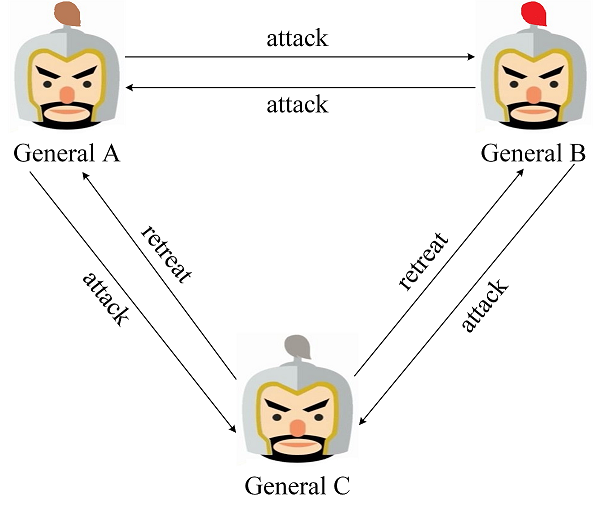

当三个将军中存在一个叛徒时, 将可能扰乱正常的作战计划. 图3展示了General C为叛徒的一种场景, 他给General A和General B发送了不同的消息, 在这种场景下General A通过投票得到进攻:撤退=1:2, 最终将作出撤退的行动计划; General B通过投票得到进攻:撤退=2:1, 最终将作出进攻的行动计划. 结果只有General B发起了进攻并战败。

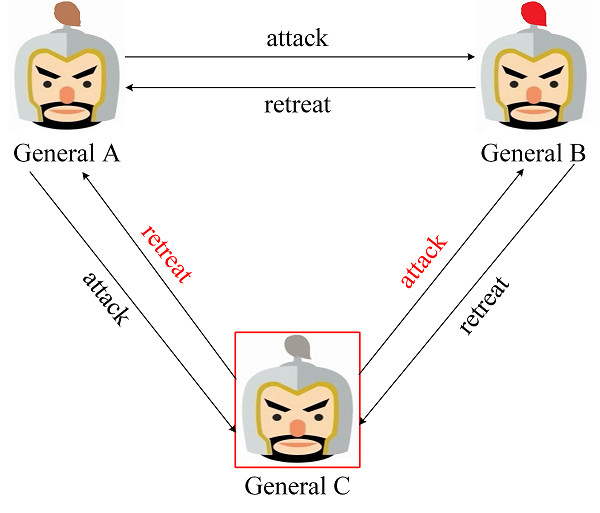

事实上, 对于三个将军中存在一个叛徒的场景, 想要总能达到一致的行动方案是不可能的. 详细的证明可参看Leslie Lamport的论文. 此外, 论文中给出了一个更加普适的结论: 如果存在*m*个叛将, 那么至少需要*3m+1*个将军, 才能最终达到一致的行动方案.

## 解决方案

Leslie Lamport在论文中给出了两种拜占庭将军问题的解决方案, 即口信消息型解决方案(A solution with oral message)和签名消息型解决方案(A solution with signed message).

### 口信消息型解决方案

首先, 对于口信消息(Oral message)的定义如下:

- A1. 任何已经发送的消息都将被正确传达;
- A2. 消息的接收者知道是谁发送了消息;
- A3. 消息的缺席可以被检测.

基于口信消息的定义, 我们可以知道, 口信消息不能被篡改但是可以被伪造. 基于对图3场景的推导, 我们知道存在一个叛将时, 必须再增加3个忠将才能达到最终的行动一致. 为加深理解, 我们将利用3个忠将1个叛将的场景对口信消息型解决方案进行推导. 在口信消息型解决方案中, 首先发送消息的将军称为指挥官, 其余将军称为副官. 对于3忠1叛的场景需要进行两轮作战信息协商, 如果没有收到作战信息那么默认撤退. 图4是指挥官为忠将的场景, 在第一轮作战信息协商中, 指挥官向3位副官发送了进攻的消息; 在第二轮中, 三位副官再次进行作战信息协商, 由于General A, B为忠将, 因此他们根据指挥官的消息向另外两位副官发送了进攻的消息, 而General C为叛将, 为了扰乱作战计划, 他向另外两位副官发送了撤退的消息. 最终Commanding General, General A和B达成了一致的进攻计划, 可以取得胜利.

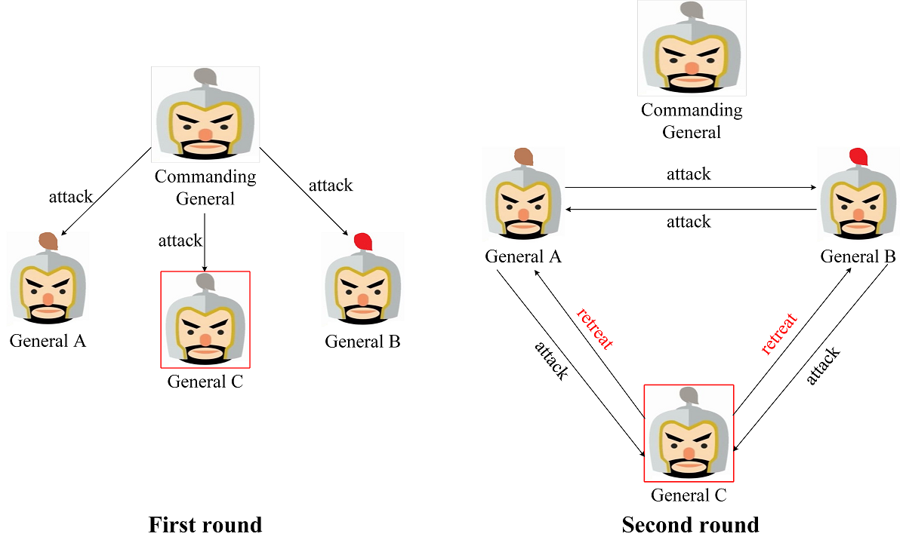

图5是指挥官为叛将的场景, 在第一轮作战信息协商中, 指挥官向General A, B发送了撤退的消息, 但是为了扰乱General C的决定向其发送了进攻的消息. 在第二轮中, 由于所有副官均为忠将, 因此都将来自指挥官的消息正确地发送给其余两位副官. 最终所有忠将都能达成一致撤退的计划.

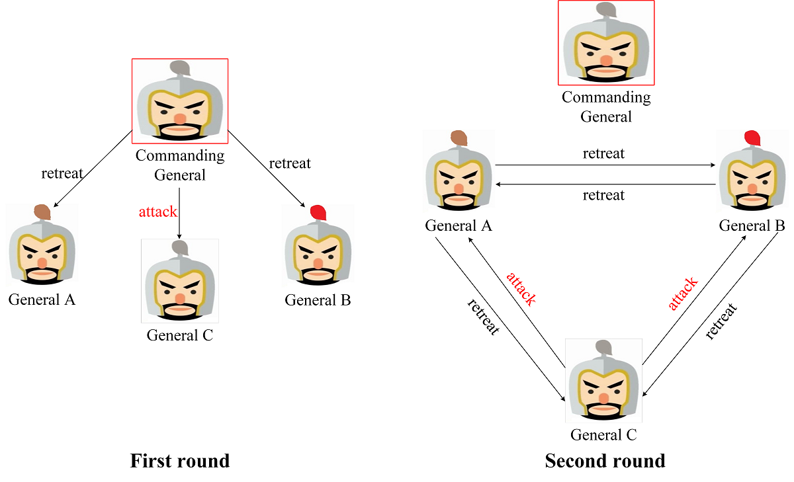

如上所述, 对于口信消息型拜占庭将军问题, 如果叛将人数为*m*, 将军人数不少于*3m+1*, 那么最终能达成一致的行动计划. **值的注意的是**, 在这个算法中, 叛将人数*m*是已知的, 且叛将人数*m*决定了递归的次数, 即叛将数*m*决定了进行作战信息协商的轮数, 如果存在*m*个叛将, 则需要进行*m+1*轮作战信息协商. 这也是上述存在1个叛将时需要进行两轮作战信息协商的原因.

### 签名消息型解决方案

同样, 对签名消息的定义是在口信消息定义的基础上增加了如下两条:

- A4. 忠诚将军的签名无法伪造，而且对他签名消息的内容进行任何更改都会被发现;
- A5. 任何人都能验证将军签名的真伪.
  基于签名消息的定义, 我们可以知道, 签名消息无法被伪造或者篡改. 为了深入理解签名消息型解决方案, 我们同样以3三将军问题为例进行推导. 图6是忠将率先发起作战协商的场景, General A率先向General B, C发送了进攻消息, 一旦叛将General C篡改了来自General A的消息, 那么General B将将发现作战信息被General C篡改, General B将执行General A发送的消息.

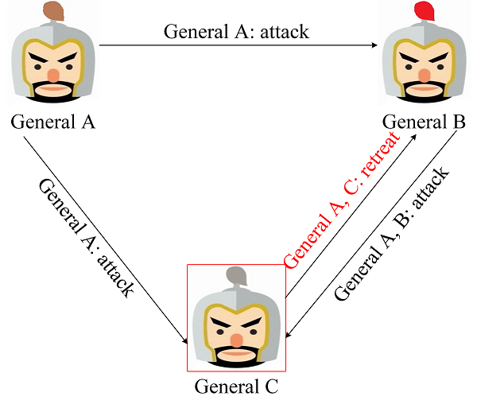

图7是叛将率先发起作战协商的场景, 叛将General C率先发送了误导的作战信息, 那么General A, B将发现General C发送的作战信息不一致, 因此判定其为叛将. 可对其进行处理后再进行作战信息协商.

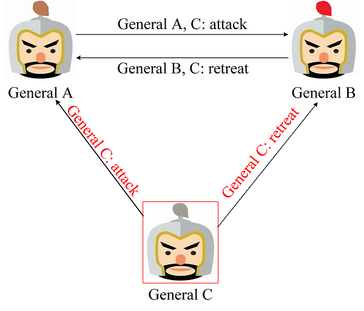

## **异步拜占庭容错**

然后，拜占庭容错，异步系统和数字签名无疑给分布式系统的研究者们打开了一闪新世界的大门，没过多久，异步系统（网络）的拜占庭容错问题就摆在了研究者的面前。而后面，无论是James Donald提到的拜占庭容错，还是中本聪通过POW解决的拜占庭容错问题，乃至由于区块链变得火起来的拜占庭容错这个问题，其实指的都是异步拜占庭容错。

在介绍异步拜占庭容错之前，我们要先说说什么是==异步网络==。

**异步网络**，顾名思义，和同步网络相反。两者的区别在于，在异步网络中，你发送的任何消息到达的延迟是不定的。更具体一点的话，我们说：

在同步网络中，存在某个延迟t，任何两点之间的通信消息延迟都小于t。

在异步网络中，不存在这么个t。

那么，在异步网络里，拜占庭节点实际上就获得了更大的能力——它可以做任何事来试图造成系统的不一致，那么自然，它可以假装失效节点，即不响应。也可以选择性地对一些人响应，一些人不响应。而且，他还可以任意控制自己响应的时间。

这个可能看上去并不好懂，那么我们举个例子来说明异步系统里的容错问题有多难：

小明想知道暗恋的女生小红是不是喜欢他，于是他发了条信息给小红：“你喜欢我吗？”如果小红回答：“嗯。”，小明得到正面的答案。如果小红回答“滚”，那么小明就得到负面的答案。

在同步系统里，我们可以在算法中约定小明在问完之后等待小红的答复，因为小红的答复一定会在时间t之前到达。

而在异步系统里，如果小红没有恶意，那么她会答复，但是她有可能很羞涩地选择了寄封信过来而不是直接发微信。于是，这条答复有可能会由于快递的原因，延迟任意长的时间。

当然，如果痴情的小明愿意等，我们还是可以说一句，他最终还是能等到小红的回信的。

但这是不考虑小红有恶意的情况。

而假设小红并不喜欢小明，而且压根不想理会他。

这个时候就会出现一个问题——痴情的小明同学可能会一根筋地相信，一定是信件的邮寄途中出了什么问题，小红怎么可能不给我回信。于是，他就算等白了头发，也可能永远不知道一个残酷的事实——

小红收到信看了一眼就丢掉了。

对于一切算法，我们都有一个基本的要求，叫终止，或者叫活性或者可用性。换句话说，我们需要一个能够获知小红喜不喜欢他的算法，我们可以接受得到结果的时间不定，但是我们不能接受最终能不能够得到结果随缘——也就是说，小明在发信之前来到山上找一个老禅师：

“有没有知道小红心意的办法？”

老禅师听了只是一言不发，笑而不语。

过了很久，小明终于恍然大悟：

“所以大师是说我只要一直等总能知道她的心意的对不对？”

于是欢天喜地地离开了。

“等等！我只是想用实际行动说明这个问题无解……”

实际上，两个人的异步系统中，在消息有可能丢失的条件下，这个叫“**两军问题**”，这个问题无解，这揭示了异步系统中的容错问题，或者说异步系统中的共识问题有多难。

但请注意，这里的两军问题可以说是拜占庭容错问题的两人版本，也可以说是一般容错问题的两人版本——因为两个人里，不存在误导他人的可能。而拜占庭错误和一般错误的最大的不同，就是拜占庭节点允许向不同的人发送不一致的消息。

那我们回到异步拜占庭将军问题，其实和之前拜占庭将军的条件一样，**只不过多了一个终止的假设**。

1. 如果将军是诚实的，那么诚实的士兵必须听从将军的命令。
2. 如果将军是叛徒，那么两个诚实的士兵必须做出一致的决定。
3. 这个算法必须最终使得大家做出决定。

这个问题，在三将军的情况下再次变得没有解了，即便加上了签名也一样。

## **说假话与不说话**

三将军问题在异步系统里无解的我们可以认为是这个问题多了一个维度。但也可以理解成，加上了异步假设之后，拜占庭节点的能力变强了——之前，它只能通过谎报军情来迷惑其他人造成不一致，而现在，他多了一个选项，他可以假装断线不说话。

那么，说假话和不说话这两招，到底哪招更厉害呢？生活常识可能告诉我们说假话可能更难对付一些，但是实际上，生活中说假话难对付最大的原因就是因为没有签名，因此，当签名被引入之后，说假话的威胁其实已经被降到了最低——签名主要有两个作用：1，别人没法伪造你说的话；2，你说过的话自己也不能否认。于是，一个诚实的将军，叛徒无法伪造他说过的话，而一个叛徒指挥官如果有心误导，那么他所发的不一致的消息如果被诚实的将军收到，那么立刻就能判断出他是叛徒。

而这个时候，不说话，实际上是一个更难对付的问题，之前的两军问题已经揭示了这个问题的核心——因为在异步网络中，诚实节点的消息也可能会被延迟任意久，于是在收到消息之前，你永远无法判别对方是诚实的还是叛徒。换句话说，小明在受到小红的答复之前，他永远也不可能知道小红是喜欢她，但是发出来的消息没收到，还是小红压根就不想理他。

在这种情况下，三将军问题还没开始就结束了：

1. 如果指挥官是叛徒，他可能永远都不会发指令。
2. 于是，为了满足终止条件，所有的士兵必须要预设一个决定，例如“没有在t之前受到命令就撤退”。
3. 但如果将军是诚实的，然后消息恰好延误了超过t的时间，那么这个算法失效。

似乎，我们发现了一个矛盾的问题：在三将军的异步拜占庭将军问题里，终止**（活性）和共识**似乎被对立起来了——如果需要这个算法能结束，那么就得给一个时限和默认决定来防止恶意节点不说话。但如果有这个，就有可能达不成共识。

实际上，这种感觉是正确的——人们很快就得出了分布式系统著名的**FLP不可能理论**——异步系统中，不要说拜占庭错误了，**只要有一个失效错误，换句话说，只要某一个节点有可能不说话，都不存在一种确定性的算法可以保证达成共识**。

这个定理的证明，实际上和我们的直觉是一致的——

首先，我们不认为一个“不管什么情况我们都无脑进攻”或者“不管什么情况我们都无脑撤退”是个合理的算法，因为这样的系统显然在实际中我们没法用。

于是，我们希望至少有的时候系统的共识是0，有的时候系统的共识是1。这其实就是更一般化的拜占庭将军问题——我们不在乎大家是不是听将军的，将军如果说了进攻最后大家包括将军都作出的决定是撤退也没事，只要大家能达成共识，而且不总是撤退就行。

然而，只要整个系统有可能有两种不同的共识的可能，就一定会出现和三将军问题一样的情况——总会有那么一种情况，所有人的决定最终会落在某位小明同学身上，这位小明同学在等着某位小红同学的消息来做判断，当她说进攻，最终整个系统的共识就是进攻，当她说撤退，整个系统的共识就是撤退。这个时候，由于是异步系统于是为了满足中止我们只能给出一个时限，例如“时间t之前如果没有收到答案，那么就默认是撤退”。而这就导致如果小红说对小明说了“进攻”可惜延迟超过t，那么算法失效。

而以上这些，仅仅是通过假装断线来实现的，换句话说，其实这个时候，拜占庭容错问题其实就变成了一般容错问题。换句话说就是，拜占庭容错这个名字听上去好像很厉害，但是最终无解的根源，仍旧是最经典的异步系统的容错问题——这个问题在分布式数据库里叫做CAP理论，简单表达起来是这样的：

**“在节点可能失效的异步网络中，一致性和活性是不可能同时达成的。”**

## **弱中止条件下的拜占庭将军问题**

所以说，想要解决异步系统拜占庭将军问题，我们需要解决说假话和不说话两个问题。

而实际上，因为有了签名，如果指挥官是诚实的，指挥官以外的叛徒说假话并没有什么卵用，他们能够进行的恶意行为，只有不说话。因此，拜占庭将军问题，其实又被简化成了“指挥官说假话”和“指挥官不说话的”的问题。

而这其中，指挥官不说话的问题，刚才我们已经用例子说明了是个无解的问题——当然，如果这个问题有解，也违背了FLP和CAP。这个暂且略过不谈。

于是，我们只剩下一个问题——**我们假设指挥官一定会下命令，而且每个人都知道这一点**。那么指挥官说假话的时候，两个诚实的将军在异步系统里能不能达成共识？我们管这种假设叫做“弱中止假设”。

很可惜，答案还是否定的，以下是会出现的情况：

1，指挥官会将两条不同的消息发给两个将军。

2，两个将军必须互相交流意见，否则很显然在这种情况共识就失败了。

3，然而，如果他们互相交流，那么又会陷入异步系统的经典问题——对方也有可能是恶意的，所以可能不会回复。所以，为了满足活性，他们必须在某个时间点，例如t，之前作出决定——如果这个决定是听指挥官的，那么如果指挥官是恶意的而两人之间的消息又恰好延迟了超过t的时间，两个诚实将军就又被恶意指挥官迷惑了；如果两人的决定是撤退，那么如果指挥官是诚实的，共识就又失败了。

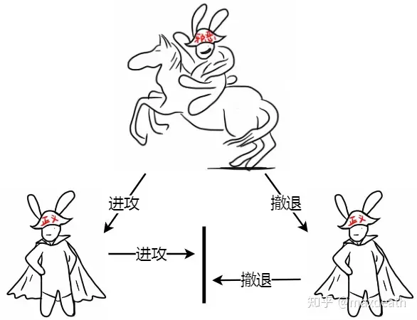

也许，看到这里大家有了深深的挫败感——我们分析了这么久为什么三将军问题还是解决不了？

其实，我们已经很接近了——

**这个问题，在四个将军的情况下是有解的！**

算法其实很简单——每个将军等收到两个一致的命令（包括指挥官的）时就遵守，在只有一个叛徒的情况下，诚实将军是能够达成共识的。

为什么这个算法可行呢？我们从将军的角度来分析一下——

假设我是诚实将军A，我收到了命令“进攻”，因为外面最多有一个恶意节点，所以，我至少还会再收到一位将军发来的消息。

1，这个时候，我收到了将军B的消息，他说他收到的是“撤退”，并且提供了指挥官的签名。这个时候，我知道指挥官是恶意的，因为他发了两条不一样的消息。于是，我知道我们三个将军都是诚实的，那么我们一定会把自己收到的东西发出来。所以，我知道我一定会等到将军C的消息，然后，如果他说他收到的是“进攻”，我就进攻，如果他说撤退，我们就撤退。

这里，最重要的一点是——我也很清楚地知道，因为B和C也是诚实的，所以他们也会采用同样的算法，所以，我们最终会达成共识。

2，如果我收到将军B的消息，他说他收到的是“进攻”，这个时候事情就有点麻烦了——因为我这个时候还不知道谁是叛徒。

首先，假设将军B诚实，那么首先他不会撤退，因为他首先收到了“进攻”，然后，因为我发的是“进攻”，那么他最多只能收到一个撤退。**接着要么将军C是叛徒，要么指挥官是叛徒。如果是前者，那么共识达成，因为指挥官和我以及将军B达成了共识，如果是后者，那么C有可能收到指挥官发的“撤退”，但他仍旧会和我们达成共识，因为我和B都发了“进攻”他最多只收到一个”撤退“。**

然后我们考虑将军B是叛徒，那么他只能选择不发给C消息（他没法伪造因为他不知道将军签名），但是这不重要，考虑到我和指挥官都是诚实的，C一定能收到两条“进攻”。

所以，我能够确定无论在什么情况下大家都能达成共识，也就代表这个算法成立。而这其中最重要的部分是——当我做出决定的时候，我能肯定别人一定不会做出相悖的决定。

这个算法推而广之到n个将军的话，一般解法是这样的：

**假设有n个将军，f个将军是恶意的。**

**那么对于任何一个将军而言，为了保证活性，他最多只能等n-f条消息（包括指挥官）就必须做出判断，否则的话就有算法就可能不会结束。**

接着就是我之前加粗的那一段了——当收到多少条”进攻“的时候我才能确定别人和我的判断一致，即，他们收到的”进攻“数量无论如何都会多于”撤退“呢？假设我开始接收消息，然后接收到的一致的消息的数量开始缓慢增加，1,2,3……，直到k条。这里面有诚实节点发的，也有恶意节点发的，那么，这个k是多少的时候，我可以自信地拍胸脯打包票：

“稳了！不可能有任何一个人能收到超过k条和我不一致的消息了。”

为了求k的值，我们考虑下这种情况：假设将军B收到了k条和我不一致的消息。

如果除了指挥官之外其他人都是诚实的，那么k应该是n/2+1，因为那样就代表至少有一个节点既发了消息给我又发了消息给B，也就是说他发了两条不一致的消息，这和他诚实矛盾。

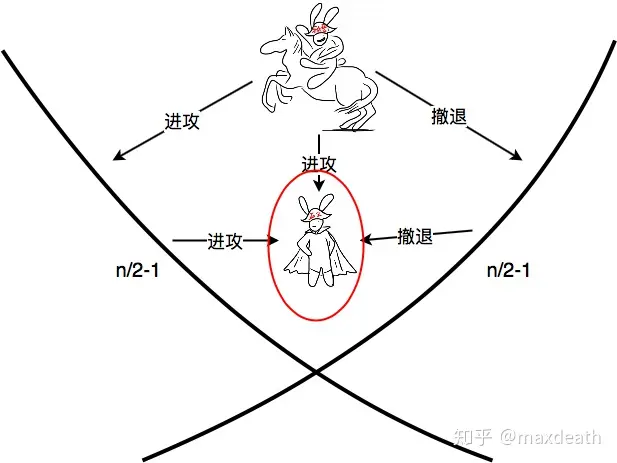

但是现在网络里除了指挥官之外，还有f-1个恶意节点，他们如果和指挥官合谋的话，n/2+1条消息就不够了，因为其中可能有f条消息是恶意节点发的。这个时候，我们需要的消息数量是(n+f+1)/2。只有这样，我才能确定其他人能够和我做出一样的判断。

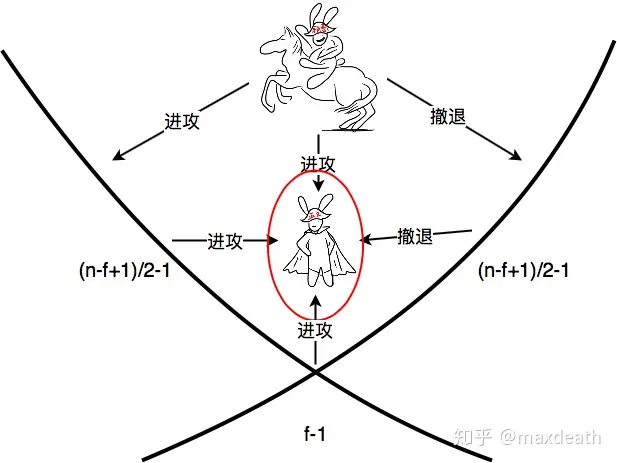

结合这两个条件，我们知道想要这个问题有解，我们需要同时满足这两个条件，即当收到最多n-f条消息的时候，我们已经可以做出一致性的判断了，也即：(n+f+1)/2<=n-f，也就是n>=3f+1的条件下，弱中止条件下的拜占庭容错有解。

弱中止条件下的拜占庭将军问题的算法，可以说是整个异步拜占庭容错的基础，或者说，是构成之后所有拜占庭容错算法的基本要素。

大家可能注意到了，我在前面一直都只说了“拜占庭将军”，这里才开始用“拜占庭容错”这个词——因为这两者在异步系统中有一些微妙的区别……

（拜占庭将军问题可以说是拜占庭容错问题的特例——但两者的算法并不能直接相通，因为拜占庭将军问题相当于在拜占庭容错问题中，先假设能够对某个人成为指挥官这件事达成共识。多数情况下，拜占庭容错问题的解法都是基于拜占庭将军问题的解法，然后加上某些机制，这个我们下次再说）

这个算法展示了拜占庭容错的其中一个边界——如果我们牺牲活性，那么通过这个算法，我们可以达到完全的一致性。

根据这个假设我们就得到了解决拜占庭容错的一个基本思路——

我们先对网络做一定的同步性假设来保证活性，在这个前提下，采用以上的算法来达成一致。

然后，无论是传统拜占庭容错算法，还是应用于区块链的拜占庭容错算法，最终，大家都在纠结一个事：

我们要怎么做这个同步性假设。

## **第一阶段——从拜占庭将军问题的提出到PBFT的提出。**

这个时候，正如我之前所说，是BFT作为一个数学问题的时期。人们关注的不是解决一个“一群拜占庭将军如何围攻地方城市的问题“，学者们既不关心这些将军也不关心地方城市的命运，学者们关注的是作为一个数学问题，如何解决它。

上一篇中我已经解释了这个问题为什么无解，即便是在有签名的情形下——最重要的原因实际上是异步系统共识固有的问题，即FLP不可能。

但是，数学家们显然不会就此止步——他们要探索这个问题的边界。而对于数学家，他们最喜欢使用的工具就是——无穷小。

所以，最终他们得出来的结论很简单——**如果确定性的算法无法解决拜占庭容错问题，那么我们引入一些随机因素**。简单地解释起来是这样——根据FLP不可能，如果要保持一致，总会出现那么一种特别恰巧的情况：每个节点的判断，延迟，消息接受的先后等等恰好都满足了某个条件，于是，恰好某些诚实节点需要等待某个失效节点的回复才能决定自己是“进攻”还是“撤退”，而他们的决定恰好会决定整个系统最终的判断，于是，系统卡在这了——如果选择中止，那么达不成一致，如果选择一致——那么就一直卡下去吧……

**那么，在这个时候，当节点判断出这种情况出现，我们让这些节点掷个硬币，根据硬币的结果随机选择“进攻”和“撤退”，并且广播自己的决定再次执行一遍之前的共识算法**……当然，更极端的情况是又出现了恰巧的情况，那么，我们就再掷一次硬币……最终，网络达不成共识的可能会越来越低。

最终，这个问题在数学层面得到了解决——任意给定一个不成功的概率，例如0.00001%，我们都能证明只要我们执行很多轮，例如100轮，这个算法失效的概率小于这个概率。

这种算法一点也没有考虑过实用，主要是它可能会需要很多轮才会中止，而且这个轮是异步系统的轮，是没有时间限制的，也就是说，每一轮我们保证会终止，但是我们不知道什么时候中止。

不过正如之前所说，计算机科学不是应用科学，这里，人们的目标是解决拜占庭容错这个数学问题。而这个工作是非常重要的，因为它为以后的拜占庭容错研究提供了两个很重要的东西：

1，我们在上文中讲过的，**弱终止条件**下的拜占庭将军问题的解法，又被称为==可靠广播==——即，当指挥官的活性可以保证的情况下，这个算法可以保证一致性。我们把这个算法简单记为A。这个算法就是这个时期提出的。

2，这个阶段给出了一个解决异步（拜占庭）容错问题的范式：**先做出某个假设S1，采用某个基于A的拜占庭容错算法F(A)来试图达到共识，然后，如果不成功，即满足某个退出条件T，则改变S1为S2，然后再采用F(A)**。

这里之所以不是直接用A，是因为A是异步拜占庭将军问题的算法，并不直接等价于异步拜占庭容错，两者的区别如下：

拜占庭将军：一个指挥官发令，剩下的所有将军需要听他的。

拜占庭容错：每个将军目前都有不同的判断，需要达成一致。

可以说，如果能够预设一个将军，并且这个将军不会不响应，那么可靠广播就能够解决拜占庭容错问题，这就是一种基于拜占庭将军算法的拜占庭容错算法，也即F(A)的一种。

对于这种范式，我们简单概括为S1:F(A):T -> S2:F(A):T -> S3:F(A):T.......，即，在S1状态下，执行某个基于可靠广播A算法的拜占庭容错算法，如果检测到共识无法达成的退出条件T成立，则改变初始状态以及假设至S2，再执行F(A)……

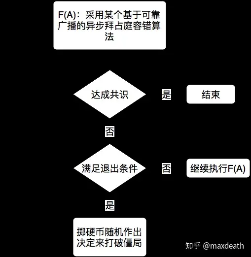

而在之前我们说的引入随机因素解决异步拜占庭容错的算法中，T就是检测到出现了“收到了所有能收到的消息，但是还是无法做出判断的情况”，例如，有f个恶意节点的情况，就是恰好收到各(n-f)/2条不一致的消息。S1->S2的方法就是所有无法做决定的节点随机掷硬币。**注意这里退出条件是每个节点自行需不需要掷硬币，因为整个系统是无法确定地判断是不是达到了退出条件的——因为这就又回到FLP不可能了**。

## **第二阶段——实用拜占庭容错（PBFT）**

1999年，Castro和Liskov提出了PBFT。PBFT是一个非常重要的算法，同时也可以说是第一个“实用”的拜占庭容错算法。PBFT中的很多机制受到Paxos的影响。但是最核心的部分，实际上还是我们之前提到过的范式：

这里面，F(A)是这样一个机制——将所有节点排上号，然后轮流来做首领（指挥官），然后进行可靠广播即算法A来达成共识。

然后，S1就是前篇中提过的弱终止假设，即，假设选出来的首领（指挥官）不会不响应，S1就是编号1的指挥官发起共识，S2就是第二个，以此类推，而退出机制T也相对应的，是达到某个时间阈值t。

但是，如果仅仅是这样，这个拜占庭容错在异步系统中是无效的——因为这个算法会在延迟超过阈值t的时候失效，而异步系统的定义就是找不到这样一个阈值t。

所以，PBFT采用的方法是：在S1的时候，把阈值设为t1，然后如果超时，则增加这个阈值。这样保证无论这个系统的延迟有多大，只要延迟不会无限增长，PBFT都能保证最终达成共识。

所以，最终的PBFT，可以表示成：

S1:F(A):T1 -> S2:F(A):T2 -> S3:F(A):T3.......

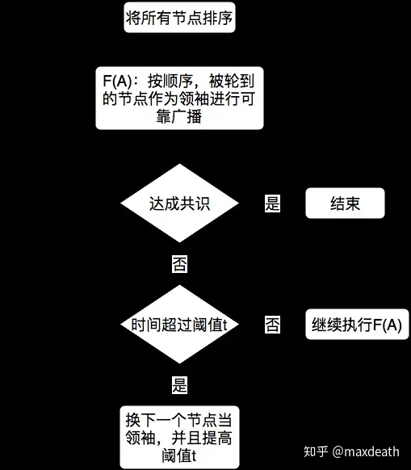

注意，这个时候，我们仍旧没有严格地达成异步系统的拜占庭容错，因为如果这个异步网络的延迟会一直增长的话，这个算法也会失效。但是通常情况，我们认为这种情况不会发生，所以PBFT，正如它们名字一样，人们认为它已经够实用了。

至于PBFT的性能，比较重要并且经常造成瓶颈的两个指标是输出和延迟，而在对于一般分布式文件储存系统的测试中，PBFT都已经接近于传统的一般容错系统。于是，大家就认为PBFT已经足够实用，整个BFT的发展，似乎已经到了终点——大家觉得，似乎没有什么BFT问题是PBFT解决不了的了，又或者说，PBFT解决不了的BFT问题，似乎也只是那些只存在于理论上的情形，不太可能在实际中出现。

## **第三阶段——Zyzzyva**

如果从现在的眼光看，以上那种想法显然过于乐观了。例如，比特币就解决了一个PBFT解决不了的拜占庭容错问题，但是，在比特币出现之前，没人想过这个问题是有解的，又或者说，压根就没人觉得这个问题存在。然后，比特币以及区块链给BFT问题打开了一扇新世界的大门，导致了BFT算法在近几年又有了许多发展。

尽管这些都是后话，这里我们想说的是，即便PBFT顶着实用拜占庭容错的名字，在接下来的许多年里，人们还是不知道它能用在哪。甚至，也许在PBFT提出的时候，作者也不知道它能用在哪，只是一般性地说“这东西是个更安全的分布式容错算法，能容下更恶意的错误的同时速度也没慢多少”。在论文中，它所有的机制，功能和性能都对标分布式文件储存系统，或者说，分布式数据库。于是，它做了很多相应的假设，例如：节点数量在10个左右，其中有不超过1/3的拜占庭节点；考虑的场景主要是一个外部的用户希望通过这个分步式系统将文件写入数据库，或者读取某个文件；每一步操作必须被严格排序再执行；优化是针对大文件的写入和读取，性能也是与传统的分布式文件存储系统对比，主要考虑延迟和输出。

而在这种场景下，PBFT的确已经相当优秀了。

可是在实际应用的时候，我们发现了PBFT的一个问题：

这里是PBFT的范式：

S1:F(A):T1 -> S2:F(A):T2 -> S3:F(A):T3.......

实际上翻译过来是这样：

先让节点1当首领，如果节点出了问题，有恶意，或者网络出了问题，导致规定时间没有完成任务，换节点2，提高规定时间的值，然后循环往复……

于是，出现了一个叫**Zyzzyva的算法**——**这个奇怪的名字是英文词典的最后一个单词**。大约，在提出的时候，作者认为这个是BFT问题的最终解决方案吧。

这个叫Zyzzyva的算法说，等等听起来好麻烦——难道实际上不是只会出现以下三种情况吗？

1，轮到的首领是好人，同时网络状况好，于是顺利达成共识。

2，轮到的首领是好人，但是网络状况极端，例如延迟超过t1，于是触发终止条件T1进入第二轮……直至最终达成共识。

3，轮到的首领是坏人，用某些方法造成共识无法达成，但其实最简单的方法就是不响应。于是，触发T1进入第二轮……直至最终共识达成。

更简单地说，只有两种情况：1，正常情况（首领是好人，网络正常），执行F(A)，共识达成；2，特殊情况（首领恶意或者网络延迟高，但这两者其实通常区别不大），然后触发几次终止条件之后再执行F(A)共识达成。

但是，对于这两种情况，PBFT是不区分的。

换句话说，PBFT对于首领是不是好人都是一视同仁的，**统统采用基于可靠广播这种绝对保证一致性同时需要O(N^2)消息复杂度的算法F(A)来达成共识**。

Zyzzyva觉得这种方法不善良，说，我们要善良一些——如果首领是可信的，那么用不着那么复杂的算法啊，直接做一轮O(N)消息复杂度的普通广播就好了嘛。然后，如果大家发现首领有问题，再退回BFT的那种算法。

于是，Zyzzyva相对于PBFT的特性就是：“当首领是诚实的并且网络状况好的话，共识更快，然而，如果状况很糟糕的话，那么共识就会比PBFT慢，因为需要先等‘基于假设的’的算法跑完才能进入正题”。

然后，两者在实际应用中哪个更好呢？

……

不好说，因为BFT哪来的实际应用……

……

但没有实际应用也不能抹杀Zyzzyva的价值，因为它激发了以后的一系列的BFT算法。这类算法共同的范式变为：

正常状态:快速算法:终止条件 -> 不正常状态:F(A):终止条件 -> 下一个节点正常状态:快速算法:终止条件.......

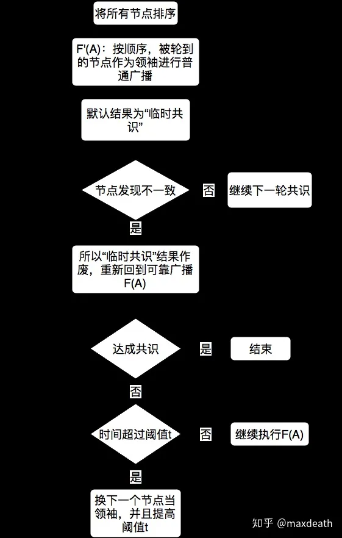

然后，每个算法的区别就在于，什么才是它们认定的“正常状态”。换言之，就是这个BFT应用场景的特性，例如：网络状况如何，恶意节点数量多少，恶意节点会进行什么样的行为……等等等等。然后，每个这一类“投机BFT”都会在某种场景下更好用一些，因为“正常状况”的出现可能更大，而算法特意对这种状况进行了优化。

而这类算法的终极形态，就是被称为链式BFT的一类算法，最标志性的就是Azyzzyva，简单说就是既然有这么多BFT，大家都定义不同的正常状态，那么，我们干脆就把它们都串起来好了：

理想状态:快速算法:终止条件 -> 一般正常状态:一般快速算法:终止条件 -> 不那么正常的状态:不那么快速的算法:终止条件 -> 特别不正常的状态:PBFT……

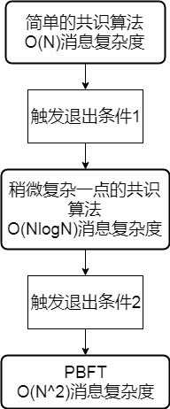

总之，无论是哪一种，基本思路就是，在理想状态下采用类似一般广播的O(N)的快速算法，最后消息复杂度O(N^2)的PBFT保底。然后，根据各种状况在这个应用场景中可能出现的比例和每个算法所需要的时间，我们只要进行优化就可以得出最适合这个场景的BFT算法了。

## **比特币的启示**

而比特币基本上也在和链式BFT出现几乎同样的时间，独立地出现了。

当然，其实说BFT算法完全没有应用也是不公允的——随着硬件的发展和对于信息安全的重视，很多分布式系统也开始考虑拜占庭容错。但是比特币的出现，对于BFT的发展，很显然是一个重大的里程碑。一方面，它提供了一个新思路，而更重要的是，它终于给拜占庭容错提出了一个有用武之地的场景。在下一篇，我们会更加详细地叙述这个场景以及针对于区块链应用诞生的新BFT类算法。

在这里，我们先来谈谈思路。

在我之前介绍比特币的文章里已经讲过，比特币的POW算法提出的最重要的思路，就是引入了博弈论的机制，以算力的方式给每条消息加上了成本，然后采用激励的方式来激励诚实节点，同时惩罚恶意节点。

在大部分人，甚至很多区块链的研究者们看来，这个算法都是和传统BFT八竿子打不着的东西，甚至，很多研究共识算法的人都不清楚传统BFT算法的原理，认为传统BFT算法例如PBFT是一个纯粹的黑盒子（这很大程度上也是因为他们只知道PBFT），只能应用于联盟链或者是根本不能用于区块链。更有甚者，将POW这种共识算法当做是密码学而不是分布式系统的问题来看。

这很难说是他们的问题——因为从起源上，中本聪的论文并没有和分布式系统扯上关系，从描述上，比特币也更像是密码学而不是分布式系统的东西，而从整个东西的原理上，又和BFT算法，例如PBFT看起来相差甚远，两者似乎完全不在一个位面上，例如许可和非许可的问题，例如所谓3f+1的节点限制，例如关于理性节点和诚实节点的假设，PBFT和POW在这里看起来似乎没有任何一点重合的地方。

然而，回到我们开篇所说的：计算机科学是数学，拜占庭容错是数学问题，我们只是想要知道，如何在有恶意节点的情况下达成共识，这和应用，与场景，与方法都无关。而之前PBFT一类的一切传统BFT算法，无非都是试图解决这个问题的方法，而POW以及之后的共识算法，也是试图解决这个问题的方法。两者看起来似乎天壤之别，无非是因为两者提出的背景不同，描述的问题不同，同时叙述的规范不同而已。而实际上，两者无论从原理上，思路上，还是实现方式上，都有千丝万缕的联系——

PBFT看起来似乎和POW很不一样，但是Zyzzyva呢？还有衍生出的链式BFT呢？

Zyzzyva先于比特币，而也没有证据显示中本聪受到过链式BFT的影响，两者完全是独立诞生的两种算法，但是如果沿着Zyzzyva的路线往下看，你会发现比特币的想法其实和链式BFT不谋而合，而且，引入了激励正是神来之笔。比特币其实解决的问题是——

如果只有“理想状态”呢？

如果我们可以用激励和惩罚的方式，约束所有节点的行为，让大部分乃至所有节点都不去做恶意行为，并且尽最大努力保持网络同步呢？这不就正是投机BFT中假设的“理想状态”嘛？

那根据投机BFT和链式BFT的思路发展下去，当一个网络大部分时间都处于理想状态的时候，我们应该怎么优化呢？

我们是不是可以直接采用O(N)消息复杂度的，最最简单的直接广播就可以让全网达成共识了呢？然后，是不是我们也永远不需要再退回消息复杂度O(N^2)的PBFT了呢？然后，我们是不是其实连节点数量也就都不需要知道了呢？

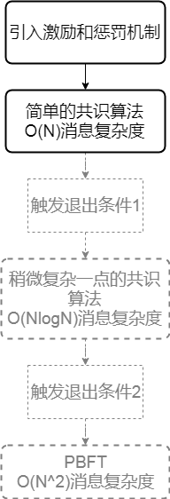

应该说，关于这个的认识也不是一蹴而就的——区块链的研究者们，许多现在还没有接受这个问题，而BFT的研究者们，也是逐渐地才开始意识到BFT和POW其实没有那么不同。归根结底，无论是PBFT还是POW，都不是不可拆分的黑盒子，都是一个个思路和机制结合起来的。

而区块链这个场景带来的新问题就是——面对区块链这个全新的场景，而我们手边则有了许多工具，例如传统的BFT，例如激励，例如防止女巫攻击的方法，例如链式的思想……那么，如何从这其中选取合适的工具，来解决区块链的问题。

作者：maxdeath
链接：https://zhuanlan.zhihu.com/p/52251671
来源：知乎
著作权归作者所有。商业转载请联系作者获得授权，非商业转载请注明出处。

O(N^2)的消息复杂度，代表着网络中节点越多，输出越低，于是，传统BFT算法基本上没法被用在超过100个节点的网络里。然而O(N)消息复杂度的算法就不同了，理论上，它可以被应用于任意节点的网络（不考虑延迟），因为输出并不会随着节点数量增加而下降。于是，实际上，比特币的这个思路把BFT问题扩展到了一个之前的BFT从未涉足的领域——

大网络中的共识。

这很令拜占庭容错的学者们兴奋，或者说，可能有点兴奋过了头。

以至于，大网络（可扩展）的拜占庭容错共识算法这个问题被抽象了出来，同时，诞生了许多采用比特币的思路的将传统BFT算法扩展至大网络的论文，例如Hybrid Consensus，Byzcoin等。而与此同时，比特币的研究者们把比特币的成功当做是一个成功的个例（不过这很自然，因为那个时候还没有区块链这个概念，有的只有山寨币而已）。于是，另一些对于比特币着迷的研究者们，关注的焦点自然而然地变成了“如何改进比特币”——增加输出，减少能耗，指出比特币模型的基础和安全模型等等……于是，许多关于比特币的论文应运而生，The Bitcoin Backbone Protocol，Majority is not Enough，GHOST，Bitcoin-NG，Proof-of-Activity，等等。直到他们开始发现想要改进比特币不是一个技术问题而是一个政治问题的时候，区块链这个概念就慢慢地变成了他们的新宠。

然后，逐渐地，随着区块链的概念的逐渐明确，关于区块链共识算法的研究方向也逐渐清晰起来——

我们究竟需要什么样的区块链共识算法？

答案是——适用于区块链的共识算法。

听起来像是废话，但其实这个概念的形成并不容易，或者说，在现实中其实我们经常遇到这种幸存者偏差——每次我们回顾历史，总会觉得某些选择是理所当然的，但是从当时的角度看，这些选择缺并没有那么显而易见。4-5年前并不是一个很长的时间，所有的人可能都还能很清楚地记得4-5年前发生的事情。但是，对于区块链而言，4-5年已经足够长了，因为我猜今天看这篇文章的人，在4-5年前就知道比特币的人十中无一，而且，即便知道比特币，能知道以上列举地这些比特币或者BFT的改进算法的，估计更是凤毛麟角。

我承认我4-5年前也不知道这些，但是，如果我们将时间推回那个时候，摆在人们面前的，并不仅仅是“区块链共识算法”而已，共识算法的发展方向，还有以下几种可能：

1，区块链，或者类比特币的系统并不是未来，但比特币引入的通过POW来防止女巫攻击和鼓励诚实节点是个好主意。所以，共识算法的未来，应该是采用POW的，大网络中的共识算法，但并不一定限于比特币或类比特币的应用。

2，区块链这个概念不存在，存在的只有比特币。未来会是去中心化的，但是比特币是唯一的系统。因此，需要改进的也只是比特币的算法。一切的改进，都是建立在比特币的基础上的，因此，在设计共识算法时，我们应该要考虑的是比特币这个具体的场景，包括比特币持币者的利益，矿工的利益，比特币的社群，比特币的安全性假设等等……最终，这个共识算法会成为比特币的一个硬分叉升级，因此，持币者和矿工的利益不能被损害，社群需要接受，比特币的安全性假设不能被改变……

3，共识算法的未来，维系在区块链的未来上。换句话说，共识算法的发展方向，将是为一个全新的，我们现在还不是如何确切定义的去中心化的系统提供共识，这个系统的大小，形态，和功能不尽相同，我们不知道他们将如何起效，不知道之后每一步的发展方向，只知道这个系统将会成为一个无比美好的，去中心化的未来中的重要一环。

即便直到今日，这个问题的答案仍旧是悬而未决的，这取决于大家对于未来的期许——未来会属于比特币，还是区块链，还是两者皆会如昙花般转瞬即逝。这点，不同的人会有不同的看法，而这又几乎取决于他们自身的背景，这很大程度上造成了现在共识算法领域的混乱现状——

比特币的追随者们会用比特币的方式来解决共识问题甚至只认同比特币的解决方式；加密货币的爱好者们，会认为比特币的最大贡献是引入了代币和经济模型，于是认为共识算法的核心在于激励机制的设计，而有了合理的激励机制之后其他的都会迎刃而解；密码学的专家们会认为共识算法已经被比特币转化成了一个领袖选择问题，于是又变成了一个经典的可验证随机数问题，可以完全用密码学的方式来解决；分布式系统的学者们则如同我之前所说的那般，坚持认为这就是一个大网络的拜占庭容错问题，于是仍旧遵循拜占庭容错的框架；然后，其他不同领域的人，会从不同的角度来认识、理解和解决这个问题——而导致的结果，就是各种五花八门的方案——分布式数据库的方案，元胞自动机的方案，可信执行系统的方案，信息论的方案等等……

以上的这些，总结起来就是三点：1，每个人最初了解到和学习到区块链的渠道就不同；2，每个人对于区块链的态度也不同；3，每个人擅长的领域也不尽相同，导致他们对于区块链究竟是什么的看法不同。

而这三点的差异，导致了所有区块链共识算法之间的差异，这点和很多其他的领域是不一样的——在一个更严谨的学术领域中，研究都是有比较清晰的脉络的，一篇文章会清楚地解释我们试图解决的这个问题的来龙去脉，包括它缘起于哪篇论文，是从属于哪个方向，又有什么已有的研究。而这个领域就算是个新兴领域，它的研究者，也基本上都来自于相关领域，有相似的背景……然而区块链共识算法则如我所说，本身的概念就含糊不清，因为区块链本身的概念也含糊不清，而且踏足这个领域的人也五花八门——不同的学术领域，工业界的开发者，创业者，乃至于纯粹的业余爱好者都有。于是，共识算法的论文或者白皮书们本身就给想要踏入这个领域的人，甚至给很多身处这个领域的人设置了一个很大的障碍——

其实这些区块链共识算法，看起来都是在解决区块链的共识问题，而实际上他们是在解决不同的问题，或者说，是在不同的框架下讨论这个问题。于是，这些共识算法很难被拿来直接比较，甚至，在背景介绍中也很少提及不同类的方案，更不要说去客观地评价与同类算法的优劣了。而对于对区块链一知半解的人来说，唯一通用的评价标准就是“TPS”，殊不知从TPS来比较这些算法根本没有意义，因为大部分都不是在同一个框架下，解决同一个问题。

而造成的结果是加剧了这个领域的混乱：一方面，一些理解共识算法的人在有意地混淆概念。例如，为了追求高TPS，采用了非拜占庭容错的共识算法，或者采用了较优的网络状况的假设（见上篇），然而并不在文中直接写明。又或者，故意不去与最新的同类算法进行比较，仍旧引用非常原始的POW或者BFT类算法的表现（例如7笔交易每秒或者不能超过20个节点等），来标榜自己是目前最好的共识算法算法。

而另一方面，这些算法和文章的出现，又将大量的新进研究者引入歧途——他们如果他们只参照以上的某篇论文或者白皮书，他们会对共识算法和区块链的概念和用途有一个错误的印象，例如，认为区块链仅仅是一个分布式数据库，或者认为区块链仅仅是将区块用哈希函数链接的结构。而如果他们只看了一些不正确的引用，他们会对于共识算法的发展有错误的认识，例如，提出将PBFT加入到POW里，或者提出其他各式各样的POx，殊不知其中大部分早在4-5年前就有人提过了。

以上的各种现象，在我审过和看过的未发表和发表的论文及白皮书中，我都看过很多很多。

这些，还只是偏学术领域发生的事——换句话说，我这里已经不在讨论那些看起来就不靠谱的白皮书了——我说的是那些看起来已经很高大上的白皮书和论文，无论是作者有意还是无意，其中有不少，其实从共识层面，是基本没啥意义的东西。

## **共性与发展趋势**

然而，之所以写下本文，是因为渐渐地，区块链共识算法这个领域正在逐渐摆脱这种混沌的状态。当然，这其中一部分原因是因为大家对于区块链共识算法的理解加深了，但更大的原因，其实还是ICO的降温，导致没有动不动就提一个百万TPS的POx算法的需求了……

以上有些离题了，我们回到拜占庭容错上来。

自从比特币出现之后，区块链共识算法的发展其实又可以分成两个阶段——

1，区块链火起来之前的阶段。

2，区块链火起来之后的阶段。

第一个阶段，正如前文所说，大家经历了一段时间的迷惘和分歧——比特币，区块链，大网络拜占庭容错，三者究竟哪一个才是最本质的突破，这点上的分歧，造成了区块链共识算法的路线上的分歧。

而第二个阶段，就是区块链的概念开始压倒其他两条路线之后的发展阶段。在这个阶段，大量的，不同思路的区块链共识算法开始涌现。但是，这个阶段又恰恰随着区块链和ICO的火热变了质，龙蛇混杂的状况加上对于TPS的过分追求，导致共识算法的发展的过程中混入了太多的杂音。这些杂音并不是指不同的思路，而是指上文中那些不能被称为思路的歪路。

不过，随着潮水退去，还是有很多东西留了下来。毕竟，在这个领域还是有严肃的研究者的，而毕竟对于研究者而言，问题就摆在那里，解决它才是目的——尽管也许一开始大家思路不同，角度不同，层次不同，但最终，还是可以用一套框架，用一个标准去衡量算法的。

而目前，在我看来，共识算法大概就处于这个潮水退去，将要从混乱转为有序的阶段，而标志就是，我们已经能够看出，几乎所有区块链共识算法的共性了——这就是我在这里想要谈的。

以下，就是我总结出来的，目前这一阶段区块链共识算法展现出的一些共性，也可能是未来区块链共识算法发展的一个共同的框架。当然，每一个我总结出来的共性都基于很多的论文和思考，这些，我会在未来的文章中慢慢给出。这里，我先简单地介绍结论。

#### 1，异步一致，同步活性

记得异步拜占庭容错中，我们解释了我们需要一致和活性，也解释了为什么根据FLP不可能，两者是不可兼得的。

在目前的这个阶段中，人们一开始是有一个错误观念的，就是比特币其实解决了大网络中的异步拜占庭容错。

然而实际上并不是——比特币对于网络同步的要求比传统BFT还要来得更高。在异步网络中，比特币要么会失去一致性，要么会失去活性。

然后，我们又发现一个问题：

对于目前所有的区块链系统而言，在什么情况下会出现大规模的不同步？

例如比特币的网络突然断开了，那么可以想象，一定是整个互联网出现了什么问题。而互联网如果出现了大规模的不同步的话，世界一定也不好了……要么是巨大自然灾难，要么是战争。

而在这样的情况下，“你无法进行交易，但是你的钱不会丢”和“你可以进行交易，但我们不保证你收到的钱以后能用”之间，估计所有人都会选前者。甚至，大家都会觉得后者很可笑——谁会做这种事？

这正是“异步一致，同步活性”的原因——几乎所有区块链应用，都是一类特定的分布式系统，即，用于价值交换的分布式系统。而在这种系统中，如果网络长时间大规模地失去了同步，区块链应该优先保证一致（这点大家都懂），而保证活性没什么意义，因为没有正常人会冒着交易失效的风险在这个时候还去接受交易。

因此，经过了很长一段时间的探索之后，区块链共识算法在这里逐渐和传统异步BFT分道扬镳了——

对于区块链共识算法而言，我们要保证异步的一致性，但是，其实不用考虑那么多所谓“弱同步”或者“部分同步”的假设，也用不着试图在网络出现极端异步状况的时候获得一些活性——我们完全可以大方承认：要是互联网出问题了这系统就是暂时不能用，只要保证同步活性就够了。但这并不代表我们可以把它当成一个同步问题看——因为实际上，我们应该关注的点，不该是“出现了异步该怎么办”，而是“如何避免网络出现大规模的异步问题”，以及，“如何避免小规模的断线严重影响整个系统的输出”。

#### 2，区块链需要进入门槛

这是一个比较有争议的点，就是通常我们认为公有链不应该有进入门槛——人们怀念中本聪的one CPU one vote的乌托邦，也怀念用电脑或者用显卡就能挖矿的时代。在那个时候的公有链真的是一个开放的环境——任何人都可以加入挖矿，参与到共识过程中来。

很多人相信，这才是区块链的真谛——一个完全公开的，人人只要下载了软件就可以参与其中的系统。而这是一个与传统BFT完全不同的特性——因为在传统BFT中，所有参与节点必须身份已知。而这有延伸出了许可链和非许可链的概念。

然而，理性的分析会告诉我们——其实对比特币的安全性贡献最大的，恰恰是ASIC矿机的出现。然后，POS的“无利益攻击”会告诉我们**POS也需要设立一个权益门槛来限制参与的节点**。然后，我们还有Proof-of-Authorty，Proof-of-Elapse-Time（需要可信执行环境TEE），DPOS这种天生写明了需要进入门槛的共识机制。更遑论联盟链和私链了。

于是，我们逐渐意识到——似乎所有区块链都有进入门槛，而没有哪个共识机制的安全性能在没有进入门槛的情况下自圆其说。从这个角度看来，BFT的“所有节点身份已知”就没有那么十恶不赦了——因为其实POW，POS啥的也半斤八两，只不过是进入的门槛不同和高低而已。但这又和许可链的定义不同——因为进入的门槛不等同于需要所有其他节点的许可。

所以，共识算法发展的另一个趋势是——

设定共识的进入门槛可以认为是一种去中心化向安全性妥协的结果，但事实就是，在目前的共识算法设计之中，我们摆脱不了进入门槛。

#### 3，BFT并不慢

我在第二篇中提到了投机BFT和POW思想的相似之处——这其实并不是我自己的理解，而是对于最近采用BFT论文思路的总结。

我们刚才已经说了，首先，无论是哪种共识算法，为了安全性，其实都需要门槛——我们应该选取对系统更有责任感的节点。

如何让一个节点负起责任来？

很显然——做得好就奖励，做不好就惩罚是最好的方法。

**这就是激励机制，而激励机制的设计，是我看来目前区块链共识算法的最大问题。**

那么问题来了：假设这个系统里的节点都已经很负责任了，我们需要采用什么样的共识算法呢？

其实，Zyzzyva已经给了我们答案——我们可以先投机地采用更简单地共识算法快速达成共识，不行了再退回BFT。

而同时，DPOS和Hyperledger-Fabric又给了我们现实的模版——其实如果真的大家都很负责，我们也许连BFT都不需要。

当然，这其实是个非常有安全隐患的做法——实际上是大家先射箭（比特币里大家都没有作恶，甚至，最近连孤块都很少了）再画靶子（那么，既然恶意节点这么少，网络这么好，那么我们完全用不着用这么复杂的算法嘛）的行为。但是，这种很鸡贼的方法，其实就是投机BFT的变种。

换句话说，不要再用老眼光去认为BFT一定代表了O(N^2)的消息复杂度和高延迟了，实际上，在引入激励机制之后，如果投机BFT永远用不到备用方案，那实际上效果和类POW算法也没什么区别。目前，在Algorand的新版本中采用的BA*，实际上就是一个投机BFT算法。而Thunderella，就干脆选出一个委员会采取同步非拜占庭容错的方法去做共识，管这种方法叫做快速通道——这个其实也就是投机BFT的路子。另外，Byzcoin中也用了投机BFT，但是只是先把消息复杂度降到了O(NlogN)。但无论如何，这些算法都会有个备用方案，就是切回传统BFT或者POW。相比而言，DPOS这种“反正有社区共识节点不会做恶，那么我们干脆不要用BFT了”的方法，从投机BFT的眼光看，有些投机地过头了。

所以，最终问题的关键是激励机制——只要激励做得好，大家都不做恶，无论是POW还是BFT，最终消息复杂度都是O(N)，最终，输出也就只受限于网络条件而已。

#### 4，更现实的网络假设

我们先来总结一下：前三条，我们叙述了经过后比特币时代第二阶段，共识算法发展出的一个基本框架：

* 首先，我们只要保证绝对的一致性，然后只要保证同步条件下的活性就行了。
* 第二，我们需要设置一个合适的准入门槛，让无关节点参与共识不是一个好主意。
* 第三，我们需要一个合适的激励机制来保证节点在正常情况下没有做恶的动机。

然而，这三条说起来容易，实际操作起来都有还要解决的问题。

其中第二和第三条，如何设置门槛和激励机制，这是一个计算机科学家无力独立解决的问题——因为其中涉及到经济学乃至政治学的东西，而目前很少有人同时对于这几方面都有很深的涉猎。

对于第一条，看似PBFT也达到了异步一致和同步活性，其实Honeybadger BFT里面指出了它的问题——由于主节点是固定的，恶意节点只要持续DDOS主节点就能无限地破坏同步性，让共识无限延迟。

所以说，对于第一条，仅仅是同步共识是不够的，我们还要考虑在实际的网络中同步的鲁棒性。

让我们翻回头再看看传统异步BFT问题中的假设：一方面，我们可以认为是一个可能出现任意延迟，恶意节点可以进行任意行为的网络；而另一方面，我们也可以认为是一个同步网络中，恶意节点可以任意操纵网络连接的系统。

而现实中的情况是——第一，刚才我们说了，如果有了好的激励机制，恶意节点的行为不是任意的；而同时，恶意节点其实也不能任意操纵网络，例如：他们没法根据公钥，立刻找出一个节点的IP；或者，恶意节点无法伪造他们的网络连接；又或者，恶意节点可以通过DDOS造成小规模的不同步，但是无法造成全互联网级别的瘫痪。

根据这些特性，我们可以梳理出另一条逐渐清晰的脉络——当我们知道区块链的主要应用场景，例如，公链的应用场景是互联网的时候，我们应该针对互联网的特性做一些新的假设。例如之前说的同步性：PBFT应用于公链是很危险的，因为恶意节点可以很容易地DDOS一个确定的节点。然而，POW在公链中就更加安全，因为POW的区块发布节点是随机的，同时，无法提前预测的。因此，在设计共识算法的时候，我们需要考虑到现实网络中DDOS的能力，最理想的状况是像比特币一般，区块的发布者的确认和区块的发布同时进行。

所以，Algorand采用VRF（可验证随机数）的方式来进行区块发布者选择，而Ouroboros也在后来的版本中把选取区块发布者的方法从哈希函数改成了VRF。

这是第四点共识算法发展的趋势——我们应该考虑互联网的实际特性，不应该再用延迟的眼光去看“异步”这个问题，而是考虑“恶意节点有怎样的网络控制能力”。然后，就如同第一条所说的，与其去关心系统如何应对理论上任何可能出现的异步情况，我们更应该关心的是现实网络中可能出现的异步情况。

#### 5，随机的领袖或者委员会选择

之前我们已经简单提到了雅典民主，而雅典民主的一个最大特点就是随机——随机选出500个人来治理一段时间，似乎并不是一个特别不可接受的选择：这里有两个原因，一是因为大部分人都是好的，二是因为如果随机的过程足够公平和不可预测，那么这500个人大概率是互不认识的陌生人，这样，他们合谋的可能性也很低。

所以说，其实这带来了一个关于选取委员会的思路——

我们希望提高比特币POW的效率，而比特币POW的瓶颈，实际上是传播延迟对于安全性的影响。因此，想要降低传播延迟，我们想要在一个更小的范围内做BFT，这就是选取委员会的问题了。

然后，接下来，出现了这么一个意见分歧：

一种方法是DPOS和POA甚至联盟链。他们代表一个更直观我们更容易理解的选取委员会的思路——我们通过投票，或者通过认证，或者通过现实中的身份，选出一些可信的节点，来代表我们做共识。

而另一种，就是朴素的雅典式民主：我们定期随机选取一些节点代表我们管理这个网络，尽管这些人在个体上可能并不那么可信，但只要随机无偏向，只要大部分人是好的，只要我们进行比较频繁的轮换，那么这些陌生人也许比一个我们信任的长期掌权的委员们更可靠。

当然，这两者孰优孰劣又变成了政治问题，这也是一个令区块链研究者头疼的问题——只要深究下去，共识本身就是个社会学和政治学问题。

但是，如果我们姑且认为随机产生委员会是有道理的，那么，区块链共识算法可以做进一步优化——我们可以采用随机的方法缩小共识范围。

Algorand和Avalanche其实都采用了这样的方法，而Elastico和Omniledger，也采用了这种随机的方法进行分片。

但是随机也是有局限的，就是随机会伴随着安全性的降低——如果对于一个有10000个节点的网络做容错的话可以容下1/3的错误节点的话，那么如果你想随机选出100个节点同时希望极大概率这一百个节点里恶意节点的数量不超过1/3的话，那么10000个节点之中，可能只能有1/5的节点是恶意的了。

当然，换言之，如果网络里只有1/5的节点是恶意的，那么我们就可以相应地用这种随机的方法来缩小共识范围。

那么，我们怎么知道网络里恶意节点的比例是1/5而不是1/3甚至1/2呢？

简单说——我们不知道，这其实又是一个先射箭在画靶子的问题。但我们希望在未来，可以想出一个用激励机制来保证它。

#### 6，无限扩展——Layer 1 or Layer 2

以上所有的方法，以及提到的除了Elastico和Omniledger的所有算法，包括但不限于POW类的，POS类的，乃至DAG类的，甚至一些不知道怎么归类的例如Thunderella，Avalanche这种，其实统统都属于“可扩展（Scalable）”共识算法，而不是“无限扩展（Scale-out）”共识算法。换句话说，消息复杂度是O(N)，于是网络节点数增加时，最好的情况，输出能够不降低，保持不变。而无限扩展的定义虽然也很混乱，但是通常，我们认为得是o(N)的消息复杂度，换句话说，当**整个网络节点数增加时，输出还能提高的，才能叫作无限扩展**。

o(N)和O(N)其实很好理解：对于任何一条消息，如果需要通知整个网络，也就是说如果这条交易记录网络里每个节点上都有，那么至少是O(N)的消息复杂度——而比特币就是这样的，或者说，通常意义上区块链就应该这样。而o(N)则表示，对于某一笔交易，只有一部分节点知道——于是就自然而然地有了那个扩展，安全和去中心化的不可能三角：要不然，A把一笔钱付给了B但你不知道，那么未来A可以再把这笔钱付给你，造成双重支付，这是安全风险；要不然，你委托另一些节点代为验证这些交易，这是中心化。

我们刚才说到如果仅仅是“可扩展”，那么输出随着网络增大最好的情况是保持不变，而不变的这个值，是受网络条件制约的，如果一定要说一个数的话，在网络条件很好的情况下，差不多是1000TPS。而1000TPS，对于被中心化应用（例如峰值能有1000000TPS的淘宝）宠坏了的我们来说，显然是不够的。因此，现在一个热门的探索方向是无限扩展，而关于无限扩展今年最热的两个词叫Layer 1和Layer 2。

当然，与区块链领域其他的很多概念一样，这两个词是工业界采用的，在学术上没有严谨定义，然后大家用他的时候概念也五花八门。直观地，很多人认为链下和侧链技术就是layer 2，分片和DAG就是layer 1。或者说，在有主链的基础上把交易挪到链下的叫layer 2，想要修改主链的叫layer 1。

但是这种定义实际上还是很模糊——因为一些分片和DAG技术其实掰开来讲也有类似主链的结构，你也可以看成是把交易挪到了链下或者侧链上。

所以，实际上，更为学术界所接受的定义是：**Layer 2是指类似于闪电网络，指通过押金或者保证金的方式将一部分钱锁定在主链上然后开启链下通道的机制**，例如闪电网络，雷电网络，Plasma，RSK，Liquid，Polkadots等等。而**Layer 1则是指修改共识算法达到无限扩容的机制，例如分片**。两者的根本区别在于交易的安全模型是否更改，换句话说，在Layer 2机制里，恶意行为，例如双重支付，是可能出现的，但是利益相关方可以通过拿走保证金的方式来惩罚恶意行为。但是在Layer 1中，安全模型是没有被改变的，恶意行为应该从共识算法上保证不能成功。

再确切点说，Layer 2中，对于每一笔交易，我们不要求BFT中的一致性（也不要求活性），但是如果出现了不一致，总有一方是对的而另一方是错的，而对的那方可以通过某些方法惩罚错的那方，并且能够让整个网络对于他们的对错有一致的判断。但这些的前提是——正确的那方得去主动发现恶意行为并主动采取行动；而在Layer 1中，对于每一笔交易，我们不要求BFT中的活性（因为无限扩展意味着交易不会被所有诚实节点收到），但是我们仍旧要求一致性。于是，只要所有节点都严格执行共识算法，双重支付是不可能出现的。

其实在我看来，两者的冲突不是根本性的，而是路线上的——哪边更好，哪边更实际，哪边更容易做到，于是，我们应该往哪边投钱。但实际上两者完全可以共存，究其原因是，Layer 2中的链下交易，其实和一般的交易是有区别的。这点很多闪电网络的科普文上都提到过了——Layer 2是有保证金的，换句话说，Layer 2更像储值卡，并不能完全代替现金交易。所以说句和稀泥的话，Layer 2是有局限的，Layer 1也同样有，因为目前大部分的分片算法，无论是随机分片，根据地理位置分片，还是根据应用分片，实际上都是牺牲了安全性的。然后，Layer 2实际上将安全交由了受害方取回保证金的机制，实际上也是牺牲了安全性（设想一下，用保险柜防止别人偷钱，和如果别人偷了钱如果你能提供对方偷钱的证据就能把钱拿回来，后者的安全性是不如前者的）。因此，目前几乎所有Layer 1和Layer 2，基本上都还是在不可能三角的框架里的。