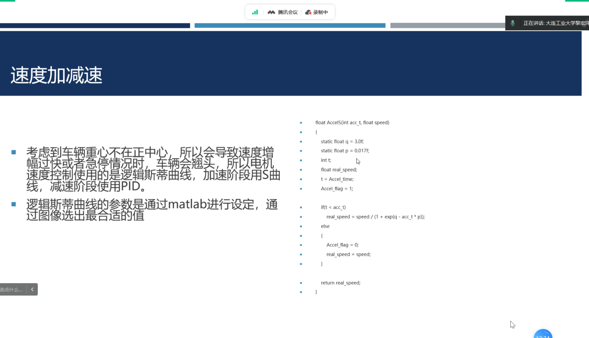
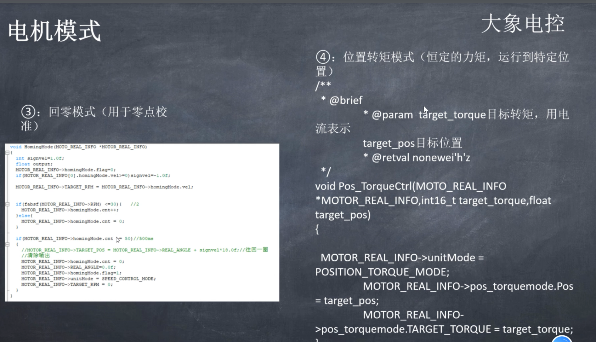
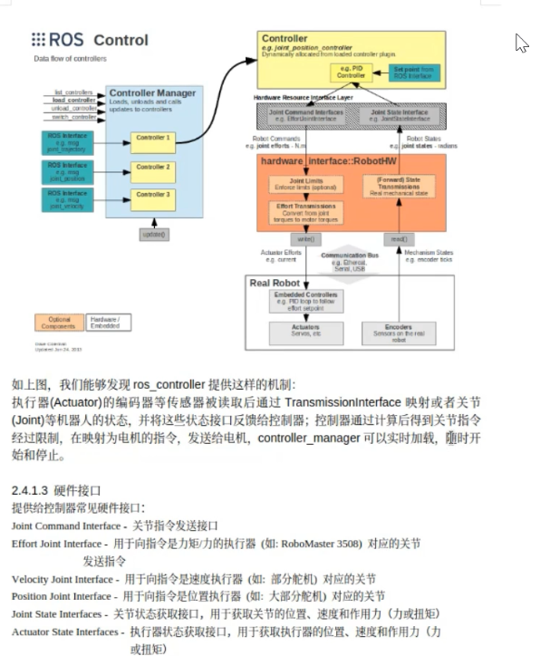
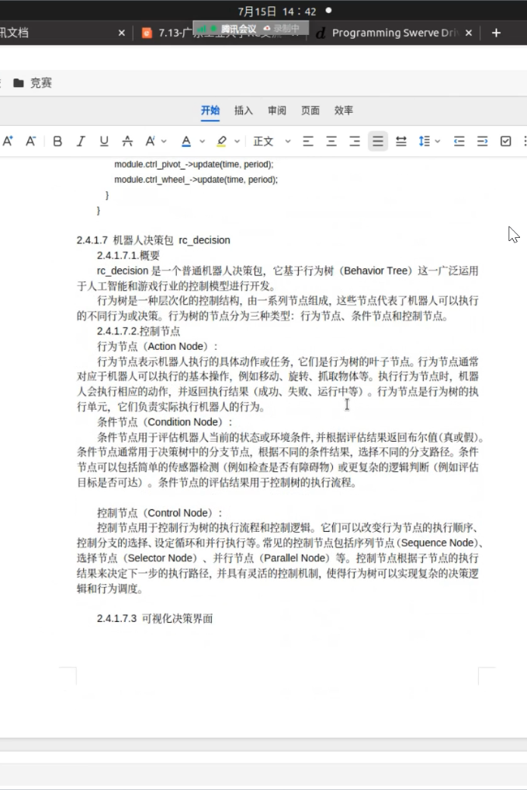
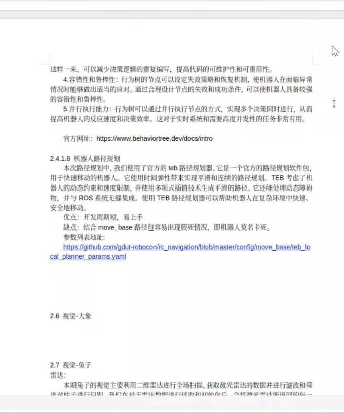
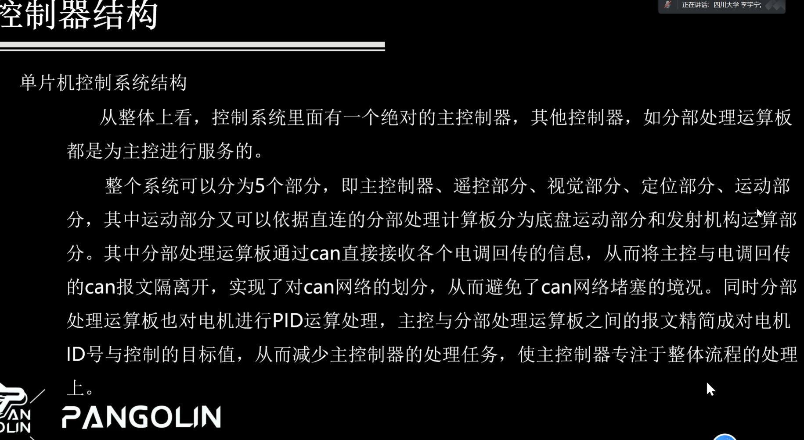

# Note

## 哈工程

### 底盘

1.    使用微动开关  来找舵轮初始位置
2.   定位：码盘   
3.   因为VESC有电流限制，故采用分段加速，采用MATLAB拟合

Matlab拟合：

S型加速路径：

1. 时间和速度的匹配

2. 路程和速度的匹配，`matlab` 找最合适的解

### 发射机构：

加速行程越长，越稳定

## 大连工业

can  最多接6个电机，多了会丢数据

atan函数避免为 0   （）反三角）

解决翘头

只获取一次坐标，防止摇摆。

vesc   烧？？？？？？？？？

位置控制    电流有限幅

 给一个小电流，当碰到flag  将当前角度置零

限制电流恒定力矩

一到指定速度就加限幅，小于就取消限幅

ROS control   

**硬件映射**？？？？

**组局域网**？？？

**目标插补曲线**

==实体按键还是最好==

贵的陀螺仪

5m 偏移 3cm??

网络调试  udp调试

Jscope

微分跟踪器

### 网口很快  

##  四川大学

遥控器使用：

NRF

DT35   激光测距慢？？？

