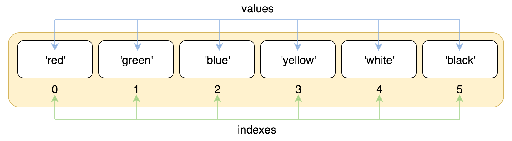

# python学习

```python
#注释
'''
多行注释
'''
"""
行与缩进
"""
#多行语句
total = item_1 + \
item_2
#python中单双引号完全相同
#使用r可以让反斜杠不转义
print(r'Ru\noob')
>>> Ru\noob
```

## 基本数据类型

Python变量不需要声明。

Python允许同时为多个变量赋值。

> #### 标准数据类型
>
> * 不可变数据类型
>   * Number
>   * String
>   * Tuple
> * bool
> * 可变数据类型
>   * List
>   * Set
>   * Dictionary

六大数据类型

### Number

* int
* float
* bool
* complex

```python
isinstance()    #会认为子类是父类
type()          #不会认为子类是父类

#Python 中，bool是int 的子类  True==1  /  False==0

#创建Number对象方法
var=1
a,b=1,100
a=b=c=d=10
#删除对象方法
del var

#数值运算
2/4    #得到浮点数    浮点数除法
2//7   #得到整数      整数除法
2 **5  #乘方
17%3   #取余

#混合运算时会将整型转换成浮点数
```

```python
#复数表示方法
a+bj 
complex(a,b)
```


* string、list 和 tuple 都属于 sequence（序列）

### String

Python中的字符串不能被改变

Python 不支持单字符类型，一个字符就是长度为1的字符串

```python
str_1= "djkfjd"
str_2 = "hello\n"
#字符串截取格式：    变量[头下标:头上标]
```


|  -6  |  -5  |  -4  |  -3  |  -2  |  -1  |
| :--: | :--: | :--: | :--: | :--: | :--: |
|  0   |  1   |  2   |  3   |  4   |  5   |
|  R   |  u   |  n   |  o   |  o   |  b   |

| ：   | 1    |  2   |  3   |  4   |    5 |   ： |
| :--- | :--- | :--: | :--: | :--: | ---: | ---: |
| ：   | -5   |  -4  |  -3  |  -2  |   -1 |   ： |


```python
# + 是字符串连接符
# * 表示复制当前字符串

str = 'Runoob'

print (str)          # 输出字符串
print (str[0:-1])    # 输出第一个到倒数第二个的所有字符
print (str[0])       # 输出字符串第一个字符
print (str[2:5])     # 输出从第三个开始到第五个的字符
print (str[2:])      # 输出从第三个开始的后的所有字符
print (str * 2)      # 输出字符串两次，也可以写成 print (2 * str)
print (str + "TEST") # 连接字符串
print (str[1:4:2])   # 截取1-4之间的元素，并且获取步长2（间隔1）
print (str[1:4:-1])  #最后一个参数附属表示逆向读取
```

转义字符：

需要使用特殊字符时可以用```\```来转义

```python
\    #续行符
#exmaple
>>> print("line1 \
	line2 \
	line3")

\000 #空字符
```

如果不想让反斜杠发生转义，可以在字符串之前添加`r`，表示原始字符串

```python
>>> print(r"Ru\noob")
Ru\noob
```

字符串运算符：

```python
+
*
[]
[:]
in           #判断该字符是不是在字符串中
not in
r/R          #原始字符串
%            #格式字符串
```

#### Python字符串格式化：

```python
print("我叫 %s 今年 %d 岁"%("xiaoming",10))

#Python支持格式化字符串
%c
%s
%d
%u
%o
%x  或  %X
%f
%e  或   %E   科学计数法


#格式化操作符辅助指令：
*             #定义宽度或者小数点精度
-             #用做左对齐
+             #在证书前面显示加号
0             #在数字前面填充0
m.n.          #m显示最小总宽度，n是小数点后面的位数
print("Hello %s"% name)
```

#### Python三引号：

允许跨行字符串

```python
'''dfdfdfdf
dfdfdf
'''
```


#### F-string(字面量格式化字符串):

以`***f*** 开头

```python
#直接用大括号来写变量
name = "rlsif"
f'Hello {name}'
```

内建函数：

```python
capitalize()              #将第一个字符转换成大写
count(str, beg=0,end=len(string))     #返回范围内string出现的次数
find(str,bdg=0,end=len(string))       #检测指定范围内是否有该值
```


### List

列表是写在方括号 ```[]``` 之间、用逗号分隔开的元素列表， **元素类型可以不同**。

列表同样可以被索引和截取

列表中的元素可以**`改变`**

#### 访问列表中的值




截取字符


```python
list = [ 'abcd', 786 , 2.23, 'runoob', 70.2 ]
tinylist = [123, 'runoob']

# + 是连接符，  * 是重复操作符
print (list)            # 输出完整列表
print (list[0])         # 输出列表第一个元素
print (list[1:3])       # 从第二个开始输出到第三个元素
print (list[2:])        # 输出从第三个元素开始的所有元素
print (tinylist * 2)    # 输出两次列表
print (list + tinylist) # 连接列表
```

#### 更新List

直接修改元素

```python
list = ['dfdf','fdfd']
list[1] = 2001
```

队列是一种先进先出（FIFO）的数据结构，我们可以使用列表来实现队列的基本功能。

- `append()` 方法向队列的末尾添加一个元素。
- `pop([index=-1])` 方法从队列的开头删除一个元素并返回它。

#### 删除元素

```python
del list1[2]
```

#### 脚本操作符

```python
len()
max()
min()
list(seq)      #将元组转换为列表
[1,2,3]+['d',5,'s']
[1,5,]*10
3 in (1,3,2)
for x in [1,2,3]
```

#### 嵌套List

```python
[[4,5],['dd']]
```

#### List比较(比较是否相同）：

```python
import operator
operator.eq(list1,lsit2)
```

#### 方法：

```python
list.append(obj)
list.count(obj)
list。extend(seq)      #用新列表来扩展原来的列表
list.index(obj)        #找出匹配的索引
list.insert(insdex,obj)
list.pop([index=-1])
list.remove(obj)        #移除第一个匹配值
list.clear()
list.copy()             #复制列表,返回被复制的这个列表
list.sort()             #对原列表进行排序
list.reverse()          #反向列表元素
```


### Tuple (元组)

元组元素**不能修改**，元素类型可以不同。

元组的元素不可改变，但它可以包含可变的对象，比如list列表。

元组中**只包含一个元素**时，需要在元素后面添加逗号 ”**,**“ ，否则括号会被当作运算符使用

```python
tuple = ( 'abcd', 786 , 2.23, 'runoob', 70.2  )
tinytuple = (123, 'runoob')

print (tuple)             # 输出完整元组
print (tuple[0])          # 输出元组的第一个元素
print (tuple[1:3])        # 输出从第二个元素开始到第三个元素
print (tuple[2:])         # 输出从第三个元素开始的所有元素
print (tinytuple * 2)     # 输出两次元组
print (tuple + tinytuple) # 连接元组
#与字符串具有相同的截取方法，字符串可以看做是特殊的元组。
```

```python
tup1 = ()    # 空元组
tup2 = (20,) # 一个元素，需要在元素后添加逗号
```

#### 对元组进行组合

```python
tup1=(12,65,45)
tup2=(12,)
tup3 = tup1+tup2
```

#### 删除元组（只能删除一整个）

```python
del tup1
```

#### 脚本操作符

```python
#与List一致
```

#### 内置函数

```python
tuple(iterable)         #将可迭代系列转化为元组
```


### Set （集合）

集合（set）是一个**无序的不重复元素序列**。

Set是由一个或者数个形态各异的大小整体组成的，构成集合的实物或对象称作元素或者是成员。

功能：成员关系测试和删除重复元素。

```python
sites = {'Google', 'Taobao', 'Runoob', 'Facebook', 'Zhihu', 'Baidu'}
set(sites)
#创建一个空集合必须用set()而不是{},{}创建一个空字典。
print(sites)   # 输出集合，重复的元素被自动去掉

# 成员测试
if 'Runoob' in sites :
    print('Runoob 在集合中')
else :
    print('Runoob 不在集合中')


# set可以进行集合运算
a = set('abracadabra')
b = set('alacazam')

print(a)

print(a - b)     # a 和 b 的差集

print(a | b)     # a 和 b 的并集

print(a & b)     # a 和 b 的交集

print(a ^ b)     # a 和 b 中不同时存在的元素
```

#### 内置函数

```python
s.add(x)              #添加元素
s.update(seq)           #添加列表，元组或者字典
s.clear()            #移除所有元素
s.remove(x)          #移除时，不存在会报错
s.discard(x)         #~移除不会报错
s.pop()              #随机删除
issubset()
issuperset()

s.difference()       #返回多个集合的差集
intersection()       #返回集合的交集
union()              #返回两个集合的并集
```


### Dictionary

字典是无序对象的集合。字典中的元素是通过键来存取的，而不是便偏移存储。

```键(Key)：值(Value)```的集合。```{ }```

字典中的关键字必须为不可变类型。

**键**  必须唯一不可变


```python
dict = {}
dict['one'] = "1 - 菜鸟教程"
dict[2]     = "2 - 菜鸟工具"

tinydict = {'name': 'runoob','code':1, 'site': 'www.runoob.com'}

print (dict['one'])       # 输出键为 'one' 的值
print (dict[2])           # 输出键为 2 的值
print (tinydict)          # 输出完整的字典
print (tinydict.keys())   # 输出所有键
print (tinydict.values()) # 输出所有值
#构造函数 dict() 可以直接从键值对序列中构建字典
dict([('Runoob', 1), ('Google', 2), ('Taobao', 3)])
{x: x**2 for x in (2, 4, 6)}
dict(Runoob=1, Google=2, Taobao=3)

#添加键值对
tinydict['df']= 8
```

#### 删除

```python
del tinydict['df']
del ttinydict                #删除字典
```

#### 字典值

```python
#创建时如果同一个键被赋值两次，后一个值会被记住
```

#### 内置函数&方法

```python
len(dict)
str(dict)
dict.clear()
dict.copy()
dict.fromkeys(seq[,value])                         #创建一个新字典
dict.get(key,default=None)              #返回指定值的值，如果不在返回default里面设置的值
pop(key[,default])
dict.items()                           #以列表返回视图对象，是一个可以遍历的key/value对

dict.setdefault(key,default=None)
key in dict
```

`dict.iterms()`

*  dict.keys()、dict.values() 和 dict.items() 返回的都是视图对象（ view objects），提供了字典实体的**动态**视图，这就意味着字典改变，视图也会跟着变化。
* 视图对象**不是列表**！！！！！！不支持索引，可以使用 list() 来转换为列表。
* 我们不能对视图对象进行任何的修改，因为字典的视图对象都是只读的

------

## 数据类型转换

* 隐式类型转换

一般较低的数据类型转换为较高的数据类型，避免数据丢失。

* 显式类型转换

强制类型转换。

```python
int()
float()
complex(x)
complex(x,y)    #将x,y转换成一个复数，y为虚部
str()
#转换成相应字符串
oct(s)
hex(s)
chr(x)

```


------

## Python推导式

Python 推导式是一种独特的数据处理方式，可以从一个数据序列构建另一个新的数据序列的结构体。

#### 列表推导式

```shell
[表达式 for 变量 in 列表] 
[out_exp_res for out_exp in input_list]

或者 

[表达式 for 变量 in 列表 if 条件]
[out_exp_res for out_exp in input_list if condition]
```


```python
news= ['dfdf','dfdfs']
news_name = [name.upper() for name in news if len(name)>3]
```

#### 字典推导式

```python
{ key_expr: value_expr for value in collection if condition }
```

#### 集合推导式

```python
{ expression for item in Sequence if conditional }
```

#### 元组推导式（生成器表达式）

元组推导式返回的结果是一个生成器对象

```python
(expression for item in Sequence if conditional)
```

------

## 解释器

让py脚本像SHELL脚本一样直接执行

```
#! /usr/bin/env python3
```

------

## 运算符

```python
:=  #海象运算符

#位运算符
&
|
^     #按位异或
~
<<
>>

#逻辑运算符
x and y
x or y 
not x

#成员运算符
in             #在指定序列中找到值则返回True
not in

#身份运算符
is            #两个标识符是不是引用自同一个对象，判断两个变量引用对象是否为同一个
is not 
```


## 条件控制

```python
#if语句
if condition_q:
   	if condition:
        djfkld
elif condition_2:
    djkf
else:
    djfkd

#match...case 
#类似于switch...case
match subject:
    case <pattern_1>:
        <action_1>
    case_:
        <action_wildcard>
```

## 循环

```python
while (condition):
    (statements)
    
    
#while循环+else
while<expr>:
    <statement>
else:
    <additional_statements>
    
#简单语句组
while(flag): print("djfdk")

#for
for <variable> in <sequence>:
    <statement>
else:
    <statement>
    
#for...else
for item in iterable:
    <statement>
else:
    <statememt>
    
range()
break
continue
pass     #空语句为了保持程序结构的完整性
```

## 迭代器和生成器

迭代器对象从集合的第一根元素开始访问，且只能前进。

```iter()```   和   ```next()```

```python
list_1[1,2,3.4]
it = iter(list_1)      #创建迭代器对象
print(next(it))

for x in it:
    print(x,end=" ")
    
while True:
    try:
        print(next(it))
    except StopIteration:
        sys.exit()
```

生成器：返回迭代器的函数，只能用于迭代操作。一边循环一边计算的机制。

## 函数

```python
def max(a,b):
    if a>b:
        return a
    else:
        return b
    

```

### 参数传递

在Python中，类型属于对象，对象有不同的类型区分，变量是没有类型的。

* 不可变类型：类似C++的值传递，（整数，字符串，元组）  ，对当前对象的修改是不会影响到原来的对象的。
* 可变类型：类似C++的引用传递（列表，字典）

#### 参数

* 必须参数

必须正确的传入函数，调用数量必须和声明的一致

* 关键字参数

使用函数中的关键字参数

```python
def print_my(str,a):
    print(str*a)
    return
print_my(str="dfdf",a=2)
```

* 默认参数

```python
def print_my(str='dfdf',a=1):
    ~
    return

```

* 不定长参数

```python
def functionname([formal_args,] *var_args_tuple ):
   "函数_文档字符串"
   function_suite
   return [expression]
#加了星号 * 的参数会以元组(tuple)的形式导入，存放所有未命名的变量参数。
def printinfo( arg1, *vartuple ):
   "打印任何传入的参数"
   print ("输出: ")
   print (arg1)
   print (vartuple)
```

```markdown
输出: 
70
(60, 50)
```

```python
def functionname([formal_args,] **var_args_dict ):
   "函数_文档字符串"
   function_suite
   return [expression]
#加了两个星号 ** 的参数会以字典的形式导入。
# 可写函数说明
def printinfo( arg1, **vardict ):
   "打印任何传入的参数"
   print ("输出: ")
   print (arg1)
   print (vardict)
 
# 调用printinfo 函数
printinfo(1, a=2,b=3)
```

#### 结合使用位置实参和任意数量实参

先匹配位置实参和关键字参数，然后余下实参收集到最后一个形参当中。

#### 传入列表

函数中传入列表之后，函数可以**直接修改列表**。

为了禁止函数修改列表，应将列表副本传给函数 ------**使用切片法**

```python
function_name(list_name[:])
```


### 匿名函数

Python 使用 **lambda** 来创建匿名函数。

所谓匿名，意即不再使用 **def** 语句这样标准的形式定义一个函数。

- **lambda** 只是一个表达式，函数体比 **def** 简单很多。
- lambda 的主体是一个表达式，而不是一个代码块。仅仅能在 lambda 表达式中封装有限的逻辑进去。
- lambda 函数拥有自己的命名空间，且不能访问自己参数列表之外或全局命名空间里的参数。
- 虽然 lambda 函数看起来只能写一行，却不等同于 C 或 C++ 的内联函数，后者的目的是调用小函数时不占用栈内存从而增加运行效率。

```python
#语法
lambda [arg1 [,arg2,......argn]]:expression
```

### 强制位置参数

Python3.8 新增了一个函数形参语法 / 用来指明函数形参必须使用指定位置参数，不能使用关键字参数的形式。

### 将函数储存在模块中

将函数封装在一个`.py`文件当中，即可。

## 模块

```python
import sys                                   #导入整个模块
from modname import name1[,name2,....]       #导入特定函数
from modname import *

from modname import name1 as na              #导入特定函数并且重命名为na
import modname as md

#__name__属性，当其值是'__main__'时，表示模块自身正在运行，否则表示被引用。
```

```dir()```函数可以找到模块内定义的所有名称，以字符串列表的形式返回。


## 类

```python
class ElectronicCar(Car):
    def __init__(self, make, model, year):
        '''初始化'''
        super().__init__(make, model, year)
        
    def fill_gas_tank():       #重写父方法
        """ddd"""
        print("don't need tank")
```


## Python3输入输出

如果你希望将输出的值转成字符串，可以使用 repr() 或 str() 函数来实现。

* ```str()```：返回一个用户易读的表达形式
* ```repr()```：产生一个解释器易读的表达式

```python
string_1.rjust(num)       #将字符串靠右
string_1.zfill(num)       #将字符串靠左
```

```str.format()```的使用

```python
print("{}是{}".format("胡萝卜","蔬菜"))

#括号及其里面的字符 (称作格式化字段) 将会被 format() 中的参数替换。
#在括号中的数字用于指向传入对象在 format() 中的位置，如下所示：
print("{1}是{0}".format("蔬菜","胡萝卜"))

#如果在 format() 中使用了关键字参数, 那么它们的值会指向使用该名字的参数
print("{name}是{veg}".format(name="胡萝卜",veg="蔬菜"))
{!a}   =   ascii()
{!s}   =   str()
{!r}   =   repr()

#可选项 : 和格式标识符可以跟着字段名。 这就允许对值进行更好的格式化
print('常量 PI 的值近似为 {0:.3f}。'.format(math.pi))

#在 : 后传入一个整数, 可以保证该域至少有这么多的宽度
print('{0:10} ==> {1:10d}'.format(name, number))


#如果你有一个很长的格式化字符串, 而你不想将它们分开, 那么在格式化时通过变量名而非位置会是很好的事情。
#最简单的就是传入一个字典, 然后使用方括号 [] 来访问键值 :
table = {'Google': 1, 'Runoob': 2, 'Taobao': 3}
print('Runoob: {0[Runoob]:d}; Google: {0[Google]:d};Taobao{0[Taobao]:d}'.format(table))
```

输入

```python
str=input("请输入：")
```


## Python3 File

### `Open()`方法

```python
open(file, mode='r')
```

完整的语法格式为：

```python
open(file, mode='r', buffering=-1, encoding=None, errors=None, newline=None, closefd=True, opener=None)
```

- file: 必需，文件路径（相对或者绝对路径）。
- mode: 可选，文件打开模式
- buffering: 设置缓冲
- encoding: 一般使用utf8
- errors: 报错级别
- newline: 区分换行符
- closefd: 传入的file参数类型
- opener: 设置自定义开启器，开启器的返回值必须是一个打开的文件描述符。

mode 参数有：

| 模式 | 描述                                                         |
| ---- | ------------------------------------------------------------ |
| t    | 文本模式 (默认)。                                            |
| x    | 写模式，新建一个文件，如果该文件已存在则会报错。             |
| b    | 二进制模式。                                                 |
| +    | 打开一个文件进行更新(可读可写)。                             |
| U    | 通用换行模式（**Python 3 不支持**）。                        |
| r    | 以只读方式打开文件。文件的指针将会放在文件的开头。这是默认模式。 |
| rb   | 以二进制格式打开一个文件用于只读。文件指针将会放在文件的开头。这是默认模式。一般用于非文本文件如图片等。 |
| r+   | 打开一个文件用于读写。文件指针将会放在文件的开头。           |
| rb+  | 以二进制格式打开一个文件用于读写。文件指针将会放在文件的开头。一般用于非文本文件如图片等。 |
| w    | 打开一个文件只用于写入。如果该文件已存在则打开文件，并从开头开始编辑，即原有内容会被删除。如果该文件不存在，创建新文件。 |
| wb   | 以二进制格式打开一个文件只用于写入。如果该文件已存在则打开文件，并从开头开始编辑，即原有内容会被删除。如果该文件不存在，创建新文件。一般用于非文本文件如图片等。 |
| w+   | 打开一个文件用于读写。如果该文件已存在则打开文件，并从开头开始编辑，即原有内容会被删除。如果该文件不存在，创建新文件。 |
| wb+  | 以二进制格式打开一个文件用于读写。如果该文件已存在则打开文件，并从开头开始编辑，即原有内容会被删除。如果该文件不存在，创建新文件。一般用于非文本文件如图片等。 |
| a    | 打开一个文件用于追加。如果该文件已存在，文件指针将会放在文件的结尾。也就是说，新的内容将会被写入到已有内容之后。如果该文件不存在，创建新文件进行写入。 |
| ab   | 以二进制格式打开一个文件用于追加。如果该文件已存在，文件指针将会放在文件的结尾。也就是说，新的内容将会被写入到已有内容之后。如果该文件不存在，创建新文件进行写入。 |
| a+   | 打开一个文件用于读写。如果该文件已存在，文件指针将会放在文件的结尾。文件打开时会是追加模式。如果该文件不存在，创建新文件用于读写。 |
| ab+  | 以二进制格式打开一个文件用于追加。如果该文件已存在，文件指针将会放在文件的结尾。如果该文件不存在，创建新文件用于读写。 |

默认为文本模式，如果要以二进制模式打开，加上 b 。


###  file 对象

file 对象使用 open 函数来创建，下表列出了 file 对象常用的函数：

| 序号 | 方法及描述                                                   |
| ---- | ------------------------------------------------------------ |
| 1    | [file.close()](https://www.runoob.com/python3/python3-file-close.html)关闭文件。关闭后文件不能再进行读写操作。 |
| 2    | [file.flush()](https://www.runoob.com/python3/python3-file-flush.html)刷新文件内部缓冲，直接把内部缓冲区的数据立刻写入文件, 而不是被动的等待输出缓冲区写入。 |
| 3    | [file.fileno()](https://www.runoob.com/python3/python3-file-fileno.html) 返回一个整型的文件描述符(file descriptor FD 整型), 可以用在如os模块的read方法等一些底层操作上。 |
| 4    | [file.isatty()](https://www.runoob.com/python3/python3-file-isatty.html)如果文件连接到一个终端设备返回 True，否则返回 False。 |
| 5    | [file.next()](https://www.runoob.com/python3/python3-file-next.html)**Python 3 中的 File 对象不支持 next() 方法。**返回文件下一行。 |
| 6    | [file.read([size\])](https://www.runoob.com/python3/python3-file-read.html)从文件读取指定的字节数，如果未给定或为负则读取所有。 |
| 7    | [file.readline([size\])](https://www.runoob.com/python3/python3-file-readline.html)读取整行，包括 "\n" 字符。 |
| 8    | [file.readlines([sizeint\])](https://www.runoob.com/python3/python3-file-readlines.html)读取所有行并返回列表，若给定sizeint>0，返回总和大约为sizeint字节的行, 实际读取值可能比 sizeint 较大, 因为需要填充缓冲区。 |
| 9    | [file.seek(offset[, whence\])](https://www.runoob.com/python3/python3-file-seek.html)移动文件读取指针到指定位置 |
| 10   | [file.tell()](https://www.runoob.com/python3/python3-file-tell.html)返回文件当前位置。 |
| 11   | [file.truncate([size\])](https://www.runoob.com/python3/python3-file-truncate.html)从文件的首行首字符开始截断，截断文件为 size 个字符，无 size 表示从当前位置截断；截断之后后面的所有字符被删除，其中 windows 系统下的换行代表2个字符大小。 |
| 12   | [file.write(str)](https://www.runoob.com/python3/python3-file-write.html)将字符串写入文件，返回的是写入的字符长度。 |
| 13   | [file.writelines(sequence)](https://www.runoob.com/python3/python3-file-writelines.html)向文件写入一个序列字符串列表，如果需要换行则要自己加入每行的换行符。 |


## Python OS

**os** 模块提供了非常丰富的方法用来处理文件和目录。常用的方法如下表所示：

| 序号 | 方法及描述                                                   |
| ---- | ------------------------------------------------------------ |
| 1    | [os.access(path, mode)](https://www.runoob.com/python3/python3-os-access.html) 检验权限模式 |
| 2    | [os.chdir(path)](https://www.runoob.com/python3/python3-os-chdir.html) 改变当前工作目录 |
| 3    | [os.chflags(path, flags)](https://www.runoob.com/python3/python3-os-chflags.html) 设置路径的标记为数字标记。 |
| 4    | [os.chmod(path, mode)](https://www.runoob.com/python3/python3-os-chmod.html) 更改权限 |
| 5    | [os.chown(path, uid, gid)](https://www.runoob.com/python3/python3-os-chown.html) 更改文件所有者 |
| 6    | [os.chroot(path)](https://www.runoob.com/python3/python3-os-chroot.html) 改变当前进程的根目录 |
| 7    | [os.close(fd)](https://www.runoob.com/python3/python3-os-close.html) 关闭文件描述符 fd |
| 8    | [os.closerange(fd_low, fd_high)](https://www.runoob.com/python3/python3-os-closerange.html) 关闭所有文件描述符，从 fd_low (包含) 到 fd_high (不包含), 错误会忽略 |
| 9    | [os.dup(fd)](https://www.runoob.com/python3/python3-os-dup.html) 复制文件描述符 fd |
| 10   | [os.dup2(fd, fd2)](https://www.runoob.com/python3/python3-os-dup2.html) 将一个文件描述符 fd 复制到另一个 fd2 |
| 11   | [os.fchdir(fd)](https://www.runoob.com/python3/python3-os-fchdir.html) 通过文件描述符改变当前工作目录 |
| 12   | [os.fchmod(fd, mode)](https://www.runoob.com/python3/python3-os-fchmod.html) 改变一个文件的访问权限，该文件由参数fd指定，参数mode是Unix下的文件访问权限。 |
| 13   | [os.fchown(fd, uid, gid)](https://www.runoob.com/python3/python3-os-fchown.html) 修改一个文件的所有权，这个函数修改一个文件的用户ID和用户组ID，该文件由文件描述符fd指定。 |
| 14   | [os.fdatasync(fd)](https://www.runoob.com/python3/python3-os-fdatasync.html) 强制将文件写入磁盘，该文件由文件描述符fd指定，但是不强制更新文件的状态信息。 |
| 15   | [os.fdopen(fd[, mode[, bufsize\]])](https://www.runoob.com/python3/python3-os-fdopen.html) 通过文件描述符 fd 创建一个文件对象，并返回这个文件对象 |
| 16   | [os.fpathconf(fd, name)](https://www.runoob.com/python3/python3-os-fpathconf.html) 返回一个打开的文件的系统配置信息。name为检索的系统配置的值，它也许是一个定义系统值的字符串，这些名字在很多标准中指定（POSIX.1, Unix 95, Unix 98, 和其它）。 |
| 17   | [os.fstat(fd)](https://www.runoob.com/python3/python3-os-fstat.html) 返回文件描述符fd的状态，像stat()。 |
| 18   | [os.fstatvfs(fd)](https://www.runoob.com/python3/python3-os-fstatvfs.html) 返回包含文件描述符fd的文件的文件系统的信息，Python 3.3 相等于 statvfs()。 |
| 19   | [os.fsync(fd)](https://www.runoob.com/python3/python3-os-fsync.html) 强制将文件描述符为fd的文件写入硬盘。 |
| 20   | [os.ftruncate(fd, length)](https://www.runoob.com/python3/python3-os-ftruncate.html) 裁剪文件描述符fd对应的文件, 所以它最大不能超过文件大小。 |
| 21   | [os.getcwd()](https://www.runoob.com/python3/python3-os-getcwd.html) 返回当前工作目录 |
| 22   | [os.getcwdb()](https://www.runoob.com/python3/python3-os-getcwdb.html) 返回一个当前工作目录的Unicode对象 |
| 23   | [os.isatty(fd)](https://www.runoob.com/python3/python3-os-isatty.html) 如果文件描述符fd是打开的，同时与tty(-like)设备相连，则返回true, 否则False。 |
| 24   | [os.lchflags(path, flags)](https://www.runoob.com/python3/python3-os-lchflags.html) 设置路径的标记为数字标记，类似 chflags()，但是没有软链接 |
| 25   | [os.lchmod(path, mode)](https://www.runoob.com/python3/python3-os-lchmod.html) 修改连接文件权限 |
| 26   | [os.lchown(path, uid, gid)](https://www.runoob.com/python3/python3-os-lchown.html) 更改文件所有者，类似 chown，但是不追踪链接。 |
| 27   | [os.link(src, dst)](https://www.runoob.com/python3/python3-os-link.html) 创建硬链接，名为参数 dst，指向参数 src |
| 28   | [os.listdir(path)](https://www.runoob.com/python3/python3-os-listdir.html) 返回path指定的文件夹包含的文件或文件夹的名字的列表。 |
| 29   | [os.lseek(fd, pos, how)](https://www.runoob.com/python3/python3-os-lseek.html) 设置文件描述符 fd当前位置为pos, how方式修改: SEEK_SET 或者 0 设置从文件开始的计算的pos; SEEK_CUR或者 1 则从当前位置计算; os.SEEK_END或者2则从文件尾部开始. 在unix，Windows中有效 |
| 30   | [os.lstat(path)](https://www.runoob.com/python3/python3-os-lstat.html) 像stat(),但是没有软链接 |
| 31   | [os.major(device)](https://www.runoob.com/python3/python3-os-major.html) 从原始的设备号中提取设备major号码 (使用stat中的st_dev或者st_rdev field)。 |
| 32   | [os.makedev(major, minor)](https://www.runoob.com/python3/python3-os-makedev.html) 以major和minor设备号组成一个原始设备号 |
| 33   | [os.makedirs(path[, mode\])](https://www.runoob.com/python3/python3-os-makedirs.html) 递归文件夹创建函数。像mkdir(), 但创建的所有intermediate-level文件夹需要包含子文件夹。 |
| 34   | [os.minor(device)](https://www.runoob.com/python3/python3-os-minor.html) 从原始的设备号中提取设备minor号码 (使用stat中的st_dev或者st_rdev field )。 |
| 35   | [os.mkdir(path[, mode\])](https://www.runoob.com/python3/python3-os-mkdir.html) 以数字mode的mode创建一个名为path的文件夹.默认的 mode 是 0777 (八进制)。 |
| 36   | [os.mkfifo(path[, mode\])](https://www.runoob.com/python3/python3-os-mkfifo.html) 创建命名管道，mode 为数字，默认为 0666 (八进制) |
| 37   | [os.mknod(filename[, mode=0600, device\])](https://www.runoob.com/python3/python3-os-mknod.html) 创建一个名为filename文件系统节点（文件，设备特别文件或者命名pipe）。 |
| 38   | [os.open(file, flags[, mode\])](https://www.runoob.com/python3/python3-os-open.html) 打开一个文件，并且设置需要的打开选项，mode参数是可选的 |
| 39   | [os.openpty()](https://www.runoob.com/python3/python3-os-openpty.html) 打开一个新的伪终端对。返回 pty 和 tty的文件描述符。 |
| 40   | [os.pathconf(path, name)](https://www.runoob.com/python3/python3-os-pathconf.html)  返回相关文件的系统配置信息。 |
| 41   | [os.pipe()](https://www.runoob.com/python3/python3-os-pipe.html) 创建一个管道. 返回一对文件描述符(r, w) 分别为读和写 |
| 42   | [os.popen(command[, mode[, bufsize\]])](https://www.runoob.com/python3/python3-os-popen.html) 从一个 command 打开一个管道 |
| 43   | [os.read(fd, n)](https://www.runoob.com/python3/python3-os-read.html) 从文件描述符 fd 中读取最多 n 个字节，返回包含读取字节的字符串，文件描述符 fd对应文件已达到结尾, 返回一个空字符串。 |
| 44   | [os.readlink(path)](https://www.runoob.com/python3/python3-os-readlink.html) 返回软链接所指向的文件 |
| 45   | [os.remove(path)](https://www.runoob.com/python3/python3-os-remove.html) 删除路径为path的文件。如果path 是一个文件夹，将抛出OSError; 查看下面的rmdir()删除一个 directory。 |
| 46   | [os.removedirs(path)](https://www.runoob.com/python3/python3-os-removedirs.html) 递归删除目录。 |
| 47   | [os.rename(src, dst)](https://www.runoob.com/python3/python3-os-rename.html) 重命名文件或目录，从 src 到 dst |
| 48   | [os.renames(old, new)](https://www.runoob.com/python3/python3-os-renames.html) 递归地对目录进行更名，也可以对文件进行更名。 |
| 49   | [os.rmdir(path)](https://www.runoob.com/python3/python3-os-rmdir.html) 删除path指定的空目录，如果目录非空，则抛出一个OSError异常。 |
| 50   | [os.stat(path)](https://www.runoob.com/python3/python3-os-stat.html) 获取path指定的路径的信息，功能等同于C API中的stat()系统调用。 |
| 51   | [os.stat_float_times([newvalue\])](https://www.runoob.com/python3/python3-os-stat_float_times.html) 决定stat_result是否以float对象显示时间戳 |
| 52   | [os.statvfs(path)](https://www.runoob.com/python3/python3-os-statvfs.html) 获取指定路径的文件系统统计信息 |
| 53   | [os.symlink(src, dst)](https://www.runoob.com/python3/python3-os-symlink.html) 创建一个软链接 |
| 54   | [os.tcgetpgrp(fd)](https://www.runoob.com/python3/python3-os-tcgetpgrp.html) 返回与终端fd（一个由os.open()返回的打开的文件描述符）关联的进程组 |
| 55   | [os.tcsetpgrp(fd, pg)](https://www.runoob.com/python3/python3-os-tcsetpgrp.html) 设置与终端fd（一个由os.open()返回的打开的文件描述符）关联的进程组为pg。 |
| 56   | os.tempnam([dir[, prefix]]) **Python3 中已删除。**返回唯一的路径名用于创建临时文件。 |
| 57   | os.tmpfile() **Python3 中已删除。**返回一个打开的模式为(w+b)的文件对象 .这文件对象没有文件夹入口，没有文件描述符，将会自动删除。 |
| 58   | os.tmpnam() **Python3 中已删除。**为创建一个临时文件返回一个唯一的路径 |
| 59   | [os.ttyname(fd)](https://www.runoob.com/python3/python3-os-ttyname.html) 返回一个字符串，它表示与文件描述符fd 关联的终端设备。如果fd 没有与终端设备关联，则引发一个异常。 |
| 60   | [os.unlink(path)](https://www.runoob.com/python3/python3-os-unlink.html) 删除文件路径 |
| 61   | [os.utime(path, times)](https://www.runoob.com/python3/python3-os-utime.html) 返回指定的path文件的访问和修改的时间。 |
| 62   | [os.walk(top[, topdown=True[, onerror=None[, followlinks=False\]]])](https://www.runoob.com/python3/python3-os-walk.html)输出在文件夹中的文件名通过在树中游走，向上或者向下。 |
| 63   | [os.write(fd, str)](https://www.runoob.com/python3/python3-os-write.html) 写入字符串到文件描述符 fd中. 返回实际写入的字符串长度 |
| 64   | [os.path 模块](https://www.runoob.com/python3/python3-os-path.html) 获取文件的属性信息。 |
| 65   | [os.pardir()](https://www.runoob.com/python3/python3-os-pardir.html) 获取当前目录的父目录，以字符串形式显示目录名。 |
| 66   | [os.replace()](https://www.runoob.com/python3/python3-os-replace.html) 重命名文件或目录。 |


## Python 错误异常

如果一个异常没有与任何的 except  匹配，那么这个异常将会传递给上层的 try 中。

### try/except


```python
#一个except子句可以同时处理多个异常，这些异常将被放在一个括号里成为一个元组，例如: 

except (RuntimeError, TypeError, NameError):
    pass
```


### try/except...else


### try-finally 语句


```python
try:
    runoob()
except AssertionError as error:
    print(error)
else:
    try:
        with open('file.log') as file:
            read_data = file.read()
    except FileNotFoundError as fnf_error:
        print(fnf_error)
finally:
    print('这句话，无论异常是否发生都会执行。')
```


### 抛出异常：

raise 唯一的一个参数指定了要被抛出的异常。它必须是一个异常的实例或者是异常的类（也就是 Exception 的子类）。

如果你只想知道这是否抛出了一个异常，并不想去处理它，**那么一个简单的 raise 语句就可以再次把它抛出。**

```python
>>> try:
        raise NameError('HiThere')  # 模拟一个异常。
    except NameError:
        print('An exception flew by!')
        raise
   
An exception flew by!
Traceback (most recent call last):
  File "<stdin>", line 2, in ?
NameError: HiThere
```


```python
raise [Exception [, args [, traceback]]]
```


## Python3 命名空间和作用域

> A namespace is a mapping from names to objects.Most namespaces are currently implemented as Python dictionaries。


一般有三种命名空间：

- **内置名称（built-in names**）， Python 语言内置的名称，比如函数名 abs、char 和异常名称 BaseException、Exception 等等。
- **全局名称（global names）**，模块中定义的名称，记录了模块的变量，包括函数、类、其它导入的模块、模块级的变量和常量。
- **局部名称（local names）**，函数中定义的名称，记录了函数的变量，包括函数的参数和局部定义的变量。（类中定义的也是

Python 的查找顺序为：**局部的命名空间 -> 全局命名空间 -> 内置命名空间**

### **作用域**


### global 和 nonlocal关键字 

当内部作用域想修改外部作用域的变量时，就要用到 global 和 nonlocal 关键字了。

```python
#以下实例修改全局变量 num：
num = 1
def fun1():
    global num  # 需要使用 global 关键字声明
    print(num) 
    num = 123
    print(num)
fun1()
print(num)

#nonlocal 关键字

def outer():
    num = 10
    def inner():
        nonlocal num   # nonlocal关键字声明
        num = 100
        print(num)
    inner()
    print(num)
outer()
```

