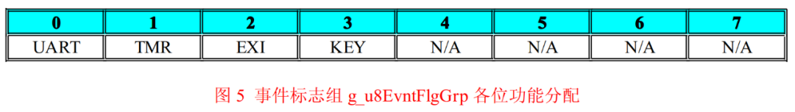
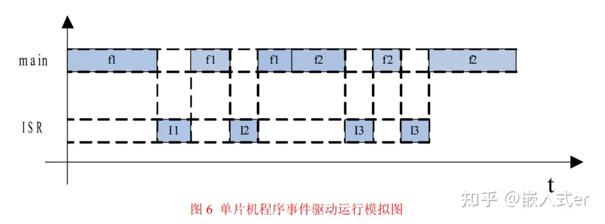
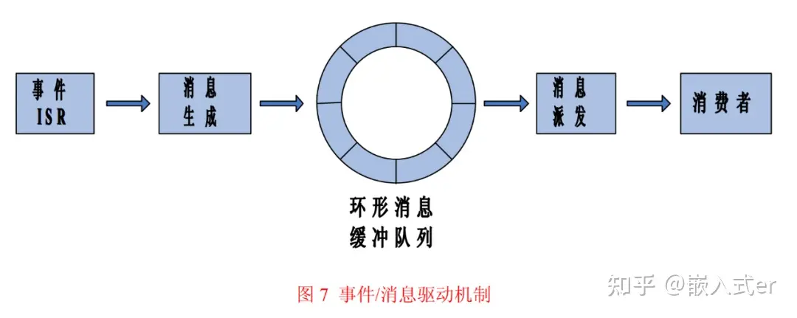
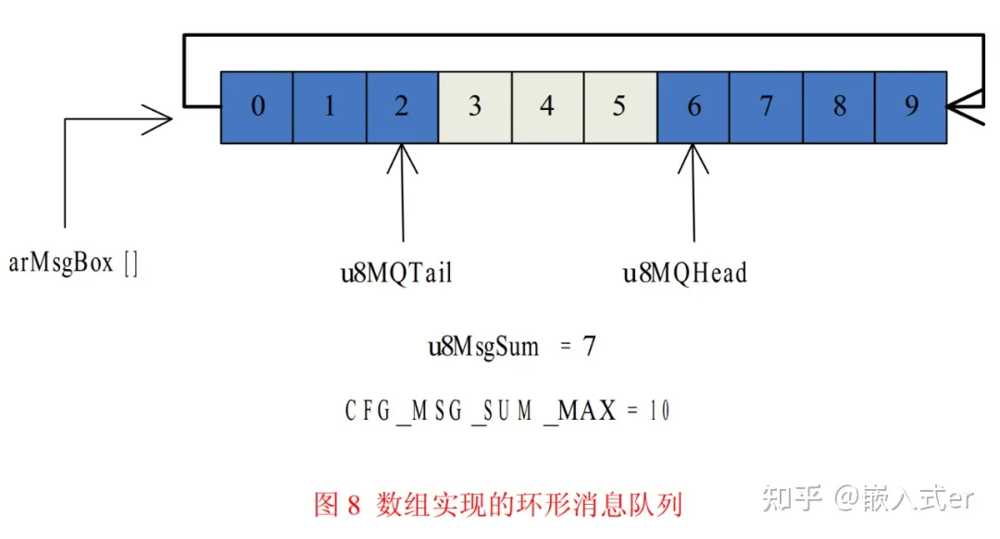
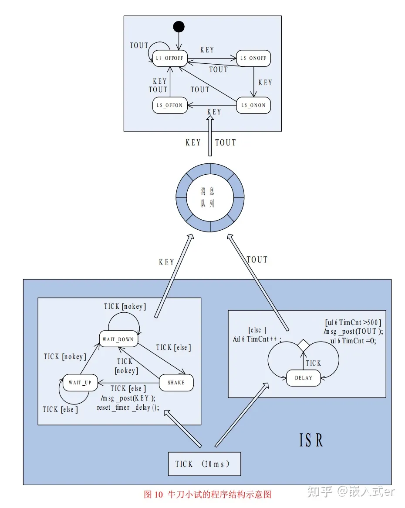
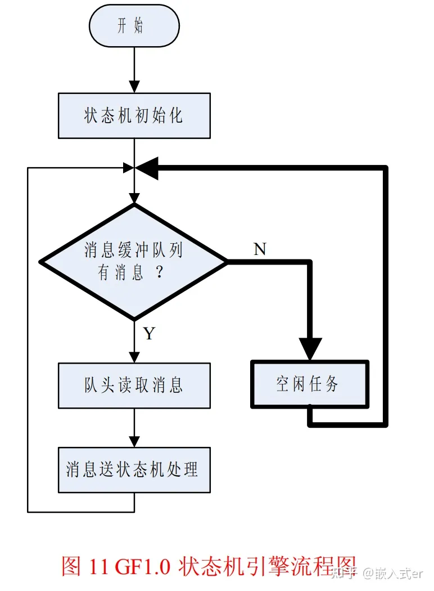
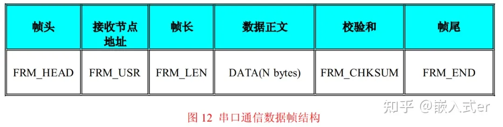
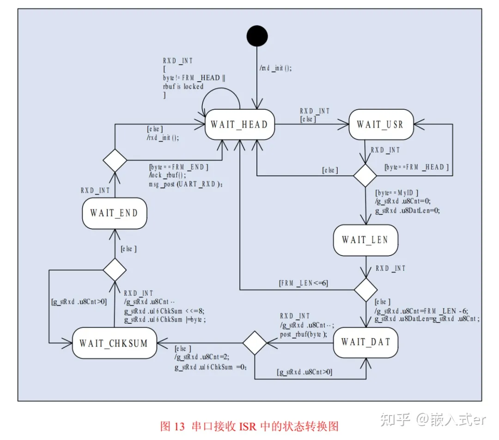
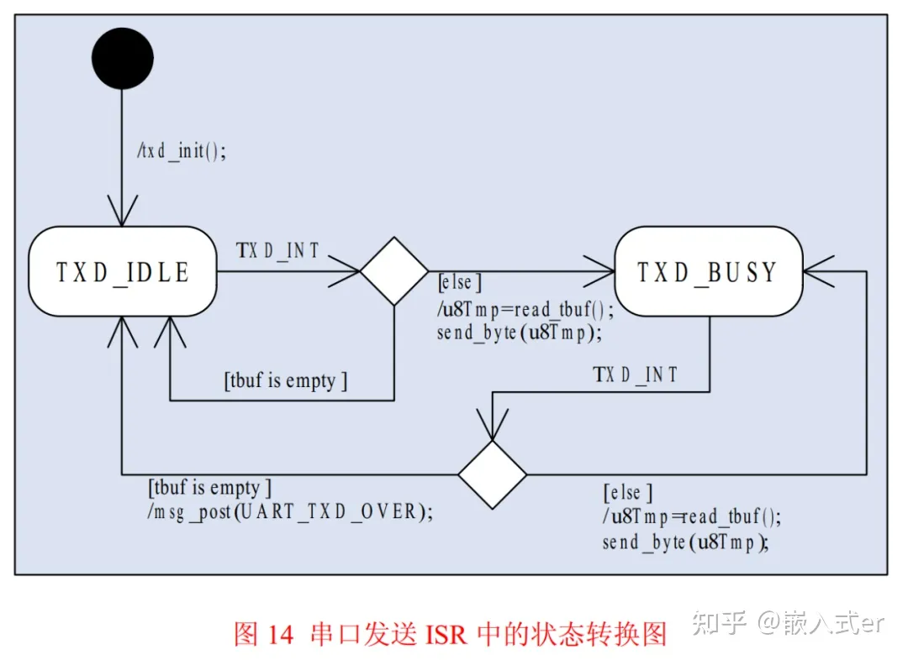
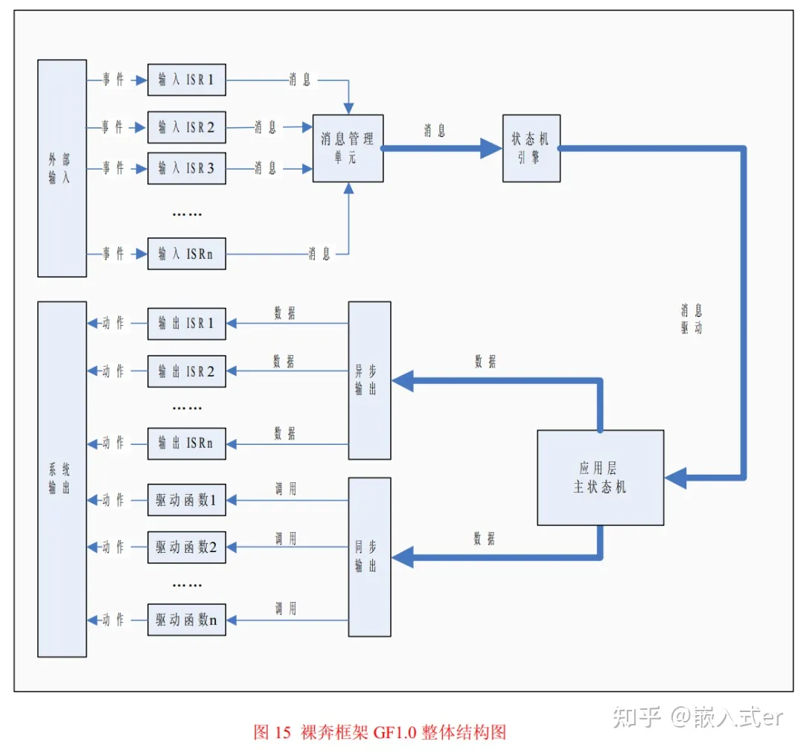

- # 嵌入式开发绝招：状态机+事件驱动框架~

- [最后一个bug](javascript:void(0);) *2023-07-10 21:17* *发表于广东*

- 

- **正文**

- **Are You OK**,雷军 - Are You OK

- 作者 | Alicedodo

- 状态机是一种思想，事件驱动也是一种思想。

- ## 事件驱动的概念

- 生活中有很多事件驱动的例子，上自习瞒着老师偷睡觉就是很生动的一个。

- 我们都是从高中时代走过来的，高中的学生苦啊，觉得睡觉是世界上最奢侈的东西， 有时候站着都能睡着啊！老师看的严，上课睡觉不允许 啊，要挨批啊！有木有！相比而言，晚自习是比较宽松的，老师只是不定时来巡视，还是有机会偷偷睡一会儿的。

- 现在的问题是，怎么睡才能既睡得好又不会让老师发现呢？ 晚自习是比较宽松的，老师只是不定时来巡视，还是有机会偷偷睡一会儿的。现在的问题是，怎么睡才能既睡得好又不会让老师发现呢？

- 我们现在有三种睡觉方案：

- - 方案 A：倒头就睡，管你三七二十一，睡够了再说，要知道有时候老师可能一整晚上都不来的。
  - 方案 B：间歇着睡，先定上闹钟， 5 分钟响一次，响了就醒，看看老师来没来，没来的话定上闹钟再睡，如此往复。
  - 方案 C：睡之前让同桌给放哨，然后自己睡觉，什么也不用管，什么时候老师来了，就让同桌戳醒你。

- 不管你们选择的是哪种方案，我高中那会儿用的可是方案 C，安全又舒服。

- 方案 C 是很有特点的：本来自习课偷睡觉是你自己的事儿， 有没有被老师抓着也是你自己的事儿，这些和同桌是毫无利害关系的，但是同桌这个环节对方案 C 的重要性是不言而喻的，他肩负着监控老师巡视和叫醒睡觉者两项重要任务，是事件驱动机制实现的重要组成部分 。

- 在事件驱动机制中，对象对于外部事件总是处于“休眠” 状态的，而把对外部事件的检测和监控交给了第三方组件。

- 一旦第三方检测到外部事件发生， 它就会启动某种机制， 将对象从“休眠” 状态中唤醒， 并将事件告知对象。对象接到通知后， 做出一系列动作， 完成对本次事件响应，然后再次进入“休眠” 状态，如此周而复始。

- 有没有发现，**事件驱动机制和单片机的中断原理上很相似 。**

- ## 事件驱动与单片机编程

- 在我们再回到单片机系统中来，看看事件驱动思想在单片机程序设计中的应用。当我还是一个单片机菜鸟的时候(当然，我至今也没有成为单片机高手)，网络上的大虾们就谆谆教导：一个好的单片机程序是要分层的。曾经很长一段时间， 我对分层这个概念完全没有感觉。

- - 什么是程序分层？
  - 程序为什么要分层？
  - 应该怎么给程序分层？

- 随着手里的代码量越来越多，实现的功能也越来越多，软件分层这个概念在我脑子里逐渐地清晰起来，我越来越佩服大虾们的高瞻远瞩。

- 单片机的软件确实要分层的，最起码要分两层：驱动层和应用层。应用是单片机系统的核心，与应用相关的代码担负着系统关键的逻辑和运算功能，是单片机程序的灵魂。

- 硬件是程序感知外界并与外界打交道的物质基础，硬件的种类是多种多样的，各类硬件的操作方式也各不相同，这些操作要求严格、精确、琐细、繁杂。

- 与硬件打交道的代码只钟情于时序和寄存器，我们可以称之为驱动相关代码；与应用相关的代码却只专注于逻辑和运算， 我们可称之为应用相关代码。

- 这种客观存在的情况是单片机软件分层最直接的依据，所以说，将软件划分为驱动层和应用层是程序功能分工的结果。那么驱动层和应用层之间是如何衔接的呢？

- 在单片机系统中，信息的流动是双向的，由内向外是应用层代码主动发起的，实现信息向外流动很简单， 应用层代码只需要调用驱动层代码提供的 API 接口函数即可， 而**由外向内**则是外界主动发起的， 这时候应用层代码对于外界输入需要被动的接收， 这里就涉及到一个**接收机制**的问题，事件驱动机制足可胜任这个接收机制。

- 外界输入可以理解为发生了事件，在单片机内部直接的表现就是硬件生成了新的数据，这些数据包含了事件的全部信息， 事件驱动机制的任务就是将这些数据初步处理(也可能不处理)，然后告知应用层代码， 应用代码接到通知后把这些数据取走， 做最终的处理， 这样一次事件的响应就完成了。

- 说到这里，可能很多人突然会发现，这种处理方法自己编程的时候早就用过了，只不过没有使用“事件驱动” 这个文绉绉的名词罢了。其实事件驱动机制本来就不神秘， 生活中数不胜数的例子足以说明它应用的普遍性。下面的这个小例子是事件驱动机制在单片机程序中最常见的实现方法，假设某单片机系统用到了以下资源：

- - 一个串口外设 Uart0，用来接收串口数据；
  - 一个定时器外设 Tmr0，用来提供周期性定时中断；
  - 一个外部中断管脚 Exi0，用来检测某种外部突发事件；
  - 一个 I/O 端口 Port0，连接独立式键盘，管理方式为定时扫描法，挂载到 Tmr0 的 ISR；

- 这样，系统中可以提取出 4 类事件，分别是 UART、 TMR、 EXI、 KEY ，其中 UART 和KEY 事件发生后必须开辟缓存存储事件相关的数据。所有事件的检测都在各自的 ISR 中完成，然后 ISR 再通过事件驱动机制通知主函数处理。

- 为了实现 ISR 和主函数通信， 我们定义一个数据类型为INT8U的全局变量 g_u8EvntFlgGrp，称为事件标志组，里面的每一个 bit 位代表一类事件，如果该 bit 值为 0，表示此类事件没有发生，如果该 bit 值为 1，则表示发生了此类事件，主函数必须及时地处理该事件。图 5 所示为g_u8EvntFlgGrp 各个 bit 位的作用 。

- 

- 程序清单 List9 所示就是按上面的规划写成的示例性代码 。

- **程序清单List9：**

- ```
  #define FLG_UART 0x01
  #define FLG_TMR 0x02
  #define FLG_EXI 0x04
  #define FLG_KEY 0x08
  volatile INT8U g_u8EvntFlgGrp = 0; /*事件标志组*/
  INT8U read_envt_flg_grp(void);
  /***************************************
  *FuncName : main
  *Description : 主函数
  *Arguments : void
  *Return : void
  *****************************************/
  void main(void)
  {
   INT8U u8FlgTmp = 0;
   sys_init();
   while(1)
   {
    u8FlgTmp = read_envt_flg_grp(); /*读取事件标志组*/
    if(u8FlgTmp ) /*是否有事件发生？ */
    {
     if(u8FlgTmp & FLG_UART)
     {
      action_uart(); /*处理串口事件*/
     }
     if(u8FlgTmp & FLG_TMR)
     {
      action_tmr(); /*处理定时中断事件*/
     }
     if(u8FlgTmp & FLG_EXI)
     {
      action_exi(); /*处理外部中断事件*/
     }
     if(u8FlgTmp & FLG_KEY)
     {
      action_key(); /*处理击键事件*/
     }
    }
    else
    {
     ;/*idle code*/
    }
   }
  }
  /*********************************************
  *FuncName : read_envt_flg_grp
  *Description : 读取事件标志组 g_u8EvntFlgGrp ，
  * 读取完毕后将其清零。
  *Arguments : void
  *Return : void
  *********************************************/
  INT8U read_envt_flg_grp(void)
  {
   INT8U u8FlgTmp = 0;
   gbl_int_disable();
   u8FlgTmp = g_u8EvntFlgGrp; /*读取标志组*/
   g_u8EvntFlgGrp = 0; /*清零标志组*/
   gbl_int_enable();
   return u8FlgTmp;
  }
  /*********************************************
  *FuncName : uart0_isr
  *Description : uart0 中断服务函数
  *Arguments : void
  *Return : void
  *********************************************/
  void uart0_isr(void)
  {
   ......
   push_uart_rcv_buf(new_rcvd_byte); /*新接收的字节存入缓冲区*/
   gbl_int_disable();
   g_u8EvntFlgGrp |= FLG_UART; /*设置 UART 事件标志*/
   gbl_int_enable();
   ......
  }
  /*********************************************
  *FuncName : tmr0_isr
  *Description : timer0 中断服务函数
  *Arguments : void
  *Return : void
  *********************************************/
  void tmr0_isr(void)
  {
   INT8U u8KeyCode = 0;
   ......
   gbl_int_disable();
   g_u8EvntFlgGrp |= FLG_TMR; /*设置 TMR 事件标志*/
   gbl_int_enable();
   ......
   u8KeyCode = read_key(); /*读键盘*/
   if(u8KeyCode) /*有击键操作？ */
   {
    push_key_buf(u8KeyCode); /*新键值存入缓冲区*/
    gbl_int_disable();
    g_u8EvntFlgGrp |= FLG_KEY; /*设置 TMR 事件标志*/
    gbl_int_enable();
   }
   ......
  }
  /*********************************************
  *FuncName : exit0_isr
  *Description : exit0 中断服务函数
  *Arguments : void
  *Return : void
  *********************************************/
  void exit0_isr(void)
  {
   ......
   gbl_int_disable();
   g_u8EvntFlgGrp |= FLG_EXI; /*设置 EXI 事件标志*/
   gbl_int_enable();
   ......
  }
  ```

- 看一下程序清单 List9 这样的程序结构，是不是和自己写过的某些程序相似？对于事件驱动机制的这种实现方式， 我们还可以做得更绝一些， 形成一个标准的代码模板，做一个包含位段和函数指针数组的结构体，位段里的每一个元素作为图 5 那样的事件标志位，然后在函数指针数组中放置各个事件处理函数的函数地址， 每个处理函数对应位段里的每个标志位。

- 这样， main()函数中的事件处理代码就可以做成标准的框架代码。应该说，这样的实现方式是很好的，足以轻松地应对实际应用中绝大多数的情况。但是，事件驱动机制用这样的方式实现真的是完美的么？在我看来，这种实现方式至少存在两个问题：

- - 不同事件集中爆发时，无法记录事件发生的前后顺序。
  - 同一事件集中爆发时，容易遗漏后面发生的那次事件。

- 图 6 所示为某一时段单片机程序的执行情况，某些特殊情况下，会出现上面提到的两个问题。

- 

- 图中， f1 为某事件的处理函数， f2 为另一事件的处理函数， I1、 I2、 I3 为 3 个不同事件触发的 ISR，假定 I1、 I2、 I3 分别对应事件 E1、 E2、 E3。从图中可以看出，主函数在调用事件处理函数 f1 的时候，发生了 2 次事件，主函数被 I1和 I2 中断了 2 次， I1 和 I2 执行的时候各自置位了相应的事件标志位。

- 函数 f1 返回后， 主函数又调用了另一个事件处理函数 f2， f2 执行期间先后发生了 2 次同样的事件， f2 被 I3 中断了 2次，对应的事件标志位被连续置位了 2 次。

- 在图 6 中我们当然可以看出 I1 先于 I2 执行，即事件 E1 发生在事件 E2 之前，但是主函数再次读取事件标志组 g_u8EvntFlgGrp 的时候， 看到的是两个“同时” 被置位的标志位， 无法判断出事件 E1 和 E2 发生的先后顺序， 也就是说有关事件发生先后顺序的信息丢失了， 这就是前面说的第 1 个问题：不同事件集中爆发时，无法记录事件发生的前后顺序。

- 在程序清单 List9 中， 主函数在处理事件时， 按照程序预先设定好的顺序， 一个一个地处理发生的事件， 如果不同事件某时段集中爆发， 可能会出现事件的发生顺序和事件的处理顺序不一致的情况。倘若系统功能对事件的发生顺序敏感，那么程序清单 List9 中的程序就不能满足要求了。

- 同样的道理，如果 I3 对应的事件 E3 是程序清单 List9 中 EXI 那样的事件(这种事件没有缓冲机制)， 事件 E3 第 2 次的发生就被遗漏了， 这就是前面所说的第 2 个问题：同一事件集中爆发时，容易遗漏后后面发生的事件。

- 如果系统功能对事件 E3 的发生次数敏感，程序清单 List9 中的程序也是不能满足要求的。既然事件驱动机制这样的实现方式存在缺陷， 那么有没有一种更好的实现方式呢？当然有！把事件转换成消息存入消息队列就能完美解决这个问题， 只不过大家不要对我这种自导自演的行文方式产生反感就好  。

- ## 事件驱动与消息

- 什么是消息？消息是数据信息的一种存储形式。从程序的角度看，消息就是一段存储着特定数据的内存块， 数据的存储格式是设计者预先约定好的， 只要按照约定的格式读取这段内存， 就能获得消息所承载的有用信息。

- 消息是有时效性的。任何一个消息实体都是有生命周期的，它从诞生到消亡先后经历了生成、 存储、 派发、 消费共 4 个阶段：消息实体由生产者生成， 由管理者负责存储和派发， 最后由消费者消费。

- 被消费者消费之后， 这个消息就算消亡了， 虽然存储消息实体的内存中可能还残留着原来的数据， 但是这些数据对于系统来讲已经没有任何意义了， 这也就是消息的时效性。说到这里，大家有没有发现，这里的“消息” 和前面一直在说的“事件” 是不是很相似？把“消息” 的这些特点套用在“事件” 身上是非常合适的， 在我看来， 消息无非是事件的一个马甲而已。

- 我们在设计单片机程序的时候，都怀着一个梦想，即让程序对事件的响应尽可能的快，理想的情况下，程序对事件要立即响应，不能有任何延迟。这当然是不可能的，当事件发生时，程序总会因为这样那样的原因不能立即响应事件。

- 为了不至于丢失事件，我们可以先在事件相关的 ISR 中把事件加工成消息并把它存储在消息缓冲区里， ISR 做完这些后立即退出。主程序忙完了别的事情之后，去查看消息缓冲区，把刚才 ISR 存储的消息读出来， 分析出事件的有关信息， 再转去执行相应的响应代码， 最终完成对本次事件的响应。

- 只要整个过程的时间延迟在系统功能容许的范围之内， 这样处理就没有问题。将事件转化为消息，体现了以空间换时间的思想。再插一句，虽然事件发生后对应的 ISR 立即被触发，但是这不是严格意义上的“响应”， 顶多算是对事件的“记录”， “记录” 和“响应” 是不一样的。事件是一种客观的存在，而消息则是对这种客观存在的记录。

- 对于系统输入而言，事件是其在时间维度上的描述；消息是其在空间维度上的描述，所以，在描述系统输入这一功能上，事件和消息是等价的。对比一下程序清单 List9 中的实现方式， 那里是用全局标志位的方式记录事件， 对于某些特殊的事件还配备了专门的缓冲区， 用来存储事件的额外信息， 而这些额外信息单靠全局标志位是无法记录的。

- 现在我们用消息+消息缓冲区的方式来记录事件，消息缓冲区就成了所有事件共用的缓冲区，无论发生的事件有没有额外的信息，一律以消息的形式存入缓冲区  。

- 为了记录事件发生的先后顺序，消息缓冲区应该做成以“先入先出” 的方式管理的环形缓冲队列。事件生成的消息总是从队尾入队，管理程序读取消息的时候总是从队头读取，这样，消息在缓冲区中存储的顺序就是事件在时间上发生的顺序，先发生的事件总是能先得到响应。

- 一条消息被读取之后， 管理程序回收存储这个消息的内存， 将其作为空闲节点再插入缓冲队列的队尾，用以存储将来新生成的消息。图 7 所示为使用了消息功能的事件驱动机制示意图。不知道有没有人对图中的“消费者”有疑问， 这个“消费者” 在程序中指的是什么呢？

- 既然这个事件/消息驱动机制是为系统应用服务的， 消费者当然就是指应用层的代码了， 更明确一点儿的话， 消费者就是应用代码中的状态机  。

- 

- 用消息的方法来实现事件驱动机制完全解决了前面提到的那两个问题，即不同事件集中爆发时，无法记录事件发生的前后顺序。同一事件集中爆发时，容易遗漏后面发生的那次事件。对于第一种情况，消息(事件)在缓冲队列中是以“先入先出” 的方式存储的，存储顺序就代表了事件发生的先后顺序。

- 对于第二种情况， 任何被 ISR 捕捉到的事件都会以一个独立的消息实体存入缓冲队列， 即使前后两个是同一个事件， 只要 ISR 反应够快就不会遗漏事件。实际上， ISR 的主要工作就是填写消息实体， 然后将其存入缓冲队列， 做这些工作只占用 CPU 很短的时间。

- 接下来再说一说这个消息机制在程序中如何实现。在程序中，消息机制可以看做是一个独立的功能模块，一个功能模块的实现无非就是**数据结构+算法**。先来看消息机制的数据结构。这里的数据结构是指和消息机制有关的数据组织形式，包含 2 个部分：

- - 消息节点自身的数据组织形式
  - 消息缓冲区的数据组织形式

- 程序清单 List10 所示就是消息机制的数据结构 。

- **「程序清单List10：」**

- ```
  typedef union msg_arg /*消息参数共用体*/
  {
   INT8U u8Arg; /*成员：8 位无符号*/
   INT8U s8Arg; /*成员：8 位有符号*/
   #if CFG_MSG_ARG_INT16_EN>0
   INT16U u16Arg; /*可选成员：16 位无符号*/
   INT16S s16Arg; /*可选成员：16 位有符号*/
   #endif
   #if CFG_MSG_ARG_INT32_EN>0
   INT32U u32Arg; /*可选成员：32 位无符号*/
   INT32S s32Arg; /*可选成员：32 位有符号*/
   #endif
   #if CFG_MSG_ARG_FP32_EN>0
   FP32 f32Arg; /*可选成员：32 位单精度浮点*/
   #endif
   #if CFG_MSG_ARG_PTR_EN>0
   void* pArg; /*可选成员：void 指针*/
   #endif
  }MSG_ARG;
  
  typedef struct _msg /*消息结构体*/
  {
   INT8U u8MsgID; /*消息 ID*/
   #if CFG_MSG_USR_SUM > 1
   INT8U u8UsrID; /*消费者 ID*/
   #endif
   MSG_ARG uMsgArg; /*应用消息参数*/
  } MSG;
  
  typedef struct msg_box /*消息缓冲区结构体*/
  {
   INT8U u8MBLock; /*队列上锁标识*/
   INT8U u8MsgSum; /*队列长度*/
   INT8U u8MQHead; /*队列头结点位置*/
   INT8U u8MQTail; /*队列尾节点位置*/
   MSG arMsgBox[CFG_MSG_SUM_MAX]; /*存放队列的数组*/
  } MB;
  static MB g_stMsgUnit; /*消息管理单元全局变量*/
  ```

- 消息的数据结构包含 2 部分：消息头和消息参数，在消息结构体 MSG 中， u8MsgID 和u8UsrID 就是消息头，共用体 MSG_ARG 就是消息参数。

- u8MsgID 是消息的类型标志，也就是生成此消息的事件的事件类型标志，程序根据这个成员选择对应的事件处理函数；u8UsrID 是消息的消费者代号， 如果应用代码中只有一个消费者，则成员 u8UsrID 可以忽略。MSG_ARG 就是消息附带的参数，也就是事件的内容信息。

- 系统中的事件是多种多样的，有的事件只需要类型标志即可， 有的事件可能还需要整型变量存储事件内容， 还有的事件可能需要大块的内存来存储一些附带的数据。为了将各种类型的事件生成的消息纳入统一管理， 要求 MSG_ARG 必须能存储各种类型的数据，因此 MSG_ARG 被定义成了共用体。

- 从程序清单 List10 中可以看出， MSG_ARG 既可以存储 8 位~32 位有符号无符号整型数据，又可以存储单精度浮点， 还可以存储 void* 型的指针变量， 而 void*的指针又可以强制转换成任意类型的指针，所以 MSG_ARG 可以存储指向任意类型的指针。

- 对于MSG_ARG中的某些成员， 还配备了预编译常量 CFG_MSG_ARG_XXX_EN加以控制，如果实际应用中不需要这些耗费内存较大的数据类型， 可以设置CFG_MSG_ARG_XXX_EN 去掉它们。全开的情况下， 每个消息节点占用 6 个字节的内存， 最精简的情况下， 每个消息节点只占用 2 个字节。

- 全局结构体变量 g_stMsgUnit 是消息缓冲区的数据结构。消息缓冲区是一个环形缓冲队列，这里将环形队列放在了一个一维数组中，也就是g_stMsgUnit 的成员 arMsgBox[]，数组元素的数据类型就是消息结构体 MSG ，数组的大小由预编译常量 CFG_MSG_SUM_MAX 控制，该常量是环形缓冲队列的最大容量。

- 理论上， CFG_MSG_SUM_MAX 值的选取越大越好，但考虑到单片机的 RAM 资源有CFG_MSG_SUM_MAX 值的选取要在资源消耗和实际最大需求之间折中， 只要能保证在最坏情况下环形缓冲队列仍有裕量即可。用数组实现环形队列还需要一些辅助变量，也就是 g_stMsgUnit 剩余的成员。

- u8MBLock 是队列的控制变量， u8MBLock>0 表示队列处于锁定/保护状态，不能写也不能读， u8MBLock=0 表示队列处于正常状态，可写可读；u8MsgSum 是队列长度计数器，记录着当前队列中存有多少条消息，存入一条消息u8MsgSum++，读出一条消息 u8MsgSum--；

- u8MQHead 记录着当前队头消息节点在数组 arMsgBox[]中的位置，其值就是数组元素的下标，消息读取的时候所读出的就是 u8MQHead 所指向的节点，读完之后 u8MQHead 向队尾方向移动一个位置，指向新的队头节点；u8MQTail 记录着当前队尾消息节点在数组 arMsgBox[]中的位置，其值是数组元素的下标，新消息写入之前， u8MQTail 向队尾方向后移一个位置， 然后新写入的消息存入 u8MQTail 所指向的空闲节点；

- 图 8 所示为消息缓冲区结构体变量 g_stMsgUnit 的示意图 。

- 

- 有了数据结构，还要有对应的算法实现，消息机制的数据主体就是一个数组化了的环形队列，环形队列的算法就是我们所要的算法。消息机制是一个独立的功能模块，应该对外屏蔽其内部实现细节，而仅对外界开放一定数量的接口函数，外界通过调用这些接口来使用消息功能，这也就是我在声明 g_stMsgUnit 变量的时候使用了 static 关键词的原因。

- 消息模块的接口函数一共有 9 个：

- - void mq_init(void) 消息队列初始化，负责初始化 g_stMsgUnit 。
  - void mq_clear(void) 清空消息队列，效果同 mq_init()，可有可无。
  - void mq_lock(void) 消息队列锁定，锁定的消息队列不可读不可写。
  - void mq_unlock(void) 消息队列解锁，解锁后消息队列恢复正常功能。
  - BOOL mq_is_empty(void) 消息队列判空，返回 TRUE 表示消息队列当前为空，返回 FALSE 表示有消息存储。
  - INT8U mq_get_msg_cur_sum(void) 查询消息队列中当前存储的消息总数，函数返回值为查询结果
  - INT8U mq_get_msg_sum_max(void) 查询消息队列的最大容量，函数返回值为查询结果。
  - INT8U mq_msg_post_fifo(MSG* pMsg) 向消息队列中寄送消息，方式为先入先出，形参 pMsg 指向消息的备份内存，函数返回操作结果。该函数多被 ISR 调用，所以必须为可重入函数。
  - INT8U mq_msg_req_fifo(MSG* pMsg) 从消息队列中读取消息， 方式为先入先出， 函数将读出的消息存入形参 pMsg 指向的内存，函数返回操作结果。该函数被主程序调用， 可以不是可重入函数， 但要对共享数据进行临界保护  。

- 事件/消息驱动机制是一个标准的通用的框架，配合 ISR，对任何系统输入都能应对自如。事件/消息驱动机制屏蔽了应用层程序获取各种系统输入的工作细节，将系统输入抽象整合， 以一种标准统一的格式提交应用代码处理， 极大地减轻了应用层代码获取系统输入的负担， 应用层只需要专注于高级功能的实现就可以了。

- 从软件分层的角度来看， 事件/消息驱动机制相当于驱动层和应用层之间的中间层， 这样的层次结构如图 9 。

- 

- 图9 中之所以驱动层和应用层之间还有接触，是因为系统输出响应的时候，应用层可能还需要直接调用驱动层提供的函数接口。如果一个单片机的软件是图 9 这样的结构，并且应用层的程序使用状态机来实现，在消息的驱动下使应用层的状态机运转起来， 那么这个软件的设计思想就是整篇文章的主题：**基于事件/消息驱动+状态机结构的裸奔通用框架** 。

- ## 程序框架：状态机+事件/消息驱动

- 事件/消息驱动和状态机是天生的搭档，这对黄金组合是分析问题解决问题的利器  。

- ### 1、牛刀小试

- 规则描述：

- 1. L1L2 状态转换顺序 OFF/OFF--->ON/OFF--->ON/ON--->OFF/ON--->OFF/OFF
  2. 通过按键控制 L1L2 的状态,每次状态转换只需按键 1 次
  3. 从上一次按键的时刻开始计时，如果 10 秒钟之内没有按键事件，则不管当前 L1L2 状态如何，一律恢复至初始状态。
  4. L1L2 的初始状态 OFF/OFF

- 现在我们用状态机+事件/消息驱动的思想来分析问题。系统中可提取出两个事件：按键事件和超时事件，分别用事件标志 KEY 和 TOUT 代替。L1L2 的状态及转换关系可做成一个状态机，称为主状态机，共 4 个状态：LS_OFFOFF、LS_ONOFF、 LS_ONON、 LS_OFFON 。主状态机会在事件 KEY 或 TOUT 的驱动下发生状态迁移，各个状态之间的转换关系比较简单，在此略过。

- 事件/消息驱动机制的任务就是检测监控事件 KEY 和 TOUT，并提交给主状态机处理。检测按键需要加入消抖处理，消抖时间定为 20ms， 10S 超时检测需要一个定时器进行计时。

- 这里将按键检测程序部分也做成一个状态机，共有 3 个状态：

- - WAIT_DOWN ：空闲状态，等待按键按下
  - SHAKE ：初次检测到按键按下，延时消抖
  - WAIT_UP ：消抖结束，确认按键已按下，等待按键弹起

- 按键状态机的转换关系可在图 10 中找到。按键检测和超时检测共用一个定时周期为 20ms 的定时中断，这样就可以把按键检测和超时检测的代码全部放在这个定时中断的 ISR 中。我把这个中断事件用 TICK 标记， 按键状态机在 TICK 的驱动下运行， 按键按下且消抖完毕后触发 KEY 事件， 而超时检测则对 TICK 进行软时钟计数，记满 500 个 TICK 则超时 10S，触发 TOUT 事件。

- 有了上面的分析，实现这个功能的程序的结构就十分清晰了， 图 10 是这个程序的结构示意图，这张图表述问题足够清晰了，具体的代码就不写了。仔细瞅瞅，是不是有点儿那个意思了？

- 

- 如果忽略定时中断 ISR 中的细节，图 10 中的整个程序结构就是**事件/消息驱动+主状态机**的结构， **ISR 是消息的生产者，与消息缓冲、派发相关的程序部分是管理者**，而**主状态机则是消息的消费者**，应用层代码中只有这一个状态机，是消息的唯一消费者。

- 这个结构就是通用框架 GF1.0 的标准结构：**多个 ISR + 一个消息缓冲区 + 一个应用层主状态机**。ISR 生成的消息(事件)全部提交主状态机处理， 在消息的驱动下主状态机不断地迁移。

- 如果把应用层主状态机看做是一台发动机， 那么 ISR 生成的消息则是燃料， 事件不断的发生， 消息不断的生成，有了燃料(消息)的供给，发动机(主状态机)就能永不停息地运转。

- 接下来关注一下图 10 中的 ISR， 这个 ISR 里面的内容是很丰富的， 里面还套着 2 个小状态机：按键状态机和计时状态机。按键状态机自不必说， 这个计时部分也可以看做是一个状态机，不过这个状态机比较特殊，只有一个状态 DELAY。

- 既然是状态机， 想要跑起来就需要有事件来驱动， 在这个 ISR 里， 定时器的中断事件 TICK就是按键状态机和计时状态机的驱动，只不过这两个事件驱动+状态机结构没有消息缓冲，当然也不需要消息缓冲，因为状态机在 ISR 中，对事件是立即响应的。

- 从宏观上看，图 10 中是事件/消息驱动+状态机，从微观上看，图 10 中的 ISR 也是事件驱动+状态机。ISR 中的状态机在迁移过程中生成消息(事件)，而这些消息(事件)对于主状态机来讲又是它自己的驱动事件。事件的级别越高， 事件自身也就越抽象， 描述的内容也就越接近人的思维方式。我觉得这种你中有我我中有你的特点正是事件驱动+状态机的精髓所在  。

- ### 2、通用框架GF1.0

- 前面说过， 状态机总是被动地接受事件， 而 ISR 也只是负责将消息(事件)送入消息缓冲区，这些消息仅仅是数据，自己肯定不会主动地跑去找状态机。那么存储在缓冲区中的消息(事件)是怎么被发送到目标状态机呢？

- 把消息从缓冲区中取出并送到对应的状态机处理，这是状态机调度程序的任务，我把这部分程序称作**状态机引擎**(State Machine Engine ， 简写作 SME)。图 11 是 SME 的大致流程图。

- 从图 11 可以看出， SME 的主要工作就是不断地查询消息缓冲队列，如果队列中有消息，则将消息按先入先出的方式取出， 然后送入状态机处理。SME 每次只处理一条消息， 反复循环，直到消息队列中的消息全部处理完毕。

- 当消息队列中没有消息时， CPU 处于空闲状态， SME 转去执行“空闲任务”。空闲任务指的是一些对单片机系统关键功能的实现无关紧要的工作，比如喂看门狗、算一算 CPU 使用率之类的工作，如果想降低功耗，甚至可以让 CPU 在空闲任务中进入休眠状态，只要事件一发生， CPU 就会被 ISR 唤醒，转去执行消息处理代码。

- 实际上， 程序运行的时候 CPU 大部分时间是很“闲” 的， 所以消息队列查询和空闲任务这两部分代码是程序中执行得最频繁的部分，也就是图 11 的流程图中用粗体框和粗体线标出的部分。

- 

- 如果应用层的主状态机用压缩表格驱动法实现，结合上面给出的消息模块， 则GF1.0 的状态机引擎代码如程序清单 List11 所示。

- **「程序清单List11：」**

- ```
  void sme_kernel(void);
  /***************************************
  *FuncName : main
  *Description : 主函数
  *Arguments : void
  *Return : void
  *****************************************/
  void main(void)
  {
   sys_init();
   sme_kernel(); /*GF1.0 状态机引擎*/
  }
  /***************************************
  *FuncName : sme_kernel
  *Description : 裸奔框架 GF1.0 的状态机引擎函数
  *Arguments : void
  *Return : void
  *****************************************/
  void sme_kernel(void)
  {
   extern struct fsm_node g_arFsmDrvTbl[]; /*状态机压缩驱动表格*/
   INT8U u8Err = 0; /**/
   INT8U u8CurStat = 0; /*状态暂存*/
   MSG stMsgTmp; /*消息暂存*/
   struct fsm_node stNodeTmp = {NULL, 0}; /*状态机节点暂存*/
   memset((void*)(&stMsgTmp), 0, sizeof(MSG)); /*变量初始化*/
   gbl_int_disable(); /*关全局中断*/
   mq_lock(); /*消息队列锁定*/
   mq_init(); /*消息队列初始化*/
   mq_unlock(); /*消息队列解锁*/
   fsm_init(); /*状态机初始化*/
   gbl_int_enable(); /*开全局中断*/
   
   while(1)
   {
    if(mq_is_empty() == FALSE)
    {
     u8Err = mq_msg_req_fifo(&stMsgTmp); /*读取消息*/
     if(u8Err == MREQ_NOERR)
     {
      u8CurStat = get_cur_state(); /*读取当前状态*/
      stNodeTmp = g_arFsmDrvTbl[u8CurStat]; /*定位状态机节点*/
      if(stNodeTmp.u8StatChk == u8CurStat)
      {
       u8CurStat = stNodeTmp.fpAction(&stMsgTmp); /*消息处理*/
       set_cur_state(u8CurStat ); /*状态迁移*/
      }
      else
      {
       state_crash(u8CurStat ); /*非法状态处理*/
      }
     }
    }
    else
    {
     idle_task(); /*空闲任务*/
    }
   }
  }
  ```

- ### 3、状态机与ISR在驱动程序中的应用

- 在驱动层的程序中使用状态机和 ISR 能使程序的效率大幅提升。这种优势在通信接口中最为明显，以串口程序为例。

- 单片机和外界使用串口通信时大多以数据帧的形式进行数据交换，一帧完整的数据往往包含帧头、接收节点地址、帧长、数据正文、校验和帧尾等内容，图 12 所示为这种数据帧的常见结构。

- 

- 图12 表明的结构只是数据帧的一般通用结构， 使用时可根据实际情况适当简化， 例如如果是点对点通信， 那么接收节点地址 FRM_USR 可省略；如果通信线路没有干扰， 可确保数据正确传输，那么校验和 FRM_CHKSUM 也可省略。

- 假定一帧数据最长不超过 256 个字节且串口网络中通信节点数量少于 256 个，那么帧头、接收节点地址、帧长、帧尾都可以用 1 个字节的长度来表示。虽然数据的校验方式可能不同，但校验和使用 1~4 个字节的长度来表示足以满足要求。

- 先说串口接收， 在裸奔框架 GF1.0 的结构里， 串口接收可以有 2 种实现方式：ISR+消息 orISR+缓冲区+消息。ISR+消息比较简单， ISR 收到一个字节数据，就把该字节以消息的形式发给应用层程序，由应用层的代码进行后续处理。这种处理方式使得串口接收 ISR 结构很简单，负担也很轻， 但是存在 2 个问题。

- 数据的接收控制是一个很底层的功能， 按照软件分层结构， 应用代码不应该负责这些工作，混淆职责会使得软件的结构变差；用消息方式传递单个的字节效率太低， 占用了太多的消息缓冲资源，如果串口波特率很高并且消息缓冲区开的不够大，会直接导致消息缓冲区溢出。

- 相比之下， ISR+缓冲区+消息的处理方式就好多了， ISR 收到一个字节数据之后， 将数据先放入接收缓冲区，等一帧数据全部接收完毕后(假设缓冲区足够大)，再以消息的形式发给应用层，应用层就可以去缓冲区读取数据。

- 对于应用层来讲，整帧数据只有数据正文才是它想要的内容，数据帧的其余部分仅仅是数据正文的封皮， 没有意义。从功能划分的角度来看， 确保数据正确接收是 ISR 的职责， 所以这部分事情应该放在 ISR 中做，给串口接收 ISR 配一个状态机，就能很容易的解决问题。图 13为串口接收 ISR 状态转换图。

- 

- 图13 中的数据帧使用 16 位校验和，发送顺序高字节在前，低字节在后。接收缓冲区属于 ISR 和主程序的共享资源，必须实现互斥访问，所以 ISR 收完一帧数据之后对缓冲区上锁， 后面再发生的 ISR 发现缓冲区上锁之后， 不接收新的数据， 也不修改缓冲区中的数据。

- 应用层程序收到消息， 读取缓冲区中的数据之后再对缓冲区解锁， 使能 ISR 接收串口数据和对缓冲区的写入。数据接收完毕后，应该校验数据，只有校验结果和收到的校验和相符，才能确信数据正确接收。

- 数据校验比较耗时，不适合在 ISR 中进行，所以应该放在应用代码中处理。这样实现的串口接收 ISR 比较复杂，代码规模比较大，看似和 ISR 代码尽量简短，执行尽量迅速的原则相悖， 但是由于 ISR 里面是一个状态机， 每次中断的时候 ISR 仅执行全部代码的一小部分，之后立刻退出，所以执行时间是很短的，不会比“ISR+消息” 的方式慢多少。

- 串口发送比串口接收要简单的多，为提高效率也是用 ISR+缓冲区+消息的方式来实现。程序发送数据时调用串口模块提供的接口函数， 接口函数通过形参获取要发送的数据， 将数据打包后送入发送缓冲区， 然后启动发送过程， 剩下的工作就在硬件和串口发送 ISR 的配合下自动完成，数据全部发送完毕后， ISR 向应用层发送消息，如果有需要，应用层可以由此获知数据发送完毕的时刻。图 14 为串口发送 ISR 的状态转换图。

- 

- 上面只是讨论了串口设备的管理方法， 其实这种状态机+ISR 的处理方式可以应用到很多的硬件设备中，一些适用的场合：

- 1. 标准的或自制的单总线协议 (状态机+定时中断+消息)
  2. 用 I/O 模拟 I2C 时序并且通信速率要求不高 (状态机+定时中断+消息)
  3. 数码管动态扫描 (状态机+定时中断)
  4. 键盘动态扫描 (状态机+定时中断  ）

- ## 小结

- 裸奔框架 GF1.0 处处体现着事件驱动+状态机的思想， 大到程序整体的组织结构， 小到某个ISR 的具体实现，都有这对黄金组合的身影。从宏观上看， 裸奔框架 GF1.0 是一个 ISR+消息管理+主状态机的结构， 如图 15 所示。

- 不管主状态机使用的是 FSM(有限状态机)还是 HSM(层次状态机)， GF1.0 中有且只有 1 个主状态机。主状态机位于软件的应用层， 是整个系统绝对的核心， 承担着逻辑和运算功能， 外界和单片机系统的交互其实就是外界和主状态机之间的交互， 单片机程序的其他部分都是给主状态机打杂 的。

- 从微观上看， 裸奔框架 GF1.0 中的每一个 ISR 也是事件驱动+状态机的结构。ISR 的主要任务是减轻主状态机获取外界输入的负担， ISR 负责处理获取输入时硬件上繁杂琐细的操作，将各种输入抽象化，以一种标准统一的数据格式(消息)提交给主状态机，好让主状态机能专注于高级功能的实现而不必关注具体的细节。

- 

- 裸奔框架 GF1.0 应用的难点在于主状态机的具体实现，对于一个实际的应用，不管功能多复杂， 都必须将这些功能整合到一个主状态机中来实现。这既要求设计者对系统的目标功能有足够详细的了解， 还要求设计者对状态机理论有足够深的掌握程度， 如果设计出的状态机不合理，程序的其他部分设计得再好，也不能很好的实现系统的要求。

- 将实际问题状态机化，最重要的是要合理地划分状态，其次是要正确地提取系统事件，既不能遗漏， 也不能重复。有了状态和事件， 状态转换图的骨架就形成了， 接下来就是根据事件确定状态之间的转换关系，自顶向下，逐步细化，最终实现整个功能。

- ```
  声明：素材来源于网络，作者 Alicedodo，版权归原作者所有。如涉及作品版权问题，请与我联系删除。最后
        好了，今天就跟大家分享这么多了，技术贵在积累和发现，如果你觉得有所收获，点赞、分享、收藏。最后一个bug，bug菌唯一创作平台
  推荐专辑  点击蓝色字体即可跳转
  ☞  MCU进阶专辑 ☞  嵌入式C语言进阶专辑 ☞  “bug说”专辑 ☞ 专辑|Linux应用程序编程大全☞ 专辑|学点网络知识☞ 专辑|手撕C语言☞ 专辑|手撕C++语言☞ 专辑|经验分享☞ 专辑|电能控制技术☞ 专辑 | 从单片机到Linux
  ```