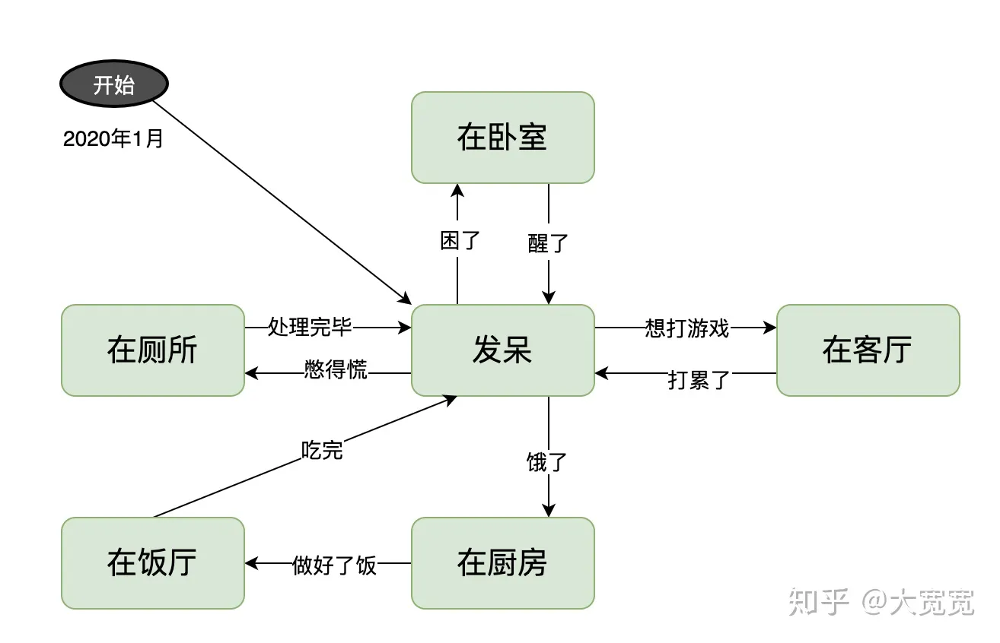
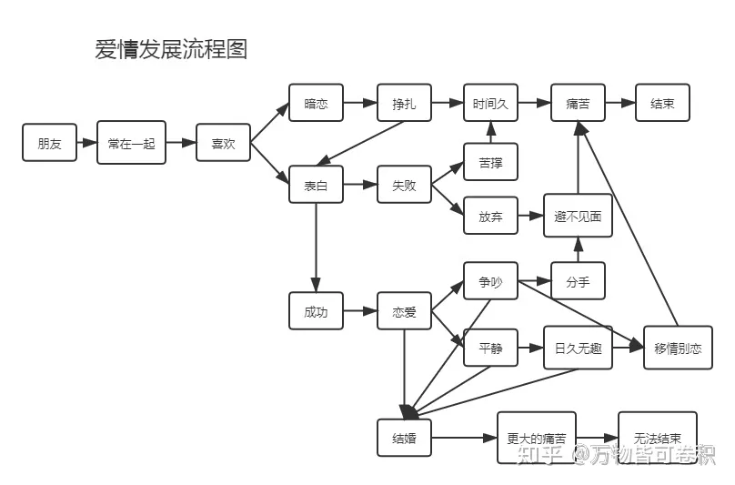
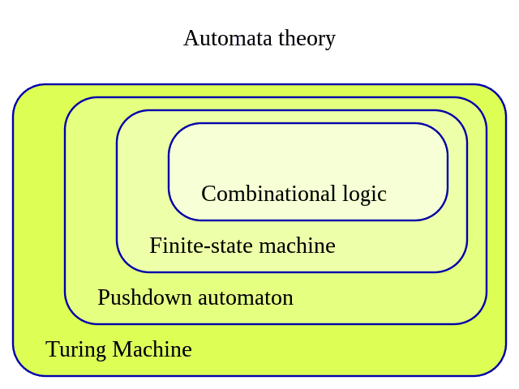
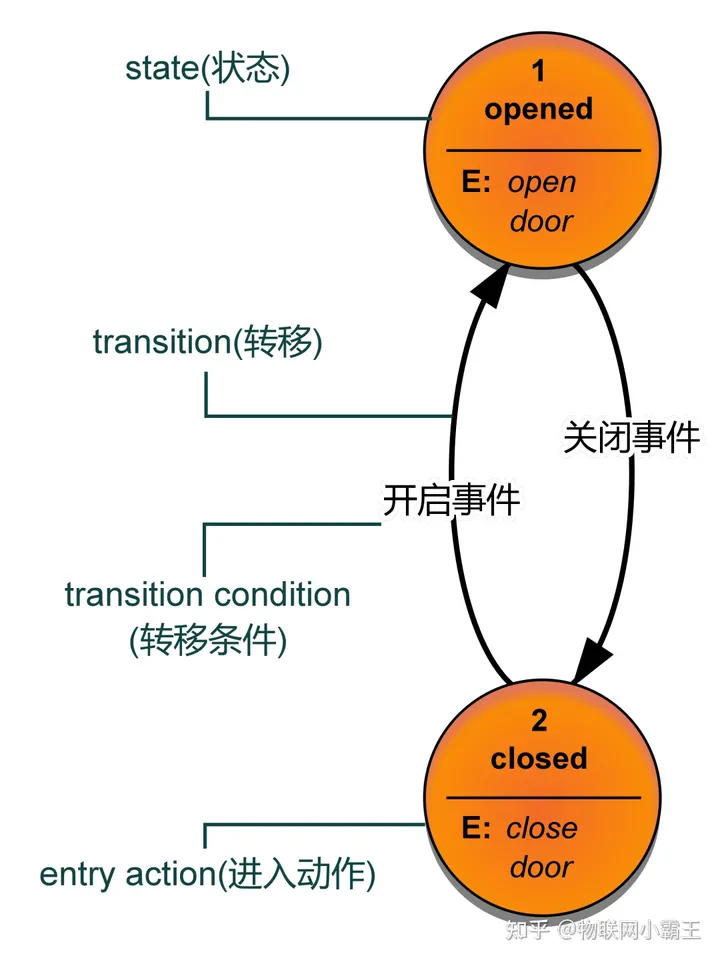
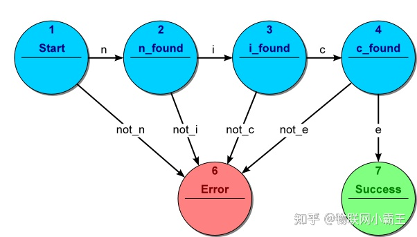
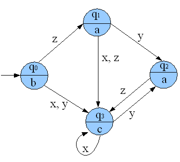
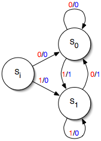

# 状态机（state machine）

通俗的例子：

**状态机** 一般指 有限状态机（FSM），是指表示有限个状态以及在这些状态之间的转移和动作等行为的**数学计算模型**。有限状态机是在自动机理论和计算理论中研究的一类自动机。如下图所示，有限状态机归属于自动机理论范畴，从下面的自动机理论的领域分层图可以看出，越往外层，概念越复杂。

状态机中有几个术语：**state(状态)** 、**transition(转移)** 、**action(动作)** 、**transition condition(转移条件)** 。

- **state(状态)** ：将一个系统离散化，可以得到很多种状态，当然这些状态是有限的。例如：门禁闸机可以划分为开启状态、关闭状态；电扇可以划分为关、一档、二档、三档等状态。
- **transition(转移)** ：一个状态接收一个输入执行了某些动作到达了另外一个状态的过程就是一个transition(转移)。定义transition(转移)就是在定义状态机的转移流程。
- **transition condition(转移条件)** ：也叫做Event(事件)，在某一状态下，只有达到了transition condition(转移条件)，才会按照状态机的转移流程转移到下一状态，并执行相应的动作。
- **action(动作)：在状态机的运转过程中会有很多种动作。如：进入动作(entry action)**[在进入状态时进行]、**退出动作(exit action)**[在退出状态时进行]、**转移动作**[在进行特定转移时进行]。

## 1.   分类

有限状态机可以被分为 **acceptors(接收器)、transducers(转换器)** 两大类。

### 1.1   Acceptors

**acceptors(接收器)** 是指产生一个二值的输出，指示接收的输入是否能被接受。acceptors(接收器)的每一种状态都是接受或不接受的。如果一组所有的输入都被接受并且当前的状态是接受状态，那么这一组输入就是可接受的。有限状态机的acceptors(接收器)这一类在正则引擎的实现中用得非常多。

如下图是一种**acceptors(接收器)** 类型有限状态机，用来识别所输入的字符串是否为**nice**，其总共被划分为了七种状态，其中只有第七种状态**Success**被认为是可接受状态。如果所输入的字串不是**nice**，则会被转移到第六种状态**Error**。

如下给出**acceptors(接收器)** 的数学形式化定义，**acceptors(接收器)** 型有限状态机是一个五元组$(\sum, S, s_0, \delta,F)$,其中：

- $\sum$   是输入字符集合(有限的非空符号集合)；
- $S$     是有限非空状态集合；
- $s_0$    是初始状态，属于$S$中的元素；
- $\delta$      是状态转移函数：$\delta$：$S\times \sum \rightarrow S$；
- $F$     是最终状态集合，是的子集。

## 1.2 transducers(转换器)

**transducers(转换器)** 是根据当前的状态和(或)给定的输入产生输出，输出的同时可能也伴随着状态的转移(不是必须)。在一些事件驱动型应用和计算语言学(computational linguistics)领域应用普遍。**transducers(转换器)** 型有限状态机可以分为两种子类型，**moore machine (摩尔型有限状态机)\**和\**mealy machine (米利型有限状态机)** ，其中：

- 若输出只和状态有关而与输入无关，则称为moore状态机
- 输出不仅和状态有关而且和输入有关系，则称为mealy状态机

### 1.2.1 moore状态机：

如下所示的状态机为**moore状态机**，其有、、、四个状态，,,三个输入，、、三个输出。可以看出其四个状态、、、对应的输出分别为、、、，就是说输出已经和状态绑定好，不管输入为哪一个，均不影响输出。其中为初始状态，假设输入为，可以看出输出为；假设输入为，则输出为，可以看出，虽然输出只和状态有关而与输入无关，但改变输入的序列顺序，输出序列也会改变。

### 1.2.2 mealy状态机：

mealy状态机与输出只依赖于机器当前状态的moore状态机不同，它的输出与当前状态和输入都有关。但是对于每个mealy状态机都有一个等价的moore机。如下所示为一个简单的mealy状态机，它有一个输入和一个输出。在每一个有向边上，标注出了输入(红色)和输出(蓝色)。这个状态机的初始状态为，当输入为0，输出0，状态变为，接着输入0，输出0，状态还是为，在此状态下一直输入0，输出会一直是0，当输入为1时，输出才为1，状态变为，在此状态再接着输入1，输出一直还是0，直到遇到输入为0，输出才变为1。此状态机其实实现了一个边缘触发检测器，每次输入从1到0或是从1到0发生跳变时，输出为1否则输出为0。如下所示时序图，当输入为`0111001110`时，输出为`0100101001`。

如下给出**transducers(转换器)** 的数学形式化定义，**transducers(转换器)** 型有限状态机是一个六元组$(\sum,\tau , S, s_0,\delta,\omega)$,其中：

- $\sum$   是输入字符集合(有限的非空符号集合)；
- $\tau$      是输出字符集合(有限的非空符号集合)；
- $S$     是有限非空状态集合；
- $s_0$    是初始状态，属于S中的元素；
- $\tau$      是状态转移函数：$\delta$：$S\times \sum \rightarrow S$；
- $\omega$     是输出函数。

如果输出函数依赖于状态和输入()，则定义的是**mealy状态机**；如果输出函数仅仅依赖于状态()，那么定义的是**moore状态机**。如果，有限状态机没有输出函数这一项，那么可以称作**transition system(转移系统)** 。很多应用程序用到的有限状态机并没有输出序列，仅仅用到了状态机的转移过程和动作，其实可以称为转移系统。
