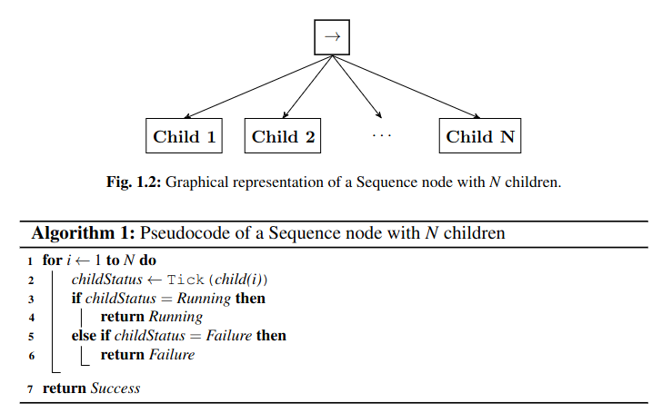
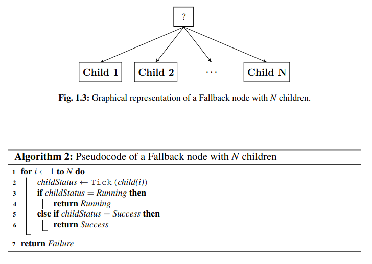
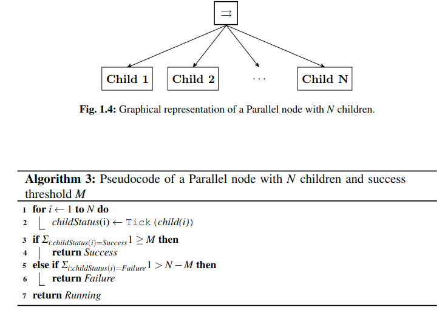
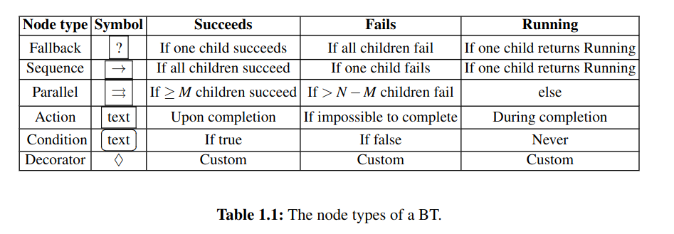

# Behavior Trees in Robotics and AI

## Chapter 1 What are Behavior Trees

Defination: ABT is a way to **structure the switching** between different tasks in an autonomous agent. And BTs are a very efficient way of creating complex systems that are both **modular** and **reactive**.

 BTs provided an alternative view of **FSMs** that supports design of modular systems.

> **FSMs** : the FInite tate Machines (有限状态机)， used in NPCs widely. However, it uses the Goto statement the is an example of one-way control transfer which means **jumping to a particular part of the code** while the two-way control transfer jumps, excutes and the **returns to where the function call was made**. 
>
> Edsgar Dihkstra said "The Goto statement as it stands is just too primitive; it is too much an invitation to make a mess of one's program". 
>
> one-way control transfer causes a mess which lose some **modular**.

A behavior can be divided into a **sequence of sub-behaviors** that are task independent.

### Classical Formulation of BTs

Generally speaking, a BT is a directed rooted tree where the internal nodes are called **control flow nodes** and leaf nodes are called **execution nodes**. 

Four catagories of control flow nodes: 

* Sequence
* Fallback
* Parallel
* Decorator
  * With a **single child** that manipulates the return status of its child according to a user -defined rule and also selectively ticks the child according to some predefined rule.

Two categories of execution nodes:

* Action
  * it returns **Success / Failure / Running**, when the action has correctly **completed / failed / ongoing**
* Condition
  * it returns **Success / Failure**, when the **proposition holds or not**

