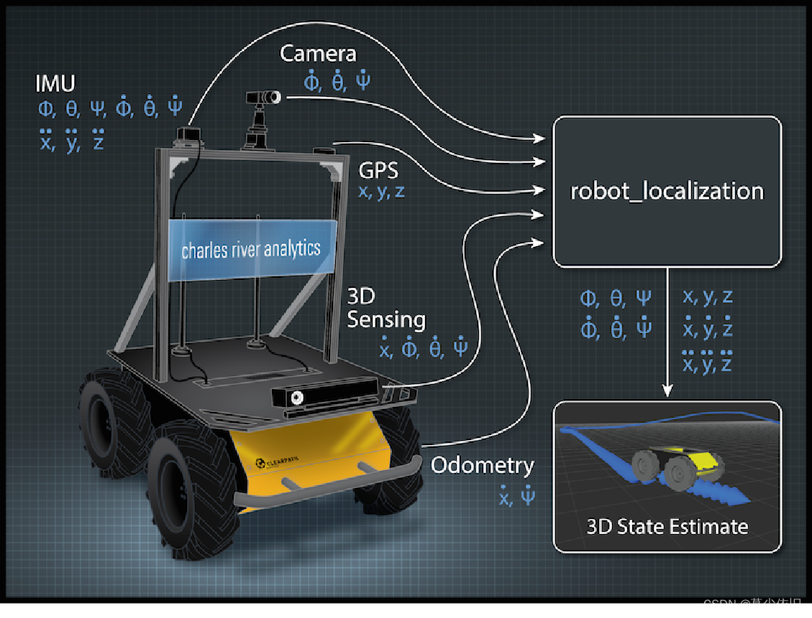
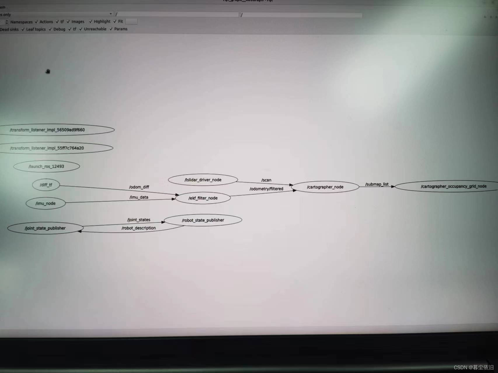

# ROS2+cartographer+激光雷达+IMU里程计数据融合(robot_locazation) 建图

> **环境：**
>
> - Ubuntu22.04
> - ROS2 humble
> - 激光雷达
> - cartographer robot_localization IMU 里程计

1. IMU数据的接收和发布
2. 车轮编码器数据的接收并转换为里程计数据
3. 数据融合——robot_localization
4. cartographer订阅

数据融合——robot_localization
概括

这个包是从ROS开发出来至今一直在广泛使用的包，效果也非常的不错。这里先把官方的wiki文档贴出:

    https://docs.ros.org/en/melodic/api/robot_localization/html

既然是ROS2集成好的包，那自然就需要和nav2一样，先将其安装下来。

```shell
sudo apt install ros-humble-robot-localization
```



使用

说完了概括，那么接下来就要来说明我用到的该包中的节点，robot_localization中有两个用于融合传感器数据的两种不同的算法节点ekf_localization_node和ukf_localization_node，它们的主要区别在于使用的滤波器算法不同。

> * ekf_localization_node使用的是扩展卡尔曼滤波器（EKF），它是一种适用于非线性系统的滤波器。当机器人或车辆的运动模型和传感器模型呈现非线性时，EKF可以通过对非线性函数进行线性化来逼近真实状态，并将观测数据和运动模型结合起来进行状态估计。但是，EKF也存在一些缺点，例如需要事先了解运动模型和传感器模型的具体形式，并且在非线性程度较高的情况下可能存在不稳定性。
>
> * ukf_localization_node使用的是无迹卡尔曼滤波器（UKF），它也是一种适用于非线性系统的滤波器，但是它不需要对非线性函数进行线性化。UKF通过使用一种称为无迹变换的方法，将概率分布从状态空间转换到高斯空间，从而避免了线性化过程中可能出现的不稳定性问题。

因此，ekf_localization_node和ukf_localization_node的主要区别在于它们使用的滤波器算法不同。对于非线性程度较低的情况，EKF通常可以提供较好的性能；对于非线性程度较高的情况，UKF可能更适合使用。我们使用的是扩展卡尔曼滤波器(UKF)。

ROS2中的参数文件一般都是用`yaml`文件形式给出的。根据上方launch文件给出的形式，我们将扩展卡尔曼滤波节点的配置参数放置到`install/your_package_name/share/your_package_name/config/ekf.yaml`当中，配置文件的示例如下：

```yaml
### ekf config file ###
ekf_filter_node:
    ros__parameters:
# The frequency, in Hz, at which the filter will output a position estimate. Note that the filter will not begin
# computation until it receives at least one message from one of the inputs. It will then run continuously at the
# frequency specified here, regardless of whether it receives more measurements. Defaults to 30 if unspecified.
        frequency: 30.0
        
# ekf_localization_node and ukf_localization_node both use a 3D omnidirectional motion model. If this parameter is
# set to true, no 3D information will be used in your state estimate. Use this if you are operating in a planar
# environment and want to ignore the effect of small variations in the ground plane that might otherwise be detected
# by, for example, an IMU. Defaults to false if unspecified.
        two_d_mode: false

# Whether to publish the acceleration state. Defaults to false if unspecified.
        publish_acceleration: true

# Whether to broadcast the transformation over the /tf topic. Defaults to true if unspecified.
        publish_tf: true
        
# 1. Set the map_frame, odom_frame, and base_link frames to the appropriate frame names for your system.
#     1a. If your system does not have a map_frame, just remove it, and make sure "world_frame" is set to the value of odom_frame.
# 2. If you are fusing continuous position data such as wheel encoder odometry, visual odometry, or IMU data, set "world_frame" 
#    to your odom_frame value. This is the default behavior for robot_localization's state estimation nodes.
# 3. If you are fusing global absolute position data that is subject to discrete jumps (e.g., GPS or position updates from landmark 
#    observations) then:
#     3a. Set your "world_frame" to your map_frame value
#     3b. MAKE SURE something else is generating the odom->base_link transform. Note that this can even be another state estimation node 
#         from robot_localization! However, that instance should *not* fuse the global data.
        map_frame: map              # Defaults to "map" if unspecified
        odom_frame: odom           # Defaults to "odom" if unspecified
        base_link_frame: base_link  # Defaults to "base_link" if unspecified
        world_frame: odom           # Defaults to the value of odom_frame if unspecified
        # odom0: /odom_diff
        # odom0_config: [true,  true,  true,
        #                false, false, false,
        #                false, false, true,
        #                false, false, false,
        #                false, false, false]
        odom0: /odom_diff
        odom0_config: [false,  false,  false,
                       false, false, false,
                       true, true, true,
                       false, false, false,
                       false, false, false]

        imu0: /imu_data
        imu0_config: [false, false, false,
                      true,  true,  true,
                      false, false, false,
                      false, false, false,
                      false, false, false]

```

> 后面的参数文件矩阵含义是我们可以在上面的话题中提供给robot_localization的数据，矩阵的各个配置值的含义为**(X,Y,Z,roll,pitch,yaw,X˙,Y˙,Z˙,roll˙,pitch˙,yaw˙,X¨,Y¨,Z¨)**。由于之前用到的diff_ty.py文件发布出来的数据是带有方向的XYZ速度值，因此需要将X˙,Y˙,Z˙这三个参数对应的矩阵设置为true，上面的话题odom0: /odom_diff是指robotlocalization需要订阅的话题名字，我们里程计数据是由diff_ty.py发布的odom_diff话题，因此在这里改为对应话题名字即可。
> 同理，对于IMU数据，我IMU驱动底层写的话题发布名字为imu_data，因此，我们也将其订阅的imu话题名字改为imu_data即可。而我们在这里只用到了IMU的roll pitch yaw三轴数据，因此是将第二排的三个参数改为true即可。
>
> 而上面的4个frame不需要进行修改，因为我们需要建立的就是map, odom, base_link三个系之间的关系。

当开启`publish_tf`选项的时候，该包会发布一个指向 `base_link_frame`的帧 `frame_id = odom`

` map_frame: map` 该选项是为了识别map_frame ,包本身不会发布这个帧。

而`cartographer`包会发布一个从 map 到`published_frame` 的变换，并且在中间插入一个名为`odom`的帧，因此，一定要在cartographer的配置文件中改掉 

```lua
odom_frame = "odom"-----> "odom1"
```


## cartographer订阅

我们已经可以输出融合后的数据了，现在就是修改`cartographer`的参数来让其订阅融合后的数据即可。我们需要修改的参数有

```lua
use_odometry = true
```

其他参数文件和一篇[博客](https://blog.csdn.net/scarecrow_sun/article/details/127978254)的参数文件都一致

`launch文件`中，将remapping参数进行修改，

```python
    cartographer_node = Node(
        package = 'cartographer_ros',
        executable = 'cartographer_node',
        arguments = [
            '-configuration_directory', FindPackageShare('cartographer_ros').find('cartographer_ros') + '/configuration_files',
            '-configuration_basename', 'my_robot.lua'],
        remappings = [
            ('odom', '/odometry/filtered')],
        output = 'screen'
        )
```




## 问题：

该方法在实际操作过程中，会造成odom坐标乱动。只要robot_localization使用了imu的`Roll Pitch Yaw`数据，有大概率会乱动，目前对该包的融合数据持怀疑态度