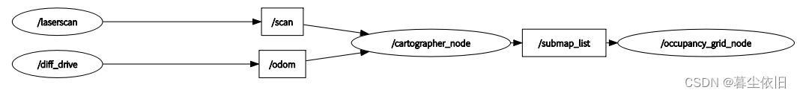
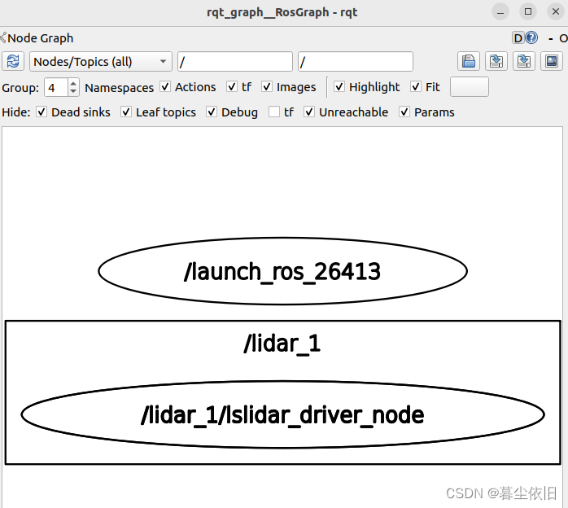
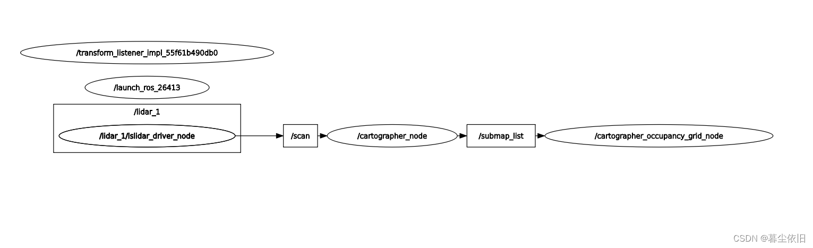

# ROS2+cartorgrapher+[激光雷达建图并保存](https://blog.csdn.net/scarecrow_sun/article/details/127978254)


## 安装cartographer

查看cartographer包名字并安装.由于ROS2发布了许多的版本，因此，我们在要安装适配于自己版本的包之前可以先查看能适配的包

```shell
#查找符合的包
sudo apt-cache search cartographer

```

返回了许多与humble有关的包，我们安装这两个

```shell
sudo apt install ros-humble-cartographer ros-humble-cartographer-ros
```

等待安装完之后，查看是否有安装好

```shell
ros2 pkg list | grep cartogrpaher
```

返回 即代表安装好

```shell
cartographer_ros
cartographer_ros_msgs
```

> 鱼香ROS有解释，为啥看不到cartographer，这里贴出来
> 鱼香ROS动手学习ROS2 安装cartographer
> “可能你会好奇为什么没有cartographer，因为cartographer包的编译类型原因造成的，不过没关系，cartographer_ros依赖于cartographer，所以有cartographer_ros一定有cartographer。”

在安装完了cartographer之后，其实我们就可以理解成我们在Ubuntu里面安装了一个ROS2的功能包，只是这个功能包并不在我们自己的功能区下面，所以我们只需要启动这个功能包，他就能发布他自己的node和topic。

## cartographer初了解

在建图的过程当中，传感器的信息非常重要。在ROS2当中，我们需要使用的传感器信息的方式非常的简单，即订阅传感器topic发布的信息，在接收信息之后，cartographer包会利用其内部的算法对其进行解析构建，进而建图。cartographer整体算法主要依赖的是激光雷达的数据。
因此我们在使用cartographer建图之前，我们需要先看懂这个算法是怎么拿到激光雷达的数据。我的入手点是从商家的激光雷达驱动文件入手进行学习。
整体学习的逻辑顺序如下：

* 激光雷达如何发布数据
* cartographer如何接收数据
* 基本参数如何配置
* 调试及建图激光

## 雷达底层驱动

任何一家激光雷达商家都会给你他们驱动文件，我们需要在自己的工作区下编译商家给的驱动文件，然后驱动文件中的激光雷达的节点，这样才能在ROS2的环境下接收其数据。

### 启动文件

```shell
lsm10p_net_launch.py
                     
```

```python
'''省略import文件部分'''
def generate_launch_description():
    driver_dir_1 = os.path.join(get_package_share_directory('lslidar_driver'), 'params', 'lsx10_1.yaml')
driver_node_1 = LifecycleNode(package='lslidar_driver',
                            executable='lslidar_driver_node',
                            name='lslidar_driver_node',		#设置激光数据topic名称
                            output='screen',
                            emulate_tty=True,
                            namespace='lidar_1',
                            parameters=[driver_dir_1],
                            )
rviz_dir = os.path.join(get_package_share_directory('lslidar_driver'), 'rviz', 'lslidar.rviz')

rviz_node = Node(
    package='rviz2',
    namespace='',
    executable='rviz2',
    name='rviz2',
    arguments=['-d', rviz_dir],
    output='screen')
return LaunchDescription([
    driver_node_1,
    rviz_node,
])

```

可以看到商家的启动文件就是启动了两个节点

但是我们需要重点关注的是**frame_id**这个东西，因为之前没有接触过，因此这里就开始学习这部分

### frame_id理解理解学习

参考博客:ROS探索总结（二十）——[发布导航需要的传感器信息](https://www.guyuehome.com/326?replytocom=50855)

要看懂这个参数，我们先来看一下ros2中激光雷达的消息接口有一些什么消息即这个接口 `Sensor_msgs/msg/LaserScan`


使用查看一下接口的消息类型

```shell
ros2 interface show sensor_msgs/msg/LaserScan
```

返回

    # Single scan from a planar laser range-finder
    
    #
    
    # If you have another ranging device with different behavior (e.g. a sonar
    
    # array), please find or create a different message, since applications
    
    # will make fairly laser-specific assumptions about this data
    
    std_msgs/Header header # timestamp in the header is the acquisition time of
    	builtin_interfaces/Time stamp
    		int32 sec
    		uint32 nanosec
    		string frame_id
    
                                 # the first ray in the scan.
    
    ​                             #
    
                                 # in frame frame_id, angles are measured around
    
                                 # the positive Z axis (counterclockwise, if Z is up)
    
                                 # with zero angle being forward along the x axis
    
    float32 angle_min            # start angle of the scan [rad]
    float32 angle_max            # end angle of the scan [rad]
    float32 angle_increment      # angular distance between measurements [rad]
    
    float32 time_increment       # time between measurements [seconds] - if your scanner
                                 # is moving, this will be used in interpolating position
                                 # of 3d points
    float32 scan_time            # time between scans [seconds]
    
    float32 range_min            # minimum range value [m]
    float32 range_max            # maximum range value [m]
    
    float32[] ranges             # range data [m]
                                 # (Note: values < range_min or > range_max should be discarded)
    float32[] intensities        # intensity data [device-specific units].  If your
                                 # device does not provide intensities, please leave
                                 # the array empty.

消息头有三部分的数据，int32 sec,uint32 nanosec,string frame_id，这三个参数的理解就是

> sec和nanosec就是时间戳，代表着发布消息的秒和纳秒。
>
> frame_id 是消息中与数据相关联的参考系id，例如在在激光数据中，frame_id对应激光数据采集的参考系(坐标系)。

因此，frame_id就是某一个物体的参考系的坐标名字。然后，我们需要学习另一个东西，什么是ROS的常见坐标系
ROS[坐标系](http://community.bwbot.org/topic/227/ros%E5%9D%90%E6%A0%87%E7%B3%BB%E7%BB%9F-%E5%B8%B8%E8%A7%81%E7%9A%84%E5%9D%90%E6%A0%87%E7%B3%BB%E5%92%8C%E5%85%B6%E5%90%AB%E4%B9%89)

> ROS坐标系统，常见的坐标系及含义
>
> ros-rep-0105
>
> 1.base_link
> base_link坐标系和机器人的底盘直接连接。其具体位置和方向都是任意的。对于不同的机器人平台，底盘上会有不同的参考点。不过ROS也给了推荐的坐标系取法。
>
> x 轴指向机器人前方
> y 轴指向机器人左方
> z 轴指向机器人上方
>
> 2.odom
> odom是一个固定在环境中的坐标系也就是world-fixed。它的原点和方向不会随着机器人运动而改变。但是odom的位置可以随着机器人的运动漂移。漂移导致odom不是一个很有用的长期的全局坐标。然而机器人的odom坐标必须保证是连续变化的。也就是在odom坐标系下机器人的位置必须是连续变化的，不能有突变和跳跃。
> 在一般使用中odom坐标系是通过里程计信息计算出来的。比如轮子的编码器或者视觉里程计算法或者陀螺仪和加速度计。odom是一个短期的局域的精确坐标系。但是却是一个比较差的长期大范围坐标。
>
> 3.map
> map和odom一样是一个固定在环境中的世界坐标系。map的z轴是向上的。机器人在map坐标系下的坐标不应该随着时间漂移。但是map坐标系下的坐标并不需要保证连续性。也就是说在map坐标系下机器人的坐标可以在任何时间发生跳跃变化。
> 一般来说map坐标系的坐标是通过传感器的信息不断的计算更新而来。比如激光雷达，视觉定位等等。因此能够有效的减少累积误差，但是也导致每次坐标更新可能会产生跳跃。
> map坐标系是一个很有用的长期全局坐标系。但是由于坐标会跳跃改变，这是一个比较差的局部坐标系（不适合用于避障和局部操作）。
>
> 而在开放环境中，我们需要定义一个全球坐标系
>
>     默认的方向要采用 x轴向东，y轴向北，z轴向上
>     如果没有特殊说明的话z轴为零的地方应该在WGS84椭球上(WGS84椭球是一个全球定位坐标。大致上也就是z代表水平面高度)
>     如果在开发中这个约定不能完全保证，也要求尽量满足。比如对于没有GPS，指南针等传感器的机器人，仍然可以保证坐标系z轴向上的约定。如果有指南针传感器，这样就能保证x和y轴的初始化方向。
>
> 在结构化的环境中（比如室内），在定义坐标系时和环境保持对应更有用。比如对于有平面图的建筑，坐标系可以和平面图对应。类似的对于室内环境地图可以和建筑物的层相对应。对于有多层结构的建筑物，对每一层单独有一个坐标系也是合理的。
>
> 4.earth
> 这个坐标系是为了多个机器人相互交互而设计的。当有多个机器人的时候，每个机器人都有自己的map坐标系，他们之间的map坐标系并不相同。如果想要在不同的机器人间共享数据，则需要这个坐标系来进行转化。
> 如果map坐标系是一个全局坐标系，那么map到earth坐标系的变化可以是一个静态变换。如果不是的话，就要每次计算map坐标系的原点和方向。
> 在刚启动的时候map坐标系的全局位置可能是不知道的。这时候可以先不发布到earth的变换，直到有了比较精确的全局位置。
>
> 在这里插入图片描述
>
> 坐标系之间的关系
> 坐标系之间的关系可以用树图的方式表示。每一个坐标系只能有一个父坐标系和任意多个子坐标系。
>
> earth -> map -> odom -> base_link
> 按照之前的说明，odom和map都应该连接到base_link坐标系。但是这样是不允许的，因为每一个坐标系只能有一个父坐标系。
>
> 坐标系变换的计算
>
> odom到base_link的变换由里程计数据源中的一个发布
>
> map到base_link通过定位组件计算得出。但是定位组件并不发布从map到base_link的变换。它首先获取odom到base_link的变换然后利用定位信息计算出map到odom的变换。
>
> earth到map的变换是根据map坐标系选取所发布的一个静态变换。如果没有设置，那么就会使用机器人的初始位置作为坐标原点。
>
> Map之间的切换
>
> 如果机器人的运动范围很大，那么极有可能是要切换地图的。在室内环境下，在不同的建筑物中，和不同的楼层地图都会不同。
> 在不同的地图间切换的时候，定位组件要恰当的把odom的parent替换成新的地图。主要是map到base_link之间的变换要选取恰当的地图，然后在转换成map到odom之间的变换。
>
> odom坐标系的连续性
> 在切换地图的时候，odom坐标系不应该受到影响。odom坐标系要保证连续性。可能影响连续性的情况包括进出电梯，机器人自身没有运动，但是周围环境发生很大的变化。还有可能由于运动距离太远，造成数据溢出。这些都要特殊进行处理。

看完了这部分，我们也就知道了，frame_id其实就是标注了这部分数据的来源参考id，在配置文件参数中写的laser也就是来源于laser代表的参考系ID。
cartographer建图过程

开始接触cartographer的时候，对ROS2这种节点的概念还没有完全建立，最开始理解要使用这个包来建图的时候，我以为需要打开什么客户端，或者说跑一个什么程序。但是随着学习的深入，我逐渐理解到

> cartographer就是ROS2的一个功能包，和我们自己在ROS2的工作空间下建立的功能包是一个道理。我们如果需要使用这个功能包，其实只需要简单的用launch文件启动这个功能包里面所带有的节点，然后启动我们自己激光雷达的节点，然后cartographer订阅激光雷达节点发布的消息，当然，接收的消息格式和接收的节点的名字都需要我们一开始配置好，也就是使用.lua和.launch.py(在ROS2中)文件。

即使用ros2 launch cartographer_ros filenames.launch
而要完成使用Cartographer进行建图，需要两个节点的参与，整个过程的计算流图如下：

> /cartographer_node节点:
>
> 
>
> 该节点从/scan和/odom话题接收数据进行计算，输出/submap_list数据.
>
> 该节点需要接收一个参数配置文件（第二部分写的那个）参数。
>
> /occupancy_grid_node节点：
>
> 该节点接收/submap_list子图列表，然后将其拼接成map并发布
>
> 该节点需要配置地图分辨率和更新周期两个参数。
>
> 参考原网址：小鱼的文档

那么其实我们需要学习理解的就是catorgrapher的.lua和.launch.py文件是如何配置的，就能够学会怎么运行起来这个算法
.lua文件

根据网上给出的建议，我们最好从cartographer官方给出的配置文件进行修改，因此，拿出官网的一个.lua文件进行学习和修改，来看backpack2d.lua。
注：我后面增加了一些其他可以修改的参数，然后我基于官方的backpack2d.lua改成自己需要的配置文件,我的激光雷达的frame_ID是laser_link

> ros2 humble cartographer会下载到电脑的路径为/opt/ros/humble/share/cartographer_ros/configuration_files/
>
> 参考网址：
> cartographer[官网](https://google-cartographer-ros.readthedocs.io/en/latest/configuration.html)
> https://zhuanlan.zhihu.com/p/563264225


```lua
include "map_builder.lua"
include "trajectory_builder.lua"

options = {
  map_builder = MAP_BUILDER,
  trajectory_builder = TRAJECTORY_BUILDER,
  map_frame = "map",
  tracking_frame = "laser_link",
  published_frame = "laser_link",
  odom_frame = "odom",
  provide_odom_frame = false,
  publish_frame_projected_to_2d = false,
  use_pose_extrapolator = false,
  use_odometry = false,
  use_nav_sat = false,
  use_landmarks = false,
  num_laser_scans = 1,
  num_multi_echo_laser_scans = 0,
  num_subdivisions_per_laser_scan = 1,
  num_point_clouds = 0,
  lookup_transform_timeout_sec = 0.2,
  submap_publish_period_sec = 0.3,
  pose_publish_period_sec = 5e-3,
  trajectory_publish_period_sec = 30e-3,
  rangefinder_sampling_ratio = 1.,
  odometry_sampling_ratio = 1.,
  fixed_frame_pose_sampling_ratio = 1.,
  imu_sampling_ratio = 1.,
  landmarks_sampling_ratio = 1.,
}

MAP_BUILDER.use_trajectory_builder_2d = true

TRAJECTORY_BUILDER_2D.submaps.num_range_data = 35
TRAJECTORY_BUILDER_2D.min_range = 0.
TRAJECTORY_BUILDER_2D.max_range = 200.
TRAJECTORY_BUILDER_2D.missing_data_ray_length = 5.
TRAJECTORY_BUILDER_2D.use_imu_data = false
TRAJECTORY_BUILDER_2D.use_online_correlative_scan_matching = true
TRAJECTORY_BUILDER_2D.real_time_correlative_scan_matcher.linear_search_window = 0.1
TRAJECTORY_BUILDER_2D.real_time_correlative_scan_matcher.translation_delta_cost_weight = 10.
TRAJECTORY_BUILDER_2D.real_time_correlative_scan_matcher.rotation_delta_cost_weight = 1e-1

POSE_GRAPH.optimization_problem.huber_scale = 1e2
POSE_GRAPH.optimize_every_n_nodes = 35
POSE_GRAPH.constraint_builder.min_score = 0.65

return options
```

参数含义：

> **map_frame**： 构建地图所使用的坐标系，一般就使用我们前面提到的map即可
>
> **tracking_frame**： SLAM算法跟踪的帧的ROS帧ID。如果要使用IMU，它应该在这个地方被选用，尽管它可能会漂移。常见的选择是“imu_link”。
>  tracking_frame一般设置为发布频率最高的传感器的frame_id，cartographer将会把其他数据都转移到该坐标系下进行计算。如果只使用雷达数据进行2D建图，那就只需要将其设置为雷达数据话题的frame_id，一般为laser。如果使用雷达数据+IMU进行2D或者3D建图，因为IMU的发布频率明显高于雷达，所以需要设置为imu数据话题的frame_id，一般imu_link。
>
> **published_frame**: 要用作发布坐标的子帧的ROS帧ID。例如，如果“odom”框架由系统的不同部分提供，则设置为“odom“。在这种情况下，将发布map_frame中“odom”的坐标。否则，将其设置为“base_link”可能是合适的。
> cartographer发布的tf树最后将指向published_frame，即published_frame不是cartographer提供的，这里如果没设置正确，tf树就不能连接成功，建图也就不能正常进行。这个一般设置为底盘的frame_id，也就是URDF文件中的底盘的link name，一般为base_link、base_footprint之类的名字。
>
> **odom_frame**： 仅当provide_odom_frame为true时使用。通常是“odom”。,==如果冲突请改名此帧名==
>
> **provide_odom_frame**： 如果enable, 则local, non-loop-closed, continuous pose 将作为 odom_frame发布在 map_frame.
>     在大多数情况下，设置 provide_odom_frame 为 true 是有意义的，因为它可以为其他节点提供一个 odom 坐标系，这些节点可以使用机器人的里程计数据来估计机器人的运动，而不必直接处理传感器数据。例如，可以使用 robot_localization 包来融合多个传感器数据，并估计机器人的位姿。
>
> **publish_frame_projected_to_2d**： 如果enable, 则发布姿态将严格限制在纯2D位姿下(不包含roll pitch和z-offset坐标)，这个可以防止出现一些由于pose extrapolation step步骤出现的预期之外不需要的平面外姿态
>
> **use_odometry**： 如果enable,则订阅topic为odom中的nav_msgs/Odometry。这种情况下必须提供里程计.在SLAM过程中也会使用这个消息进行建图。注意:这里如果设置为true，则需要在ROS2节点中发布一个名为odom的topic让carto订阅
>
> **use_nav_sat**： 如果enable, 则订阅主题为fix中的sensor_msgs/NavSatFix。这种情况下必须要使用导航数据
>
> **use_landmarks**：如果enable，则订阅主题为landmarks中的cartographer_ros_msgs/LandmarkList，必须提供LandmarkLists数据，如1cartographer_ros_msgs/LandmarkEntry中的cartographer_ros_msgs/LandmarkList
>
> **num_laser_scans**: 要订阅的laser scan的主题数量。为1时，订阅sensor_msgs/LaserScan中的scan主题,或者为多台激光扫描订阅主题的scan_1,scan_2
>
> **num_multi_echo_laser_scans**: 要订阅的multi-echo laser scan的主题数量，为1时，订阅echoes下的sensor_msgs/MultiEchoLaserScan,或者多个echoes_1, echoes_2
>
> **num_subdivisions_per_laser_scan:** 将每个接收到的（多回波）激光扫描分成的点云数。细分扫描可以使扫描仪移动时获取的扫描不变形。有一个相应的轨迹生成器选项，可以将细分的扫描累积到一个点云中，用于扫描匹配。若把默认10改为1，1/1=1等于不分割
>
> **num_point_clouds**: 要订阅的point cloud的主题数量。为1时，订阅points2主题的sensor_msgs/PointCloud2,或者为多台点云订阅主题的points2_1,points2_2
>
> **lookup_transform_timeout_sec**: 用于使用tf2查找转换的超时秒数。
>
> **submap_publish_period_sec**: 发布子图姿势的时间间隔（以秒为单位），例如 0.3 秒。
>
> **pose_publish_period_sec**: 发布姿势的时间间隔（以秒为单位），例如 5e-3 表示频率为 200 Hz。
>
> **publish_to_tf:** 启用或禁用提供 TF 转换
>
> **publish_tracked_pose**: 允许将跟踪姿势作为geometry_msgs/PoseStamped 发布到主题“tracked_pose”。
>
> **trajectory_publish_period_sec**： 发布轨迹标记的时间间隔（以秒为单位），例如 30e-3 30 毫秒。
>
> **rangefinder_sampling_ratio**：测距仪消息的固定比率采样。
>
> **odometry_sampling_ratio**： 里程计消息的固定比率采样。
>
> **fixed_frame_sampling_ratio**： 固定帧消息的固定比率采样。
>
> **imu_sampling_ratio IMU**： IMU消息的固定比率采样。
>
> **landmarks_sampling_ratio**： 地标消息的固定比率采样。
>
> **use_pose_extrapolator**： Node里的位姿估计器，作用是融合里程计和IMU，推测出一个位姿。 如果use_pose_extrapolator参数为true，发布出的这个位姿不准，因为是先验的位姿，没有经过雷达校准，除非IMU和里程计特别准。因此这个参数一般都是false。如果参数publish_tracked_pose为false，use_pose_extrapolator其实就无效了

> # Terminology
>
> This documents a few common patterns that exist in the Cartographer codebase.
>
> ## Frames
>
> - global map frame
>
>   This is the frame in which global SLAM results are expressed. It is the fixed map frame including all loop closure and optimization results. The transform between this frame and any other frame can jump when new optimization results are available. Its z-axis points upwards, i.e. the gravitational acceleration vector points in the -z direction, i.e. the gravitational component measured by an accelerometer is in the +z direction.
>
> - local map frame
>
>   This is the frame in which local SLAM results are expressed. It is the fixed map frame excluding loop closures and the pose graph optimization. For a given point in time, the transform between this and the global map frame may change, but the transform between this and all other frames does not change.
>
> - submap frame
>
>   Each submap has a separate fixed frame.
>
> - tracking frame
>
>   The frame in which sensor data is expressed. It is not fixed, i.e. it changes over time. It is also different for different trajectories.
>
> - gravity-aligned frame
>
>   Only used in 2D. A frame colocated with the tracking frame but with a different orientation that is approximately aligned with gravity, i.e. the gravitational acceleration vector points approximately in the -z direction. No assumption about yaw (rotation around the z axis between this and the tracking frame) should be made. A different gravity-aligned frame is used for different trajectory nodes, e.g. yaw can change arbitrarily between gravity-aligned frames of consecutive nodes.
>
> ## Transforms
>
> - local_pose
>
>   Transforms data from the tracking frame (or a submap frame, depending on context) to the local map frame.
>
> - global_pose
>
>   Transforms data from the tracking frame (or a submap frame, depending on context) to the global map frame.
>
> - local_submap_pose
>
>   Transforms data from a submap frame to the local map frame.
>
> - global_submap_pose
>
>   Transforms data from a submap frame to the global map frame.

TF2是ROS2使用的坐标转换的工具

因此，我们其实可以根据我们自己的需求来配置我们所需要的.lua文件

除此之外，我们还可以配置两个文件中的参数，也就是头文件中引入的"map_builder.lua" 和 "trajectory_builder.lua"

### map_builder.lua 参数理解

```lua
include "pose_graph.lua"

  MAP_BUILDER = {
   use_trajectory_builder_2d = false, //是否使用2d建图
   use_trajectory_builder_3d = false, //是否使用3d建图
   num_background_threads = 4,			//使用几线程
   pose_graph = POSE_GRAPH,
   collate_by_trajectory = false,		
   //用于控制是否将数据按照轨迹进行分组。

//如果将 collate_by_trajectory 设置为 true，则 Cartographer 将会按照每个轨迹的 ID 将数据进行分组。在建图过程中，Cartographer 将每个轨迹的数据单独处理，然后将它们合并到最终地图中。这对于多个轨迹的数据进行建图时非常有用。

//如果将 collate_by_trajectory 设置为 false，则 Cartographer 将忽略轨迹信息，并将所有数据都视为同一个轨迹进行处理。在这种情况下，Cartographer 会将所有数据合并到一起进行建图，生成一个单一的地图。
      } 
```
这其中又含有pose_grapher.lua文件，其中的参数解析参考
[cartographer pose_graph.lua 参数解析](https://blog.csdn.net/windxf/article/details/109195442)

cartographer trajectory_builder_2d.lua参数备忘

[trajectory_builder_2d.lua 参数理解](https://blog.csdn.net/c417469898/article/details/117790918)

### .launch.py文件

在下载了cartographer包之后，我们可以根据launch文件的名字来选择我们需要的文件，命名规则如下：

> 按照功能划分，分为以下几类：
>
> （１）利用已有数据集进行2d/3d建图，如demo_backpack_2d.launch（其又调用了backpack_2d.launch）
>
> （２）利用先验地图及数据集进行全局定位，如demo_backpack_2d_localization.launch
>
> （３）显示pbstream文件
>
> launch文件命名规则标明了其作用：用户根据需要选择launch文件
>
>     offline_backpack_2d.launch：离线快速构建全局地图，事先记录的数据集被多倍快速播放
>     demo_backpack_2d_localization.launch：基于先验地图进行全局定位
>     demo_backpack_2d.launch：同时定位和建图，需要跑数据包
>     backpack_2d.launch：同时定位和建图，使用真实的传感器数据
>     assets_writer_my_robot.launch：用于从.pbstream先前 Cartographer 执行的记录中提取数据。
>     
>     来源于https://blog.csdn.net/qq_18276949/article/details/113174339

我们就需要使用launch文件来启动我们的cartographer功能包的节点，同样，我们打开前面.lua文件对应的.launch文件——backpack_2d.launch.py(在ROS2中，由于python语言特性，已经从.launch后缀改为了.launch.py后缀)

```python
from launch import LaunchDescription
from launch.actions import DeclareLaunchArgument, IncludeLaunchDescription
from launch.conditions import IfCondition, UnlessCondition
from launch.substitutions import LaunchConfiguration
from launch_ros.actions import Node, SetRemap
from launch_ros.substitutions import FindPackageShare
from launch.launch_description_sources import PythonLaunchDescriptionSource
import os

def generate_launch_description():

## ***** Launch arguments *****
# 是否使用仿真时间，真实的机器人我们不需要，设置为False
use_sim_time_arg = DeclareLaunchArgument('use_sim_time', default_value = 'False')

## ***** File paths ******
# 找到cartographer功能包的地址
pkg_share = FindPackageShare('cartographer_ros').find('cartographer_ros')
## ***** Nodes *****
#=====================声明三个节点，cartographer/occupancy_grid_node/rviz_node=================================
cartographer_node = Node(
    package = 'cartographer_ros',
    executable = 'cartographer_node',
    parameters = [{'use_sim_time': LaunchConfiguration('use_sim_time')}],
    arguments = [
        '-configuration_directory', FindPackageShare('cartographer_ros').find('cartographer_ros') + '/configuration_files',
        '-configuration_basename', 'backpack_2d.lua'],
    remappings = [
        ('echoes', 'horizontal_laser_2d')],
    output = 'screen'
    )

# 可视化节点
rviz_node = Node(
      package='rviz2',
      namespace='rviz2',
      executable='rviz2',
      name='rviz2',
      output='screen')

cartographer_occupancy_grid_node = Node(
    package = 'cartographer_ros',
    executable = 'cartographer_occupancy_grid_node',
    parameters = [
        {'use_sim_time': True},
        {'resolution': 0.05}],
    )

return LaunchDescription([
    use_sim_time_arg,
    # Nodes
    rviz_node ,
    cartographer_node,
    cartographer_occupancy_grid_node,
])
```

cartographer_node 节点中有一个remap的一个重映射，意思就是将前一个话题的名字重映射为后面的话题名字，就类似于一个改名的操作。
比如我cartographer订阅里程计话题名字odom，但是我发布的话题不是odom，我们可以使用remappings=[('odom', '/odometry/filtered')], 即可将cartographer订阅的话题名映射过去
自己的.launch文件


```python
from launch import LaunchDescription
from launch.actions import DeclareLaunchArgument, IncludeLaunchDescription
from launch.conditions import IfCondition, UnlessCondition
from launch.substitutions import LaunchConfiguration
from launch_ros.actions import Node, SetRemap
from launch_ros.substitutions import FindPackageShare
from launch.launch_description_sources import PythonLaunchDescriptionSource
import os

def generate_launch_description():

## ***** Launch arguments *****
use_sim_time_arg = DeclareLaunchArgument('use_sim_time', default_value = 'False')

## ***** File paths ******
pkg_share = FindPackageShare('cartographer_ros').find('cartographer_ros')
   # urdf_dir = os.path.join(pkg_share, 'urdf')
   # urdf_file = os.path.join(urdf_dir, 'backpack_2d.urdf')
   # with open(urdf_file, 'r') as infp:
   #     robot_desc = infp.read()
   ## ***** Nodes *****
      # robot_state_publisher_node = Node(
   #     package = 'robot_state_publisher',
   #     executable = 'robot_state_publisher',
   #     parameters=[
   #         {'robot_description': robot_desc},
   #         {'use_sim_time': LaunchConfiguration('use_sim_time')}],
   #     output = 'screen'
   #     )
   cartographer_node = Node(
    package = 'cartographer_ros',
    executable = 'cartographer_node',
    arguments = [
        '-configuration_directory', FindPackageShare('cartographer_ros').find('cartographer_ros') + '/configuration_files',
        '-configuration_basename', 'my_robot.lua'],
    remappings = [
        ('scan', 'scan')],
    output = 'screen'
    )

cartographer_occupancy_grid_node = Node(
    package = 'cartographer_ros',
    executable = 'cartographer_occupancy_grid_node',
    parameters = [
        {'use_sim_time': False},
        {'resolution': 0.05}],
    )

rviz_node = Node(
    package='rviz2',
    namespace='rviz2',
    executable='rviz2',
    name='rviz2',
    output='screen')
return LaunchDescription([
    use_sim_time_arg,
    # Nodes
   # robot_state_publisher_node,
    rviz_node,
    cartographer_node,
    cartographer_occupancy_grid_node,
])
```
## 补充

在进行了融合IMU和里程计数据之后，对carto的使用有了新的理解

对于carto而言，其核心需要使用的数据是激光雷达发布的/scan话题，因此我们一定需要提供/scan话题，并提供对应的数据形式(无论你的数据是激光雷达得到的数据亦或者是其他方式得到的)。而对于carto的使用而言，它订阅数据和frameID是没有任何关系的，对于ROS2里面，拿到数据的方法是订阅topic,因此参数中的map_frame,tracking_frame,published_frame都和carto订阅数据无关，这些frame_ID影响的是其TF树的建立，而与数据订阅无关。

在后续的测试当中，我们发现carto订阅的激光雷达数据就是/scan话题，订阅的里程计数据就是/odom话题，我们暂时还没找到有参数修改能改变其订阅的数据话题名字，比如将其改变为订阅odom_optimize，后续如果继续学习的过程中发现方法，也会继续补充，也欢迎理解的朋友在评论区补充，感谢！

### 启动及其调试

我们使用ros2 launch cartographer_ros my_robot.launch.py 注意，这里的my_robot.launch.py是自定义的启动文件，需要自己配置和修改。
在启动之前注意要先启动激光雷达的驱动，让激光雷达发布自己的数据。

### 善用rqt_graph

rqt_graph是一个非常好用的一个工具，我们一定要灵活的使用它
当我打开了雷达的驱动节点之后，其显示为



当我再把cartographer启动之后，节点就变成了

这个工具非常有利于我们看不同的节点是否成功订阅了话题

> 注意，这里需要安装符合自己ros版本的rqt
>
> 可以使用sudo apt-cache search 包名字 在apt源里寻找库
>
> sudo apt install ros-humble-rqt*

## 运行
    rqt_graph

### 善用rqt_tf_tree

我们也可以使用该工具来查看各个坐标之间的变换关系

安装方式如下：

## 查看tf2坐标关系
### 安装


    sudo apt install ros-humble-tf2-tools
    
    ros2 run tf2_tools view_frames # 查看tf坐标关系

我最开始建图的方式是在vmware虚拟机上跑Ubuntu接激光雷达，然后用手拿着激光雷达在家里进行建图，但是我发现建出来的图，始终在乱飞，效果如下图所示:
在这里插入图片描述
搜索了很多资料，都没有发现能够彻底解决的方式。于是后面想把IMU的数据也加到carto的算法当中去，但是发现里面的配置参数，urdf学起来一阵头大，陆续学了一段时间，搞不定。（后续已经解决，未来会写一篇博客，记得关注噢）
最近开学测试，直接使用Ubuntu，而不是虚拟机来跑carto算法，但是把雷达放到了自己要做的小车上推着进行建图。同样的配置参数和代码，发现建图效果好了起来，如下图所示:
在这里插入图片描述
这其中，我认为可能是激光雷达传到虚拟机中出现了一些时间上的差异导致了建图时间不匹配出现建图乱飞，由于时间所限，也没继续深究了。
地图保存

> 参考：
> https://blog.csdn.net/PC2721/article/details/128303807

保存地图需要另一个叫map_saver的节点
在建图完毕之后，我们在我们想要保存地图的地方运行

> 注：这里保存用到了nav2，下一篇继续总结。

```shell
ros2 run nav2_map_server map_saver_cli -f map
```

注意：在调用map_saver节点之前不要关闭Cartographer节点，不然会丢失地图

会生成.pgm和.yaml两个文件