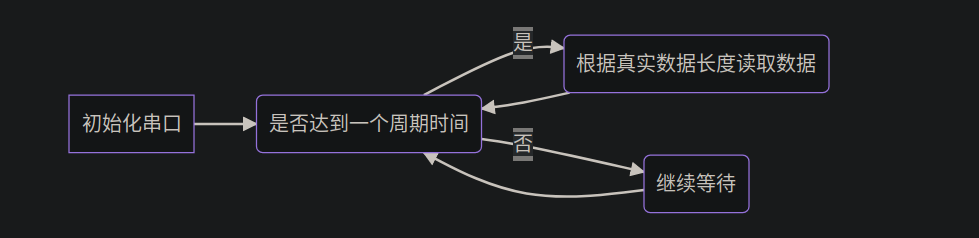

# ROS2手写接收IMU数据(Imu)代码并发布

环境

> ROS2 humble
>  Ubuntu22.04
>
> 维特科技JY62

* 串口接收IMU数据 
* 解析IMU数据
* ROS2发布IMU数据
* 利用rviz2可视化检查          

## 接收IMU数据

确保串口权限开启，并且 docker能够访问串口即可

### python接收串口数据

在Ubuntu连接了串口之后，我们就可以使用python来读取IMU的数据了

这里用到了python的serial库

    sudo apt install python3-serial

为确保读取IMU数据的准确性，我们用python读取串口的方法是，在一个周期下，收取该周期内所有信息，每隔time，将数据返回一次

因此，我们需要按照如下设置我们的串口
```python
# 串口初始化
IMU_Usart = serial.Serial(
   				port = '/dev/ttyUSB0',      # 串口
   				baudrate=115200,            # 波特率
   				timeout = 0.04             # 由于后续使用read按照一个timeout周期时间读取数据
                               # imu在波特率115200返回数据时间大概是1ms,9600下大概是10ms
                               # 所以读取时间设置0.001s
        )
# ----读取IMU的内部数据-----------------------------------
try:
   count = IMU_Usart.inWaiting()
   if count > 0:
       # 接收数据至缓存区
        Read_buffer=self.IMU_Usart.read(40)         # 我们需要读取的是40个寄存器数据，即40个字节
except KeyboardInterrupt:
   if serial != None:
       print("close serial port")
       self.IMU_Usart.close()

#--------------------------------------------------------
```

其中`.inWaiting()`函数的作用如下：

> 用于检查串口缓冲区中等待读取的字节数。
>  在串口通信中，发送方发送的数据可能需要一定时间才能到达接收方。因此，接收方需要先将接收到的数据存储在缓冲区中，等待读取。.inWaiting() 方法可以用于检查当前串口缓冲区中等待读取的字节数，以便读取相应数量的字节。



## ROS2发布IMU数据

在跑通了整个读取数据的流程，并与卖家给的上位机返回的数据对比没问题之后，下一步就是需要将数据转换为ROS2的数据格式，并将其发布出来，ROS2中IMU的数据格式类型如下

```shell
std_msgs/Header header      # 时间戳和坐标系ID
geometry_msgs/Quaternion orientation # 四元数形式的方向
float64[9] orientation_covariance # 方向估计的协方差矩阵
geometry_msgs/Vector3 angular_velocity # 三维角速度
float64[9] angular_velocity_covariance # 角速度估计的协方差矩阵
geometry_msgs/Vector3 linear_acceleration # 三维线性加速度
float64[9] linear_acceleration_covariance # 线性加速度估计的协方差矩阵
```

* header：标准的ROS消息头，包含测量的时间戳和坐标系。
  * 时间戳没有单位，坐标系ID是字符串类型；
* orientation：以四元数形式表示的IMU传感器的方向，以 geometry_msgs/Quaternion 消息表示。四元数表示从IMU坐标系到由header指定的参考坐标系的旋转。四元数应该被归一化。
  * 四元数表示的方向没有单位；
* orientation_covariance：一个包含9个元素的数组，表示方向估计的协方差矩阵。矩阵以行优先顺序存储。协方差值应以(x、y、z、x-y、x-z、y-z)的顺序表示。
  * 协方差矩阵是无单位的；
* angular_velocity：以IMU坐标系表示的IMU传感器的角速度，以 geometry_msgs/Vector3 消息表示。
  * 角速度以弧度/秒（rad/s）为单位
* angular_velocity_covariance：一个包含9个元素的数组，表示角速度估计的协方差矩阵。矩阵以行优先顺序存储。协方差值应以(x、y、z、x-y、x-z、y-z)的顺序表示。
  * 角速度估计的协方差矩阵是以 (rad/s)^2 为单位的；
* linear_acceleration：以IMU坐标系表示的IMU传感器的线性加速度，以 geometry_msgs/Vector3 消息表示。
  * 线性加速度以米/秒²（m/s²）为单位；
* linear_acceleration_covariance：一个包含9个元素的数组，表示线性加速度估计的协方差矩阵。矩阵以行优先顺序存储。协方差值应以(x、y、z、x-y、x-z、y-z)的顺序表示。
  * 线性加速度估计的协方差矩阵是以 (m/s²)^2 为单位的。

注意，这里需要用到ROS2的`serial`库，但是由于在ROS2 humble中并没有此库，因此，我们需要去下载这个库的源码，并手动安装，安装的教程参考我之前的这篇：

> ## ROS2安装serial库
>
> ### 国内git仓库（ROS2 humble已测试可用）(==这个好用==)
>
> [ROS2 foxy serial (github.com)https://github.com/ZhaoXiangBox/serial](https://github.com/ZhaoXiangBox/serial)
>
> 如果是在ros1中，他可以直接使用以下命令安装包
>
> ```bash
> sudo apt install ros-melodic-serial
> ```
>
> 但是在ROS2中，`serial`的包并没有放入到ROS2的官网当中，所以搜索包库后，找不到这个对应的`serial`包，经过搜索，找到答案，需要自己去编译源码并安装
>
> 参考博客
>  https://blog.csdn.net/slampai/article/details/127876015 
>
> https://github.com/wjwwood/serial

> ## ==优先使用上面那个==
>
> ## Installation
>
> ### Dependencies
>
> - CMake:
>  - CMake is required for building the system and can be located here: http://www.cmake.org/
> 
> ### Compiling
> 
>Once you have gathered the dependencies, you need to checkout the software from github.com:
> 
>```
>     git clone https://github.com/wjwwood/serial.git
>  ```
>
> Once you have checked out the source code from github.com you can enter the directory and build the software.
>
> ```
>    cd serial
>     make
>    make test # (optional) builds the example and tests, and runs the tests.
>     make doc  # (optional) builds _this_ documentation.
> ```
>
> ### Installing
>
> To install simply:
>
> ```
>     sudo make install
> ```
>
> To uninstall simply:
>
> ```
>     sudo make uninstall
> ```

## serial编写样例

### cpp

```c++
//serial_port.cpp 
#include <ros/ros.h> 
#include <serial/serial.h> 
#include <iostream>  
int main(int argc, char** argv) {    
	ros::init(argc, argv, "serial_port");    //创建句柄（虽然后面没用到这个句柄，但如果不创建，运行时进程会出错）    
	ros::NodeHandle n;        //创建一个serial类    
	serial::Serial sp;    //创建timeout    
	serial::Timeout to = serial::Timeout::simpleTimeout(100);    //设置要打开的串口名称    
	sp.setPort("/dev/ttyUSB0");    //设置串口通信的波特率    
	sp.setBaudrate(115200);    //串口设置timeout    
	sp.setTimeout(to);     
try{        //打开串口        
    sp.open();}    
catch(serial::IOException& e){       
	ROS_ERROR_STREAM("Unable to open port.");        
	return -1;    
	}        //判断串口是否打开成功 
    
if(sp.isOpen())
	{ROS_INFO_STREAM("/dev/ttyUSB0 is opened.");}    
    else
        return -1；
ros::Rate loop_rate(500);    
while(ros::ok())    {        //获取缓冲区内的字节数        
    size_t n = sp.available();        
    if(n!=0){           
     uint8_t buffer[1024];            //读出数据            
     n = sp.read(buffer, n);                        
        for(int i=0; i<n; i++){                //16进制的方式打印到屏幕                
        std::cout << std::hex << (buffer[i] & 0xff) << " ";            }            
        std::cout << std::endl;            //把数据发送回去            
        sp.write(buffer, n);        }        
    loop_rate.sleep();    }        //关闭串口    
sp.close();     
return 0;
```

```c++


    serial::Serial ser; //声明串口对象
     
    ser.setPort("/dev/ttyUSB0");//串口设备
    ser.setBaudrate(115200);//设置波特率
     
    //设置一个严格的延时，一开始我以为是打开串口这个动作的延时；后来经过使用发现是每次读取串口数据到缓存区的时间，这个时间越大，读取到缓存区数据量越大
    //括号里面的数字单位是milliseconds即毫秒
    //下面附上了原文，我怕我解释错了
    serial::Timeout to = serial::Timeout::simpleTimeout(1000);
    ser.setTimeout(to);
     
    ser.open();//打开串口
     
    ser.available();//读取到缓存区数据的字节数
     
    ser.read(ser.available());//读出缓存区缓存的数据
```

### Cmakelists:

```cmake
find_package(serial)

add_executable(data_pub src/serial_control.cpp)
ament_target_dependencies(data_pub rclcpp serial ...)

install(TARGETS
  data_pub
  DESTINATION lib/${PROJECT_NAME}  
)
```

### packages.xml:

```xml
<depend>serial</depend>
```


## IMU接收和车轮编码器接收样例代码：

```cpp
#include<iostream>
#include<string>
#include<serial/serial.h>
#include<functional>
#include<memory>
#include<cmath>
#include<thread>
#include<mutex>
#include<condition_variable>

#include"rclcpp/rclcpp.hpp"
#include"sensor_msgs/msg/imu.hpp"
#include "tf2_msgs/msg/tf_message.hpp"
#include "tf2/LinearMath/Quaternion.h"
#include "tf2_geometry_msgs/tf2_geometry_msgs.hpp"

#include "geometry_msgs/msg/twist.hpp"
#include "nav_msgs/msg/odometry.hpp"


typedef union
{
    float data;
    uint8_t byte[4];
}byte_to_float;


namespace imu_data_pub{

    byte_to_float buffer_to_send[3];
    bool is_paused;

    using imu_message = sensor_msgs::msg::Imu;
    using odm = nav_msgs::msg::Odometry;
    using CMD = geometry_msgs::msg::Twist;

    class IMU :public rclcpp::Node
    {
        //friend class Subscriber;
        public:
        explicit IMU(const std::string &name):Node(name)
        {
            my_serial.setPort("/dev/ttyACM0");
            my_serial.setBaudrate(115200);
            my_serial.setTimeout(to);
            world_x = 0.0;
            world_y = 0.0;
            world_theta= 0.0;
            loop = std::make_shared<rclcpp::Rate>(1);
            is_paused = true;

            pub_ = this->create_publisher<imu_message>("imu_data",10);
            pub_motor = this->create_publisher<odm>("odom_raw",10);
            //sub_ = this->create_subscription<CMD>("cmd_vel",10,std::bind(&IMU::receive_callback,this,std::placeholders::_1));

            //thread_ = std::thread(&IMU::write_data,this);
        }

        void serial_func()
        {
            try{
                my_serial.open();
            }
            catch(serial::IOException& e)
            {
                RCLCPP_ERROR(this->get_logger(),"Unable to open the port");
                return;
            }

            if(my_serial.isOpen())
            {
                RCLCPP_INFO(this->get_logger(),"Open succeed !!!");
                
                //is_paused = false; // 恢复子线程
                //cv.notify_all();   // 通知子线程恢复执行
                
            }
        }

        void data_decode()
        {
            //RCLCPP_INFO(this->get_logger(),"ddddddd");
            while (rclcpp::ok())
            {
                size_t n = my_serial.available();
                if(n!=0)
                {
                    //RCLCPP_INFO(this->get_logger(),"ddddddd");
                    uint8_t buffer[54];
                    n = my_serial.read(buffer,n);
                    if(n == 54 && verify_data(buffer))
                    {
                        //RCLCPP_INFO(this->get_logger(),"!!!");
                        uint_to_float(buffer);
                        transform_form_to();
                        pub_imu_data();
                        pub_motor_data();
                        //RCLCPP_INFO(this->get_logger(),"world:%.3f, %.3f, %.3f",world_x,world_y,world_theta);
                    }
                }
            }
        }

        private:
            serial::Serial my_serial;
            serial::Timeout to = serial::Timeout::simpleTimeout(0.04);
            byte_to_float buffer_decoded[13];
            const float MOTOR_R=37.5;
            const float cal_matrix[4][3]={
                {1.0,-1.0,-250.0},
                {1.0,1.0,-250.0},
                {1.0,-1.0,250.0},
                {1.0,1.0,250.0} };
            double vel_last[3];
            double time_last;
            double world_x;
            double world_y;
            double world_theta;
            tf2::Quaternion orientation_motor;
            double vel[3];
            

            //发布
            rclcpp::Publisher<imu_message>::SharedPtr pub_ ;
            rclcpp::Publisher<odm>::SharedPtr pub_motor;

            //接收
            //rclcpp::Subscription<CMD>::SharedPtr sub_;
            std::thread thread_;
            std::mutex mutex_2;
            std::condition_variable cv;
            std::mutex cv_mutex;

            std::shared_ptr<rclcpp::Rate> loop;
            
            
            bool verify_data(const uint8_t *data)
            {
                if(data[0] == 0x55 && data[53] == 0xff)
                    return true;
                else
                {
                    RCLCPP_INFO(this->get_logger(),"Invalid data");
                    return false;
                }
            }

            void uint_to_float(uint8_t *buffer_point)
            {
                size_t n=1;
                for(int i=0;i<13;i++)
                {
                    for(int j=0;j<4;j++)
                    {
                        buffer_decoded[i].byte[j]=buffer_point[n];
                        n++;
                    }
                }
            }

            void transform_form_to()
            {
                double time_now=0.0;

                double bot_dx = 0.0;
                double bot_dy = 0.0;

                double bot_relate_to_world_dx =0.0;
                double bot_relate_to_world_dy =0.0;

                orientation_motor.setX(0.0);
                orientation_motor.setY(0.0);
                orientation_motor.setZ(std::sin(world_theta/2.0));
                orientation_motor.setW(std::cos(world_theta/2.0));

                vel[0] = (  buffer_decoded[9].data + buffer_decoded[12].data + buffer_decoded[11].data + buffer_decoded[10].data)*MOTOR_R/4;
                vel[1] = -(- buffer_decoded[9].data + buffer_decoded[12].data - buffer_decoded[11].data + buffer_decoded[10].data)*MOTOR_R/4;
                vel[2] = (- buffer_decoded[9].data - buffer_decoded[12].data + buffer_decoded[11].data + buffer_decoded[10].data)*MOTOR_R/4.0/250.0;
                RCLCPP_INFO(this->get_logger(),"%.3f %.3f %.3f",vel[0],vel[1],vel[2]);
                time_now = this->get_clock()->now().seconds();
                double dt = time_now - time_last; 

                bot_dx = vel[0]*dt/1000.0;
                bot_dy = vel[1]*dt/1000.0;
                world_theta += vel[2]*dt;
                
                bot_relate_to_world_dx = bot_dx*std::cos(world_theta) - bot_dy*std::sin(world_theta);
                bot_relate_to_world_dy = bot_dx*std::sin(world_theta) + bot_dy*std::cos(world_theta);

                world_x += bot_relate_to_world_dx;
                world_y += bot_relate_to_world_dy;
                
                std::copy(std::begin(vel),std::end(vel),std::begin(vel_last));
                time_last = time_now;
            }

            void pub_imu_data()
            {
                imu_message::SharedPtr imu_data;
                imu_data = std::make_shared<imu_message>();

                tf2::Quaternion orientation;
                orientation.setRPY(buffer_decoded[3].data,buffer_decoded[4].data,buffer_decoded[5].data);

                imu_data->header.frame_id = "map";
                imu_data->header.stamp = this->get_clock()->now();
                imu_data->linear_acceleration.x=buffer_decoded[0].data;
                imu_data->linear_acceleration.y=buffer_decoded[1].data;
                imu_data->linear_acceleration.z=buffer_decoded[2].data;
                imu_data->orientation.x = orientation.x();
                imu_data->orientation.y = orientation.y();
                imu_data->orientation.z = orientation.z();
                imu_data->orientation.w = orientation.w();
                imu_data->angular_velocity.x=buffer_decoded[6].data;
                imu_data->angular_velocity.y=buffer_decoded[7].data;
                imu_data->angular_velocity.z=buffer_decoded[8].data;
                
                pub_->publish(*imu_data);
            }

            void pub_motor_data()
            {
                odm::SharedPtr odm_data;
                odm_data = std::make_shared<odm>();
                odm_data->header.stamp = this->get_clock()->now();
                odm_data->header.frame_id = "odom";
                odm_data->pose.pose.position.x = world_x;
                odm_data->pose.pose.position.y = world_y;
                odm_data->pose.pose.position.z = 0;
                odm_data->pose.pose.orientation.x = orientation_motor.x();
                odm_data->pose.pose.orientation.y = orientation_motor.y();
                odm_data->pose.pose.orientation.z = orientation_motor.z();
                odm_data->pose.pose.orientation.w = orientation_motor.w();
                odm_data->child_frame_id = "base_link";
                odm_data->twist.twist.linear.x = vel[0]/1000.0;
                odm_data->twist.twist.linear.y = vel[1]/1000.0;
                odm_data->twist.twist.linear.z = 0.0;
                odm_data->twist.twist.angular.x = 0.0; 
                odm_data->twist.twist.angular.y = 0.0;
                odm_data->twist.twist.angular.z = vel[3]/1000.0;

                pub_motor->publish(*odm_data);
            }
    };

int main (int argc, char **argv)
{
    rclcpp::init(argc,argv);
    auto node = std::make_shared<imu_data_pub::IMU>("imu_pub");
    node->serial_func();
    node->data_decode();
    rclcpp::spin(node);
/*
    node->serial_func();
    node->data_decode();
    rclcpp::spin(node);
*/
    rclcpp::shutdown();
}


/*
░░░░░░░░░░░░░░░░░░░░░░░░▄░░
░░░░░░░░░▐█░░░░░░░░░░░▄▀▒▌░
░░░░░░░░▐▀▒█░░░░░░░░▄▀▒▒▒▐░
░░░░░▄▄▀▒░▒▒▒▒▒▒▒▒▒█▒▒▄█▒▐░
░░░▄▀▒▒▒░░░▒▒▒░░░▒▒▒▀██▀▒▌░
░░▐▒▒▒▄▄▒▒▒▒░░░▒▒▒▒▒▒▒▀▄▒▒░
░░▌░░▌█▀▒▒▒▒▒▄▀█▄▒▒▒▒▒▒▒█▒▐
░▐░░░▒▒▒▒▒▒▒▒▌██▀▒▒░░░▒▒▒▀▄
░▌░▒▄██▄▒▒▒▒▒▒▒▒▒░░░░░░▒▒▒▒
▀▒▀▐████▌▄░▀▒▒░░░░░░░░░░▒▒▒
狗狗保佑代码无bug！
*/
```

