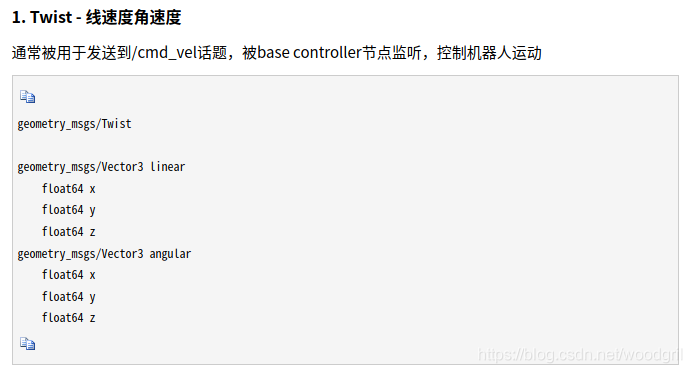

2、发送速度的命令 :

（期间可以用tab健补全）

```shell
rostopic pub /cmd_vel geometry_msgs/Twist "linear:
```

3、监听速度

```shell
rostopic echo /cmd_vel
```

4、监听反馈速度

```shell
rostopic echo /raw_vel
```

5、先让机器人转圈

```shell
rostopic pub -r 10 /cmd_vel geometry_msgs/Twist '{linear: {x: 0.1, y: 0, z: 0}, angular: {x: 0, y: 0, z: -0.5}}'
```

6、让机器人直行

```shell
rostopic pub -r 10 /cmd_vel geometry_msgs/Twist '{linear: {x: 0.1, y: 0, z: 0}, angular: {x: 0, y: 0, z: 0}}'
```

