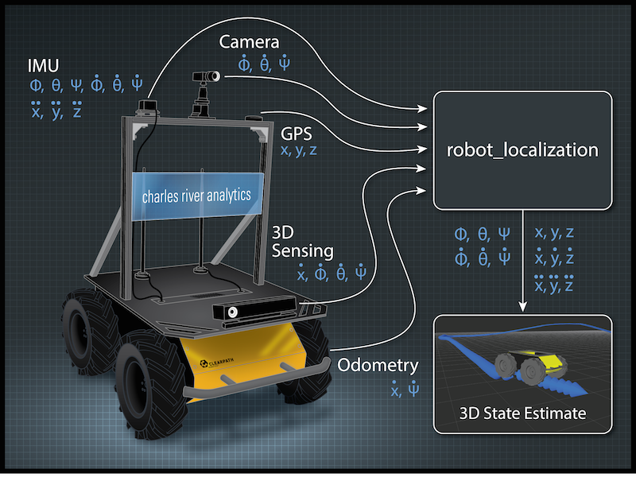

# robot_localization(1)：介绍，[安装和状态估计节点](https://blog.csdn.net/learning_tortosie/article/details/103346412)

## 1 robot_localization

`robot_localization`是状态估计节点的集合，每个节点都是非线性状态估计器的一种实现，用于在3D空间中移动的机器人。它包括两个状态估计节点`ekf_localization_node`和`ukf_localization_node`。另外，`robot_localization`提供`navsat_transform_node`，它有助于集成GPS数据。

Github：https://github.com/cra-ros-pkg/robot_localization

文档：http://docs.ros.org/melodic/api/robot_localization/html/index.html#
 

## 1.1 特性

`robot_localization`中的所有状态估计节点都具有共同的特征，即：

- 融合任意数量的传感器。节点不限制传感器的数量。例如，如果您的机器人具有多个IMU或里程计信息，则`robot_localization`中的状态估计节点可以支持所有传感器。
- 支持多种ROS消息类型。`robot_localization`中的所有状态估计节点都可以接收[nav_msgs/Odometry](http://docs.ros.org/api/nav_msgs/html/msg/Odometry.html)，[sensor_msgs/Imu](http://docs.ros.org/api/sensor_msgs/html/msg/Imu.html)，[geometry_msgs/PoseWithCovarianceStamped](http://docs.ros.org/api/geometry_msgs/html/msg/PoseWithCovarianceStamped.html)，或[geometry_msgs/TwistWithCovarianceStamped](http://docs.ros.org/api/geometry_msgs/html/msg/TwistWithCovarianceStamped.html)消息。
- 自定义每个传感器的输入。如果给定的传感器消息包含您不希望包含在状态估计中的数据，则`robot_localization`中的状态估计节点允许您排除该数据。
- 连续估计。`robot_localization`中的每个状态估计节点在收到一次测量结果后便开始估算车辆的状态。如果传感器数据中有间歇（即很长一段时间，没有收到任何数据），则滤波器将继续通过内部运动模型来估算机器人的状态。

所有状态估计节点都跟踪车辆的15维状态：

```shell
X,Y,Z,roll,pitch,yaw,X˙,Y˙,Z˙,roll˙,pitch˙,yaw˙,X¨,Y¨,Z¨
```

## 1.2 其他资源

如果您不熟悉`robot_localization`，请查看[2015 ROSCon演讲](https://vimeo.com/142624091)，以获取入门指南。

可以在[本文](http://docs.ros.org/melodic/api/robot_localization/html/_downloads/robot_localization_ias13_revised.pdf)中找到更多详细信息：

> @inproceedings{MooreStouchKeneralizedEkf2014,
>  author = {T. Moore and D. Stouch},
>  title = {A Generalized Extended Kalman Filter Implementation for the Robot Operating System},
>  year = {2014},
>  month = {July},
>  booktitle = {Proceedings of the 13th International Conference on Intelligent Autonomous Systems (IAS-13)},
>  publisher = {Springer}
>  }

# 2 安装robot_localization

## 2.1 使用ubuntu软件源安装

```
sudo apt-get install ros-kinetic-robot-localization

```

## 2.2 使用源码安装

```
mkdir -p catkin_ws/src
cd catkin_ws/src
git clone https://github.com/cra-ros-pkg/robot_localization --branch kinetic-devel
cd ..
catkin_make -DCMAKE_BUILD_TYPE=Release
source catkin_ws/devel/setup.bash
```

## 3 状态估计节点

## 3.1 ekf_localization_node

`ekf_localization_node`是[扩展卡尔曼滤波器](http://en.wikipedia.org/wiki/Extended_Kalman_filter)的实现。它使用全向运动模型来及时预测状态，并使用感知到的传感器数据校正预测的估计值。

## 3.2 ukf_localization_node

`ukf_localization_node`是[无迹卡尔曼过滤器](http://en.wikipedia.org/wiki/Kalman_filter#Unscented_Kalman_filter)的实现。它使用一组精心选择的sigma点，以通过EKF中使用的相同运动模型来投影状态，然后使用这些投影的sigma点来恢复状态估计和协方差。这消除了雅可比矩阵的使用，并使滤波器更稳定。但是，与`ekf_localization_node`相比，它在计算上也更加繁重。

## 3.3 参数

`ekf_localization_node`和`ukf_localization_node`共享它们的绝大多数参数，因为大多数参数控制在与核心滤波器融合之前如何处理数据。

可用于状态估计节点的相对大量参数使启动（launch）文件和配置（configuration）文件成为启动其任何节点的首选方法。该软件包包含启动和配置文件模板，以帮助用户入门。

### 3.3.1 ekf_localization_node和ukf_localization_node共有的参数

#### 3.3.1.1 标准参数

（1）~frequency

滤波器产生状态估计值的真实频率（单位为Hz）。

**注意：滤波器只有从输入之一接收到至少一条消息后才会开始计算。**

（2）~sensor_timeout

实值周期（以秒为单位），超过此值后我们认为任何传感器都已超时。在这种情况下，我们将对EKF进行预测周期，而无需对其进行校正。可以将此参数视为滤波器将生成新输出的最小频率的倒数。

（3）~two_d_mode

如果您的机器人在平面环境中运行，并且可以忽略地面的细微变化（如IMU所报告），则将其设置为true。它将所有3D变量（Z，侧倾，俯仰以及它们各自的速度和加速度）融合成值0。这样可以确保这些值的协方差不会爆炸，同时确保您的机器人的状态估算值仍固定在X-Y平面上。

(4）~[frame]

具体参数：

- ~map_frame
- ~odom_frame
- ~base_link_frame
- ~base_link_output_frame
- ~world_frame

这些参数定义了`robot_localization`的操作“模式”。REP-105指定三个主要坐标系：`map`，`odom`和`base_link`。`base_link`是固定在机器人上的坐标系。机器人在`odom`框架中的位置会随着时间而漂移，但在短期内是准确的，应该是连续的。`map`坐标系与`odom`坐标系一样，是固定的世界坐标系，虽然它包含您机器人的全局最准确的位置估计值，但由于GPS数据的融合，它会受到离散跳跃的影响。这是使用这些参数的方法：

a.将`map_frame`，`odom_frame`和`base_link_frame`参数设置为系统的适当坐标系名称。

注意：如果您的系统没有`map_frame`，则将其删除，并确保`world_frame`设置为`odom_frame`的值。

注意：如果您正在运行多个EKF实例，并且想“覆盖”输出转换和消息以使其`child_frame_id`具有此坐标系，则可以进行设置。`base_link_output_frame`是可选的，默认为`base_link_frame`。当运行多个EKF实例时，这有助于启用断开连接的TF树。计算完最终状态后，我们将“覆盖”输出转换和消息，以使此坐标系为其`child_frame_id`。

b.如果仅融合连续位置数据（例如车轮编码器里程计，视觉里程计或IMU数据），则将`world_frame`设置为`odom_frame`的值。这是`robot_localization`中状态估计节点的默认行为，也是最常见的用法。

c.如果您要融合受离散跳跃影响的全局绝对位置数据（例如GPS或来自地标观测的位置更新），则：

1. 将`world_frame`设置为`map_frame`的值
2. 确保其他东西正在生成`odom-> base_link`的转换。这甚至可以是`robot_localization`状态估计节点的另一个实例。但是，该实例不应融合全局数据。

`map_frame`，`odom_frame`和`base_link_frame`的默认值分别是`map`，`odom`和`base_link`。`base_link_output_frame`参数默认为`base_link_frame`的值。`world_frame`参数默认为`odom_frame`的值。

（5）~transform_time_offset

`robot_localization`包使用tf2的`lookupTransform`方法请求转换。此参数指定如果转换尚不可用我们要等待多长时间。如果未设置，则默认为0。值0表示我们只是获取了最新的可用转换（请参阅tf2实现），因此我们不会阻塞滤波器。指定非零的`transform_timeout`会影响滤波器的时序，因为它会等待最大的`transform_timeout`时间以使转换可用。这直接意味着大多数指定的期望输出速率都无法满足，因为滤波器在更新时必须等待转换。

（6）~[sensor]

对于每个传感器，用户需要根据消息类型定义此参数。例如，如果定义一个Imu消息源和两个Odometry消息源，则配置如下所示：

```xml
<param name="imu0" value="robot/imu/data"/>
<param name="odom0" value="wheel_encoder/odometry"/>
<param name="odom1" value="visual_odometry/odometry"/>
123
```

每个参数名称的索引都是从0开始的（例如odom0，odom1等），并且必须按顺序定义（例如，如果尚未定义pose1，则不要使用pose0和pose2）。每个参数的值是该传感器的话题名称。

（7）~[sensor]_config

具体参数：

- ~odomN_config
- ~twistN_config
- ~imuN_config
- ~poseN_config

对于上面定义的每个传感器消息，用户必须指定应将这些消息的哪些变量融合到最终状态估计中。里程计配置示例可能如下所示：

```xml
<rosparam param="odom0_config">[true,  true,  false,
                               false, false, true,
                               true,  false, false,
                               false, false, true,
                               false, false, false]</rosparam>
12345
```

布尔值的顺序为：
                    X,Y,Z,roll,pitch,yaw,X˙,Y˙,Z˙,roll˙,pitch˙,yaw˙,X¨,Y¨,Z¨                  
 。在此示例中，我们将位置X和Y，yaw，X˙和yaw˙融合在一起。

注意：该规范是在传感器的`frame_id`中完成的，而不是在`world_frame`或`base_link_frame`中完成的。请参阅[配置教程](http://docs.ros.org/melodic/api/robot_localization/html/configuring_robot_localization.html)以获取更多信息。

（8）~[sensor]_queue_size

具体参数：

- ~odomN_queue_size
- ~twistN_queue_size
- ~imuN_queue_size
- ~poseN_queue_size

用户可以使用这些参数来调整每个传感器的回调队列大小。如果您的频率参数值远低于传感器的频率，这很有用，因为它允许滤波器合并更新周期之间到达的所有测量值。

（9）~[sensor]_differential

具体参数：

- ~odomN_differential
- ~imuN_differential
- ~poseN_differential

对于上面定义的每个包含位姿信息的传感器消息，用户可以指定是否应差分集成位姿变量。如果给定值设置为true，则对于从相关传感器在时间t进行的测量，我们首先将减去在时间t-1处的测量值，然后将所得值转换为速度。如果您的机器人有两个绝对位姿信息源，例如来自里程计和IMU的偏航测量，则此设置特别有用。在这种情况下，如果未正确配置输入源上的方差，则这些测量值可能会彼此不同步，并在滤波器中引起振荡，但是通过对其中一个或两个进行差分集成，我们可以避免这种情况。

用户将此参数用于方向数据时应格外小心，因为转换为速度意味着方向状态变量的协方差将无限制地增长（除非融合了另一个绝对方向数据源）。如果您只是想让所有位姿变量都从0开始，那么请使用`_relative`参数。

注意：如果要通过`navsat_transform_node`或`utm_transform_node`融合GPS信息，则应确保`_differential`设置为false。

（10）~[sensor]_relative

具体参数：

- ~odomN_relative
- ~imuN_relative
- ~poseN_relative

如果将此参数设置为true，则来自该传感器的任何测量值都将相对于从该传感器接收到的第一个测量值进行融合。这在以下情况下很有用，例如，如果您希望状态估计值始终从(0,0,0)开始，并且侧倾，俯仰和偏航角值为(0,0,0)。它与`_differential`参数相似，但是我们始终在时间0删除测量，而不是在时间*t-1*删除测量，并且不将测量转换为速度。

（11）~imuN_remove_gravitational_acceleration

如果从IMU融合加速度计数据，则此参数确定在融合之前是否从重力测量中去除了由于重力引起的加速度。

注意：这假定提供加速度数据的IMU也在产生绝对方向。需要方向数据才能正确消除重力加速度。

（12）~gravitational_acceleration

如果`imuN_remove_gravitational_acceleration`设置为`true`，则此参数确定由于重力引起的Z方向的加速度，该加速度将从IMU的线性加速度数据中删除。默认值为9.80665 (m/s^2)。

（13）~initial_state

以指定状态启动过滤器。以与传感器配置相同的顺序，将状态指定为双精度的15维向量。例如，要在位置为(5.0,4.0,3.0)，偏航角为1.57和线速度为(0.1,0.2,0.3)的状态下启动机器人，则可以使用：

```xml
<rosparam param="initial_state">[5.0,  4.0,  3.0,
                                 0.0,  0.0,  1.57,
                                 0.1,  0.2,  0.3,
                                 0.0,  0.0,  0.0,
                                 0.0,  0.0,  0.0]</rosparam>
12345
```

（14）~publish_tf

如果为`true`，则状态估计节点将发布从`world_frame`参数指定的坐标系到`base_link_frame`参数指定的坐标系的转换。默认为`true`。

（15）~publish_acceleration

如果为`true`，则状态估计节点将发布线性加速状态。默认为`false`。

（16）~print_diagnostics

如果为`true`，则状态估计节点将向`/diagnostics`主题发布诊断消息。这对于调试配置和传感器数据很有用。

#### 3.3.1.2 高级参数

（1）~use_control

如果为`true`，则状态估计节点将在话题`cmd_vel`中监听[geometry_msgs/Twist](http://docs.ros.org/api/geometry_msgs/html/msg/Twist.html)消息，并使用该消息生成加速度。然后，该加速度将用于机器人的状态预测。在给定状态变量的收敛滞后即使很小的情况下，也会在您的应用程序中引起问题（例如，旋转期间LIDAR移位）的情况下，这尤其有用。默认为`false`。

注意：来自IMU的线性加速度数据的存在和包含将“覆盖”当前预测的线性加速度值。

（2）~stamped_control

如果为`true`，并且`use_control`也为`true`，则查找`geometry_msgs/TwistStamped`消息，而不是`geometry_msgs/Twist`消息。

（3）~control_timeout

如果`use_control`设置为`true`，并且在此时间内没有收到任何控制命令（以秒为单位），则基于控制的加速项将不再适用。

（4）~control_config

控制`cmd_vel`消息中的哪些变
 量用于状态预测。值的顺序为

```math
X˙,Y˙,Z˙,roll˙,pitch˙,yaw˙ 
1
```

，仅在`use_control`设置为`true`时使用。

```xml
<rosparam param="control_config">[true,  false, false,
                                  false, false, true]</rosparam>
12
```

（5）~acceleration_limits

您的机器人在每个维度上的加速度。匹配`control_config`中的参数顺序。仅在`use_control`设置为`true`时使用。

```xml
<rosparam param="acceleration_limits">[1.3, 0.0, 0.0,
                                       0.0, 0.0, 3.2]</rosparam>
12
```

（6）~deceleration_limits

您的机器人在每个纬度上的减速度。匹配`control_config`中的参数顺序。仅在`use_control`设置为`true`时使用。

（7）~acceleration_gains

如果您的机器人无法立即达到其加速度极限，则可以通过这些增益来控制允许的变化。仅在`use_control`设置为`true`时使用。

```xml
<rosparam param="acceleration_gains">[0.8, 0.0, 0.0,
                                       0.0, 0.0, 0.9]</rosparam>
12
```

（8）~deceleration_gains

如果您的机器人无法立即达到其减速极限，则可以通过这些增益来控制允许的变化。仅在`use_control`设置为`true`时使用。

（9）~smooth_lagged_data

如果您的任何传感器产生的时间戳数据都比最新的滤波器更新早（更明确地说，如果您有滞后的传感器数据源），则将此参数设置为`true`将在接收到滞后的数据后启用滤波器恢复到滞后测量之前的最后状态，然后处理所有测量直到当前时间。这对于来自需要大量CPU使用量以生成姿态估计值的节点（例如，激光扫描匹配器）进行的测量特别有用，因为它们经常落后于当前时间。

（10）~history_length

如果`smooth_lagged_data`设置为`true`，则此参数指定滤波器将保留其状态和测量历史记录的秒数。该值应至少等于滞后测量值与当前时间之间的时间增量。

（11）~[sensor]_nodelay

具体参数：

- ~odomN_nodelay
- ~twistN_nodelay
- ~imuN_nodelay
- ~poseN_nodelay

如果为`true`，则设置tcpNoDelay[传输提示](http://docs.ros.org/api/roscpp/html/classros_1_1TransportHints.html#a03191a9987162fca0ae2c81fa79fcde9)。有证据表明，Nagle的算法与及时接收大消息类型（例如[nav_msgs/Odometry](http://docs.ros.org/api/nav_msgs/html/msg/Odometry.html)消息）有关。将输入设置为`true`会禁用该订阅者的Nagle算法。默认为`false`。

（12）~[sensor]_threshold

具体参数：

- ~odomN_pose_rejection_threshold
- odomN_twist_rejection_threshold
- poseN_rejection_threshold
- twistN_rejection_threshold
- imuN_pose_rejection_threshold
- imuN_angular_velocity_rejection_threshold
- imuN_linear_acceleration_rejection_threshold

如果您的数据存在异常值，请使用这些阈值设置（表示为[马氏距离](http://en.wikipedia.org/wiki/Mahalanobis_distance)）来控制允许传感器测量值距当前车辆状态的距离。如果未指定，则每个默认值均为`numeric_limits<double>::max()`。

（13）~debug

布尔标志，指定是否在调试模式下运行。警告：将其设置为`true`将生成大量数据。数据将写入`debug_out_file`参数的值。默认为`false`。

（14）~debug_out_file

如果`debug`为`true`，则将调试输出写入的文件。

（15）~process_noise_covariance

过程噪声协方差（通常表示为Q）用于对滤波算法预测阶段的不确定性建模。调整可能很困难，并且已作为参数公开以方便自定义。可以单独保留此参数，但是通过调整它可以取得更好的结果。通常，相对于输入消息中给定变量的方差，Q值越大，滤波器将收敛到测量值的速度就越快。

（16）~dynamic_process_noise_covariance

如果为`true`，将根据机器人的速度动态缩放`process_noise_covariance`。例如，当您希望机器人的静止状态下机器人的估计误差协方差停止增长时，这很有用。默认为`false`。

（17）~initial_estimate_covariance

估计协方差（通常表示为P）定义了当前状态估计中的误差。该参数允许用户设置矩阵的初始值，这将影响滤波器收敛的速度。例如，如果用户将位置[0,0]的值设置为非常小的值，例如1e-12，然后尝试将X位置的测量值与X的高方差值融合在一起，则滤波器将非常缓慢，无法“信任”这些测量，并且收敛所需的时间将增加。同样，用户应注意此参数。当仅融合速度数据时（例如，没有绝对姿态信息），用户可能将不希望将绝对姿态变量的初始协方差值设置为大数。这是因为那些误差将无限制地增长（由于缺乏绝对姿态测量来减小误差），并且以大的值开始将不会使状态估计受益。

（18）~reset_on_time_jump

如果设置为`true`且`ros::Time::isSimTime()`为`true`，则在检测到某个话题的时间跳回时，过滤器将重置为未初始化状态。这在处理bag数据时很有用，因为可以在不重新启动节点的情况下重新启动bag。

（19）~predict_to_current_time

如果设置为`true`，则滤波器可以预测和校正直到最近一次测量的时间（默认情况下），但现在还将预测到当前时间步长。

（20）~disabled_at_startup

如果设置为true，则不会在启动时运行滤波器。

#### 3.3.1.3 特定于节点的参数

标准和高级参数对于`robot_localization`中的所有状态估计节点都是通用的。本节详细介绍了各自状态估计节点所特有的参数。

`ukf_localization_node`的参数遵循[原始论文](http://ieeexplore.ieee.org/xpls/abs_all.jsp?arnumber=882463&tag=1)和[Wiki文章](http://en.wikipedia.org/wiki/Kalman_filter#Unscented_Kalman_filter)的术语。

- `~alpha`：控制sigma点的传播。除非您熟悉无迹的Kalman滤波器，否则最好将此设置保留为默认值0.001
- `~kappa`：还控制sigma点的传播。除非您熟悉无迹的Kalman滤波器
- `~beta`：与状态向量的分布有关。默认值为2表示分布是高斯分布。像其他参数一样，除非用户熟悉无迹的Kalman滤波器，否则该参数应保持不变。

### 3.3.2 发布的话题

- odometry/filtered ([nav_msgs/Odometry](http://docs.ros.org/api/nav_msgs/html/msg/Odometry.html))
- accel/filtered ([geometry_msgs/AccelWithCovarianceStamped](http://docs.ros.org/api/geometry_msgs/html/msg/AccelWithCovarianceStamped.html)) （如果启用）

### 3.3.3 发布的变换

如果用户的`world_frame`参数设置为`odom_frame`的值，则将转换从`odom_frame`参数给出的坐标系发布到`base_link_frame`参数给出的坐标系。如果用户的`world_frame`参数设置为`map_frame`的值，则将转换从`map_frame`参数给出的坐标系发布到`odom_frame`参数给出的坐标系。

注意：此模式假定另一个节点正在广播从`odom_frame`参数给定的坐标系到`base_link_frame`参数给定的坐标系的转换。这可以是`robot_localization`状态估计节点的另一个实例。

### 3.3.4 服务

`set_pose`：通过向`set_pose`主题发出[geometry_msgs/PoseWithCovarianceStamped](http://docs.ros.org/api/geometry_msgs/html/msg/PoseWithCovarianceStamped.html)消息，用户可以手动设置过滤器的状态。这对于在测试期间重置过滤器很有用，并允许与rviz进行交互。可选地，状态估计节点通告类型为[robot_localization/SetPose](http://docs.ros.org/api/robot_localization/html/srv/SetPose.html)的`SetPose`服务。

# 参考

https://www.jianshu.com/p/415b288c8f3d

https://www.jianshu.com/p/975af69cd718