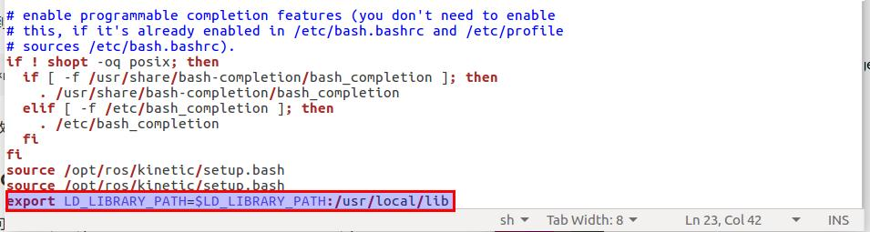

# 找不到LIBSERIAL.SO文件

查看之前的安装可以看到，默认安装目录是**/usr/local/lib/libserial.so**

```shell
/usr/local/_setup_util.py
/usr/local/env.sh
/usr/local/setup.bash
/usr/local/local_setup.bash
/usr/local/setup.sh
/usr/local/local_setup.sh
/usr/local/setup.zsh
/usr/local/local_setup.zsh
/usr/local/.rosinstall
/usr/local/lib/pkgconfig/serial.pc
/usr/local/share/serial/cmake/serialConfig.cmake
/usr/local/share/serial/cmake/serialConfig-version.cmake
/usr/local/share/serial/package.xml
/usr/local/lib/libserial.so
/usr/local/include/serial/serial.h
/usr/local/include/serial/v8stdint.h
```


## 解决方法：

```shell
robots@Robots-ubuntu1604:~$ sudo gedit ~/.bashrc
```

这里提供一种方法，其他的可以自己查看。[参考](https://my.oschina.net/u/2306127/blog/1617233)
在当前用户的配置文件 **~/.bashrc**下加入命令**export LD_LIBRARY_PATH=$LD_LIBRARY_PATH:/usr/local/lib**。这个目录正好是我们需要的.so文件所在的目录。



关闭terminal然后重新打开就可以正常使用了。