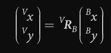

# Foundation

## Representing Position and Orientation

* scalar: to specify distance
* vector: to specify a location.

**Pose:** combination of **position** and **orientation**.

-The difference of two points is a vector. The pose of the coordinate frame is denoted by the symbol ξ.


坐标系变换公式：（transform it with respect to A coordinate）
$$
^AP=^A\xi_B·{^BP}
$$
位姿(**Pose**)也可以进行组合：
$$
^A\xi_C=^A\xi_B\quad \oplus\quad ^B\xi_C
$$


### 运算规则：


> $\xi\ominus0$  意味着从  $\xi$  中去掉一个相对坐标中去掉一个相对坐标


## Working in Two DimenSions ( 2D )

使用笛卡尔坐标系（Cartesian coordinate）描述二维向量：
$$
p=x\widehat \alpha+y\widehat \beta
$$


Concret representation of the pose is **3-vector** $^A\xi_B$~(x, y, $\theta$)

>  we use the symbol ==∼== to denote that the two representations are **equivalent**.

### 2.1  Oritation:

#### 2.1.1  Orthonormal Rotation Matrix

​	Express the ponit **P** with respect to {**V**} :
$$
\begin{split}
^VP= \ ^Vx\widehat \alpha_v+\ ^Vy\widehat \beta_v \\
	=(\widehat \alpha_v,\ \widehat \beta_v)
	\left\{
 \begin{matrix}
   ^Vx  \\
   ^Vy 
  \end{matrix}
  \right\}
\end{split}
$$
Coordinate {B} :


Express the ponit **P** with respect to {**B**}:


$$
\begin{split}
^BP= \ ^Bx\widehat \alpha_B+\ ^By\widehat \beta_B \\
	=(\widehat \alpha_B,\ \widehat \beta_B)
	\left\{
 \begin{matrix}
   ^Bx  \\
   ^By 
  \end{matrix}
  \right\}
\end{split}
$$


故：




> 
>
> 
>
> is a 2-dimensional rotation matrix with some special properties: 
>
> *  it is ==orthonormal== (also called orthogonal **正交**) since each of its columns is a unit  vector and the columns are orthogonal." 
> *  the columns are the unit vectors that defi ne the axes of the rotated frame Y with respect to X and are by defi nition both unit-length and orthogonal. 
> *  it belongs to the special orthogonal group of dimension 2 or $R ∈ SO(2) ⊂ R^{2×2}$ .  This means that the product of any two matrices belongs to the group, as does  its inverse. 
> *  its determinant is +1, which means that the length of a vector is unchanged  after transformation, that is, 
> *  the inverse is the same as the transpose, that is, $R^{-1}=R^T$

#### 2.1.2 Matrix Exponential (矩阵指数)：

预备知识： **李群代数**

Represent a **scalar** to a **skew-symmetric** matix

矩阵对数运算可以将单一旋转角度表示在**反斜对称矩阵**


### 2.2 Pose in 2-Dimensions

#### 2.2.1 Homogeneous Transformation Matrix ( 齐次变换矩阵 )


where t=(x,y) is the translation of the frame and the orientation is $^AR_B$

> **齐次坐标**
>
> 将本维度的笛卡尔坐标系**升维****就可以实现**坐标平移**
>
> 二维向量的第三个分量为1，二维点的第三个分量是0.
>
> A vector **p= (x, y)** is written in homogeneous form as p ∈ P2 , **p = (x1, x2, x3)** where x = x1/x3,  y = x2/x3 and x3≠ 0. The dimension has been increased by one and a point on a plane is now  represented by a 3-vector. 
>
> To convert a point to homogeneous form we typically append an element equal to one **p = (x, y, 1)**. The tilde indicates the vector is homogeneous. Homogeneous vectors have the important property that p is equivalent to λp for all λ ≠ 0  which we write as p $ λp. That is p represents the same point in the plane irrespective of the  overall scaling factor

$$
^AP=\left\{
\begin{matrix}
^AR_B & t\\
0_{1×2} & 1
\end{matrix}
\right\}\ ^BP\\
=^AT_B\ ^BP
$$


#### 2.2.2 Center of Rotation

可以选定旋转的中心

#### 2.2.3 Twist in 2D

Given any two frames we can find a rotational center that will rotate the frame into the second. In matlab, we can use:
$$
tw=Twist('R',C);
\\R为旋转矩阵，C为旋转中心
$$


## Working in Three Dimensions (3D)

We can express the coordinate like this:
$$
p=x\widehat \alpha+y\widehat \beta +z\widehat \gamma
$$


### 3.1 Orthonormal  Rotation Matrix 


$$
R_x(\theta) = \begin{bmatrix}
1 & 0 & 0 \\
0 & \cos(\theta) & -\sin(\theta) \\
0 & \sin(\theta) & \cos(\theta)
\end{bmatrix}
$$

$$
R_y(\theta) = \begin{bmatrix}
\cos(\theta) & 0 & \sin(\theta) \\
0 & 1 & 0 \\
-\sin(\theta) & 0 & \cos(\theta)
\end{bmatrix}
$$

$$
R_z(\theta) = \begin{bmatrix}
\cos(\theta) & -\sin(\theta) & 0 \\
\sin(\theta) & \cos(\theta) & 0 \\
0 & 0 & 1
\end{bmatrix}
$$

> ==Euler’s rotation theorem==:
>
> Any rotation can be represented by not more than 3 dimensions about coordinate axes.

### 3.2 Three-Angle Representations 

Two classes of rotation sequence:

* Eulerian : Involves repetition but not successive 
  * ```XYX, XZX, YXY, YZY, ZXZ, or ZYZ```
* Cardanian
  * ```XYZ, XZY, YZX, YXZ, ZXY, or ZYX```

properties:
$$
R=R_z(\phi)R_z(\psi)=R_z(\phi+\psi)
$$


==Cardan angles==(Roll-pitch-yaw):

| ZYX  | roll pitch yaw | arm          |
| ---- | -------------- | ------------ |
| XYZ  | roll pitch yaw | mobile robot |


### 3.3 Singularities and Gimbal Lock  aka(万向节锁或奇点)


  	The situation the rotation angle of the middle gimbal is **parallel**, we say it lose **one degree of freedom**.


### 3.4 Two Vector Representation

For **arm-type** robots,  it is useful to consider a coordinate frame {E} attached to the end-effector. 

$\widehat a = (a_x,a_y,a_z)$   ----------   represent z-zxis(called approach vector)

$\widehat o = (o_x,o_y,o_z)$-------------   represent orientation.

Two unit vectors are sufficient to define **the rotation matrix** (The remaining vector can be computed)
$$
R = \left \{
\begin{matrix}
n_x && o_x && a_x \\
n_y && o_y && a_y \\
n_z && o_z && a_z \\
\end{matrix}
\right\}
$$

### 3.5 Rotation about an Arbitrary Vector 

Converting from angle and vector to a rotation matrix is achieved by this:
$$
R = I_{3*3}+sin{\theta}[\widehat v]_x+(1-cos\theta)[\widehat v]^2_x
$$
[v] is a **skew-symmetric matrix**

### 3.6 Matrix Exponentials


### 3.7 Unit Quaternions 

The quaternion is an extension of the complex number.
$$
q=s+v \\
=s+v_1i+v_2j+v_3k
$$
**Unit quaternion can be considered as rotation of $\theta$ about the unit vector $\widehat v$**
$$
q = \cos\frac{\theta}{2}<\widehat v\sin\frac{\theta}{2}>
$$

## POSE  in -Dimensions


### Homogeneous Transformation Matrix

**Point** Present:
$$
^AP=\left\{
\begin{matrix}
^AR_B & t\\
0_{1×2} & 1
\end{matrix}
\right\}\ ^BP\\
= ^AT_B\ ^BP
$$
$^AT_B$ is a homogeneous transformation matix.


### Vector-Quaternion Pair

 A compact and practical representation is **the vector** and **unit quaternion pair**

* easy
* singularity free

