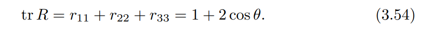

## Angular Velocities

Examining the body frame at times **t**  and **t + $\Delta t$ **  , the rotation of angle $\Delta \theta$ about some uint axis $\widehat w$ passing through the origin. 

* The ratio $\vec \theta =  \frac{\Delta \theta}{\Delta t}$ is the rate of rotation $ \theta $
* $ \widehat w $  --------  instantaneous **axis** of rotation

**angular velocity** : 
$$
w = \widehat w \vec \theta
$$

These three equations can be rearranged into the following single 3 × 3 matrix equation:
$$
\vec R = [...]=w_s × R
$$

> 
>
> 
>
> 

## Exponential Coordinate Representation of Rotation

parametrize a rotation matrix in terms of a rotation

* $\widehat w \theta$  exponential coordinate representation 
* $\widehat w$ and $\theta$ individually is the **axis-angle** representation

S

### Essential Results from Linear Differential Equations 

* The linear differential equation:
  * $\vec x(t) = Ax(t)$            
    * A $\in$ $R^{n*n}$ 
    * $\vec x(t)\in R^n$ 
* Initial condition :
  * $x(0)=x_0$

* Solution:
  * $x(t) = e^{At}x_0$ 

### Exponential Coordinates of Rotation

### 		                                                   

This rotation can be achieved by imagining that p(0) rotates at a constant rate of 1 rand/s from time $t = 0$ to $t = \theta$ 

The velocity of p(t) :
$$
\vec p = \widehat w × p\\
=[w]p
$$
Then $\vec P$ is tangent to the path with magnitude ||p||sin φ.

The solution of this equation($[w]^3$=$-[w]$ ):
$$
p(t) = e^{[x]t}p(0)
$$

the matrix exponential of $[\widehat ω]θ = [\widehat ωθ] ∈ so(3)$ is
$$
e^{[\widehat w]\theta} = I+[\widehat w]\theta+[\widehat w]^2\frac{\theta^2}{2!}+[\widehat w]^3\frac{\theta}{3!}+...\\
=I+(\theta - \frac{\theta^3}{3!}+\frac{\theta^5}{5!}-...)[\widehat w]+(\frac{\theta^2}{2!}-\frac{\theta^4}{4!}+..)[\widehat w]^2 \\
=I+\sin\theta[\widehat w]+(1-cos\theta)[\widehat w]^2
$$

==Rodrigues’ formula for rotations==:

$R' = e^{[\widehat w]\theta }R = Rot(\widehat w , \theta)R$    Orientation achieved by rotation R by $\theta $  in the fixed frame

$R''=R e^{[\widehat w]\theta}  = RRot(\widehat w , \theta)$  Orientation achieved by rotation R by $\theta $ in the body frame

The orientation of the frame {b} can be represented by

* R
* unit axis $\widehat w$ and angle $\theta$
* $\widehat w \theta$

### Matrix Logarithm of Rotation

The matrix logarithm is the inverse of the matrix exponential. Just as the matrix exponential “**integrates**” the matrix representation of an angular velocity $[ˆω]θ ∈ so(3)$ for one second to give an orientation R ∈ SO(3), the matrix logarithm “**differentiates**” an R ∈ SO(3) to find the matrix representation of a constant angular velocity [ˆω]θ ∈ so(3) which, if integrated for one second, rotates a frame from I to R. In other words:
$$
EXP: [\widehat w]\theta \in so(3)   \rightarrow R\in SO(3)  \\
LOG: R \in so(3)   \rightarrow [\widehat w]\theta \in SO(3)
$$

* **$\widehat ω$θ ∈ R** 3 represents the exponential coordinates of a rotation matrix R
* the skew-symmetric matrix $[\widehat ωθ] = [\widehat ω]θ$ is the ==matrix logarithm== of the rotation R.

#### When the $\theta \neq k\pi$ 

Expend each entry for  $e^{[\widehat w]\theta}$ in Equation (3.51):

> $\widehat w = (\widehat w_1,\widehat w_2,\widehat w_3)\\s\theta =sin\theta   \\ c\theta =  \cos\theta$

Setting the above matrix equal to the given R ∈ SO(3) and subtracting the transpose from both sides leads to the following:

Therefore, as long as sin $θ \neq 0$ (or, equivalently, θ is not an integer multiple of π), we can write:

The above equations can also be expressed in skew-symmetric matrix form a

If any $\theta$ satisfying :

such that $\theta$ is not an integer multiply  of $\pi$

#### When the $\theta = k\pi$ 

When k is an odd integer (corresponding to θ = ±π, ±3π, . . ., which in turn implies tr R = −1), the exponential formula (3.51) simplifies to:
$$
R= e^{[\widehat w]\pi} = I+2[\widehat w]^2  \tag{3.55}
$$
The three diagonal terms of Equation (3.55) can be manipulated to give：
$$
\widehat w_i = \sqrt{\frac{r_{ii}+1}{2}} \ \ , i=1,2,3  \tag{3.56}
$$
The off-diagonal terms lead to the following three equations:
$$
2\widehat w_1 \widehat w_2 = r_{12} \\
2\widehat w_2 \widehat w_3 = r_{23} \\
2\widehat w_4 \widehat w_3 = r_{13}
\tag{3.57}
$$

## Rigid-Body Motions and twists

