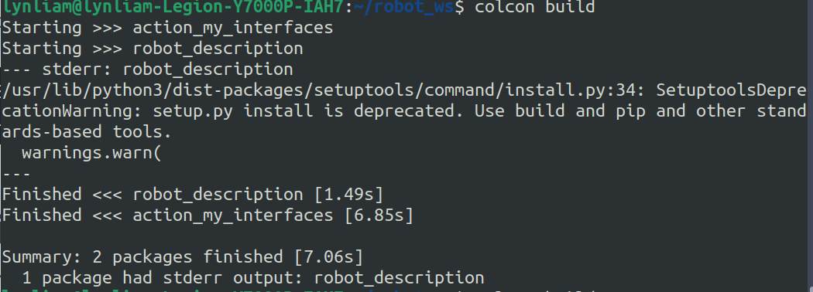

# SetuptoolsDeprecationWarning: setup.py install is deprecated

## 问题描述：



提示 setup.py install方法已经被弃用。

## 原因：

我们的```setuptools```版本太新


## 解决方法：

更换```setuptools```版本

```shell
sudo pip3 install setuptools==58.2.0
```

查看```setuptools```版本

```shell
python3 

>>>import setuptools
>>>print(setuptools.__version__)
```

