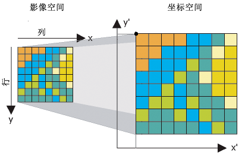

# SLAM建图


## 图像基础

* 尺度地图
  * 尺度地图表示尺寸距离，按比例缩小
* 拓扑地图
  * 表示点与点之间的连接信息
* 语义地图
  * 添加语义，比如该处是哪里

### 地图的储存

地图一般以图片的形式存储下来。

### 栅格地图



采用概率来解决无法完全确定前方某个位置是否有物体，我们可以采用概率来解决这一问题，认为确实有物体的栅格的占据率为100%，确定没有物体的栅格占据率为0%，不确定的栅格就用（确认占据概率/确认非占据概率）值表示占据率。由此我们知道**占据栅格地图就是一张写满占据率的格子组成的地图**。


## SLAM建图

SLAM是同步定位与地图构建(Simultaneous Localization And Mapping)。机器人**通过自身传感器数据处理进行位置估计**，同时通过**不断移动完成对整个未知环境的地图构建**。这就是SLAM解决的问题。

几个比较关键的技术：

1. **传感器感知** 通过各类传感器实现对环境的感知，比如通过激光雷达获取环境的深度信息。同时可以通过传感器融合来提高位置估计的精度，比如融合轮式里程计、IMU、雷达、深度相机数据等。
2. **视觉/激光里程计** 基本原理是通过**前后数据之间对比得出机器人位置的变化**。
3. **回环检测** 判断机器人是否到达之前到过的位置，可以解决位置估计误差问题，建图时可以纠正地图误差。


### [SLAM算法分类](https://fishros.com/d2lros2/#/humble/chapt10/get_started/1.SLAM前世今生?id=_3slam算法分类)

从算法的对数据的处理方式上看，目前常用的SLAM开源算法可以分为两类

1.**基于滤波**，比如扩展卡尔曼滤波（EKF: Extended Kalman Filter）、粒子滤波(PF: Particle Filter)等。

ROS中的gmapping、hector_slam算法都是基于滤波实现的。

2.**基于图优化**，先通过传感器进行构图，然后对图进行优化。

目前比较主流的是图优化的方法，Cartographer就是基于图优化实现的。图优化相对于滤波，不用实时的进行计算，效率更高，消耗的资源更少，所以在实际场景中使用的更多。

## [4.SLAM开源库](https://fishros.com/d2lros2/#/humble/chapt10/get_started/1.SLAM前世今生?id=_4slam开源库)

### [4.1. Cartographer](https://fishros.com/d2lros2/#/humble/chapt10/get_started/1.SLAM前世今生?id=_41-cartographer)

github地址：https://github.com/cartographer-project/cartographer

Cartographer是一个可跨多个平台和传感器配置以2D和3D形式提供实时同时定位和建图（SLAM）的系统。

### [4.2. ORB_SLAM2(纯视觉)](https://fishros.com/d2lros2/#/humble/chapt10/get_started/1.SLAM前世今生?id=_42-orb_slam2纯视觉)

github地址：https://github.com/raulmur/ORB_SLAM2

ORB-SLAM2是用于单目，双目和RGB-D相机的实时SLAM库，用于计算相机轨迹和稀疏3D重建

### [4.3 VINS](https://fishros.com/d2lros2/#/humble/chapt10/get_started/1.SLAM前世今生?id=_43-vins)

github地址：https://github.com/HKUST-Aerial-Robotics/VINS-Mono

VINS-Mono是单目视觉惯性系统的实时SLAM框架。它使用基于优化的滑动窗口配方来提供高精度的视觉惯性测距。


## Carto与地图

### [Cartographer介绍与安装](https://fishros.com/d2lros2/#/humble/chapt10/get_started/2.Carto介绍及安装?id=_2-cartographer介绍与安装)

Cartographer是Google开源的一个可跨多个平台和传感器配置以2D和3D形式提供实时同时定位和建图（SLAM）的系统。

> github地址：https://github.com/cartographer-project/cartographer 文档地址：https://google-cartographer.readthedocs.io/en/latest


### Cartographer安装

```shell
sudo apt install ros-humble-cartographer
sudo apt install ros-humble-cartographer-ros


#源码安装

#将下面的源码克隆到fishbot_ws的src目录下：
git clone https://ghproxy.com/https://github.com/ros2/cartographer.git -b ros2
git clone https://ghproxy.com/https://github.com/ros2/cartographer_ros.git -b ros2

#安装依赖
wget http://fishros.com/install -O fishros && . fishros
rosdepc install -r --from-paths src --ignore-src --rosdistro $ROS_DISTRO -y

#编译（这里有一个新的命令--packages-up-to，意思是其所有依赖后再编译该包）
colcon build --packages-up-to cartographer_ros
```

### [Cartographer参数配置](https://fishros.com/d2lros2/#/humble/chapt10/get_started/2.Carto介绍及安装?id=_3cartographer参数配置)

作为一个优秀的开源库，Cartographer提供了很多可以配置的参数，虽然灵活性提高了，但同时也提高了使用难度（需要对参数进行调节配置），所以有必要在正式使用前对参数进行基本的介绍。

因为我们主要使用其进行2D的建图定位，所以我们只需要关注2D相关的参数。

#### [前端参数](https://fishros.com/d2lros2/#/humble/chapt10/get_started/2.Carto介绍及安装?id=_31-前端参数)

**文件：trajectory_builder_2d** 

```
src/cartographer/configuration_files/trajectory_builder_2d.lua
```

请你打开这个文件自行浏览，小鱼对其中我们可能会在初次建图配置的参数进行介绍。

```lua
  -- 是否使用IMU数据
  use_imu_data = true, 
  -- 深度数据最小范围
  min_range = 0.,
  -- 深度数据最大范围
  max_range = 30.,
  -- 传感器数据超出有效范围最大值时，按此值来处理
  missing_data_ray_length = 5.,
  -- 是否使用实时回环检测来进行前端的扫描匹配
  use_online_correlative_scan_matching = true
  -- 运动过滤，检测运动变化，避免机器人静止时插入数据
  motion_filter.max_angle_radians
```

#### [后端参数](https://fishros.com/d2lros2/#/humble/chapt10/get_started/2.Carto介绍及安装?id=_32-后端参数)

**文件：pose_graph.lua**-后端参数配置项

路径`src/cartographer/configuration_files/pose_graph.lua`

该文件主要和地图构建

```lua
--Fast csm的最低分数，高于此分数才进行优化。
constraint_builder.min_score = 0.65
--全局定位最小分数，低于此分数则认为目前全局定位不准确
constraint_builder.global_localization_min_score = 0.7
```

#### [Carotgrapher_ROS参数配置](https://fishros.com/d2lros2/#/humble/chapt10/get_started/2.Carto介绍及安装?id=_33-carotgrapher_ros参数配置)

该部分参数主要是用于和ROS2进行通信和数据收发的配置，比如配置从哪个话题读取里程记数据，从哪个话题来获取深度信息（雷达）。

**文件：backpack_2d.lua**

路径：`src/cartographer_ros/cartographer_ros/configuration_files/backpack_2d.lua`

```lua
include "map_builder.lua"
include "trajectory_builder.lua"

options = {
  map_builder = MAP_BUILDER,
  trajectory_builder = TRAJECTORY_BUILDER,
  -- 用来发布子地图的ROS坐标系ID，位姿的父坐标系，通常是map。
  map_frame = "map",
  -- SLAM算法跟随的坐标系ID
  tracking_frame = "base_link",
  -- 将发布map到published_frame之间的tf
  published_frame = "base_link",
  -- 位于“published_frame ”和“map_frame”之间，用来发布本地SLAM结果（非闭环），通常是“odom”
  odom_frame = "odom",
  -- 是否提供里程计
  provide_odom_frame = true,
  -- 只发布二维位姿态（不包含俯仰角）
  publish_frame_projected_to_2d = false,
  -- 是否使用里程计数据
  use_odometry = false,
  -- 是否使用GPS定位
  use_nav_sat = false,
  -- 是否使用路标
  use_landmarks = false,
  -- 订阅的laser scan topics的个数
  num_laser_scans = 0,
  -- 订阅多回波技术laser scan topics的个数
  num_multi_echo_laser_scans = 1,
  -- 分割雷达数据的个数
  num_subdivisions_per_laser_scan = 10,
  -- 订阅的点云topics的个数
  num_point_clouds = 0,
  -- 使用tf2查找变换的超时秒数
  lookup_transform_timeout_sec = 0.2,
  -- 发布submap的周期间隔
  submap_publish_period_sec = 0.3,
  -- 发布姿态的周期间隔
  pose_publish_period_sec = 5e-3,
  -- 轨迹发布周期间隔
  trajectory_publish_period_sec = 30e-3,
  -- 测距仪的采样率
  rangefinder_sampling_ratio = 1.,
  --里程记数据采样率
  odometry_sampling_ratio = 1.,
  -- 固定的frame位姿采样率
  fixed_frame_pose_sampling_ratio = 1.,
  -- IMU数据采样率
  imu_sampling_ratio = 1.,
  -- 路标采样率
  landmarks_sampling_ratio = 1.,
}
```


