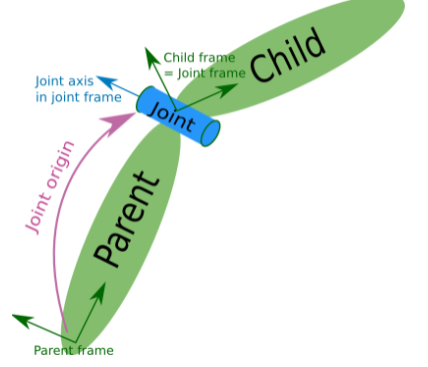

# 机器人建模

## URDF

URDF（Unified Robot Description Format）统一机器人描述格式，URDF使用XML格式描述机器人文件.

> **XML 文档形成了一种树结构，它从“根部”开始，然后扩展到“枝叶”**。
>
> **所有 XML 元素都须有关闭标签**
>
> **XML 文档必须有根元素**
>
> **XML 的属性值须加引号**
>
> **注释**：<!-- This is a comment --> 

### 组成部分

* 一个声明信息

```xml
<?xml version="1.0"?>
<robot name="fishbot">
     
</robot>
```


* 两种关键组件

把机器人组成部件称为```Link```，```Link```和```Link```之间的连接部分称之为```joint```关节


### Link介绍

#### [2.1 link标签定义](https://fishros.com/d2lros2foxy/#/chapt8/8.1URDF统一机器人建模语言?id=_21-link标签定义)

link的子标签列表

- visual 显示形状

  - ```
    <geometry> 
    ```

    (几何形状)

    - ```
      <box>
      ```

       长方体

      - 标签属性: `size`-长宽高
      - 举例：`<box size="1 1 1" />`

    - ```
      <cylinder>
      ```

       圆柱体

      - 标签属性:`radius` -半径 `length`-高度
      - 举例：`<cylinder radius="1" length="0.5"/>`

    - ```
      sphere
      ```

       球体

      - 属性：`radius` -半径
      - 举例：`<sphere radius="0.015"/>`

    - ```
      mesh
      ```

       第三方导出的模型文件

      - 属性：filename
      - 举例:` <mesh filename="package://robot_description/meshes/base_link.DAE"/>`

  - origin (可选：默认在物体几何中心)

    - 属性 `xyz`默认为零矢量 `rpy`弧度表示的翻滚、俯仰、偏航
    - 举例：`<origin xyz="0 0 0" rpy="0 0 0" />`

  - material 材质

    - 属性 

      ```
      name
      ```

       名字

      - color 
        - 属性 `rgba` a代表透明度
        - 举例：`<material name="white"><color rgba="1.0 1.0 1.0 0.5" /> </material>`

- collision  碰撞属性，仿真章节中讲解

- inertial 惯性参数 质量等，仿真章节中讲解

***example    $\downarrow$$\downarrow$$\downarrow$$\downarrow$$\downarrow$***

```xml
<?xml version="1.0"?>
<robot name="fishbot">
    
  <!-- base link -->
  <link name="base_link">
      <visual>
      <origin xyz="0 0 0.0" rpy="0 0 0"/>
      <geometry>
        <cylinder length="0.12" radius="0.10"/>
      </geometry>
    </visual>
  </link>
    
  <!-- laser link -->
  <link name="laser_link">
      <visual>
      <origin xyz="0 0 0" rpy="0 0 0"/>
      <geometry>
        <cylinder length="0.02" radius="0.02"/>
      </geometry>
      <material name="black">
          <color rgba="0.0 0.0 0.0 0.5" /> 
      </material>
    </visual>
  </link>
    
  <!-- laser joint -->
    <joint name="laser_joint" type="fixed">
        <parent link="base_link" />
        <child link="laser_link" />
        <origin xyz="0 0 0.075" />
    </joint>

</robot>
```

### 


### Joint介绍

joint为机器人关节，机器人关节用于连接两个机器人部件，主要写明父子关系

- 父子之间的连接类型，包括是否固定的，可以旋转的等
- 父部件名字
- 子部件名字
- 父子之间相对位置
- 父子之间的旋转轴，绕哪个轴转



### [3.1 joint标签详解](https://fishros.com/d2lros2foxy/#/chapt8/8.1URDF统一机器人建模语言?id=_31-joint标签详解)

#### [joint属性](https://fishros.com/d2lros2foxy/#/chapt8/8.1URDF统一机器人建模语言?id=joint属性)

- name 关节的名称
- type 关节的类型
  - **revolute: 旋转关节，绕单轴旋转,角度有上下限,比如舵机0-180**
  - **continuous: 旋转关节，可以绕单轴无限旋转,比如自行车的前后轮**
  - **fixed: 固定关节，不允许运动的特殊关节**
  - prismatic: 滑动关节，沿某一轴线移动的关节，有位置极限
  - planer: 平面关节，允许在xyz，rxryrz六个方向运动
  - floating: 浮动关节，允许进行平移、旋转运动

#### [joint的子标签](https://fishros.com/d2lros2foxy/#/chapt8/8.1URDF统一机器人建模语言?id=joint的子标签)

- ```
  parent
  ```

   父link名称

  - ` <parent link="base_link" />`

- ```
  child
  ```

  子link名称

  - `<child link="laser_link" />`

- ```
  origin
  ```

   父子之间的关系xyz rpy

  - ` <origin xyz="0 0 0.014" />`

- ``axis``
  
   围绕旋转的关节轴

  - `<axis xyz="0 0 1" />`