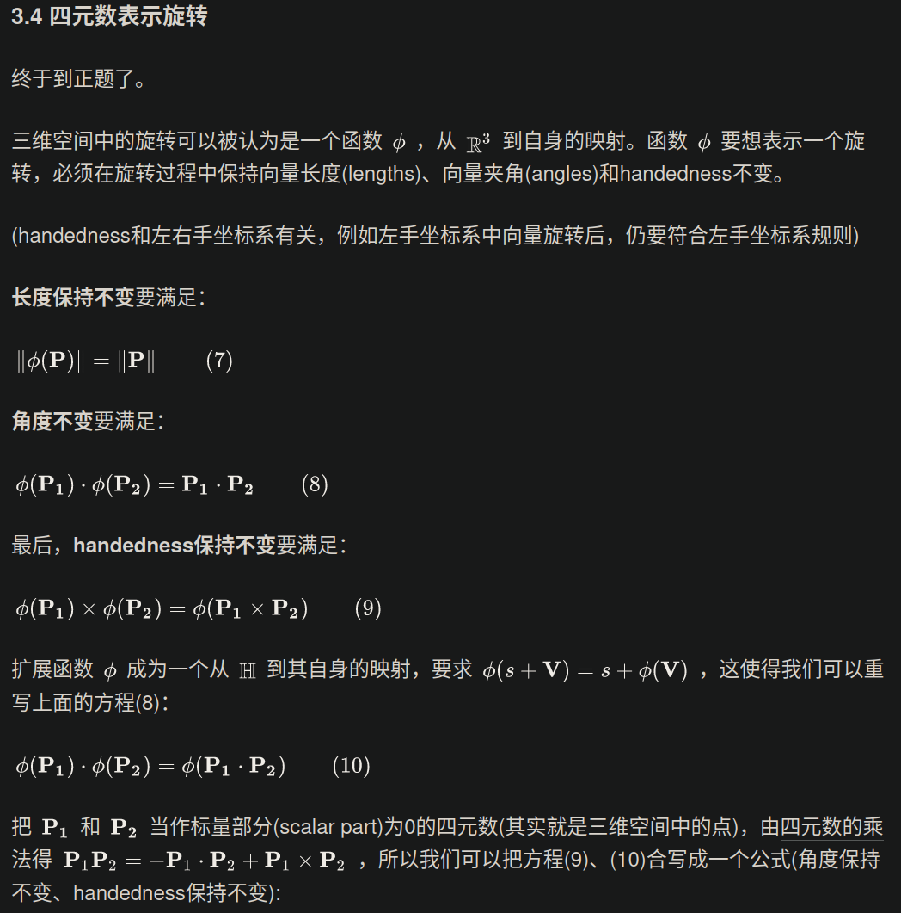
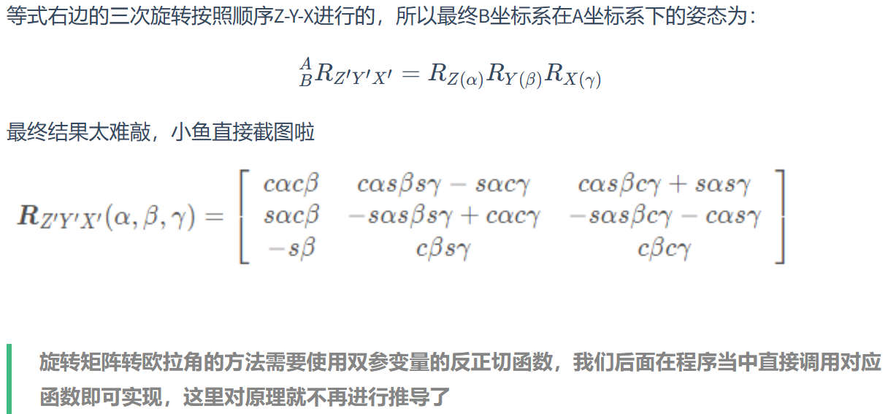

# 刚体旋转知识

------

## 轴角法

### 等效轴角坐标系的表示法


轴角法用一个轴和一个角来表示。

缺点：

* 当旋转角度为0的时候，旋转轴可以任意
* 两字旋转难以合成


## 四元数法

------

### 前置数学知识

在二维下复数的实矩阵：
$$
z=a+bi
$$

$$
复数的矩阵形式：M=\left[\begin{matrix}
a&-b\\
b&a
\end{matrix}\right]
$$

$$
数学处理：\left[\begin{matrix}
a&-b\\
b&a
\end{matrix}\right]
=
\sqrt{a^2+b^2}\left[\begin{matrix}
\frac{a}{\sqrt{a^2+b^2}}&-\frac{b}{\sqrt{a^2+b^2}}\\
\frac{b}{\sqrt{a^2+b^2}}&\frac{a}{\sqrt{a^2+b^2}}
\end{matrix}\right]
=
\sqrt{a^2+b^2}\left[\begin{matrix}
\cos{\theta}&-\sin{\theta}\\
\sin{\theta}&-\cos{\theta}
\end{matrix}\right]
$$

复数变换z，实际上是将向量缩放了```||z||```并旋转了z与实轴夹角theta   

四元数：
$$
q=a+bi+ci+dk,(a,b,c,d)
$$

$$
i^2=j^2=k^2=ijk=-1
$$

$$
q=[w,v](v=\left[\begin{matrix}
x\\
y\\
z
\end{matrix}\right]，w为标量)
$$

模长：
$$
||q||=\sqrt{a^2+b^2+c^2+d^2}
$$
加减法：

相应分量相加减

与标量相乘：-

$$
sq=a(a+bi+cj+dk)
$$
sq=qs   :四元数与标量的乘法满足交换律

四元数乘法不满足交换律，满足结合律和分配律。


#### 复数的矩阵形式：

$$
q_1 = a+bi+cj+dk  ;
q_2 = e+fi+gj+hk
$$


四元数相乘是一个线性组合:   
$$
q_1q_2 = \left[\begin{matrix}
a&-b&-c&-d\\
b&a&-d&c\\
c&d&a&-b\\
d&-c&b&a
\end{matrix}\right]
\left[\begin{matrix}
e\\
f\\
g\\
h
\end{matrix}\right]
$$


Graβmann积：
$$
令v=\left[\begin{matrix}
b\\
c\\
d
\end{matrix}\right],
u=\left[\begin{matrix}
f\\
g\\
h
\end{matrix}\right],v·u=bf+cg+dh,v×u = 
\left[\begin{matrix}
i&j&k\\
b&c&d\\
f&g&h
\end{matrix}\right]=
(ch-dg)i-(bh-df)j+(bg-cf)k
$$

$$
q_1q_2的点乘叉乘形式(Graβmann积)：q_1q_2 = [ae-v·u,au+ev+v×u]
$$

纯四元数：
$$
v=[0,v]
$$
 只有虚部的四元数。

逆和共轭：

把四元数的乘法pq的逆运算定义为pq<sup>-1</sup>或者q<sup>-1</sup>p，令q<sup>-1</sup>是q 的逆，规定：
$$
qq^{-1}=q^{-1}q=1
$$
定义四元数的共轭:
$$
q=a+bi+cj+dk;q^*=a-bi-cj-dk
$$
标量向量有序对表示：
$$
q=[w,v];q^*=[w,-v]
$$

$$
qq^* = [w^2+v·v,0]
$$


### 遵循的运算规则：

共轭规则:


> 1. 一个四元数共轭的共轭是该四元数本身。
> 2. 两个四元数和的共轭是它们共轭的和。
> 3. 两个四元数乘积的共轭是它们共轭调换顺序后的乘积。

模规则: 


> 1. 一个四元数的模等于其共轭的模。
> 2. 两个四元数乘积的模等于它们模的乘积

乘法法则:


Linearity:  


### 单位四元数：

模长为1的四元数为**单位四元数**，$u_q$为单位三维向量。
$$
\widehat q=(\sin(\phi)u_q,\cos(\phi))=\sin(\phi)u_q+\cos(\phi)=e^{\phi u_q}
$$
单位向量适合创建 **旋转**和**定向**

满足：$\widehat q^{-1}=\widehat q^*$

### 四元数变换：

本小节学习一四元数的一个子类，即单位四元数(unit quaternions，其模为1)。单位四元数可以以简单紧凑的方式表示任何3D旋转。


首先，把一个点或向量 $p=(p_x,p_y,p_z,p_w)^T$的四个坐标分别放进一个四元数$\widehat p$的各个分量中，假设我们有一单位四元素$\widehat q=(\sin(\phi)u_q,\cos(\phi))$.可证》：
$$
\widehat qp\widehat q^{-1} \tag{2}
$$
公式（2）将会让$\widehat p$饶轴$u_q$旋转$2\phi$弧度

> 任何 $\widehat q$ 的非零实数倍都和表示相同的旋转变换。这意味着和$-\widehat q$表示相同的旋转，即同时对旋转轴 $u_q$ 取负，对实部 $q_w$ 取负，则创建一个和原始四元数一样的旋转。这也意味着从一个矩阵中提取的四元数可能是或者 。




### 三维旋转与四元数

如果将一个向量v沿着一个用单位向量所定义的旋转轴u旋转θ度，将向量v拆分为正交于旋转轴的向量V<sub>⊥</sub>和平行于旋转轴的向量V<sub> ∥</sub>，然后对向量进行旋转，得到v<sup>'</sup>=v<sup>′</sup><sub>⊥</sub>+V<sup>'</sup><sub> ∥</sub>


### 四元数与几大方法之间的转换

四元数转旋转矩阵


旋转矩阵转四元数


四元数转欧拉角


轴角转四元数


## 欧拉角

------

欧拉角是用来唯一的确定定点转动刚体位置的三个一组独立角参量，由**章动角**，**进动角**和**自转角**组成。绕三个坐标轴依次进行旋转。

* 欧拉角的万向节死锁（Gimbal Lock）

当旋转过程中有两个旋转轴重合了，那么就丧失了一个自由度，三轴线性相关，不能构成三维空间。


## 姿态的不同表示法

* 旋转矩阵
  * 旋转矩阵
* 坐标轴旋转
  * 固定轴欧拉角
  * 非固定欧拉角
* 任意轴旋转 
  * 等效轴角
  * 四元数


常用的坐标转换包括：

- `固定角`与`四元数`互转
- `固定角`与`旋转矩阵`互转
- `四元数`与`旋转矩阵`互转


#### 旋转矩阵：

$$
^A_PR = \left[\begin{matrix}
P_x·A_x&P_y·A_x&P_z·A_x\\
P_x·A_y&P_y·A_y&P_z·A_y\\
P_x·A_z&P_y·A_z&P_z·A_z
\end{matrix}\right]
$$

## 绕某一轴旋转***θ***角的旋转矩阵

#### X轴：

$$
R(x,\theta) = \left[\begin{matrix}
1&0&0\\
0&\cos{\theta}&-\sin{\theta}\\
0&\sin{\theta}&\cos{\theta}
\end{matrix}\right]
$$


#### y轴：

$$
R(y,\theta) = \left[\begin{matrix}
\cos{\theta}&0&\sin{\theta}\\
0&1&0\\
-\sin{\theta}&0&\cos{\theta}
\end{matrix}\right]
$$


#### z轴：

$$
R(z,\theta) = \left[\begin{matrix}
\cos{\theta}&-\sin{\theta}&0\\
\sin{\theta}&\cos{\theta}&0\\
0&0&1
\end{matrix}\right]
$$

## 欧拉角

#### 十二种旋转顺序

- `xyz`,`xyx`, `xzy`
- `xzx`,`yzx`, `yzy`
- `yxz`, `yxy` , `zxy`
- `zxz`, `zyx`, `zyz`

#### 两种参考坐标系

参考固定坐标系


参考自身坐标系


### 固定轴欧拉角旋转矩阵

们可以假设一个向量v固定在B坐标系上，那我们让B坐标系绕着A坐标系的三个轴做旋转，就可以认为是让向量v绕着坐标系A的三个轴做旋转，那先转的肯定先乘。

相乘的时候，应该是左乘旋转矩阵


### 非固定轴的欧拉角

#### 1.1. ZYX

将每一次的拆解
$$
^A_BR = ^A_{B'}R^{B'}_{B''}RB^{B''}_{B'''}R
$$



## 轴角

任何姿态都可以通过选择适当的轴和角度得到

#### 轴角转旋转矩阵

假设坐标系B和参考坐标系A重合，将B绕着A坐标系下的矢量^AK*A**K*按右手定则旋转\theta*θ*角度，旋转之后B坐标系在A坐标系下的姿态可以用
$$
^A_BR(K,\theta)
$$
K为单位矢量（模长为1），
$$
^AK = [K_x,k_y,k_z]^T
$$


***θ***的符号由右手定则确定，大拇指为矢量K的方向

旋转矩阵转轴角转换原理：https://en.wikipedia.org/wiki/Rotation_matrix#Axis_of_a_rotation


