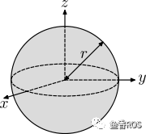

# 机器人仿真（Gazebo）

## 模型添加物理参数：

### 碰撞检测

在机器人仿真中，我们要对物体之前是否接触，是否发生碰撞做检测，常用的检测方法比如包围盒，判断两个物体的包围盒是否相交来快速判断物体是否发生碰撞。

collision可以包含的子标签如下：

- origin，表示碰撞体的中心位姿
- geometry，用于表示用于碰撞检测的几何形状
- `material`，可选的，描述碰撞几何体的材料(这个设置可以在gazebo仿真时通过view选项看到碰撞包围体的形状)

```xml
    <collision>
      <origin xyz="0 0 0.0" rpy="0 0 0"/>
      <geometry>
        <cylinder length="0.12" radius="0.10"/>
      </geometry>
      <material name="blue">
          <color rgba="0.1 0.1 1.0 0.5" /> 
      </material>
    </collision>
```


### 旋转惯量

旋转惯量矩阵是用于描述物体的惯性的，在做动力学仿真的时候，这些参数尤为重要。

> **惯性矩阵**：
>
> 惯性矩阵描述的是物体的惯性张量在x,y,z三个坐标轴上的投影的矩阵形式
>
> **常见三维几何物体张量矩阵**
>
> ### 1.实心球体
>
> 半径为r，质量为m的是实心球体
>
> #### 形状
>
> 实心球体
>
> #### 矩阵
>
> 矩阵
>
> ### 2.空心球体
>
> 半径为r，质量为m的是空心球体
>
> #### 形状
>
> 空心球体
>
> #### 矩阵
>
> 矩阵
>
> ### 3.实心椭球
>
> 半轴长度为a , b , c，质量m的实心椭球
>
> #### 形状
>
> 实心椭球
>
> #### 矩阵
>
> 矩阵
>
> ### 4.实心长方体
>
> 宽度为w，高度为h，深度为d，质量为m 的实心长方体
>
> #### 形状
>
> 长方体
>
> #### 矩阵
>
> 矩阵
>
> ### 5.绕细长杆末端
>
> 沿y轴长度为l，质量为m 的绕末端旋转的细长杆
>
> #### 形状
>
> 细长杆
>
> #### 矩阵
>
> 矩阵
>
> ### 6.绕细长杆中心
>
> 沿y轴长度为l，质量为m 的绕中心旋转的细长杆
>
> #### 形状
>
> 中心细长杆
>
> #### 矩阵
>
> 
>
> 矩阵
>
> ### 7.实心圆柱体
>
> 半径为r，高度为h，质量为m 的实心圆柱体
>
> #### 形状
>
> 实心圆柱体
>
> #### 矩阵
>
> 
>
> 矩阵
>
> ### 8.圆柱管
>
> 内径为r1，外径为r2，长度为h，质量为m 的带有开口端的厚壁圆柱管
>
> #### 形状
>
> 
>
> 圆柱
>
> #### 矩阵
>
> 
>
> 矩阵
>
> ### 9.正圆锥
>
> 半径为r，高度为h，质量为m 的正圆锥
>
> #### 形状
>
> 正圆锥
>
> #### 矩阵
>
> 
>
> 矩阵
>
> ## 五、如何使用矩阵
>
> 惯性矩阵是一个3*3的对称矩阵，所以在urdf中只使用六个值描述该矩阵，对应着上面的公式赋值即可。
>
> 对称矩阵

intertial标签包含的子标签如下：

- mass，描述link的质量
- inertia，描述link的旋转惯量（该标签有六个属性值ixx\ixy\ixz\iyy\iyz\izz）

```xml
   <inertial>
      <mass value="0.2"/>
      <inertia ixx="0.0122666" ixy="0" ixz="0" iyy="0.0122666" iyz="0" izz="0.02"/>
    </inertial>
```


### 摩擦力和刚性系数

mu1,mu2代表摩擦力，kp,kd代表刚性系数。

```xml
  <gazebo reference="caster_link">
    <mu1 value="0.0"/>
    <mu2 value="0.0"/>
    <kp value="1000000.0" />
    <kd value="10.0" />
  </gazebo>
```


## Gazebo加载URDF

前置组件节点：

```shell
sudo apt install ros-humble-gazebo-ros
```

### 启动Gazebo和插件

```shell
gazebo --verbose -s libgazebo_ros_init.so -s libgazebo_ros_factory.so 
```

### 插件节点介绍

```shell
ros2 service list

/delete_entity
/get_model_list
/spawn_entity
/gazebo/describe_parameters
/gazebo/get_parameter_types
/gazebo/get_parameters
/gazebo/list_parameters
/gazebo/set_parameters
/gazebo/set_parameters_atomically
```

- /spawn_entity，用于加载模型到gazebo中
- /get_model_list，用于获取模型列表
- /delete_entity，用于删除gazbeo中已经加载的模型


### 调用服务加载URDF模型

使用`rqt`


加载多个机器人重要的是**namespace要不一样**

### 使用launch文件来加载urdf模型

```shell
import os
from launch import LaunchDescription
from launch.actions import ExecuteProcess
from launch_ros.actions import Node
from launch_ros.substitutions import FindPackageShare


def generate_launch_description():
    robot_name_in_model = 'fishbot'
    package_name = 'fishbot_description'
    urdf_name = "fishbot_gazebo.urdf"

    ld = LaunchDescription()
    pkg_share = FindPackageShare(package=package_name).find(package_name) 
    urdf_model_path = os.path.join(pkg_share, f'urdf/{urdf_name}')

    # Start Gazebo server
    start_gazebo_cmd =  ExecuteProcess(
        cmd=['gazebo', '--verbose','-s', 'libgazebo_ros_init.so', '-s', 'libgazebo_ros_factory.so'],
        output='screen')

    # Launch the robot
    spawn_entity_cmd = Node(
        package='gazebo_ros', 
        executable='spawn_entity.py',
        arguments=['-entity', robot_name_in_model,  '-file', urdf_model_path ], output='screen')

    ld.add_action(start_gazebo_cmd)
    ld.add_action(spawn_entity_cmd)


    return ld
```


## Gazebo仿真插件---两轮差速

Gazebo插件的功能

* 控制插件
* 数据采集插件


里程计：

里程计信息默认输出话题为`odom`,消息类型为`nav_msgs/msg/Odometry`

```shell
root@66ed6a552749:/# ros2 interface show nav_msgs/msg/Odometry
# This represents an estimate of a position and velocity in free space.
# The pose in this message should be specified in the coordinate frame given by header.frame_id
# The twist in this message should be specified in the coordinate frame given by the child_frame_id

# Includes the frame id of the pose parent.
# 消息发布时间
std_msgs/Header header
	builtin_interfaces/Time stamp
		int32 sec
		uint32 nanosec
	string frame_id

# Frame id the pose points to. The twist is in this coordinate frame.
# 当前机器人朝向
string child_frame_id

# Estimated pose that is typically relative to a fixed world frame.
# 表示当前机器人位置和朝向
geometry_msgs/PoseWithCovariance pose
	Pose pose
		Point position
			float64 x
			float64 y
			float64 z
		Quaternion orientation
			float64 x 0
			float64 y 0
			float64 z 0
			float64 w 1
	float64[36] covariance

# Estimated linear and angular velocity relative to child_frame_id.
# 当前机器人线速度和角速度
geometry_msgs/TwistWithCovariance twist
	Twist twist
		Vector3  linear
			float64 x
			float64 y
			float64 z
		Vector3  angular
			float64 x
			float64 y
			float64 z
	float64[36] covariance  ######？？？？？？？？
```

### URDF配置两轮差速模型

```xml
  <gazebo>
    <plugin name='diff_drive' filename='libgazebo_ros_diff_drive.so'>
          <ros>
            <namespace>/</namespace>
            <remapping>cmd_vel:=cmd_vel</remapping>
            <remapping>odom:=odom</remapping>
          </ros>
          <update_rate>30</update_rate>
          <!-- wheels -->
          <left_joint>left_wheel_joint</left_joint>
          <right_joint>right_wheel_joint</right_joint>
          <!-- kinematics -->
          <wheel_separation>0.2</wheel_separation>
          <wheel_diameter>0.065</wheel_diameter>
          <!-- limits -->
          <max_wheel_torque>20</max_wheel_torque>
          <max_wheel_acceleration>1.0</max_wheel_acceleration>
          <!-- output -->
          <publish_odom>true</publish_odom>
          <publish_odom_tf>true</publish_odom_tf>
          <publish_wheel_tf>true</publish_wheel_tf>
          <odometry_frame>odom</odometry_frame>
          <robot_base_frame>base_footprint</robot_base_frame>
      </plugin>
```


### 在RVIZ2中显示机器人模型

```shell
import os
from launch import LaunchDescription
from launch.actions import ExecuteProcess
from launch_ros.actions import Node
from launch_ros.substitutions import FindPackageShare


def generate_launch_description():
    robot_name_in_model = 'fishbot'
    package_name = 'fishbot_description'
    urdf_name = "fishbot_gazebo.urdf"

    ld = LaunchDescription()
    pkg_share = FindPackageShare(package=package_name).find(package_name) 
    urdf_model_path = os.path.join(pkg_share, f'urdf/{urdf_name}')
    gazebo_world_path = os.path.join(pkg_share, 'world/fishbot.world')


    # Start Gazebo server
    start_gazebo_cmd =  ExecuteProcess(
        cmd=['gazebo', '--verbose','-s', 'libgazebo_ros_init.so', '-s', 'libgazebo_ros_factory.so', gazebo_world_path],
        output='screen')
        
    # Launch the robot
    spawn_entity_cmd = Node(
        package='gazebo_ros', 
        executable='spawn_entity.py',
        arguments=['-entity', robot_name_in_model,  '-file', urdf_model_path ], output='screen')
    
    # Start Robot State publisher
    start_robot_state_publisher_cmd = Node(
        package='robot_state_publisher',
        executable='robot_state_publisher',
        arguments=[urdf_model_path]
    )

    # Launch RViz
    start_rviz_cmd = Node(
        package='rviz2',
        executable='rviz2',
        name='rviz2',
        output='screen',
        # arguments=['-d', default_rviz_config_path]
        )

    ld.add_action(start_gazebo_cmd)
    ld.add_action(spawn_entity_cmd)
    ld.add_action(start_robot_state_publisher_cmd)
    ld.add_action(start_rviz_cmd)


    return ld
```

