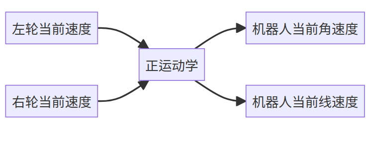

# 机器人运动学

## 分类

* 正向运动学

给定机器人各关节变量，计算及其腾末端位置姿态

* 逆向运动学

已知机器人末端姿态，反求机器人关节变量

#### 机械臂运动学

* 正运动学
* 逆运动学

#### 两轮差速底盘运动学

两个驱动轮和若干支撑轮




> ## 空间坐标描述

**位姿**即是**位置**和**姿态**的组合

* 多个含义：
  * 表示特定参考坐标系下某个物体的的位置和姿态
  * 两个坐标系之间的位置姿态
  * 两个物体之间的关系。（我们常把坐标系固定在物体上）

#### 位置的表示：

$$
^AP=\left[\begin{matrix}
x\\
y\\
z
\end{matrix}\right]
$$

表示在空间直角坐标系中的A，使用```x,y,z```来表示P的位置。

#### 位置矢量：

$$
^AP=\left[\begin{matrix}
^xP\\
^yP\\
^zP\\
\end{matrix}\right]
$$

#### 姿态的表示：

可以在需要确定姿态的点上再建立一个坐标系。通过新坐标系和旧坐标系之间的关系来表示<sup>A</sup>P点的姿态。

例如通过Px轴和参考坐标轴Ax，Ay，Az轴之间的角度关系。

#### 旋转矩阵：

坐标系{P}相对于参考系{A}的三个轴组成九个角度的余弦值。
$$

$$

- 当两个坐标系之间姿态没有变化，即坐标系间x,y,zx,y,z轴方向对应重合，则旋转矩阵为单位矩阵，这个很好求得，有兴趣的同学可以算一下
- 从矩阵的角度看，矩阵的逆等于矩阵的转置，则该矩阵为正交矩阵，显而易见，旋转矩阵是正交矩阵


## tf2介绍

```TF```即**Transform**的缩写，指和坐标变换相关的tool

#### 发布坐标关系：

三数据：

- 父坐标系名称（字符串）
- 子坐标系名称（字符串）
- 父子之间的变换关系（平移关系和旋转关系）

姿态描述：

* 四元数形式
* 欧拉角形式

```shell
A command line utility for manually sending a transform.
Usage: static_transform_publisher x y z qx qy qz qw frame_id child_frame_id 
OR 
Usage: static_transform_publisher x y z yaw pitch roll frame_id child_frame_id 
```

#### 监听/获取TF关系

```shell
ros2 run tf2_ros tf2_echo B P
```

#### ```rqt_tf_tree```

```shell
sudo apt install ros-foxy-rqt-tf-tree
#查看所有发布者和频率
ros2 run tf2_ros tf2_monitor

#可以生成TF的Pdf和在线实时查看工具
ros2 run tf2_tools view_frames.py
```

#### 坐标广播

1. 静态坐标变换：坐标系之间的关系不会随之间的推移而改变。使用静态广播发生器
2. 动态坐标变换：会随时间而改变。使用广播发生器。


#### 静态广播发生器

```python
import rclpy
from rclpy.node import Node
from geometry_msgs.msg import TransformStamped
#导入静态广播坐标器
from tf2_ros import StaticTransformBroadcaster

#初始化节点
rclpy.init()
node= Node("transform_node")
#构造静态广播发生器
static_tf_pub = StaticTransformBroadcaster(node)

t = TransformStamped()
t.header.stamp = node.get_clock().now().to_msg()
# parent-name:基坐标系B
t.header.frame_id = 'B'
# chrild-name：相机坐标系C
t.child_frame_id = 'C'
# 平移关系，单位m
t.transform.translation.x = 0.0
t.transform.translation.y = 2.0
t.transform.translation.z = 0.0
# 旋转关系，四元数形式，我们需要将欧拉角的形式转换成四元数
# 可以使用在线坐标转换工具：https://quaternions.online/
t.transform.rotation.x = 0.0
t.transform.rotation.y = 0.0
t.transform.rotation.z = 0.0
t.transform.rotation.w = 1.0

#发布坐标关系
static_tf_pub.sendTransform(t)

#监听坐标关系
ros2 run tf2_ros tf2_echo B C
ros2 run tf2_ros tf2_echo C P
```


#### 坐标变换监听

监听整个系统的坐标变换关系

```python
import rclpy
from rclpy.node import Node

#导入坐标变换监听器
from tf2_ros import TransformException
from tf2_ros.buffer import Buffer
from tf2_ros.transform_listener import TransformListener

#初始化节点
rclpy.init()
node = Node("transform_node3")
tf_buffer = Buffer()
tf_listener = TransformListener(tf_buffer,node)

def transform_callback():    
    try:
        now = rclpy.time.Time()
        trans = tf_buffer.lookup_transform('B','P',now)
        print("trans",trans)
    except TransformException as ex:
        print(f'Could not transform B to P: {ex}')
        

node.create_timer(1,transform_callback)
rclpy.spin(node)
```

