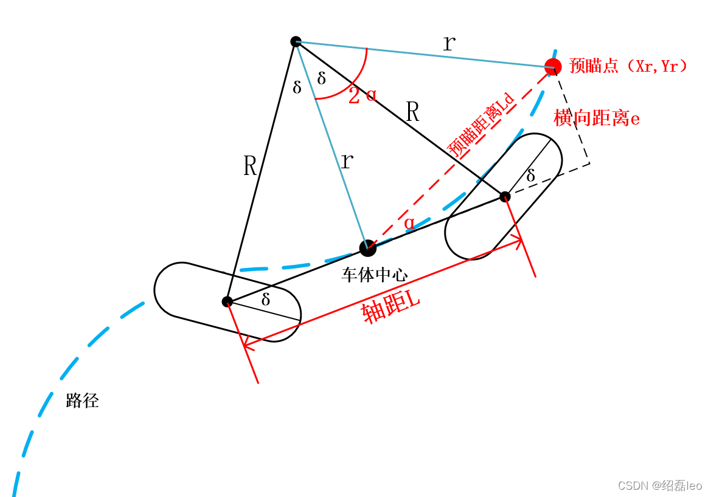
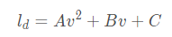
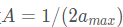

### **一、Pure Pursuit算法模型图解和公式推导**

下图分析的双舵轮AGV的运动学模型，是按照**前后舵轮均安装在车体中心线上的车型**分析的，当然其它结构的车型也可以按照这样的分析方法画出如下图解。

| **符号** | **物理量**               |
| -------- | ------------------------ |
| r(m)     | 车体中心（小圆）转弯半径 |
| R(m)     | 车轮（大圆）转弯半径     |
| L(m)     | 轴距                     |
| δ(rad)   | 前轮转角                 |
| α(rad)   | 车身与预瞄点夹角         |
| Ld(m)    | 预瞄距离                 |
| e(m)     | 与预瞄点的横向偏差       |
| Xr(m)    | 预瞄点横坐标             |
| Yr(m)    | 预瞄点纵坐标             |

通过正弦定理推导：

即
$$
\frac{L_d}{sin\alpha} = 2r
$$
则可推导出 **转弯圆弧的曲率k** ：
$$
k = \frac{1}{r} = 2\sin\alpha/L_d
$$
还可得到：
$$
\tan{\delta} = \frac{L/2}{r}
\\
sin\alpha = e/L_d
$$
**即可推导出：（重要）**
$$
\delta = \tan^{-1}((L/2)/r) = \tan^{-1}{eL/(L_d)^2}
$$
由上式可知，本控制器的本质是对 **转角进行控制** ，以减少横向误差为目标的横向控制器。其中，$(eL/L_d^2)$    可视为控制器的 **P参数** 。 **L** 为车辆的 **轴距** ， **Ld** 为设定的 **预瞄距离** 。 本控制器的控制效果主要取决于预瞄距离的选取，一般来说预瞄距离越长，控制效果会越平滑，预瞄距离越短，控制效果会越精确（同时也会带来一定的震荡）。 **预瞄距离的选取也和当前车速有关** 。

通常来说ld 被认为是车速的函数，在不同的车速下需要选择不同的前视距离。

一种最常见的调整前视距离的方法就是将前视距离表示成 **车辆纵向速度** 的线形函数，即 **Ld=k\*Vx** ，那么前轮的转角公式就变成了：
$$
\delta = \tan^{-1}(eL/(kV_x)^2)
$$
于是纯追踪控制器的参数调整就变成了调整 **前视系数k** 。常来说，会使 **用最大、最小前视距离** 来 **约束前视距离** ，越大的前视距离意味着轨迹的追踪越平滑，小的前视距离会使得追踪更加精确（当然也会带来控制的震荡）。

而两轮转角对应的角速度W，根据当前控制速度V可得：
$$
W = \frac{V}{r}=V * k
$$

- **非线性的预瞄距离选取方式**

在有些文献中， **预瞄距离的选取方式** 表现为如下形式（二次方程）：

上式中，对于常数A：

`amax`为 **最大制动加速度** 。 `Av2`表示 **最短车辆制动距离** 。 `B`表示车辆 **遇到异常时需要的反应时间** ， `Bv`则为 **对应的反应距离** ，`C`表示 **车辆的最小转弯半径** 。

- **实际应用总结**

在实际应用中，Pure Pursuit算法通常 **不要求跟踪的目标点到本车中心的距离切实等于预瞄距离。** 而是会选择 **采样好的一系列目标点中到中心距离最接近预瞄距离的那个点来** **近似跟踪** 。这样做的好处是可以 **不需要目标轨迹的函数方程来求解真实预瞄距离坐标** ，极大地提升了算法的效率。

实践中， **纵向控制Vx** 通常使用一个简单的 **P控制器** ， **横向控制** （即转角控制）我们使用 **纯追踪控制器** 。