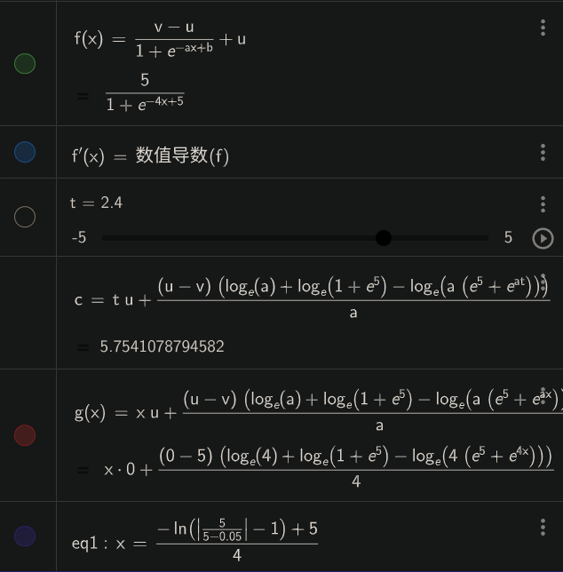
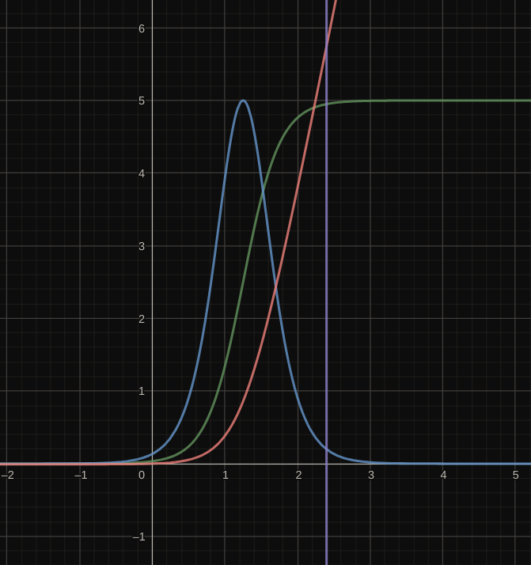

# 直线S型加速规划





```python
class TracePlanning():
    def __init__(self):
        self.a = 0
        self.b = 5
        self.a_max = 5
    
    def function(self,v_cur,v_tar,t):
        y = v_cur + (v_tar - v_cur)/(1 + math.exp(-self.a * t + self.b))
        return y
    
    def func(self,v_cur,v_tar,t):
        if (v_tar - v_cur) > 0.05:
            s_0 = t * v_cur + ((v_cur - v_tar) * (math.log(self.a) + math.log(1 + math.exp(5)) - math.log(
                self.a * (math.exp(5) + math.exp(self.a * t)))))/self.a
        elif (v_tar - v_cur) < -0.05:
            s_0 = t * v_cur + ((v_cur - v_tar) * (math.log(self.a) + math.log(1 + math.exp(5)) - math.log(
                self.a * (math.exp(5) + math.exp(self.a * t)))))/self.a
        else:
            return 0
        return s_0
    
    def Accelerate_S(self, v_cur, v_tar):
        self.a = math.fabs(4 * self.a_max / (v_tar - v_cur))

        if (v_tar - v_cur) > 0.05:
            t_0 = (math.log(math.fabs((v_cur - v_tar) / (v_tar - 0.05 - v_cur)) - 1) - self.b) / (-self.a)
            s_0 = t_0 * v_cur + ((v_cur - v_tar) * (math.log(self.a) + math.log(1 + math.exp(5)) - math.log(
                self.a * (math.exp(5) + math.exp(self.a * t_0)))))/self.a
        elif (v_tar - v_cur) < -0.05:
            t_0 = (math.log(math.fabs((v_cur - v_tar) / (v_tar + 0.05-v_cur)) - 1) - self.b) / (-self.a)
            s_0 = t_0 * v_cur + ((v_cur - v_tar) * (math.log(self.a) + math.log(1 + math.exp(5)) - math.log(
                self.a * (math.exp(5) + math.exp(self.a * t_0)))))/self.a
        else:
            return 0
        return s_0,t_0
    
    def straight_line_plan(self,x_tar,y_tar,w_tar,v_start,v_max,v_tar):
        '''
        x_tar,y_tar,w_tar:目标点坐标
        v_start:起始速度
        v_max:最大速度
        v_tar:目标速度
        '''
        vx_list = list()
        vy_list = list()
        
        x_list = list()
        y_list = list()
        theta = math.atan2(x_tar,y_tar)
        
        x_ = math.sqrt(x_tar**2 + y_tar**2)
        s_,t_ = self.Accelerate_S(v_start,v_max)
        s_last,t_last = self.Accelerate_S(v_max,v_tar)
        
        delt_x = x_ - s_ - s_last
        delt_t = delt_x / v_max
        
        t_sum = t_ + delt_t + t_last
        t_1 = 0
        
        while(t_1 < t_):
            vx_list.append(self.function(v_start,v_max,t_1)*math.sin(theta))
            vy_list.append(self.function(v_start,v_max,t_1)*math.cos(theta))
            
            x_list.append(self.func(v_start,v_max,t_1)*math.sin(theta))
            y_list.append(self.func(v_start,v_max,t_1)*math.cos(theta))
            
            t_1 = t_1 + 0.05
            t_temp = t_1
        
        while(t_1 < delt_t+t_temp):
            vx_list.append(v_max*math.sin(theta))
            vy_list.append(v_max*math.cos(theta))
            
            x_list.append(self.func(v_start,v_max,t_1)*math.sin(theta))
            y_list.append(self.func(v_start,v_max,t_1)*math.cos(theta))
            t_1 = t_1 + 0.05
        t_1 = 0
        xlen_temp = len(x_list)
        ylen_temp = len(y_list)
        
        while(t_1 < t_):
            vx_list.append(self.function(v_max,v_tar,t_1)*math.sin(theta))
            vy_list.append(self.function(v_max,v_tar,t_1)*math.cos(theta))
            
            x_list.append(x_list[ylen_temp-1] + self.func(v_max,v_tar,t_1)*math.sin(theta))
            y_list.append(y_list[ylen_temp-1] + self.func(v_max,v_tar,t_1)*math.cos(theta))
            t_1 = t_1 + 0.05
        
        return vx_list,vy_list,x_list,y_list
```

