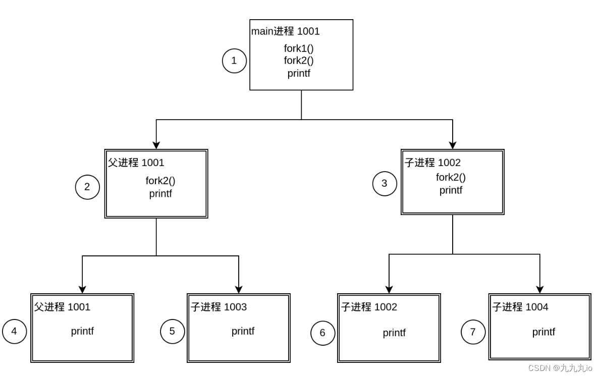

# Virtualization

## 5.   Process API

* `fork()`
* `wait()`
* `exec()`

### 5.1   `fork()` call     [Note](https://blog.csdn.net/weixin_51609435/article/details/124849719)

When one process calls the `fork()`, the OS creates an (most) **exact copy of the calling process**. The newly-created process doesn't start running at `main()`, though, it starts the code resides after `fork()` function.

The parent process receives the PID of child process, and the child receives the return code of zero.

The CPU scheduler determines which process runs at a given moment, so the order of these process that are running is non-determinism. 

> **Tips:**
>
> The same part of parent and child:
>
> * data / text segment
> * heap / stack
> * ...
>
> The difference:
>
> * PID
> * Return code 
> * parent process
> * ...

### 5.2   `wait()` call

If the parent does happen to run first, it will immediately call wait(); this system call won’t return until the child has run and exited.

### 5.3   `exec()` call

it loads code (and static data) from that executable and overwrites its current code segment (and current static data) with it; the heap and stack and other parts of the memory space of the program are re initialized. 

Then the OS simply runs that program, passing in any arguments as the `argv` of that process. Thus, it does not create a new process; rather, it **transforms** the currently running program into a different running program . 

After the exec() in the child, it is almost as if it never ran; a successful call to exec() never returns.
