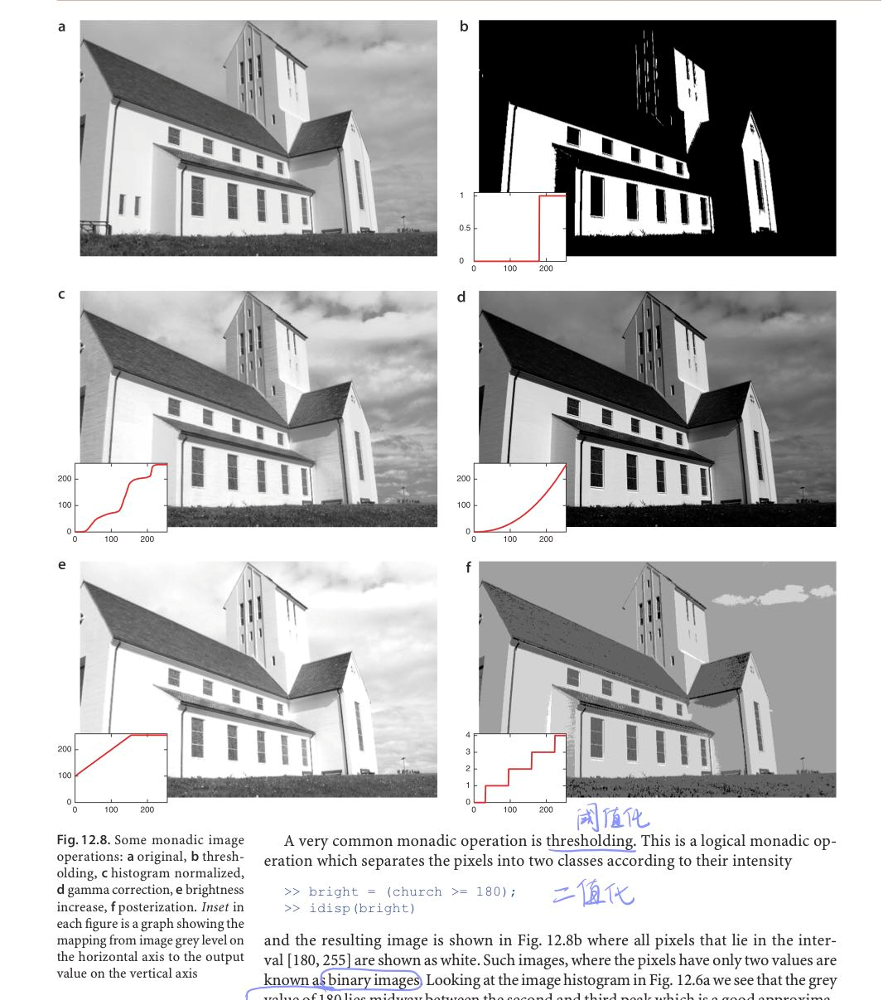

# 灰度变换 

> 空间域是包含 图像中像素的平面
>
> 操作表达式：其中T为(x,y)点在一个领域上定义的的**f**的算子
> $$
> g(x,y)=T[f(x,y)]
> $$
> 频率域操作的是图像的傅里叶变换而非图像

​	邻域：中心点像素周围的小区域称为邻域。最小邻域大小为**1x1**

应用灰度变换函数：```s=T(r)```




## 一些基本的灰度变换函数


### 图像反转：

灰度级在[0,L-1]反转图像：
$$
s=L-1-r
$$
可以增强图像暗色区域中的白色或者灰色细节（暗色区域的尺寸很大时，增强效果很好）

### 对数变换：

$$
s=clog(1+r)
$$

将输入范围中较窄的灰度值映射到输出范围较宽的灰度级；高灰度值将会映射到范围较窄的灰度级，压缩高灰度级数。

### 幂律变换（gamma）：

$$
s=cr^y
$$

与对数变换规律相反。y>1和y<1的效果刚好相反。

由于用于获取，打印和现实设备符合幂律。用于矫正这些幂律相应现象的处理称为伽马矫正。


y=0.4为对比度和分辨细节增强效果最好的值。

### 分段线性变换函数：

#### 对比度拉伸：

对比度拉伸可以扩展图像中的灰度值，使其覆盖整个理想灰度范围。


####  灰度级分层：

为了突出特定的灰度值可见，增强特征。两种方法：

* 二值化，将目标范围灰度值显示为一个值
* 是期望的灰度范围变亮或者变暗

#### 比特平面分层：

256级灰度图像中，图像由8比特组成。有助于研究每一个比特层图像的意义。


### 直方图处理（Image Histogram）：

非归化一直方图：(n<sub>k</sub>是灰度为r<sub>k</sub>的像素的数目)
$$
h(r_k)=n_k,		k=0,1,2,...,L-1
$$
归一化直方图：(m,n分别为图像行数和列数)
$$
P(r_k)=\frac{h(r_k)}{MN}
$$


像素占据整个灰度级范围并且具有均匀分布的图像，具有高对比度的外观和多种灰色调。

#### 直方图均衡化：

**直方图均衡化是将原图像通过某种变换，得到一幅灰度直方图为均匀分布的新图像的方法。**

**直方图均衡化方法的基本思想是对在图像中像素个数多的灰度级进行展宽，而对像素个数少的灰度级进行缩减。从而达到清晰图像的目的。**


我们知道，那些灰度值分布较为平均的图像，通常对比度较高。比如，下图中 g 的灰度较分散（有白的有灰的有黑的），所以对比度较高；f 的灰度很集中，所以显得灰蒙蒙的。直方图均衡的目的，就是对 f 进行处理产生 g，使得 g 的灰度值比 f 更分散。


> 灰度映射函数满足：
>
> 1. 严格递增。
> 2. 输入灰度值和输出灰度值的范围一致。

对于一维实随机变量*X*，设它的[累积分布函数](https://baike.baidu.com/item/累积分布函数?fromModule=lemma_inlink)(CDF)是


,如果存在可测函数


满足：


,那么*X*是一个[连续型随机变量](https://baike.baidu.com/item/连续型随机变量/3318213?fromModule=lemma_inlink)，并且


是它的概率密度函数。


从离散分布来看，某个随机变量值的离散分布的函数值，代表随机变量取该值的概率。但是某一个值的概率密度函数的值并不代表概率等于该值的概率，因为概率密度函数**(PDF)**满足：
$$
\int^{+\infty}_{-\infty}{f(x)dx=1}
$$
​	首先，如果取连续随机变量取值的某一点，那么它的概率是接近0的。最简单但是粗略的，从长度来看，一点相对于区间，就趋近于0。所以连续随机变量取值的概率，不仅和概率密度函数相关，还和区间长度相关。所以便有了概率密度函数求和公式。如上图，概率密度函数曲线在0附近最大，说明什么呢？那就说明，连续随机变量的值在0附近的概率较大，但是并不能说明连续随机变量等于0的概率是多少。对于连续随机变量，撇开区间谈概率，都是趋近于0。

​	令p<sub>r</sub>(s)  , p<sub>s</sub>(r) 映射后的变量s的PDF是
$$
p_s(s)=p_r(r)|\frac{dr}{ds}|
$$


> **累积分布函数**(Cumulative Distribution Function)，又叫分布函数，是[概率密度函数](https://baike.baidu.com/item/概率密度函数/5021996?fromModule=lemma_inlink)的积分，能完整描述一个实[随机变量](https://baike.baidu.com/item/随机变量/828980?fromModule=lemma_inlink)*X*的[概率分布](https://baike.baidu.com/item/概率分布/828907?fromModule=lemma_inlink)。一般以大写==CDF==标记,，与概率密度函数probability density function（小写pdf）相对。

重要的变换函数：
$$
s=T(r)=(L-1)\int^{r}_{0}{P_r(w)dw}
$$

$$
\frac{ds}{dt}=(L-1)\frac{d}{dr}[\int^{r}_{0}{P_r(w)dw}]=(L-1)p_r(r)
$$

执行上述变换，则**p<sub>s</sub>(s)**是一个均匀的概率密度函数。


还可以将式子**离散化**，形成离散公式：
$$
s_k=T(R_k)=(L-1)\sum^k_{j=0}{p_r(r_j)}, k=0,1,2,3,...,L-1
$$


#### 直方图匹配：

用于生成具有规定直方图的图像的方法，称为**直方图匹配**或者**直方图规定化**

$$
s=T(r)=(L-1)\int^{r}_{0}{P_r(w)dw}
$$
定义一个关于变量z的函数：
$$
s=G(z)=(L-1)\int^{z}_{0}{P_r(v)dv}
$$
则：
$$
z=G^{-1}(s)=G^{-1}[T(r)]
$$

* 先计算输入图像的直方图P<sub>r</sub>(r)  并使用直方图均衡化，并将s<sub>k</sub>四舍五入到整数区间。
* 使用符合规定的**PDF**函数，得到G(z)函数；
* 计算反变换： z=G<sup>-1</sup>(s)    （可以直接输入整数k 的每一个值来得到映射）
* 先使用直方图均衡化函数得到输出图像，然后执行逆映射z=G<sup>-1</sup>(s)


#### 局部直方图处理：

