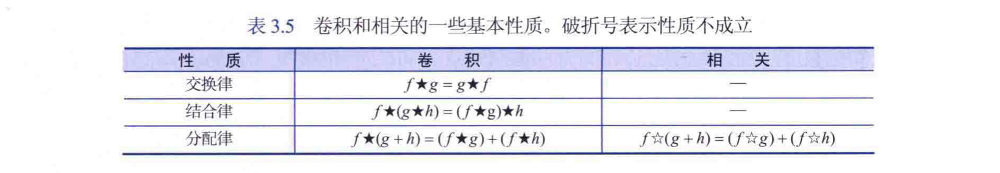

# 空间滤波

### 3.4.1 空间滤波基础

* 概念：空间滤波通过把每个像素的值替换为该像素及其邻域的函数值来修改图像
* 分类
  * 非线性空间滤波器
  * 线性空间滤波器  （对图像执行的运算是线性的）

### 线性空间滤波器的原理：

线性空间滤波器在图像和 **滤波器核**之间执行乘积之和的运算。

> 空间滤波器核（窗口Windows）（模板template）：大小定义了运算的邻域，系数决定性质。一般来说使用奇数大小的核。

example(***空间相关***):
$$
g(x,y)=w(-1,1)f(x-1,y-1)+w(-1,0)f(x-1,y)+···+w(1,1)f(x+1,y+1)=\sum^{a}_{t=-a}{\sum^{b}_{t=-b}{w(s,t)f(x+s,y+t)}}
$$
核中心不断移动然后形成滤波后的图像。

线性空间滤波和空间卷积是同义。

### 空间相关和卷积:

* 空间相关
* 空间卷积（线性空间滤波和卷积是同义）

**空间相关**：
一维的定义：
$$
g(x) = \sum^{a}_{-a}w(s)f(x+s)
$$
二维的定义：
$$
(w*f)(x,y) = \sum^{a}_{s=-a}\sum^{b}_{s=-b}w(s,t)f(x+s,y+t)
$$
空间卷积的原理和相关相同，只是把相关运算的核旋转180°  。

当核w的一部分在 f (即图像)之外一般采取补0解决。

**卷积定义式：**

连续定义：
$$
(f*g)(n) = \int^{\infin}_{-\infin}f(\gamma)g(n-\gamma)  d\gamma
$$
离散定义：
$$
(f*g)(n) = \sum^{\infin}_{-\infin}f(\gamma)g(n-\gamma)
$$
二维定义：
$$
(w*f)(x,y) = \sum^{a}_{s=-a}\sum^{b}_{s=-b}w(s,t)f(x-s,y-t)
$$

#### 可分离滤波器核

可分离核：指一个能够表示为两个向量的外积的矩阵。

业已证明，一个列向量和一个行向量的乘积，等于这两个向量的二维卷积。
