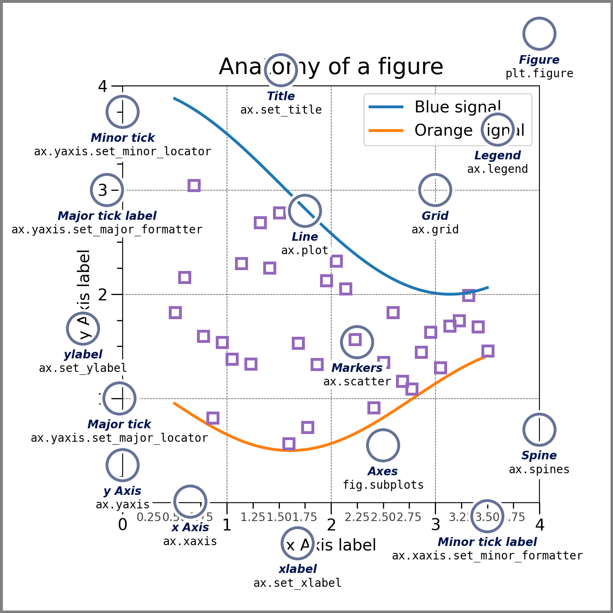

# Introduction


## 1.0  Parts of a Figure



### 1.1  Figure

The **whole** figure. The Figure keeps track of all the child [`Axes`](https://matplotlib.org/stable/api/_as_gen/matplotlib.axes.Axes.html#matplotlib.axes.Axes), a group of 'special' Artists (titles, figure legends, colorbars, etc), and even nested subfigures.

```python
#Creating figure

fig = plt.figure()  # an empty figure with no Axes
fig, ax = plt.subplots()  # a figure with a single Axes
fig, axs = plt.subplots(2, 2)  # a figure with a 2x2 grid of Axes
# a figure with one axes on the left, and two on the right:
fig, axs = plt.subplot_mosaic([['left', 'right_top'],
                               ['left', 'right_bottom']])
```

> `matplotlib.pyplot.subplot_mosaic`  
>
> Build a layout of Axes based on ASCII art or nested lists.

You can also create axes latter.

#### 1.2 Axes

An Axes is an Artist attached to a Figure that contains a region for plotting data. 

Each [`Axes`](https://matplotlib.org/stable/api/_as_gen/matplotlib.axes.Axes.html#matplotlib.axes.Axes) also has a title (set via [`set_title()`](https://matplotlib.org/stable/api/_as_gen/matplotlib.axes.Axes.set_title.html#matplotlib.axes.Axes.set_title)), an x-label (set via [`set_xlabel()`](https://matplotlib.org/stable/api/_as_gen/matplotlib.axes.Axes.set_xlabel.html#matplotlib.axes.Axes.set_xlabel)), and a y-label set via [`set_ylabel()`](https://matplotlib.org/stable/api/_as_gen/matplotlib.axes.Axes.set_ylabel.html#matplotlib.axes.Axes.set_ylabel)).

#### 1.3  Axis

These objects set the **scale and limits** and generate ticks (the marks on the Axis) and ticklabels (strings labeling the ticks). The location of the ticks is determined by a [`Locator`](https://matplotlib.org/stable/api/ticker_api.html#matplotlib.ticker.Locator) object and the ticklabel strings are formatted by a [`Formatter`](https://matplotlib.org/stable/api/ticker_api.html#matplotlib.ticker.Formatter). The combination of the correct [`Locator`](https://matplotlib.org/stable/api/ticker_api.html#matplotlib.ticker.Locator) and [`Formatter`](https://matplotlib.org/stable/api/ticker_api.html#matplotlib.ticker.Formatter) gives very fine control over the tick locations and labels.

#### 1.4  Artist

Basically, everything visible on the Figure is an Artist (even [`Figure`](https://matplotlib.org/stable/api/figure_api.html#matplotlib.figure.Figure), [`Axes`](https://matplotlib.org/stable/api/_as_gen/matplotlib.axes.Axes.html#matplotlib.axes.Axes), and [`Axis`](https://matplotlib.org/stable/api/axis_api.html#matplotlib.axis.Axis) objects). This includes [`Text`](https://matplotlib.org/stable/api/text_api.html#matplotlib.text.Text) objects, [`Line2D`](https://matplotlib.org/stable/api/_as_gen/matplotlib.lines.Line2D.html#matplotlib.lines.Line2D) objects, [`collections`](https://matplotlib.org/stable/api/collections_api.html#module-matplotlib.collections) objects, [`Patch`](https://matplotlib.org/stable/api/_as_gen/matplotlib.patches.Patch.html#matplotlib.patches.Patch) objects, etc. When the Figure is rendered, all of the Artists are drawn to the **canvas**. Most Artists are tied to an Axes; such an Artist cannot be shared by multiple Axes, or moved from one to another.

#### 1.5  Types of inputs to plotting functions

* `numpy.array`
* `numpy.ma.masked_array`
* object that can be passed to `numpy,asarray`

You can convert other data type to `numpy.asarray`.


## Coding Styles

### The explicit and the implicit interfaces

As noted above, there are essentially two ways to use Matplotlib:

- Explicitly create Figures and Axes, and call methods on them (the "object-oriented (OO) style").
- Rely on pyplot to implicitly create and manage the Figures and Axes, and use pyplot functions for plotting.

```py
#-------------------OO-style ----------------------------
x = np.linspace(0, 2, 100)  # Sample data.

# Note that even in the OO-style, we use `.pyplot.figure` to create the Figure.
fig, ax = plt.subplots(figsize=(5, 2.7), layout='constrained')
ax.plot(x, x, label='linear')  # Plot some data on the axes.
ax.plot(x, x**2, label='quadratic')  # Plot more data on the axes...
ax.plot(x, x**3, label='cubic')  # ... and some more.
ax.set_xlabel('x label')  # Add an x-label to the axes.
ax.set_ylabel('y label')  # Add a y-label to the axes.
ax.set_title("Simple Plot")  # Add a title to the axes.
ax.legend()  # Add a legend.

#----------------------pyplot-style-------------------------
x = np.linspace(0, 2, 100)  # Sample data.

plt.figure(figsize=(5, 2.7), layout='constrained')
plt.plot(x, x, label='linear')  # Plot some data on the (implicit) axes.
plt.plot(x, x**2, label='quadratic')  # etc.
plt.plot(x, x**3, label='cubic')
plt.xlabel('x label')
plt.ylabel('y label')
plt.title("Simple Plot")
plt.legend()
```


