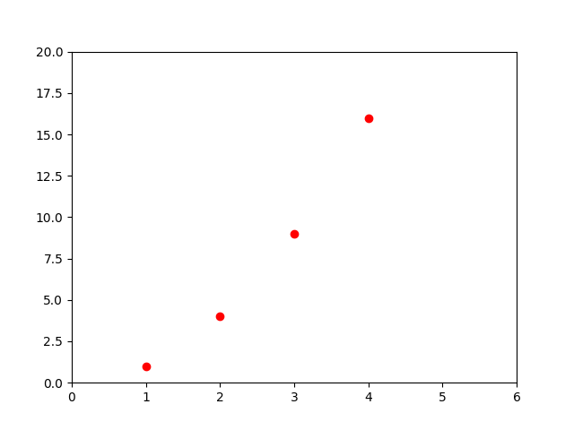
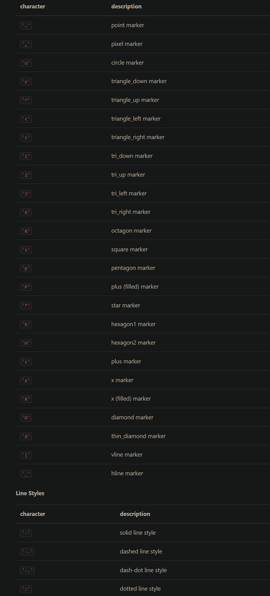
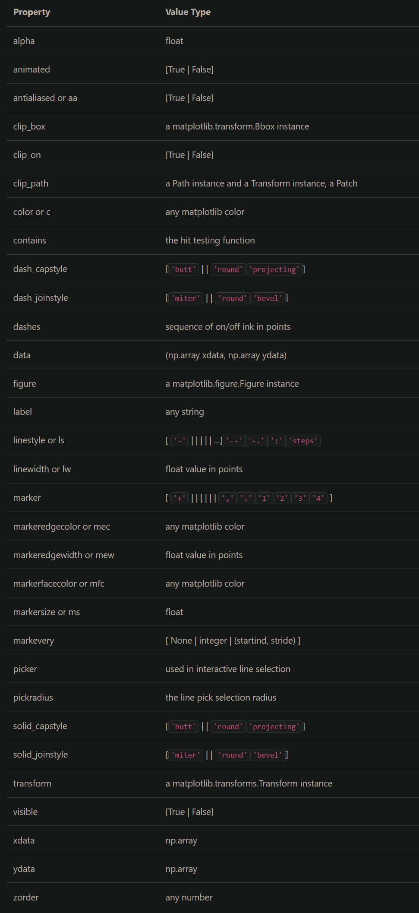
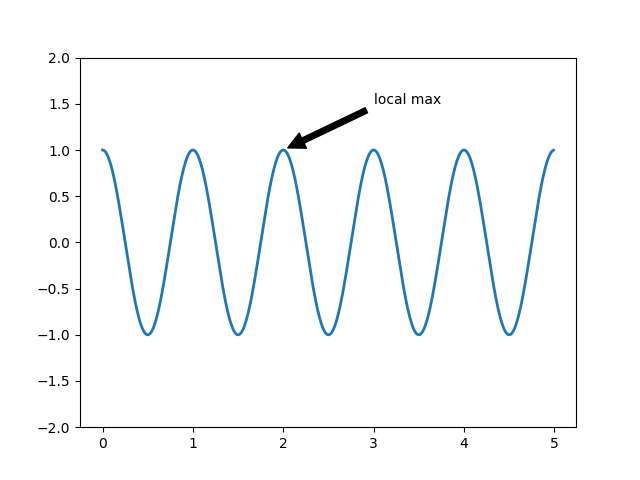

# `Pyplot tutorial`

## `Introduction to pyplot`

> ```python
> matplotlib.pyplot.plot(*args,scalex = True, scaley=True,data=None, **kwargs)
> ```
>
> ```python
> plot([x], y, [fmt], *, data=None, **kwargs)
> plot([x], y, [fmt], [x2], y2, [fmt2], ..., **kwargs)
> ```

Each pyplot function makes some change to a figure. 

```python
import matplotlib.pyplot as plt
plt.plot([1, 2, 3, 4])
plt.plot([1, 2, 3, 4], [1, 4, 9, 16])
plt.ylabel('some numbers')
plt.show()
```

In the example above, `matplotlib` assumes it is a sequence of y values, and automatically generates the x values for you.

### Formatting the style of your plot

```python
plt.plot([1, 2, 3, 4], [1, 4, 9, 16], 'ro')
plt.axis([0, 6, 0, 20])
plt.show()
```



```python
xmin, xmax, ymin, ymax = axis()
xmin, xmax, ymin, ymax = axis([xmin, xmax, ymin, ymax])   #The axis limits to be set. This can also be achieved using   ax.set(xlim=(xmin, xmax), ylim=(ymin, ymax))

xmin, xmax, ymin, ymax = axis(option)
xmin, xmax, ymin, ymax = axis(**kwargs)
```

> plot
>
> 

If `matplotlib` were limited to working with lists, it would be fairly useless for numeric processing. The example below illustrates plotting several lines with different format styles in one function call using array.

```python
import numpy as np

# evenly sampled time at 200ms intervals
t = np.arange(0., 5., 0.2)

# red dashes, blue squares and green triangles
plt.plot(t, t, 'r--', t, t**2, 'bs', t, t**3, 'g^')
plt.show()
```

### Plotting with keyword strings

`matplotlib` allow me to provided with `data` keyword argument.

```python
data = {'a': np.arange(50),
        'c': np.random.randint(0, 50, 50),
        'd': np.random.randn(50)}
data['b'] = data['a'] + 10 * np.random.randn(50)
data['d'] = np.abs(data['d']) * 100

plt.scatter('a', 'b', c='c', s='d', data=data)
plt.xlabel('entry a')
plt.ylabel('entry b')
plt.show()
```

### Plotting with categorical variables

```python
names = ['group_a', 'group_b', 'group_c']
values = [1, 10, 100]

plt.figure(figsize=(9, 3))

plt.subplot(131)
plt.bar(names, values)
plt.subplot(132)
plt.scatter(names, values)
plt.subplot(133)
plt.plot(names, values)
plt.suptitle('Categorical Plotting')
plt.show()
```

> ```python
> #  matplotlib.pyplot.subplot
> #  Add an Axes to the current figure or retrieve an existing Axes.This is a wrapper of Figure.add_subplot which provides additional behavior when working with the implicit API (see the notes section).
> ```
>
> ```python
> subplot(nrows, ncols, index, **kwargs)
> subplot(pos, **kwargs)
> subplot(**kwargs)
> subplot(ax)
> ```
>
> Parameters:
>
> - ***args**int, (int, int, *index*), or [`SubplotSpec`](https://matplotlib.org/stable/api/_as_gen/matplotlib.gridspec.SubplotSpec.html#matplotlib.gridspec.SubplotSpec), default: (1, 1, 1)
>
>   The position of the subplot described by one ofThree integers (*nrows*, *ncols*, *index*). The subplot will take the *index* position on a grid with *nrows* rows and *ncols* columns. *index* starts at 1 in the upper left corner and increases to the right. *index* can also be a two-tuple specifying the (*first*, *last*) indices (1-based, and including *last*) of the subplot, e.g., `fig.add_subplot(3, 1, (1, 2))` makes a subplot that spans the upper 2/3 of the figure.A 3-digit integer. The digits are interpreted as if given separately as three single-digit integers, i.e. `fig.add_subplot(235)` is the same as `fig.add_subplot(2, 3, 5)`. Note that this can only be used if there are no more than 9 subplots.A [`SubplotSpec`](https://matplotlib.org/stable/api/_as_gen/matplotlib.gridspec.SubplotSpec.html#matplotlib.gridspec.SubplotSpec).
>
> - **projection**{None, 'aitoff', 'hammer', 'lambert', 'mollweide', 'polar', 'rectilinear', str}, optional
>
>   The projection type of the subplot ([`Axes`](https://matplotlib.org/stable/api/_as_gen/matplotlib.axes.Axes.html#matplotlib.axes.Axes)). *str* is the name of a custom projection, see [`projections`](https://matplotlib.org/stable/api/projections_api.html#module-matplotlib.projections). The default None results in a 'rectilinear' projection.
>
> - **polar**bool, default: False
>
>   If True, equivalent to projection='polar'.
>
> - **sharex, sharey**[`Axes`](https://matplotlib.org/stable/api/_as_gen/matplotlib.axes.Axes.html#matplotlib.axes.Axes), optional
>
>   Share the x or y [`axis`](https://matplotlib.org/stable/api/axis_api.html#module-matplotlib.axis) with sharex and/or sharey. The axis will have the same limits, ticks, and scale as the axis of the shared axes.
>
> - **label**str
>
>   A label for the returned axes.

### Controlling line properties



Use [`setp`](https://matplotlib.org/stable/api/_as_gen/matplotlib.pyplot.setp.html#matplotlib.pyplot.setp). The example below uses a MATLAB-style function to set multiple properties on a list of lines. works transparently with a list of objects or a single object. 

```python
lines = plt.plot(x1, y1, x2, y2)
# use keyword arguments
plt.setp(lines, color='r', linewidth=2.0)
# or MATLAB style string value pairs
plt.setp(lines, 'color', 'r', 'linewidth', 2.0)
```

### Working with multiple figures and axes

`matplotlib.pyplot.subplots()` 

 `matplotlib.pyplot.plot()`

```python
def f(t):
    return np.exp(-t) * np.cos(2*np.pi*t)

t1 = np.arange(0.0, 5.0, 0.1)
t2 = np.arange(0.0, 5.0, 0.02)

plt.figure()
plt.subplot(211)
plt.plot(t1, f(t1), 'bo', t2, f(t2), 'k')

plt.subplot(212)
plt.plot(t2, np.cos(2*np.pi*t2), 'r--')
plt.show()
```

If you are making lots of figures, you need to be aware of one more thing: the memory required for a figure is not completely released until the figure is explicitly closed with [`close`](https://matplotlib.org/stable/api/_as_gen/matplotlib.pyplot.close.html#matplotlib.pyplot.close).


### Working with text

[`text`](https://matplotlib.org/stable/api/_as_gen/matplotlib.pyplot.text.html#matplotlib.pyplot.text) can be used to add text in an arbitrary location, and [`xlabel`](https://matplotlib.org/stable/api/_as_gen/matplotlib.pyplot.xlabel.html#matplotlib.pyplot.xlabel), [`ylabel`](https://matplotlib.org/stable/api/_as_gen/matplotlib.pyplot.ylabel.html#matplotlib.pyplot.ylabel) and [`title`](https://matplotlib.org/stable/api/_as_gen/matplotlib.pyplot.title.html#matplotlib.pyplot.title) are used to add text in the indicated locations (see [Text in Matplotlib Plots](https://matplotlib.org/stable/tutorials/text/text_intro.html) for a more detailed example)

```python
mu, sigma = 100, 15
x = mu + sigma * np.random.randn(10000)

# the histogram of the data
n, bins, patches = plt.hist(x, 50, density=True, facecolor='g', alpha=0.75)


plt.xlabel('Smarts')
plt.ylabel('Probability')
plt.title('Histogram of IQ')
plt.text(60, .025, r'$\mu=100,\ \sigma=15$')
plt.axis([40, 160, 0, 0.03])
plt.grid(True)
plt.show()
```

> #### `matplotlib.pyplot.hist`,创建直方图
>
> ```python
> mu, sigma = 100, 15
> x = mu + sigma * np.random.randn(10000)
> 
> # the histogram of the data
> n, bins, patches = plt.hist(x, 50, density=True, facecolor='g', alpha=0.75)
> 
> 
> plt.xlabel('Smarts')
> plt.ylabel('Probability')
> plt.title('Histogram of IQ')
> plt.text(60, .025, r'$\mu=100,\ \sigma=15$')
> plt.axis([40, 160, 0, 0.03])
> plt.grid(True)
> plt.show()
> ```

### Using mathematical expressions in text

Matplotlib accepts TeX equation expressions in any text expression.

```python
plt.title(r'$\sigma_i=15$')
```

### Annotating text

```python
ax = plt.subplot()

t = np.arange(0.0, 5.0, 0.01)
s = np.cos(2*np.pi*t)
line, = plt.plot(t, s, lw=2)

plt.annotate('local max', xy=(2, 1), xytext=(3, 1.5),
             arrowprops=dict(facecolor='black', shrink=0.05),
             )

plt.ylim(-2, 2)
plt.show()
```



### Logarithmic and other nonlinear axes

[`matplotlib.pyplot`](https://matplotlib.org/stable/api/pyplot_summary.html#module-matplotlib.pyplot) supports not only linear axis scales, but also logarithmic and logit scales. This is commonly used if data spans many orders of magnitude. Changing the scale of an axis is easy:

> plt.xscale('log')

```python
# Fixing random state for reproducibility
np.random.seed(19680801)

# make up some data in the open interval (0, 1)
y = np.random.normal(loc=0.5, scale=0.4, size=1000)
y = y[(y > 0) & (y < 1)]
y.sort()
x = np.arange(len(y))

# plot with various axes scales
plt.figure()

# linear
plt.subplot(221)
plt.plot(x, y)
plt.yscale('linear')
plt.title('linear')
plt.grid(True)

# log
plt.subplot(222)
plt.plot(x, y)
plt.yscale('log')
plt.title('log')
plt.grid(True)

# symmetric log
plt.subplot(223)
plt.plot(x, y - y.mean())
plt.yscale('symlog', linthresh=0.01)
plt.title('symlog')
plt.grid(True)

# logit
plt.subplot(224)
plt.plot(x, y)
plt.yscale('logit')
plt.title('logit')
plt.grid(True)
# Adjust the subplot layout, because the logit one may take more space
# than usual, due to y-tick labels like "1 - 10^{-3}"
plt.subplots_adjust(top=0.92, bottom=0.08, left=0.10, right=0.95, hspace=0.25,
                    wspace=0.35)

plt.show()
```


Most of the terms are straightforward but the main thing to remember is that:

- The [`Figure`](https://matplotlib.org/stable/api/figure_api.html#matplotlib.figure.Figure) is the final image, and may contain one or more [`Axes`](https://matplotlib.org/stable/api/_as_gen/matplotlib.axes.Axes.html#matplotlib.axes.Axes).

- - The [`Axes`](https://matplotlib.org/stable/api/_as_gen/matplotlib.axes.Axes.html#matplotlib.axes.Axes) represents an individual plot (not to be confused with

    [`Axis`](https://matplotlib.org/stable/api/axis_api.html#matplotlib.axis.Axis), which refers to the x-, y-, or z-axis of a plot).
