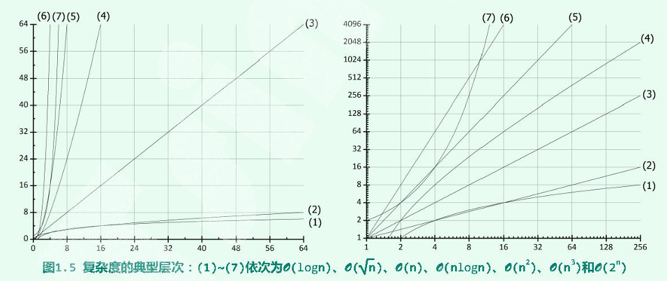

# Introduction

## 算法

算法：基于特定的计算模型，旨在解决某一信息处理问题而设计的一个指令序列。

- 输入输出
- 基本操作、确定性和可行性
- 有穷性和正确性

## 复杂度

### 时间复杂度

从保守估计角度，随着输入规模的扩大，执行时间的变化趋势称为 算法时间复杂度，记作`T(n)`。

### 渐进复杂度

渐进分析：注重时间复杂度的总体变化趋势和增长速度的策略和方法。

#### 渐进上界：$O(n)$

若存在正的常数 $c$ 和 $f(n)$ 使得对任何 $n >> 2$ 都有
$$
T(n) \leq c \cdot f(n)
$$
记：$T(n) = O(f(n))$

性质：

- 对于任意常数 $c > 0$，有$O(f(n)) = O(c \cdot f(n))$
- 对于任意 $a > b > 0$，有 $O(n^a + n^b) = O(n^a)$

将$T(n)$ 定义为算法执行基本操作的次数。

#### 渐进下界：$\Omega( n)$

若存在正的常数 $c$ 和 $g(n)$ 使得对任何 $n >> 2$ 都有
$$
T(n) \geq c \cdot g(n)
$$
记：$T(n) = \Omega (g(n))$

#### 确界： $\Theta (n)$ 

若存在正的常数 $c_1 < c_2$ 和 $h(n)$ 使得对任何 $n >> 2$ 都有
$$
c_1 \cdot h(n) \leq T(n) \leq c_2 \cdot h(n)
$$
记：$T(n) = \Theta (g(n))$

### 空间复杂度

衡量算法所需空间的多少。算法所需的空间总量，和基本操作的次数同阶，不会超过常数规模。

## 复杂度分析

### 常数 $O(1)$ 

对于运行时间可表述为：
$$
T(n) = O(1)
$$
的算法，统称为 常数时间复杂度算法，算法已经最理想

### 对数 $O(logn)$ 

在使用 $log_r n$ 界定渐进复杂度时，底数的值并不重要，故通常笼统记为 $logn$

性质：
$$
∀c >0,log(n^c) = c \cdot log(n) = O(logn)
$$

### 对数多项式  $O(log^cn)$  

对数多项式，低次项可以忽略:
$$
O(132 \cdot log^{321}n + log^{105}(n^2 - n + 1)) = O(log^{321}n)
$$

### 线性 $O(n)$ 

### 多项式 $O(polynomial(n))$ 

对于解决某问题的算法，其复杂度如果为$O(n^{c})$，即多项式复杂度，则认为该问题是可解的。常见时间复杂度介于 $O(n)$ 和 $O(n^2)$

### 指数 $O(2^n)$ 

指数级算法的复杂度，通常是不可接受的，多项式复杂度和指数复杂度之间是 有效算法 和 无效算法 的分水岭。

### 复杂度层次

### 输入规模

对算法复杂度的界定都是相对于问题输入规模而言，不同的输入会产生不同的复杂度分析结果。

待计算问题的输入规模应严格定义为 用以描述输入所需的空间规模。

