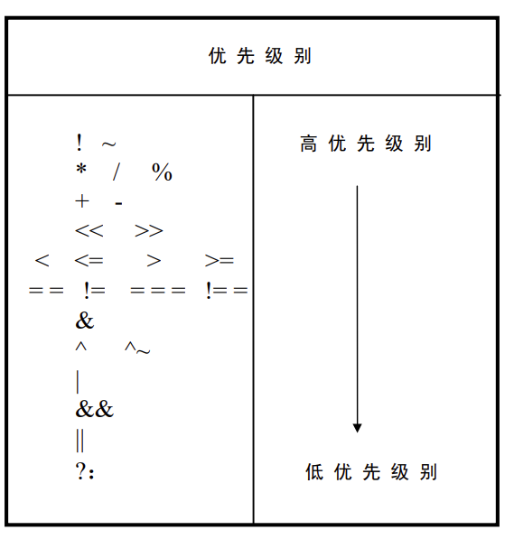

# Verilog

## 1. 模块结构

>    Verilog程序的最基本设计单元是“模块”，模块从关键字**module**开始，到**endmodule**结束，其中每条语句以";"分隔。

一个完整的模块由以下四个部分组成：

●**模块定义行**：定义**模块名称、输入输出参数**列表；

●**说明部分**：定义不同的项，其中包括**端口类型**（input输入、output输出和inout双向端口）、**寄存器**（**reg**）、连线（**wire**）、参数（parameter）、函数（function）和任务（task）；

●**描述体部分**：这一部分描述模块的行为和功能；

●**结束行**：以endmodule结束

> 例子：
>
> 
>
> 语法说明
>
> **module/endmodule** :表征模块的开始与结束。 ------ 以**下划线**和**字母** **开头**
>
> **example** ：模块名可由用户指定，可包含字母、数字及下划线，需以字母开头，区分大小写
>
> **assign** :赋值操作关键字，该关键字后可跟一个赋值表达式，该关键字是实现**组合逻辑操作**的一种主要描述方式。
>
> **input/output** :表征该信号的方向，除输入、输出外还有一种inout（输入输出）型。

操作符：

```
~按位取反、&按位与、|按位或
```

> 例子：
>
> ```verilog
> //模块定义行，test为模块名，括号内为参数列表（这里可以不说明其输入输出类型）
> module test(A,B,C,D,F1,F2); 
> 
> //说明部分，将A,B,C,D定义为输入，F1、F2为输出，wire和reg类型暂且先不管
>   input  A,B,C,D;
>   output F1,F2;
>   wire   F1;
>   reg    F2;
> 
> //描述体部分，F2是F1经过一个D触发器，将数据延迟一拍(在D的上升沿才将F1赋值给F2)
> always@(posedge D)
>   F2 <= F1;
>   
> //描述体部分，F1= AB + （~A）（~C)
> assign F1 = (A & B)|(~A & ~C);
> 
> //结束行
> endmodule
> ```
>
> 信号类型声明：
>
> * wire类型表示直通，一条连线，只要输入有变化输出马上无条件反映；
> * reg类型表示一定要有触发，输出才会反应输入；
>
> **不声明类型时默认为wire类型**

声明类型时也**可以声明其位宽**，如`reg [2:0] A`，其表示A为3bit位宽的寄存器。

> 例子：
>
> 
>
> 

什么时候用wire，什么时候用reg？  

> 待补充

##### 逻辑功能定义

通常采用**assign持续赋值语句**、**always过程赋值块**和**调用元件**（元件例化，可以理解成C语言中调用函数，但不一样，verilog自身也有function）等方式构成逻辑功能。

●assign是持续赋值语句，只能用于对wire（连线）类型变量的赋值


### 2. 行为语句

### 2.1  过程语句

```verilog
always@(<触发条件列表>)
/*
触发条件列表又称为敏感信号表达式，触发条件写在敏感信号表达式之中，当触发条件满足时，其后的语句才能被执行，触发条件列表中的多个条件之间采用“or”来连接。
*/
```

> 例子：
>
> ```verilog
> input A,B,C;
> output D;
> 
> always@(A);                        //A发生变化就执行后面的语句
> always@(A or B);                   //A或B发生变化就执行后面语句
> always@(posedge A);                //在A的上升沿时执行后面语句
> always@(negedge B);              //在B的下降沿时执行后面语句
> always@(posedge A or negedge B);  //在A的上升沿或B的下降沿执行后面的语句
>     
> always@(*);   ==   always@(A or B or C);                  //只要有输入变量发生变化就触发条件
> ```

### 2.2   块语句

在begin-end串行块中，语句按照**串行方式**顺序执行。

举例如下，想要在clk的上升沿处实现A=B,C=D,E=F功能时，

> ```verilog
> /*不使用 begin-end */
> always@(posedge clk)
>   A = B;
> always@(posedge clk)
>   C = D;
> always@(posedge clk)
>   E = F; 
> 
> /*使用 begin-end */
> always@(posedge clk)
> begin
>   A = B;
>   C = D;
>   E = F;
> end
> ```

### 2.3  赋值语句

①**用assign持续赋值**

该语句一般用于组合逻辑的赋值，成为连续赋值；例如F=AB + AC;

```verilog
assign F = (A & B) | (A & C);
```

**②用always过程赋值**

当过程赋值较多时，通常采用begin-end构成串行块，在该块中可以对多个变量进行赋值操作；在过程赋值中，只有**寄存器类型的变量**才能被赋值；

赋值有**非阻塞赋值**和**阻塞赋值**；

●**非阻塞赋值(  < =  )**

```Verilog
always@(posedge clk)
begin
  b <= 1'b1;         //1'b表示一位二进制，再例如4’b 1111表示四位二进制数1111
  a <= b;
end
12345
```

假设初始时b为0，当触发后b和a**同时**分别赋值1和0；也就是说**a赋值的是b之前的值**。

**●阻塞赋值** **（  =  ）**

```Verilog
always@(posedge clk)
begin
  b = 1'b1;         //1'b表示一位二进制，再例如4’b 1111表示四位二进制数1111
  a = b;
end
12345
```

假设初始时b为0，当执行b=1后，b变为1，然后再执行a=b，a赋值为1


### 2.4  条件语句

两种条件语句**if-else**语句和**case**语句，他们都是顺序语句且**只能放在always块内。**

> ```verilog
> module test(A,B,C);
> input A,B;
> output C;
> reg C;
> 
> always@(*)
> begin
>     if(A == B)
>       C <= 1;
>     else
>       C <= 0;
> endmodule
> ```
>
> ```verilog
> case(条件表达式)
>   值1 ：语句1;
>   值2 : 语句2;
>   ...
>   值n : 语句n;
>   default : 语句n+1;
>   endcase
> ```
>
> ```verilog
> module test(A,B);
> input [1:0] A;
> output B;
> reg B;
> 
> always@(*)
> begin
>    case(A)
>      2'b00 : B <= 1;
>      2'b01 : B <= 0;
>      2'b10 : B <= 1;
>      2'b11 : B <= 1;
>      default ：B <= 0;
>    endcase
> end
> endmodule
> ```

#### 2.4.1 运算符

##### （1）条件运算符“ ？：”

举个例子，assign a = (b==3) ? 4 : 5;

意思就是如果b=3，那就将4赋值给a，如果不等于就将5赋值给a；

##### （2）拼接运算符“{ }”

假设a=3’b011，b=3’b101,执行如下语句

```
c = { a , b };
```

那c的结果就为011101,但前提是c这个变量的位宽必须要大于6，如果他只有4bit位宽，那结果就变为1101。


##### 1.  算术运算符

| 算术运算符 | 作用                 |
| ---------- | -------------------- |
| a + b      | a 加上b              |
| a - b      | a减去b               |
| a * b      | a乘以b               |
| a / b      | a除以b               |
| a % b      | 求余运算，a除b的余数 |
| a ** b     | a的b次方             |

##### 2、关系运算符

| 关系运算符 | 作用                           |
| ---------- | ------------------------------ |
| a < b      | a 小于b                        |
| a > b      | a大于b                         |
| a <= b     | a小于等于b                     |
| a >= b     | a大于大等于b                   |
| a === b    | 实例相等，a等于b，包含x和z     |
| a !== b    | 实例不相等，a不等于b，包含x和z |
| a == b     | 逻辑相等 ，只作用于0/1         |
| a != b     | 逻辑不相等 ，只作用于0/1       |

“===” 和 ==”的区别：


##### 3.  位运算符

```verilog
~ ：按位取反   	 	 a=1001   ~a=0110
& ：按位与   	 	 a=1001   b=0001   a&b=0001   &a = 1&0&0&1 = 0;&b = 1&0&0&0 = 0
| ：按位或      	 	 a=1001   b=0001   a|b=1001   |a = 1|0|0|1 = 0;|b = 1|0|0|0 = 0
^ ：按位异或	     	 a=1001   b=0001   a^b=1000	  ^a = 1^0^0^1 = 0;^b = 1^0|0^0 = 1
^~ ：按位同或(异或非)  a=1001   b=0001   a^~b=0111  ^~a = ~(^a) = 1; ^~b = ~(b) = 0
```

##### 4、逻辑运算符

逻辑与 &&（双目运算符） ；逻辑或 || （双目运算符）；逻辑非 ！ （单目运算符）


```markdown
一个为4bit二进制数为4'b0001是为真（True）；只有当等于4'b0000是才为假（Fals）；
 逻辑运算符的关键在于逻辑运算符比较的量不在于值本身，而在于这个值的“真”与“假”
 因此，两个不同位宽的变量也可以进行逻辑运算！！
```

##### 5.  条件运算符

```verilog
assign  a = (b)?4'b1:4'b0; 如果b为真，那么a = 4'b1，否则a = 4'b0  
```

##### 6.    移位运算符

```verilog
 reg [3:0] a，c;
 reg [5:0] b;
 a = 4'b1001;
 b = a<<2;    此时b=6'b100100，原始a=9*4=36；
 c = a>>2;    此时c=4'b0010，原始a=9/4=2余1，显示为2；不显示余数
```

##### 7.    拼接运算符

```verilog
a = 4'h1101;
b = 6'h111000；
c = 2'h11；
d = {a[3],b[2:0],c}；此时d = 100011
e = {2{b}};          此时e = {b,b} = 111000111000
f = {a,b,2{a,c}}     此时f = {a,b,a,c,a,c} = 11111100011011111011
```

