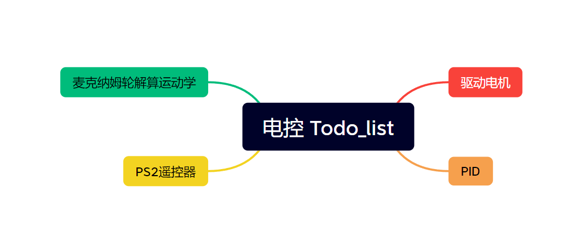

# 电控资料

* PID课

【从不懂到会用！PID从理论到实践~】 https://www.bilibili.com/video/BV1B54y1V7hp/?share_source=copy_web&vd_source=38d91c7f8b1a8b6f47f8edfb938f8a5f

* 驱动电机

[lynliam/STM32_Driver: STM32相关底层驱动 (github.com)](https://github.com/lynliam/STM32_Driver)

[STM32_code/STM32F407_Demo2 at main · lynliam/STM32_code (github.com)](https://github.com/lynliam/STM32_code/tree/main/STM32F407_Demo2)

* 麦克纳姆轮运动学

**着重看第一个！！！！！！！！**

[微信公众平台 (qq.com)](https://mp.weixin.qq.com/s/GWhlXsuY6QYyoZydaSYpjQ)

[robomaster麦轮运动解算_麦轮解算_HouEna的博客-CSDN博客](https://blog.csdn.net/qq_53671582/article/details/124070401)

[麦克纳姆轮（麦轮）原理-CSDN博客](https://blog.csdn.net/weixin_64064747/article/details/128693337)

* PS2遥控器

[STM32_code/STM32F407_Demo2/User at main · lynliam/STM32_code (github.com)](https://github.com/lynliam/STM32_code/tree/main/STM32F407_Demo2/User)