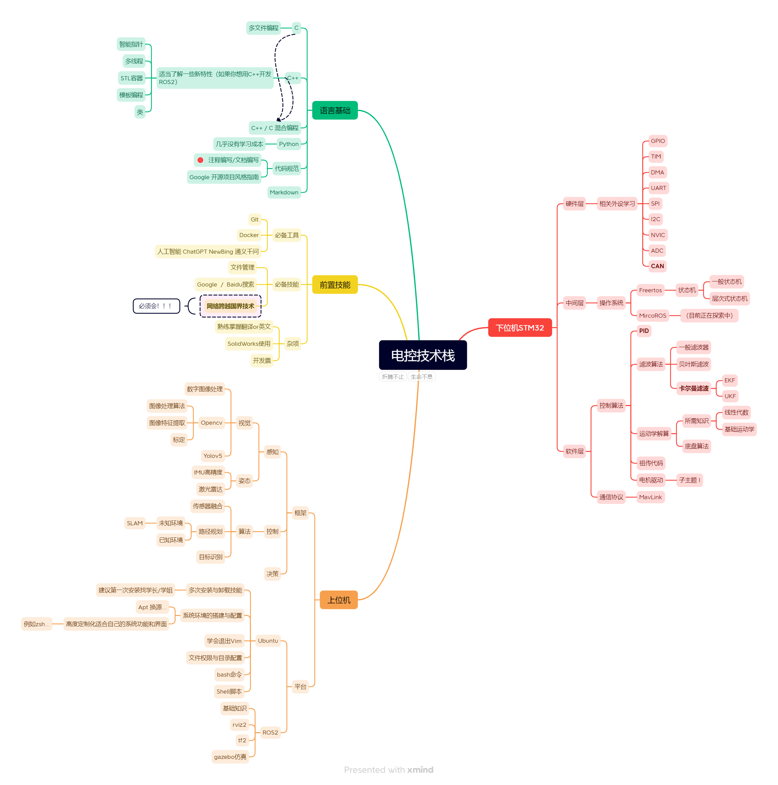

# WTR 电控学习路径

------

## 1.0   Mind Map

## 2.0   接下来是资料推荐：

### 2.1    语言基础

#### 2.1.1    C 

#### 2.1.2    C++

#### 2.1.3    Python

#### 2.1.4    Markdown

#### 2.1.5    代码规范

### 2.2    前置技能

#### 2.2.1    必备工具

#### 2.2.2    必备技能

#### 2.2.3    杂项

### 2.3    上位机

#### 2.3.1    Ubuntu

* Linux学习： 《鸟哥的linux私房菜》
* 最重要的能力是**搜索能力**， 只有在实际实践操作中才能有效提升自己的能力！！

#### 2.3.2   `ROS2`（Humble）

资料：

* [动手学ROS2 (fishros.com)](https://fishros.com/d2lros2foxy/#/)
* [ROS 2 Documentation — ROS 2 Documentation: Dashing documentation](http://docs.ros.org/en/dashing/)
* 

#### 2.3.3     `Opencv`

#### 2.3.4     `Yolov5`

### 2.4     STM32

#### 2.4.1   FreeRTOS

#### 2.4.2   MicroROS

#### 2.4.3   PID

#### 2.4.4   MavLink

#### 2.4.5  CAN

#### 2.4.6  滤波算法

舵轮  

底盘

