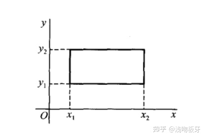

# 联合概率分布   6

## 联合分布函数

定义 $F(x,y) = P(X<x,Y<y)$  为二元随机向量的联合分布函数。

$$
P(a_1<X \leq a_2, b_1<Y\leq b_2) = F(a_2,b_2) - F(a_2,b_1) + F(a_1,b_1)-F(a_1,b_2)
$$

## 概率密度函数

对于$F(x,y)$，如果存在$f(x,y)$,使得$F(x,y) = \int^x_{-\infty}\int^y_{-\infty}f(s,t)dsdt$ 则，$f(x,y)$ 为概率密度函数。
$$
\begin{align}
f(x,y)\geq0& \\
&\int_{-\infty}^{\infty}\int_{-\infty}^{\infty}f(s,t)dsdt=1 \\ \\
如果G为某一区域，&则随即向量点落在G内的概率为 \iint_{G}^{} f(s,t)dsdt \\
如果 f(x,y) 在 &(x,y) 连续，则 f(x,y)= \frac{\partial^2}{\partial x\partial x}F(x,y) 
\end{align}
$$

## 多元随机向量

表示为 $(X_1,X_2,X_3,X_4,...,X_n)$

## 边缘分布

探讨**某个变量**的分布情况：
$$
F_X(x) = P(X \leq x) = P(X \leq x, Y \leq \infty) = F(x,\infty)
$$
如果取值不独立，则使用：
$$
f_X(x) = \int_{\Omega_Y}f(x,y)dy
$$
有个小技巧：找 $\Omega_Y$ 的时候，保持 $X$ 固定，然后对这个固定的 $X$ 找使得 $f(X,Y)>0$ 的 $y$ 的取值。

**边缘分布**：$E(X) = \int_{\Omega_X}xf_X(x)dx$

**边缘方差**：$Var(X) = \int_{\Omega_X}(x-E(X))^2f_X(x)dx$

## 条件分布：

研究**某些随机变量给定**的情况下，另外一些随机变量的分布情况。
$$
F_{X|Y}(x|y) = P(X \leq x | Y = y) =  \int^x_{-\infty}\frac{f(x,y)}{f_Y(y)}dx \\
f(X|Y)(x|y) = \frac{f(x,y)}{f_Y(y)}
$$

## 独立性：

对于二维随机变量 $(X,Y)$：

如果 $P(X \leq x,Y \leq y) = P(X \leq x)(Y \leq y)$ 则称随机变量 $X,Y$ 独立。

> 另一种形式：
> $$
> F(X,Y) = F_X(x)F_Y(y)
> $$

离散型随机变量：

对所有组合$(x_i,y_i)$:
$$
P(X=x_i,Y=y_i)=P(X=x_i)P(Y=y_i)
$$
连续型随机变量：

对于整个平面
$$
f(x,y) = f_X(x)f_Y(y)
$$

对于n维向量：

如果n维随机向量$(X_1,X_2,...,X_n)$:
$$
F(X_1,X_2,...,X_n) = F_{X_1}(x_1)F_{X_2}(x_2)F_{X_3}(x_3)...F_{X_n}(x_n)
$$
