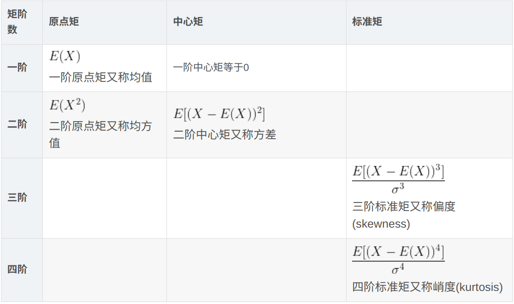

# 随机变量及其性质 2

## 2.1   随机变量

随机变量是一个有**样本空间**向实数域的**映射**，而且这个映射是**单射**。

样本空间的描述可以是文字或者数字。
$$
S \rightarrow X(S) \rightarrow P(X)
\\
Sample Space  \rightarrow RandomVariable \rightarrow Probability
$$

## 2.2   DRV (discrete random variable)

离散型随机变量的取值要求的是“**可列**”，而不是有限。

自然数集或者骰子的数字（无限可列和有限可列）是离散型随机变量，而有理数集或区间 [0,1] （无限不可列和有限不可列）就不是离散型随机变量。

### 2.2.1   PMF   (概率质量函数)

$$
\begin{align}
&f_X(x) = P(X=x) \\ \\
\mathrm{s.t.}
& \begin{cases}
0 \leq f_X(x) \leq 1\\
\sum_{x:f_X(x)>0}f_X(x) = 1
\end{cases}
\end{align}
$$

### 2.2.2   CDF  (累计分布函数)

$$
\begin{align}
F_{X}(x)= & P(X\leq x)=\sum_{y\leq x}^{}{f_{X}(y)} \\ \\
&\lim_{x \to + \infty} F_{X}(x)=1 \\ 
&\lim_{x \to - \infty} F_{X}(x)=0 \\ 
&x_{1}\leq x_{2},F_{X}(x1)\leq F_{X}(x1) \\ 
&\lim_{x^{+} \rightarrow a}{F_{X}(x)}=F_{X}(a) 
\end{align}
$$

联系：
$$
f_{X}(x_{i})=\left\{\begin{matrix} F_{X}(x_{i}),&i=1 \\ F_{X}(x_{i})-F_{X}(x_{i-1}),&i>1 \end{matrix}\right.
$$

## 2.3   CRV  (continuous random variable) 

### 2.3.1   PDF   (概率密度函数)

$f_{X}(x)$
$$
\begin{align}
&f_{X}(x)\geq0 \\
&\int_{\Omega_{x}}^{}f_{X}(x)dx=1
\end{align}
$$

* 离散型是概率**质量**函数，连续型是概率**密度**函数。
* 概率密度函数的取值可以大于1

### 2.3.2   CDF  (累积分布函数)

$$
F_{X}(x)=P(X\leq x)=\int_{-\infty}^{x}{f_{X}(x)}dx
$$

性质：
$$
\begin{align}
&P(X=x)=0 \\
&P(a\leq\ X \leq b)=F_{X}(b)-F_{X}(a)=\int_{a}^{b}f_{X}(x)dx
\end{align}
$$
**联系**:
$$
\begin{align}
&f_{X}(x)=\frac{dF_{X}(x)}{dx}
\end{align}
$$

## 2.4  期望

描述概率分布**集中趋势**。
$$
E(X)=\left\{\begin{matrix} \sum_{x\in \Omega_{X} }^{}xf_{X}(x) ,&DRV \\ \int_{x\in \Omega_{X}}^{}xf_{X}(x)dx, &CRV \end{matrix}\right.
$$
当概率分布为复合函数时：
$$
E(g(X))=\left\{\begin{matrix} \sum_{x\in \Omega_{X} }^{}g(x)f_{X}(x) ,&DRV \\ \int_{x\in \Omega_{X}}^{}g(x)f_{X}(x)dx, &CRV \end{matrix}\right.
$$
线性运算：
$$
E(aX+bY+c)=aE(X)+bE(Y)+c
$$

## 2.5   方差

$$
Var(X)=\left\{\begin{matrix} \sum_{x\in \Omega_{X} }^{}(x-E(X))^{2}f_{X}(x) ,&DRV \\ \int_{x\in \Omega_{X}}^{}(x-E(X))^{2}f_{X}(x)dx, &CRV \end{matrix}\right.
$$

另一个公式：
$$
Var(X)=E(X^{2})-(E(X))^{2}
$$
性质：
$$
\sigma_{x}=\sqrt{Var(x)}
$$

## 2.6    矩

> From Wikipedia
>
> In [mathematics](https://en.wikipedia.org/wiki/Mathematics), the **moments** of a [function](https://en.wikipedia.org/wiki/Function_(mathematics)) are certain quantitative measures related to the shape of the function's [graph](https://en.wikipedia.org/wiki/Graph_of_a_function)

### 2.6.0  Defination

> The **n**-th raw moment (i.e., moment about zero) of a distribution is defined by
> $$
> \begin{align}
> &\mu_n = <x^n> \\ 
> \text{where:} & <f(x)> = \begin{cases}
> \sum f(x)P(x),  \\   
> \int f(x)P(c)dx,
> \end{cases}
> \end{align}
> $$
> if real-valued continuous function about a value **c**:
> $$
> \mu_n = \int^{\infty}_{-\infty}(x-c)^nf(x)dx
> $$
>
> * c = 0     为**原点矩**
> * c= E(X) 为**中心矩**
> * standardised moment（**标准矩**） $\frac{\mu_n}{\sigma^n} = \frac{E[(x-c)^n]}{\sigma^n}$ 
>
> 

### 2.6.1  原点矩

$$
E(x^{k})=\left\{\begin{matrix} \sum_{x\in \Omega_{X} }^{}x^{k}f_{X}(x) ,&DRV \\ \int_{x\in \Omega_{X}}^{}x^{k}f_{X}(x)dx, &CRV \end{matrix}\right.
$$

**一阶原点矩为数学期望**

### 2.6.2   中心矩

$$
E((X-E(X))^{k})=\left\{\begin{matrix} \sum_{x\in \Omega_{X} }^{}(x-E(X))^{k}f_{X}(x) ,&DRV \\ \int_{x\in \Omega_{X}}^{}(x-E(X))^{k}f_{X}(x)dx, &CRV \end{matrix}\right.
$$

看表格

### 2.6.3    应用

#### 1.  偏度

$$
skew(X)=\frac{E([X-E(X)]^{3})}{\sigma^{3}}

\left\{\begin{matrix} skew(X)<0,&左偏 \\ skew(X)=0,&对称 \\ skew(X)>0,&右偏 \end{matrix}\right.
$$

#### 2.  峰度

$$
kurt(X)=\frac{E([X-E(X)]^{4})}{\sigma^{4}}-3

\left\{\begin{matrix} kurt(X)<0,&比正态圆润 \\ kurt(X)=0,&正态 \\ kurt(X)>0,&比正态尖锐 \end{matrix}\right.
$$

这里这个减三没有啥特别的性质，就是为了让正态分布的峰度为0.

#### 3.  矩母函数

高阶矩的计算有时候非常繁琐，所以我们需要引入矩母函数来**简化运算难度**。
$$
M_{X}(t)=E(e^{tX})
$$
**定理：**
$$
M_{X}^{(k)}(0)=E(X^{k})
$$
性质：
$$
Y=a+bX
\\
M_{Y}(t)=e^{at}M_{X}(bt)
$$

