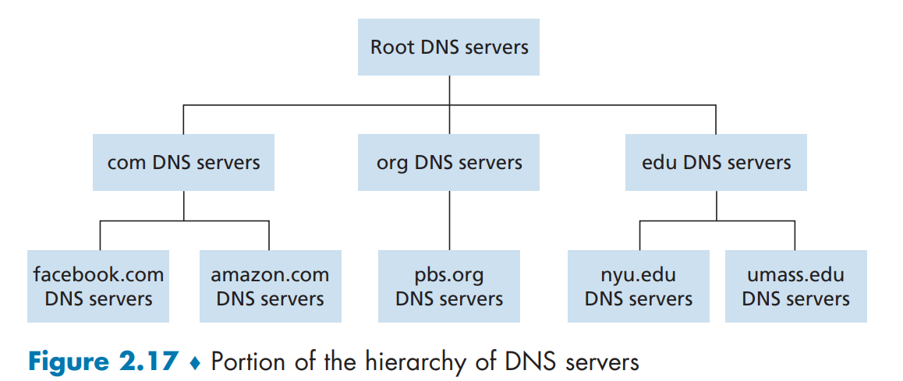

# Application Layer

------

## Principles of Network Applications

### Network Application Architectures

### Processes Communicating

### Transport Services Availabel to Applications

### Transport Services Provided by the Internet

### Application-Layer Protocols

### Network Applications Covered in This Book


## The Web and HTTP


## Electronic Mail in the Internet


## DNS---The Internet's Directory Service

There are two kinds of identifier for Internet host. One is **hostname** which is easy for human to identify and remember, like ```wwww.favebook.com```, the other is **IP address** (120.45.65.4) which is much easy for machines to use. 

> #### The  construction of  IP address:
>
> 121.7.106.83   where each period separates one of the bytes expressed in decimal notation from 0 to 255.

### Services Provided by DNS:

DNS(domain name system): directory service that translates hostnames to IP address.  Runs over UDP and uses port 53. Employing applicationlayer protocols ingcluding HTTP and SMTP.

MAIN TASK：

1. a distributed database implemented in a hierarchy of DNS servers
2. an application-layer protocol that allow hosts to **query the distributed database**

> Attention: **DNS** will add an additional delay. 
>
> Solution:  DNS caching

Function:

* Host aliasing
  * A host can have one or more alias names. You can scroll the content above.
* Mail server aliasing
  * The MX record permits a company's mail sercer and Web server to have identical hostnames.
* Load distribution
  * can perform load distribution among replicated server. For example, google have many search engine server(a set of IP), but have one hostname----```www.google.com```. So DNS server can distribute or rotate tons of request to every server.

### Overview of How DNS Works

Overview step: 

1. Host invoke the client side of DNS to push a request contain query message by UDP datagrams through port 53.
2. DNS receive and search for it and reply the desired mapping message.

> The problem that one DNS server contains all the mappings
>
> * A single point of failure.              One DNS crashes, the whole Internet crashes.
> * Traffic volume                             Busy
> * Distant centralized database     Delay because not every host is behind the DNS
> * Maintenance                              Database will be huge

### A Distributed, Hierarchical Database:

In reality, the DNS uses a large number of servers and distributed around the world.

Hierarchy:

* root DNS servers
  * More than 1000 root server instances which are copies of 13 different root sercers
  * Provide the IP addresses of the TLD servers.  
* top-level domain DNS server(TLD)
  * such as .org .com .gov .cn
  * The company Verisign GLobal Registry Services maintains the TLD server for ***com***
  * always provide the IP adresses for authoritative
  * sometimes provide an intermediate DNS server, which knows the authoritative DNS server.
    * example:  ```dns.umass.edu( intermediate DNS server)```->```dns.cs.umass.edu(authoritative DNS server)``` 
* authoritative DNS server
  * provide publicly accessible DNS records that maps the names of those hsots to IP adddress.
* Local DNS server(do not strictly belong to the hierarchy)(aka default name server)
  * Each ISP has a local DNS server.
  * ISP provide the host with the IP address typically through DHCP
  * local host acts a proxy, forwarding the query into the DNS server hierarchy.



The Figure below make use of both **recursive queries** and **iterative queries**. In order to obtain the mapping for one hostname, eight DNS messages were sent.


#### DNS Caching:

DNS extensively exploits **DNS caching** in order to improve the **delay performance** and reduce **the number of DNS messages** ricocheting around the Internet.

**Function:**

* DNS server cache the mapping in its local memory.
* But it will discard cached information after a period of time(two days always).

### DNS Records and Messages 

**records:**

DNS **resource records(RRs)** is a four-tuple that contains the following fields:

* Name
* Value
* Type
* TTL 

> TTL is the time to live of the resource record; It determines when a resource should be removed from a cache.

Type:

* A              hostname - IPv4 address
* AAAA       hostname - IPv6 address
* ALIAS      
* CNAME   alias hostname - canonical hostname
* MX           alias hostname - canonical name for a mail server
* NS           domain - hostname of an authoritative DNS server
* TXT         to save some text.

**messages:**

## Peer-to-Peer File Distribution
