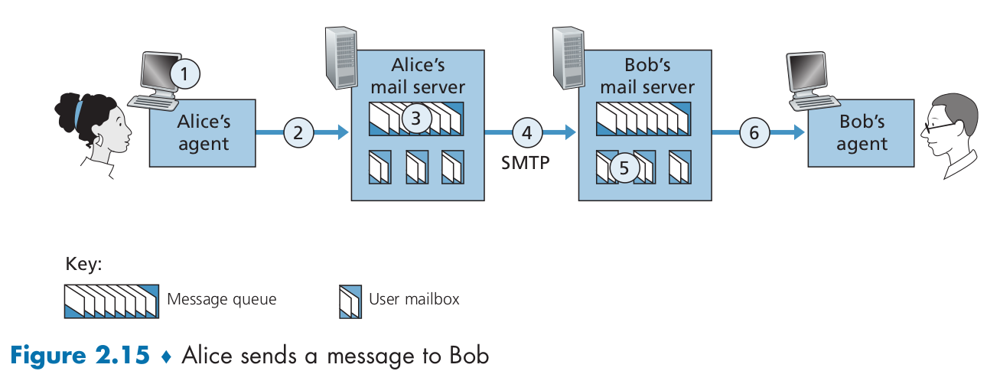
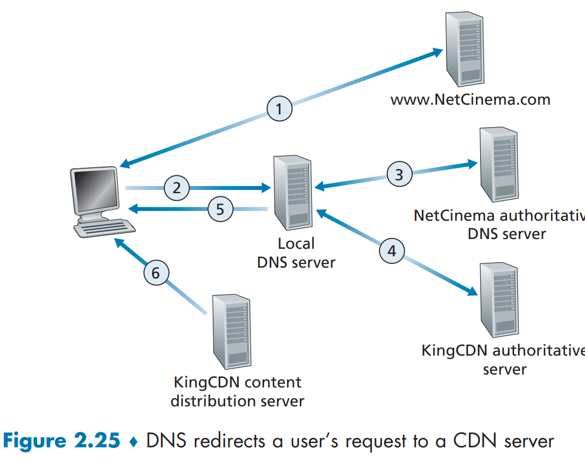

# Application Layer

------


## Principles of Network Applications


### Network Application Architectures

The **Application architecture** designed by the application seveloper, and two architecture: 

* **client-sever architecture**
  * The client do not communicate with each other.
  * A single server is not enough---data center.
* **the peer-to-peer architecture**
  * One of its compelling features of P2P architecture.
  * Drawbacks: security, performance, and reliablity


### Processes Communicating

In the jargon of operating systems, it is not actually programs but processes that  a. Client-server architecture communicate.

Processes on two different end systems communicate with each other by  exchanging **messages** across the computer network.

#### Client and Server Processes

> In the context of a communication session between a pair of processes, the process that initiates the communication (that is, initially contacts the other process  at the beginning of the session) is labeled as the client. The process that waits to  be contacted to begin the session is the server.

#### The Interface Between the Process and the Computer Network

A process  sends messages into, and receives messages from, the network through a software  interface called a **socket** also referred to as the **Application Programming Interface(API)**.


Application programmer can control the 1) the choice of transport protocol. 2) ability to fix a few transport-layer parameters.

#### Addressing Processing

1. The address of the host---an identifier called **IP address**
2. . A destination port number that the receiving process is on.

### Transport Services Available to Applications

Some factors are needed to be considered when choosing the proper protocol:

#### 	1.  Reliable Data Transfer

​			Some application can tolerate the packages loss while other not.

​			**loss-tolerant applications**

#### 	2.  Throughout

​			**bandwidth-sensitive applications**

#### 	3.  Timing

#### 	4.  Security

### Transport Services Provided by the Internet

* #### TCP

* #### UDP

### Application-Layer Protocols

### Network Applications Covered in This Book


## The Web and HTTP

### Overview of HTTP(HyperText Transfer Protocol)

* client-server program model
* **Web page**

### Non-Persistent and Persistent Connnections

### HTTP Message Format

### User-Server Interaction: Cookies

### Web Caching

### HTTP/2


## Electronic Mail in the Internet


* **User agent** allow users to read, reply, forward, save and compose messages
* **mail server** form the core of the e-mail infrastructure.
* **SMTP** is the principal application-layer protocol.
  * use TCP
  * a push protocol.
  * contain mailbox for each user.
  * help send or receive mail asynchronous

#### Illustration:




Step:

1. he client SMTP has TCP establish a connection to port 25 at the server SMTP.
2. Try once again or handshaking.
3. introduce themselves.
4. indicates the e-mail address of the sender and the e-mail address of the recipient.
5. Send
6. close TCP connection.

```shell
S:220 hamburger.edu
C:HELO crepes.fr
S:250 Hello crepes.fr, pleased to meet you
C:MAIL FROM: <alice@crepes.fr>
S:250 alice@crepes.fr ... Sender ok
C:RCPT TO: <bob@hamburger.edu>
S:250 bob@hamburger.edu ... Recipient ok
C:DATA
S:354 Enter mail, end with ”.” on a line by itself
C:Do you like ketchup?
C:How about pickles?
C:.
S:250 Message accepted for delivery
C:QUIT
S:221 hamburger.edu closing connection
```

### Mail Message Formats:

```shell
From: alice@crepes.fr
To: bob@hamburger.edu
Subject: Searching for the meaning of life.
[CRLF]
[Body]
```


## DNS---The Internet's Directory Service

There are two kinds of identifier for Internet host. One is **hostname** which is easy for human to identify and remember, like ```wwww.favebook.com```, the other is **IP address** (120.45.65.4) which is much easy for machines to use. 

> #### The  construction of  IP address:
>
> 121.7.106.83   where each period separates one of the bytes expressed in decimal notation from 0 to 255.

### Services Provided by DNS:

DNS(domain name system): directory service that translates hostnames to IP address.  Runs over UDP and uses port 53. Employing applicationlayer protocols ingcluding HTTP and SMTP.

MAIN TASK：

1. a distributed database implemented in a hierarchy of DNS servers
2. an application-layer protocol that allow hosts to **query the distributed database**

> Attention: **DNS** will add an additional delay. 
>
> Solution:  DNS caching

Function:

* Host aliasing
  * A host can have one or more alias names. You can scroll the content above.
* Mail server aliasing
  * The MX record permits a company's mail sercer and Web server to have identical hostnames.
* Load distribution
  * can perform load distribution among replicated server. For example, google have many search engine server(a set of IP), but have one hostname----```www.google.com```. So DNS server can distribute or rotate tons of request to every server.

### Overview of How DNS Works

Overview step: 

1. Host invoke the client side of DNS to push a request contain query message by UDP datagrams through port 53.
2. DNS receive and search for it and reply the desired mapping message.

> The problem that one DNS server contains all the mappings
>
> * A single point of failure.              One DNS crashes, the whole Internet crashes.
> * Traffic volume                             Busy
> * Distant centralized database     Delay because not every host is behind the DNS
> * Maintenance                              Database will be huge

### A Distributed, Hierarchical Database:

In reality, the DNS uses a large number of servers and distributed around the world.

Hierarchy:

* root DNS servers
  * More than 1000 root server instances which are copies of 13 different root sercers
  * Provide the IP addresses of the TLD servers.  
* top-level domain DNS server(TLD)
  * such as .org .com .gov .cn
  * The company Verisign GLobal Registry Services maintains the TLD server for ***com***
  * always provide the IP adresses for authoritative
  * sometimes provide an intermediate DNS server, which knows the authoritative DNS server.
    * example:  ```dns.umass.edu( intermediate DNS server)```->```dns.cs.umass.edu(authoritative DNS server)``` 
* authoritative DNS server
  * provide publicly accessible DNS records that maps the names of those hsots to IP adddress.
* Local DNS server(do not strictly belong to the hierarchy)(aka default name server)
  * Each ISP has a local DNS server.
  * ISP provide the host with the IP address typically through DHCP
  * local host acts a proxy, forwarding the query into the DNS server hierarchy.


The Figure below make use of both **recursive queries** and **iterative queries**. In order to obtain the mapping for one hostname, eight DNS messages were sent.


#### DNS Caching:

DNS extensively exploits **DNS caching** in order to improve the **delay performance** and reduce **the number of DNS messages** ricocheting around the Internet.

**Function:**

* DNS server cache the mapping in its local memory.
* But it will discard cached information after a period of time(two days always).

### DNS Records and Messages 

**records:**

DNS **resource records(RRs)** is a four-tuple that contains the following fields:

* Name
* Value
* Type
* TTL 

> TTL is the time to live of the resource record; It determines when a resource should be removed from a cache.

Type:

* A              hostname - IPv4 address
* AAAA       hostname - IPv6 address
* ALIAS      
* CNAME   alias hostname - canonical hostname
* MX           alias hostname - canonical name for a mail server
* NS           domain - hostname of an authoritative DNS server
* TXT         to save some text.

**messages:**

* The first 12 bytes is the heaser section
* The question sectioin :
  * a name field that contains the name that is being made.
  * a type field that indicates the type of question being asked about the name.


## Peer-to-Peer File Distribution

In P2P architecture, there is minimal reliance on always-on infrastructure servers. One of the popular P2P protocol is BitTorrent.

### Scalability of P2P Architectures

Let's talk about the **distribution time** now.


* The size of the file-----F bits
* N host
* the distribution time of client-server----- $D_{cs}$ 

$$
d_{min}=min\{d_1,d_2,d_3,...,d_N\}
$$

Thus the distribution time increases linearly with the number of peers N.
$$
D_{cs}\geq max\{\frac{NF}{u_s},\frac{F}{d_{min}}\}
$$

* the distribution time of P2P----- $D_{P2P}$ 

The total upload capacity of the system as a whole is equal to the upload rate of the server plus the upload rates of each of the individual peers
$$
D_{P2P}\geq max\{\frac{F}{u_s},\frac{F}{d_{min}},\frac{NF}{u_s+\sum_{i=1}^{N}{u_i}}\}
$$


### Bittorrent

The collection of all peers are called a torrent.

Peers in a torrent download equal-size **chunks of the files** with typicala chunk size of **256 KBytes**.


* Each torrent  has an infrastructure node called a tracker, which tracks the alive peers
* randomly selects a subset of peers(50) and setablish a TCP connection with them(neighbor peers).
* ask for neighbor peers for list of the chunks they have.
* request the rarest chunks among them  called **rarest first**
* gives priority to the neighbors that are currently supplying data at **the highest rate**.
* Determine 4 peers   to be **unchoked**


## Video Streaming and Content Distribution Networks

### Internet Video

* A video is a sequence of images.
* Video can be compressed.
* can create mulitiple versions of the same video.

### HTTP Streaming and DASH

STEP:

1. client establishes a TCP connection with the server and issues an HTTP ```GET``` request for that URL.
2. server sends the video file
3. client collects the bytes in a client buffer.
4. When bytes exceeds a predetermined threshold, the client begins playback.

DASH(**Dynamic Adaptive Streaming over HTTP**)

* In DASH, the video is encoded into **several different versions** having different bit rate(quality).
* DASH allows clients with different Internet access rates to stream in video at different encoding rates.
* The HTTP server also has a **manifest file** providing a URL for each version along with its bit rate.

### Content Distribution Networks

Challenges: Streaming all the video traffic to locations all over the world while providing continuous playout and high interactivity is clearly a challenging task.

Drawbacks of a single database:  1)  far away from some client.  2) waste bandwidth while a popular video is being sent many times over same links.  3) a single point failure.

Solution:  Making use of **Content Distribution Networks(CDNs)**

 A CDN manages servers in multiple geographically distributed locations, **stores copies** of the videos (and other  types of Web content, including documents, images, and audio) in its servers, and  attempts to **direct each user request to a CDN location** that will provide the best user  experience.

Category: 1) **private CDN**    2)  **third-party CDN**

Two different server placement philosophies of CDNs:

* Enter Deep
  * Means enter deeper into the access networks of Internet Service Providers.
  * By deploying server clusters in access ISPs.
  * Drawbacks: maintaining and managing is challenging.
* Bring Home
  * Large clusters getting inside the access ISPs. 

Once its clusters are in place, the CDN replicates content across its clusters, and acts like a Web caching.

### CDN Operation:

When a browser in a user's host is instructed to retrieve a specific video, the CDN will **intercept** the request and do:

1. determine a suitable CDN server cluster for that  client at that time.
2. redirect the client’s request to a server in that cluster.


Six steps then occur:

1. The user visits the Web page at NetCinema.
2. When the user clicks on the link http://video.netcinema.com/6Y7B23V, the  user’s host sends **a DNS query** for video.netcinema.com.
3. The user’s Local DNS Server (LDNS) relays the DNS query to an authoritative  DNS server for NetCinema, which observes the string “video” in the hostname video.netcinema.com. To “hand over” the DNS query to KingCDN,  instead of returning an IP address, the NetCinema authoritative DNS server  returns to the LDNS a hostname in the KingCDN’s domain, for example,  a1105.kingcdn.com.
4. From this point on, the DNS query enters into KingCDN’s private DNS infrastructure. The user’s LDNS then sends a second query, now for a1105.kingcdn. com, and KingCDN’s DNS system eventually returns the IP addresses of a  KingCDN content server to the LDNS. It is thus here, within the KingCDN’s  DNS system, that the CDN server from which the client will receive its content  is specified
5. The LDNS forwards the IP address of the content-serving CDN node to the  user’s host.
6. Once the client receives the IP address for a KingCDN content server, it establishes a direct TCP connection with the server at that IP address and issues an  HTTP GET request for the video. If DASH is used, the server will first send to  the client a manifest file with a list of URLs, one for each version of the video,  and the client will dynamically select chunks from the different versions




### Cluster Selection Strategies

At the core of any CDN deployment is a **cluster selection strategy**: a mechanism for dynamically directing clients to a server cluster or a data center within the  CDN. CDNs generally employ **proprietary  cluster selection strategies**: 

* GEOGRAPHICALLY CLOSEST
* periodic **real-time measurements** of delay  and loss performance
  * send probes (for example, ping messages or  DNS queries) to all of the LDNSs around the world.


### Netflix:

Netflix use two major components: 1).  Amazon cloud:  2). private CDN  infrastructure

Amazon do:

* Content ingestion
* Content prosessing 
* Uploading versions to its CDN


Netflix distributes by pushing the  videos to its CDN servers **during off-peak hours**, not using pull-caching.

STEP:

* First detemines which osdf its CDN servers have copies of the movie.
* Detemine the best tobe the request
* Sends the client the IP address of the server as well as a manifest file
* The client receive it and run a rate-detemination algorithm to detemine the quality.


### YouTube:

Google uses pull caching. Most of the time ,Google directs the client to the cluster geographically closer.

Depending on user's to employs to select the version(quality).


## Socket Programming: Crreating Network Application

