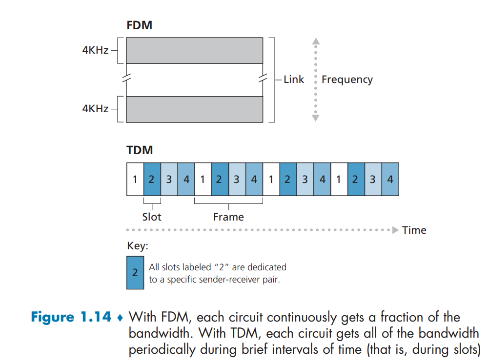
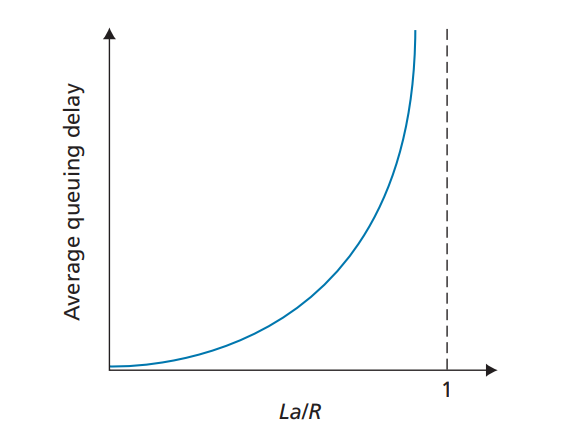
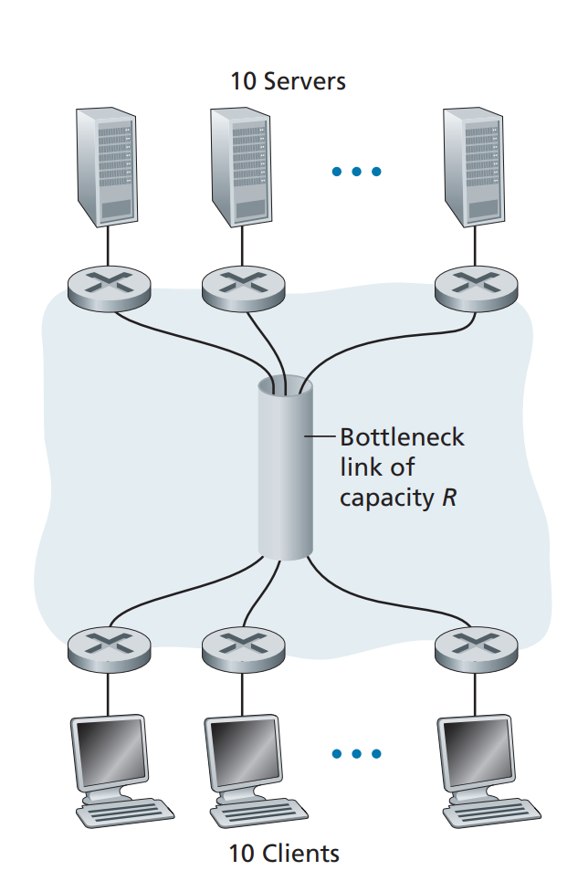
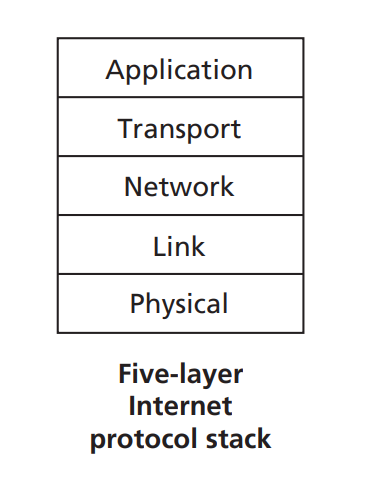
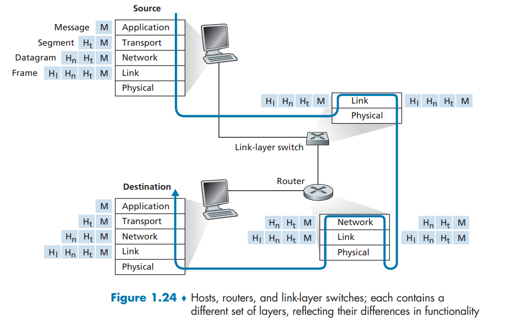
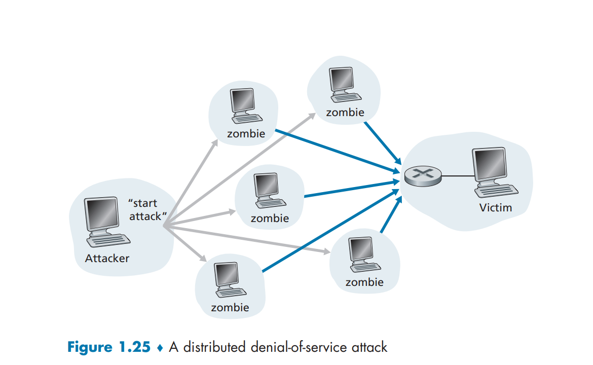

# Computer Networks and the Internet

## What is the Internet

### A Nuts-and-Bolts Description

* hosts-end systems  :  many devices that is receiver or sender are called hosts and end systems
* communication links
* packet switches
* transmission rate
* packets
* routers and link-layer switches
* route and path
* ISPs (Internet Service Providers)
  * providing a variety of types of network access.
* protocol--TCP,UDP,IP

### Protocols: 

All activity in the Internet that involves two or more communicating remote entities is governed by a protocol.

> A protocol defines the format and the order of messages exchanged between two or more communicating entities, as well as the actions takes on the transmission and/or receipt of a message or other event.

## The Network Edge

### Access Networks

[End-system interaction]

> In this note host = end system
>
> * clients
> * **servers**

#### Home Access: DSL, Cable, FTTH, and 5G Fixed Wireless

| category                     | links                                    | modem   | speed                                                |                | telecmt    |
| ---------------------------- | ---------------------------------------- | ------- | ---------------------------------------------------- | -------------- | ---------- |
| Dial up modems               |                                          |         | up to 56 Kbps                                        |                | dedicated  |
| DSL(digital subscriber line) | local phone access                       | DSLAM   | downstream: 24-52Mbps; upstream: 3.5-16Mbps          | analog signals | dedicated  |
| hybrid fiber coax(HFC)       | fiber and coaxial cable(local TV access) | CMTS    | downstream: 40Mbps-1.2Gbps; upstream: 30-100Mbps     | analog signals | shared     |
| FTTH                         | optical fiber path                       | ONT/OLT | 2-10Mbps upload; 10-20 Mbps download   **?????????** |                | not shared |

DSL link split the spectrum band(frequency-devision multiplexing):

* 0-4KHz                    phone
* 4-50KHz                  upstream  data
* 50KHz-1MKHz        downstream data

HFC: packet delivering

FTTH: two competing optical-distribution network architectures:

* active optical networks(AONS)-----Ehernet
* passive optical networks(PONS)

Ethernet and WiFi

Local area network(LAN) is used to connect an end system to the edge router. Ethernet is one of the LAN technologies.

| category | links                    | modem           | speed                                            | telecomt |
| -------- | ------------------------ | --------------- | ------------------------------------------------ | -------- |
| Ethernet | twisted-pair copper wire | Ethernet switch | user: 100Mbps- tens of Gbps    servers: 1-10Gbps |          |

Wireless LAN based on IEEE 802.11 technology.

wireless Access: 3G and LTE 4G and 5G

cellular network provider

### Physical Media

Physical medium fall into two categories: **guided media** and **unguided media**.

| physical media             |                                                             | properties         | distance              | speed            |
| -------------------------- | ----------------------------------------------------------- | ------------------ | --------------------- | ---------------- |
| twisted-pair copper wire   | a number of two insulated twisted copper wires              | LANs               | not long              | 10 M--10 Gbps    |
| coaxial cable              | two concentric copper conductors                            | shared medium      |                       | hundreds of Mbps |
| fiber optics               | a thin flexible medium conducting pulses of light           | OC-n standard link | up to 100km           | n*51.8Mbps       |
| terrestrial radio channels | air, in the electromagnetic spectrum                        |                    | 1-2m;100 m;tens of km | speed of light   |
| satellite radio channels   | air,geostationary satellites/ low-earth orbiting satellites | delay:280ms        |                       | speed of light   |

## The networks Core

network core——the mesh of packet switches and links.

### Packet Switching:

The source breaks long messages into smaller chunks of data known as packets.

#### Store-and-Forward Transmission:

In this protocol, the packet switch must receive the entire packet before it can begin to transmit the first bit of the packet onto the outbound link.

When receive bits, it will first buffer the packet's bits.

Sending one packet from source to destination over a path consisting of N links each of rate R : (There are N-1 routers between source and destination)
$$
d_{end-to-end} = N\frac{L}{R}
$$

#### Queuing Delays and Packet Loss:

Queuing delay: 

Output buffer(output queue): storing the packets if the outbound link is busy. Because the amount of buffer space is finite, an arriving packet will be dropped.------**packet loss** will occur.

#### Forwarding Tables and Routing Protocols:

forwarding table: maps destination addresses to that router to that router's outbound links.

The end-to-end routing process is analogous to a car driver who does not use maps but instead prefers to ask for directions.

#### Circuit Switching:

In circuit-switched networks, the resources needed along a path to provide for communication between the end systems. A session's messages  use the resources on demand  and , may have to **wait** for access to a communication link.

STEP:

* establish the **circuit**, also refers to establish a dedicated end-to-end connection.(握手)
* the network reserve one circuit on each of two links.

#### Multiplexing in Circuit-Switched Networks:

**FDM(frequency-division multiplexing)**&&**TDM(time-dividion multiplexing)**

| category | way                                         |      |
| -------- | ------------------------------------------- | ---- |
| FDM      | dividing frequency spectrum                 |      |
| TDm      | dividing time into frames of fixed duration |      |

## Delay, loss and Throughput in Packet-Switched Networks

> Throughput: the amount of data per second that can be transferred

### (Delay at single router)Overview：

total nodal delay contains 1). **nodal processing delay** 2). **queuing delay** 3). transmission delay 4). **propagation delay**
$$
d_{nodal}=d_{proc}+d_{queue}+d_{trans}+d_{prop}
$$

There are still other delays, such as media packetization delay, ...

#### Processing delay:

* examine the packet's header and determine where to direct the packet
* check bit-level errors

After this process, the packet will be directs the packet to the queue.

The time spend: **microsecond**

#### Queuing Delay:

Depends on the number of preceded packets.

the time spend: **microsecond to milliseconds**

#### Transmission Delay:

The transmission delay is $\frac{L}{R}$,  **L** means a packet has L bits;  **R** means the rate of links.

#### Propagation delay:

The time requires to propagate from the beginning of the link.
$$
2·10^8~ m/s~~~~~to~~~~~~3·10^8~m/s
$$
The time spend: **millisecond**

**Traffic intensity：** Keep the $\frac{La}{R}$ <1.   the La is the average rate at which bits arrive at the queue.

arrive periodically&&arrive in bursts

**Packet loss:** With no place to store such a packet, a router will drop that packet.

#### (delay from source to destination)End-to-End Delay:

$$
d_{end-end}=N(d_{proc}+d_{trans}+d_{prop})
$$

### Traceroute:

This tool helps us to trace the routine that the packets going through.

### Throughput in Computer Networks

**instantaneous throughput** :   At any instant of time ,rate at which host B is receiving the file.

**average throughput**:  bits is divided by the whole time.

For this simple two-link network, the throughput is min{Rc1,Rc2,Rc3,Rc4...}，that is the transmission rate of the **bottleneck link**.

## Protocol Layers and Their Service Models

### Layered Architecture(MODULARITY):

A layered architecture allows us to discuss a well-defined, specific part of a  large and complex system.

* easy to achieve goals and maintain it
* each layer is relative independent
* flexible
* extendable
* lower the complexity

> protocol stack: the protocol of the various layers that are taken together.

| Layer             | packet   | protocols         |
| ----------------- | -------- | ----------------- |
| Application layer | message  | HTTP/SMTP/FTP/DNS |
| Transport layer   | segment  | TCP/UDP           |
| Network layer     | datagram | IP                |
| Link layer        | frame    |                   |
| physical layer    |          |                   |

### Encapsulation:

## Networks Under Attack

### somethings......:

**self-malware**:once it infects one host,  from that host it seeks entry into other hosts over the Internet, and from the newly  infected hosts, it seeks entry into yet more hosts. In this manner, self-replicating malware can spread exponentially fast

**Dos(denial-of-service)** always fall into one of three categories:

* Vulnerability: 
* Bandwidth flooding: link congested
* Connection flooding:  a large number of half-open or fully open TCP connection(fake).

### bandwidth flooding:

DDOS(distributed Dos):

### The bad guy can sniff packets:

**packet sniffer**:  a passive receiver records a copy of every packets.

## History of Computer Networking and the Internet

## Summary

*  the edge of the network
  * end systems and applications
* network core
  * packet switching and circuit switching -----strengths and weaknesses
* structure of the global Internet
  * Internet's hierarchical structure-----higher- and lower-tier ISPs.
* several topics central to the field of computer networking.
  * causes of delay
  * throughput
  * packet loss
* security attacks

## Homework Problems and Questions:

1.1

* R1: no difference.
* R2: **Set of international courtesy rules**
* R3: important for communication

1.2

* Dial-up modem, DSL, FTTH, HFC, Ethernet, WIFI, 4G, 5G
* shared with users  ;   no collisions because of the independent cable. On the downstream channel, all packets emanate from a single source, namely, the head end. Thus, there are no collisions in the downstream channel.

* 4G and 5G,  FTTH, Ethernet, WIFI,
* 100Mbps-tens of Gbps  ;   server:  1-10Gbps
*  **twisted-pair copper wire** and “thin” coaxial cable. It also can run over fibers optic links and thick coaxial cable.
* 参考上面
* WIFI(802.11)     4G and 5G

1.3

* $\frac{L}{R_{1}}$  +$\frac{L}{R_2}$
* A circuit-switched network can guarantee a certain amount of end-to-end bandwidth for the  duration of a call. Most packet-switched networks today (including the Internet) cannot make  any end-to-end guarantees for bandwidth. FDM requires sophisticated analog hardware to shift  signal into appropriate frequency bands.'
* Two; Since each user requires 1Mbps when transmitting, if two or fewer users transmit  simultaneously, a maximum of 2Mbps will be required. Since the available  bandwidth of the shared link is 2Mbps, there will be no queuing delay before the link.  Whereas, if three users transmit simultaneously, the bandwidth required will be 3Mbps which  is more than the available bandwidth of the shared link. In this case, there will be queuing delay before the link.; 0.2; $0.2^3$

* R22: Five generic tasks are **error control**, **flow control**, **segmentation** and **reassembly**, **multiplexing**,  and c**onnection setup**. Yes, these tasks can be duplicated at different layers. For example, error  control is often provided at more than one layer.
* 

